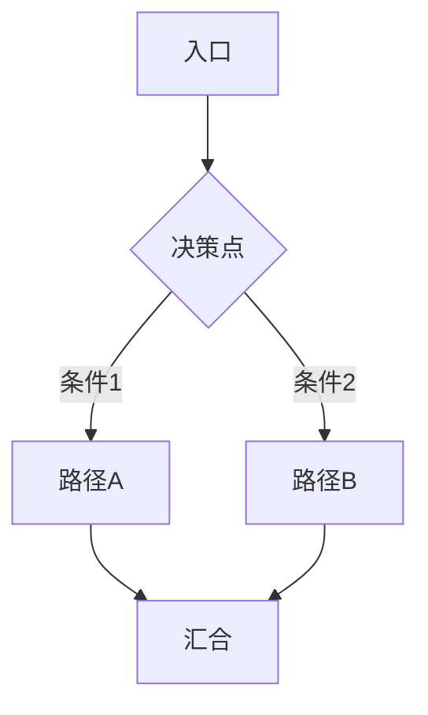

# Decision Protocol

A real-time decision expression engine for collaborative technical decisions. Routes each decision to the right expression form (matrix / flowchart / diff / text), enforces structured recommendation output, and preserves decision ownership — the model recommends, the user decides.

## Decision Workflow

```
用户提出决策需求
  ↓
1. 判断是否缺少关键外部信息
  ├── 缺少 → 先搜索再决策（见下方 Pre-Decision Search）
  └── 不缺少 → 直接进入决策输出
  ↓
2. 按决策类型选表达形式（矩阵/图/Diff/文字）
  ↓
3. 输出结构化决策 + 推荐
```

## Pre-Decision Search

**决策前先评估信息缺口，按缺口等级决定是否搜索。**

### 缺口评估

| 等级 | 条件 | 行为 |
|------|------|------|
| **必搜** | 决策涉及你不完全了解的实体（库/协议/工具/框架）；方案之间存在社区已知的坑位或性能差异但你无数据；决策的影响面大且外部有可参考的实践（如"Go 生态里做这个的主流方案是什么"） | 先搜索再决策，不等待用户指令 |
| **可选** | 你可以基于已知知识做出合格推荐，但外部可能有更优实践或更新的数据 | 简要说明"建议搜索 XX 方向"，用户决定是否先搜 |
| **跳过** | 决策仅涉及项目内部约束（如"这个函数放哪个文件"）；外部信息无论如何都不会改变推荐 | 直接决策，不搜索 |

### 搜索工具

| 场景 | 工具 | 方法 |
|------|------|------|
| **网页搜索** | Browser 插件 | 打开 Google 搜索，提取关键信息 |
| **GitHub 仓库/issue** | `exec_command` + curl GitHub API | `curl -s "https://api.github.com/search/repositories?q=..."` |
| **已有本地知识** | yopedia `query_wiki` / `search_wiki` | 先查本地 wiki 有无相关记录 |
| **抓取网页深读** | yopedia `ingest_url` | 发现高质量文章后抓取并总结

### 搜索工具选择

| 场景 | 工具 | 方法 |
|------|------|------|
| **网页搜索** | Browser 插件 | 打开 Google 搜索，提取关键信息 |
| **GitHub 仓库/issue** | `exec_command` + curl GitHub API | `curl -s "https://api.github.com/search/repositories?q=..."` |
| **已有本地知识** | yopedia `query_wiki` / `search_wiki` | 先查本地 wiki 有无相关记录 |
| **抓取网页深读** | yopedia `ingest_url` | 发现高质量文章后抓取并总结 |

### 搜索结果使用规则

- 把搜索结果作为**决策矩阵的 Evidence 来源**——推荐理由中引用搜索发现的具体数据或社区反馈
- 搜索结果与你的已知知识冲突时：**以搜索结果为准**，标注"根据搜索"
- 搜索后仍信息不足：**诚实说缺什么**，不强行推荐
- 不要仅因为「可能有更好的方案」而无限搜索——搜 1-2 轮，带回可靠信息就决策

## Trigger Conditions

Enter decision mode when:

- 新增接口 / 改数据结构 (含增删改 struct/table/proto 字段) / 跨多文件 (≥2 个文件) / 多方案有明显 tradeoff
- 以上任一命中，必须进决策模式
- **无法确定是否触发时，默认进决策模式**

## Anti-Avoidance Guards

When you hear yourself reaching for one of these excuses, stop. They are rationalization, not reasoning.

| Excuse | Counter |
|--------|---------|
| "This is simple, no need for decision mode" | Simple is subjective. Cross-file changes or multiple alternatives mean it is not simple. |
| "There is only one reasonable option" | "Do nothing" is always an option. List it and reject it explicitly. |
| "The user didn't ask for a decision" | The decision protocol triggers on conditions, not on the user explicitly naming it. |
| "I'll just give a quick recommendation" | A quick recommendation without structured comparison is what causes the user to say "信息是够了，但表达不清楚，阅一遍很累". |
| "The tradeoff is obvious" | Obvious to you, today, with the context fresh. Not obvious to the user. |

## Decision Output Structure

**在进入任何决策输出之前，必须先完成搜索评估。** 跳过搜索直接输出视为未完成。

1. **信息缺口评估** — 按 Pre-Decision Search 三级评估判断是否需要搜索。必搜级：立即搜索，不输出任何决策内容直到搜索有结果。
2. 决策点 + 为什么需要决定 (1-2 句)
3. 当前状态和约束的简要上下文 (1-2 句)
4. 若执行了搜索：简述搜索了什么、发现了什么关键信息
5. 按决策类型选表达形式 (见下方)
6. 推荐 + 理由 (强制)，末尾说「你决定」

**推荐是强制输出项** — 不给推荐不算完成决策输出。

## Decision Expression by Type

Choose the expression form based on decision type:

| 决策类型 | 表达形式 | 触发条件 |
|---------|---------|---------|
| 多方案对比 | 决策矩阵 | 2+ 方案选型 |
| 流程/分支/调用链 | Mermaid 图 | 3+ 分支或多节点调用 |
| 代码实现对比 | Diff 块 | 两段代码二选一 |
| 单点判断 | 纯文字 | 无对比对象 |

### Multi-Option Comparison: Decision Matrix

Rules:
- 表前给结论摘要 (≤20 字，仅方案 ≥3 时使用)。摘要承载代价信号，不复读推荐列。
- 使用标准 6 列：方案 | 收益 | 改动量 | 风险(概率/影响/原因) | 与你现有栈的关系 | 推荐
- 风险列格式：概率/影响/原因。概率和影响用 低/中/高；原因段可选 ≤10 字，装不下时写核心关键词 (≤5 字)，其余附在表后。
- 表后附推荐，理由引用 ≥1 个具体项目约束。**推荐后必须附带至少一个其他方案的适用条件。**
- 推荐是倾向性建议 (「我倾向 X」)，禁止用「唯一正确」「毫无疑问」等词。
- 若执行了搜索，推荐理由中标注数据来源 (如「根据 GitHub issue #423，...」)。

Template:

```
| 方案 | 收益 | 改动量 | 风险(概率/影响/原因) | 与你现有栈的关系 | 推荐 |
|------|------|--------|-------------------|----------------|------|
| A    | ...  | ...    | 低/中/原因         | ...             | ✓    |
| B    | ...  | ...    | 中/高/原因         | ...             |      |

推荐：A。理由：引用 ≥1 个具体项目约束。注意：A 存在 <一条风险或限制>。方案 B 在 <条件> 下更优。你决定。
```

For large decisions (>3 options, high impact), load `references/dimension-guide.md` for dimension selection by decision type.

### Flow/Branch/Call Chain: Mermaid

Use Mermaid for 3+ branches or multi-node call chains.



图后附一句话说明 + 推荐。不适用于简单的是/否二元选择。

### Code Comparison: Diff

Use diff block for "this implementation vs that implementation" decisions.

```diff
// Option A
- func handlerA(t time.Time) (*Result, error) { ... }

// Option B — 带校验
+ func handlerB(t time.Time) (*Result, error) {
+     if t.Before(minDate) { return nil, ErrUnsupported }
+     ...
+ }
```

差异标注 + 一句话推荐。不适用于架构模式对比 (那种用矩阵)。

### Single-Point Judgment: Plain Text

For yes/no decisions with no comparison object. Structure: decision point → context → recommendation with reason. 推荐需含倾向性陈述 + 理由引用 + 一条风险或限制，不允许纯表态 (如仅说「推荐：做 X」)。

## Recommendation Rules

- 推荐是倾向性建议，禁止用「唯一正确」「毫无疑问」「必须」「绝对」等封闭词
- 理由必须引用 ≥1 个具体项目约束 (已有依赖/现有测试/架构决策)
- **必须提及推荐方案自身的一条风险或限制** — 诚实的权衡比完美的推荐更可信
- 多方案场景：推荐后必须附带至少一个其他方案的适用条件
- 单点判断：推荐需含倾向性陈述 + 理由引用 + 一条风险，不允许纯表态
- 末尾必须说「你决定」

## Decision Quality Checklist

Before delivering the decision output, verify:

- [ ] 6 列齐全或对应表达形式完整 (Completeness)
- [ ] 推荐理由引用了具体项目约束，不是空洞模板 (Evidence)
- [ ] 风险原因可理解 — 用户不需要追问「为什么有风险」 (Clarity)
- [ ] 推荐与既有架构决策无冲突，如有冲突已标注 (Consistency)
- [ ] 若执行了搜索：搜索结果已标注来源 (Traceability)

## File References

引用代码实体时给出可点击链接：

```
[文件名](/Users/wikiglobal/workSapce/suanming-agent/相对路径:行号)
```

## Explanation Protocol

用户追问「XX 是什么」时：先解释它控制的**行为** (干什么用的)，再说类型和定义位置。

## Companion Skills

- **ADR 存储**：如果决策需要持久化记录，加载 `references/adr-template.md` 使用 MADR 简化格式
- **大决策维度选型**：决策 >3 方案或涉及跨领域 tradeoff 时，加载 `references/dimension-guide.md` 按决策类型选评分维度
