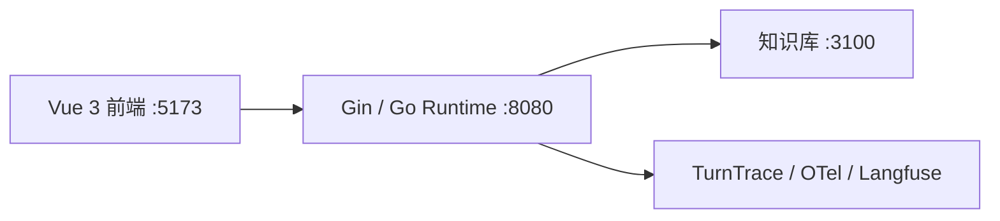

# 命理大师

<p align="center">
  
</p>

> 一个面向中文命理咨询的 AI Agent 应用，也是一个用 Go 构建可控 Agent runtime 的实践项目。

命理大师覆盖八字、奇门和紫微三类咨询。项目重点不是让模型自由生成一段回答，而是把路由、命盘准备、知识检索、多轮会话、结果校验和 SSE 展示组织成一条可观察、可验证的执行链。

## 特性

- 八字、奇门、紫微统一接入同一运行时
- 多轮追问与多对象资料隔离
- 确定性命盘计算和 artifact 预填充
- 受控知识库检索，展示古籍参考来源
- SSE 推送回答、组件和处理过程
- 本地 TurnTrace / OpenTelemetry / Langfuse 观测
- Go 合同测试与最小在线 smoke 回归

## 架构



一次请求的主链是：

```text
用户消息
  -> RouteAdvisor 路由审批
  -> Policy Gate 确定性校验
  -> Manager 生成执行计划
  -> Prefill 准备命盘等必要资料
  -> bounded specialist 执行领域分析
  -> final guard 校验最终结果
  -> SSE 推送给前端
```

核心边界：Manager 是会话和最终答复的唯一 owner；specialist 只负责受限领域执行，不直接拥有最终回复权。八字的 Graph、模型适配、检索、schema 和展示实现位于 `backend/internal/specialists/bazi/`，其他领域也通过统一的 `specialists.Runner` 合同接入。

完整 owner、数据合同和依赖方向见 [架构总览](docs/architecture.md)。

## 技术栈

| 层 | 技术 | 作用 |
|---|---|---|
| 前端 | Vue 3、TypeScript、Vite、SSE | 聊天、命盘卡片和过程展示 |
| API / Runtime | Go、Gin | 路由、会话、执行编排和 SSE |
| Agent 编排 | Eino ADK | 路由、领域 runner 和工具适配 |
| 命理计算 | `lunar-go` + 原生 Go | 八字、奇门、紫微确定性计算 |
| 知识检索 | 独立 Next.js 服务 + MCP/RAG | 命理资料检索和来源展示 |
| 观测 | TurnTrace、OpenTelemetry、Langfuse | 运行记录和评测观测 |

## 快速开始

### 本地开发

前置条件：WSL2 Ubuntu、Go 1.21+、Node.js 22+，以及可用的模型 API Key。

```bash
cp backend/.env.example backend/.env
# 编辑 backend/.env，至少填写 LLM_API_KEY

cd knowledge && npm install --legacy-peer-deps
cd ../web && npm install
cd ..
make dev-core
```

`make dev-core` 启动知识库、Go 后端和前端；需要本地 Langfuse 时使用 `make dev`。

访问：

- 应用：http://localhost:5173
- 后端健康检查：http://localhost:8080/api/health
- 知识库状态：http://localhost:3100/api/status

常用命令：

```bash
make status
make restart-core
make backend-restart
make knowledge-restart
make frontend-restart
```

### 本地 Docker

`deploy/app/` 提供本地演示用 Docker Compose，启动 Go 后端（内嵌前端）和知识库：

```bash
cd deploy/app
cp .env.example .env
docker compose up -d --build
```

访问主应用：http://localhost:8080

详细说明见 [Docker 部署](deploy/app/README.md)。这套 Compose 面向本地开发和演示，不是线上正式部署方案。

## 验证

基础检查：

```bash
go test ./backend/...
go build ./backend/cmd/server/
cd web && npx vue-tsc --noEmit && npm run build
```

官方默认回归入口：

```bash
make regression
```

它运行 Go 合同测试和当前最小在线 smoke，不默认执行全量在线评测。完整评测命令、数据集和报告说明见 [评测文档](eval/README.md)。

## 项目结构

```text
suanming-agent/
├── backend/      # Go API、runtime、路由、工具、specialists 和 SSE
├── web/          # Vue 3 前端
├── knowledge/    # 独立知识库服务和资料
├── deploy/       # 本地 Docker 部署与可选观测栈
├── eval/         # 合同测试、数据集和回归脚本
├── docs/         # 架构、数据链路和验收标准
└── PROGRESS.md   # 当前实施状态快照
```

## 文档

- [架构总览](docs/architecture.md)：运行时 owner、边界和数据合同
- [术语表](docs/glossary.md)：项目中常用的领域和运行时术语
- [验收标准](docs/acceptance-criteria.md)：功能和回归要求
- [Docker 部署](deploy/app/README.md)：本地 Compose 入口
- [评测说明](eval/README.md)：数据集、回归和 Langfuse
- [当前进度](PROGRESS.md)：已完成事项、未决问题和下一步

## 免责声明

本项目用于学习和工程实践，命理内容仅供娱乐与文化研究参考，不构成医疗、法律、投资或其他专业建议。
