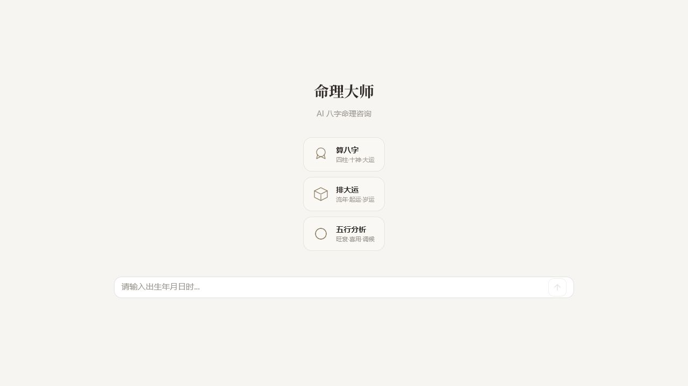

# 命理大师
<p align="center">
  
</p>
<br>

面向技术实现的命理 Agent 项目，采用 **Go 主控 runtime + Eino ADK** 的混合架构，覆盖 **八字（Bazi）**、**奇门（Qimen）**、**紫微（Ziwei）** 三个领域。

Go 继续拥有确定性控制边界：`Orchestrator` 事件循环、`Policy Gate`、`Preflight`、会话状态、prefill 排盘链、工具调度时机、SSE 协议与最终响应组装都由 Go 主控；Eino ADK 负责 LLM Agent 运行时 — supervisor agent 调度 + specialist agent 执行 + callback tracing。

详细的数据链路文档见 [docs/data-flow.md](docs/data-flow.md)。

## 运行时控制边界

| Component | Owner | Detail |
|-----------|-------|--------|
| Orchestrator control flow | Go | `Orchestrator.Run()` — main event loop |
| Policy gate | Go | Deterministic state-based route correction |
| Preflight | Go | 确定性硬判断，可能短路返回（澄清/缺资料） |
| Prefill 排盘链 | Go | bazi/qimen/ziwei 排盘 + 用神 + 大运 + 知识预检索 |
| Session state & persistence | Go | JSON file store + in-memory locking |
| Tool dispatch timing | Go | Go decides *when* tools run |
| SSE protocol | Go | 6 种事件类型，结构化流式推送 |
| Agent 运行时 | Eino ADK | Supervisor + Specialist ChatModelAgent + AgentAsTool |
| LLM backend | Eino | ChatModel backend |
| Callback tracing | Eino | Framework events feed a Go-owned `TurnTrace` envelope |

---

## 数据链路（一条用户消息的完整旅程）

```
用户消息 → POST /api/chat
  │
  ▼
┌─────────────────────────────────────────────────────────────────┐
│ ① Orchestrator.Run()                                            │
│    取会话锁 → 加载 SessionState → 启动 Trace                     │
├─────────────────────────────────────────────────────────────────┤
│ ② RouteAdvisor.Approve()                                        │
│    L0 对话意图 → L1 领域 → L2 任务 → L3 槽位                     │
│    三层降级: ADK structured → textDecide → safeFallback          │
├─────────────────────────────────────────────────────────────────┤
│ ③ Preflight                                                     │
│    确定性硬判断: 缺资料 → 澄清提问（短路）                         │
├─────────────────────────────────────────────────────────────────┤
│ ④ Prefill (确定性排盘链)                                         │
│    bazi_calc → yongshen → dayun_analyzer → knowledge_search     │
│    结果注入 SessionValues，LLM Agent 不接触排盘工具               │
├─────────────────────────────────────────────────────────────────┤
│ ⑤ BuildSupervisor + BuildSpecialist                             │
│    每轮动态构建 supervisor agent + 领域 specialist agent          │
│    instruction 注入: 基础规则 + 运行时上下文 + 对话历史            │
├─────────────────────────────────────────────────────────────────┤
│ ⑥ runner.Run() → agentEventBridge → SSE 流                      │
│    Agent 事件桥接到 6 种 SSE 事件: thinking / tool_call /         │
│    component / text / error / done                              │
├─────────────────────────────────────────────────────────────────┤
│ ⑦ emitTracePanels                                               │
│    route-decision / process-panel / debug-trace / execution-tree │
└─────────────────────────────────────────────────────────────────┘
  │
  ▼
前端 useSSE.ts → buildAssistantTurnViewModel → AssistantTurn.vue
```

---

## 提示词链路

Agent 的最终回答 prompt 由**两层 instruction 组装**而成。

### Supervisor Agent instruction

**角色：** 纯调度，不回答命理问题。

**来源：** [internal/runtime/agent_route.go](internal/runtime/agent_route.go) `AgentBuilder.buildSupervisorInstruction()`

**内容：** 本轮批准的主领域 + 可见的 AgentTool 列表 + 调用规则 + 禁止事项。

### Specialist Agent instruction（以 bazi 为例）

**基础 instruction** 从 `prompts/interpret.md` 加载，在 [internal/specialists/bazi/specialist.go](internal/specialists/bazi/specialist.go) 注册时读取，文件缺失时使用内置 fallback：

```
「你是八字命理专家」
+ 可调用工具: knowledge_catalog / knowledge_search
  （排盘/用神/大运由 Go prefill 确定性执行，LLM 不接触这些工具）
+ 知识检索流程 (目录探索→证据规划→受控检索→质量评估→引用回答)
```

**运行时上下文注入** 在 `AgentBuilder.BuildSpecialist()` 中完成：

```
+ buildProfileSection(st)        — 出生资料
+ buildBaziDataBlock(st)         — 命盘数据摘要 (四柱十神/五行/用神/大运/神煞 + 古籍背景)
+ buildQimenDataBlock(st)        — 奇门盘数据摘要（若已排盘）
+ buildZiWeiDataBlock(st)        — 紫微命盘数据摘要（若已排盘）
+ 当前日期、时区
```

**对话历史** 通过 `buildConversationMessages` 注入：

```
+ RecentTurns (最近 N 轮对话)
+ 当前用户消息
```

**LLM 输出格式：** `<analysis>` + `<response>` XML 标签，`agentEventBridge` 解析后分别以 `thinking` 和 `text` SSE 事件推送。非流式模式下最终回答经 `parseXMLSections` 解析后分别推送；流式模式下直接逐 chunk 推送。

---

## 架构总览

```
                         ┌─────────────────────────┐
                         │    Vue 3 前端 (:5173)     │
                         │                          │
                         │  WelcomePanel            │
                         │  ChatPanel               │
                         │    ├─ ChatBubble (用户)   │
                         │    └─ AssistantTurn (助手) │
                         │         ├─ ResultBlock    │
                         │         │    ├─ BaziChartCard
                         │         │    ├─ QimenChart
                         │         │    └─ ZiweiChartCard
                         │         ├─ TracePanel     │
                         │         ├─ DebugTracePanel│
                         │         └─ KnowledgeSourceCard
                         └──────────┬──────────────┘
                                    │ SSE (6 种事件)
                                    ▼
                         ┌─────────────────────────┐
                         │    Gin HTTP (:8080)       │
                         │    POST /api/chat         │
                         │    GET  /api/health       │
                         └──────────┬──────────────┘
                                    │
                                    ▼
┌─────────────────────────────────────────────────────────────────┐
│                       Orchestrator.Run()                        │
│                                                                 │
│  ┌───────────────────────────────────────────────────────────┐ │
│  │ ① RouteAdvisor (ADK RouteEngine)                           │ │
│  │                                                           │ │
│  │  L0 对话意图 → L1 领域 → L2 任务 → L3 槽位                  │ │
│  │  降级链: ADK structured → textDecide → safeFallback        │ │
│  │  产出: ApprovedRoute                                       │ │
│  └───────────────────────┬───────────────────────────────────┘ │
│                          ▼                                     │
│  ┌───────────────────────────────────────────────────────────┐ │
│  │ ② Policy Gate + Preflight                                  │ │
│  │                                                           │ │
│  │  Policy Gate: 确定性状态修正                               │ │
│  │    · 已有资料 + collect_profile → amend_profile            │ │
│  │    · 已有命盘 + collect_profile → fortune_followup        │ │
│  │                                                           │ │
│  │  Preflight: 确定性硬判断，可能短路返回                      │ │
│  │    · 缺出生资料 → 澄清提问 → 直接返回 SSE                  │ │
│  │    · Guidance state forced route → 替换当前 route          │ │
│  └───────────────────────┬───────────────────────────────────┘ │
│                          ▼                                     │
│  ┌───────────────────────────────────────────────────────────┐ │
│  │ ③ Prefill (确定性排盘链)                                    │ │
│  │                                                           │ │
│  │  在 runAgentRoute 中执行，结果注入 SessionValues:            │ │
│  │    bazi  → bazi_calc → yongshen → dayun_analyzer          │ │
│  │           → knowledge_search (3次) → flash 压缩            │ │
│  │    qimen → qimen_dunjia                                   │ │
│  │    ziwei → ziwei_calc → ziwei_liunian                     │ │
│  │                                                           │ │
│  │  ⚠️ LLM Agent 不接触排盘工具，排盘由 Go 确定性执行          │ │
│  └───────────────────────┬───────────────────────────────────┘ │
│                          ▼                                     │
│  ┌───────────────────────────────────────────────────────────┐ │
│  │ ④ Dynamic Agent Assembly (AgentBuilder)                     │ │
│  │                                                           │ │
│  │  AgentBuilder.BuildSupervisor(route, st, allowed)         │ │
│  │    → 每轮动态构建 supervisor agent                         │ │
│  │    → instruction 含本轮可见的 AgentTool 列表               │ │
│  │    → specialist 作为 AgentAsTool 挂载到 supervisor         │ │
│  │                                                           │ │
│  │  AgentBuilder.BuildSpecialist(cfg, st) × N                │ │
│  │    → instruction 注入运行时上下文 + 命盘数据块             │ │
│  │    → 工具: knowledge_catalog + knowledge_search            │ │
│  │    → 知识检索最多 3 次，adapter 闭包计数器硬控             │ │
│  └───────────────────────┬───────────────────────────────────┘ │
│                          ▼                                     │
│  ┌───────────────────────────────────────────────────────────┐ │
│  │ ⑤ runner.Run() → agentEventBridge → SSE                   │ │
│  │                                                           │ │
│  │  Agent 事件 → SSE 事件:                                    │ │
│  │    · Assistant (含 ToolCalls) → thinking                  │ │
│  │    · Specialist AgentAsTool 响应 → 作为最终回答主文本      │ │
│  │    · 普通 Tool 调用完成 → tool_call                       │ │
│  │    · Tool 结果含排盘 JSON → component (命盘卡片)           │ │
│  │    · <analysis> XML 段 → thinking                         │ │
│  │    · <response> XML 段 → text                             │ │
│  └───────────────────────┬───────────────────────────────────┘ │
│                          ▼                                     │
│  ┌───────────────────────────────────────────────────────────┐ │
│  │ ⑥ emitTracePanels + done                                   │ │
│  │                                                           │ │
│  │  SSE component:                                            │ │
│  │    · route-decision  (路由快照)                            │ │
│  │    · process-panel   (产品过程面板)                         │ │
│  │    · debug-trace     (调试追踪)                            │ │
│  │    · execution-tree  (统一执行链路树)                       │ │
│  │  SSE done: 本轮结束                                        │ │
│  └───────────────────────────────────────────────────────────┘ │
│                                                                 │
└─────────────────────────────────────────────────────────────────┘

       ┌──────────────────────────────────────────────┐
       │              持久化 & 可观测性                  │
       │                                              │
       │  data/sessions/{id}.json  会话状态            │
       │    ├─ Profile, BaziResult, QimenResult        │
       │    ├─ Routing (路由快照)                       │
       │    ├─ DomainStates (领域状态)                  │
       │    ├─ RecentTurns (最近对话)                   │
       │    └─ RunningSummary (滚动摘要)                │
       │                                              │
       │  logs/traces/   TurnTrace (DEBUG_TRACE=1)     │
       │  logs/debug/    SSE 事件记录 (DEBUG_HTTP=1)    │
       └──────────────────────────────────────────────┘
```

### 关键设计决策

**LLM 路由 + Go 确定性修正**

LLM 回答「这条消息属于什么意图/领域」，Go 代码回答「当前状态下应该走哪个分支」。LLM 不擅长跨轮状态比对，确定性代码一行就够了。

**三层降级防御**

| 层 | 机制 | 触发条件 | 行为 |
|---|------|---------|------|
| L1 | ADK structured | 正常 | 强制 tool_choice，JSON schema 匹配 |
| L2 | textDecide | L1 校验失败 / API 错误 | 纯文本 + 错误反馈重试 |
| L3 | safeFallback | L2 全部失败 | 确定性硬编码，零网络调用 |

**Prefill 确定性排盘**

所有排盘、用神、大运计算由 Go 在 `runAgentRoute` 的 prefill 阶段确定性执行，结果注入 SessionValues 和 SessionState。LLM Agent 只拥有 `knowledge_catalog` 和 `knowledge_search` 两个工具，不接触排盘工具。

**AgentAsTool 专家调度**

Supervisor agent 通过 Eino ADK 的 AgentAsTool 机制调度领域专家。每轮由 `AgentBuilder.BuildSupervisor()` 动态构建，specialist 作为 AgentTool 挂载。`agentEventBridge` 识别 specialist 响应（名称以 `_specialist` 结尾），将其作为最终回答主文本推送，不产生 `tool_call` 事件。

**两层 instruction 组装**

Specialist instruction 由两部分组成：`prompts/interpret.md` 提供基础指令（含知识检索流程），`AgentBuilder.BuildSpecialist()` 在运行时注入会话上下文（出生资料、命盘数据块、当前日期）。Supervisor 的 instruction 完全由 `buildSupervisorInstruction()` 动态生成。

---

## SSE 事件协议

前端通过 `POST /api/chat` 建立长连接，服务端以 SSE 流式推送 6 种事件：

| 事件 | 格式 | 说明 |
|------|------|------|
| `thinking` | `{"agent":"supervisor","text":"..."}` | 内部思考过程 |
| `tool_call` | `{"tool":"knowledge_search","result":"..."}` | 工具调用及结果 |
| `component` | `{"type":"bazi-chart","payload":{...}}` | 结构化组件（命盘卡片/过程面板/执行链路） |
| `text` | `{"content":"..."}` | LLM 流式文本片段 |
| `error` | `{"message":"..."}` | 错误信息 |
| `done` | `{}` | 本轮结束 |

## 前端组件树

```
App.vue
└─ ChatPanel.vue                    ← SSE 接收 + 消息管理
     ├─ WelcomePanel.vue            ← 空状态，快捷提问入口
     ├─ ChatBubble.vue              ← 用户消息 (气泡样式)
     │    └─ TextSegment.vue
     └─ AssistantTurn.vue           ← 助手回复 (结构化分区)
          ├─ ResultBlock.vue        ← 命盘/奇门/紫微结果卡片
          │    ├─ BaziChartCard.vue ← 八字四柱 + 大运 + 用神
          │    ├─ QimenChart.vue    ← 奇门九宫格
          │    └─ ZiweiChartCard.vue← 紫微斗数
          ├─ ThinkingSegment.vue    ← 思考过程 (可折叠)
          ├─ TracePanel.vue         ← 过程面板
          ├─ DebugTracePanel.vue    ← 执行链路树
          │    └─ ExecutionNodeItem.vue × N
          └─ KnowledgeSourceCard.vue← 知识引证来源
```

---

## 技术栈

| 层 | 技术 |
|---|------|
| 前端 | Vue 3 + Naive UI + TypeScript + Vite + markdown-it |
| HTTP | Gin |
| Agent 运行时 | Eino ADK (ChatModelAgent + AgentAsTool + Runner) |
| 八字 | [lunar-go](https://github.com/6tail/lunar-go) |
| 奇门 | 时家奇门（拆补法），原生 Go 实现 |
| 紫微 | 原生 Go 实现（框架就绪） |
| 知识检索 | 自建知识库 MCP (:3100)，古籍原文，权威分级 ⭐1-5 |
| LLM | DeepSeek（Eino ChatModel backend） |
| 流式 | SSE（结构化事件流） |
| 持久化 | JSON 文件存储 + 内存锁并发控制 |
| 追踪 | TurnTrace + Eino callbacks |

---

## 快速开始

```bash
# 前置条件: Node.js ≥ 18, Go ≥ 1.21

# 1. 配置
cp .env.example .env
# 编辑 .env，填入 LLM_API_KEY

# 2. 启动知识库 (:3100)
make knowledge-start

# 3. 一键启动后端 (:8080) + 前端 (:5173)
make dev

# 浏览器打开 http://localhost:5173
```

环境变量：

| 变量 | 必填 | 默认值 | 说明 |
|------|:--:|------|------|
| `LLM_API_KEY` | ✓ | — | LLM API 密钥 |
| `LLM_BASE_URL` | | `api.deepseek.com/anthropic` | API 地址 |
| `LLM_MODEL` | | `deepseek-v4-pro` | 主模型 |
| `LLM_FLASH_MODEL` | | 同主模型 | 快速模型（Supervisor 路由用） |
| `LLM_TEMPERATURE` | | `0.3` | 主回答模型温度 |
| `KNOWLEDGE_MCP_URL` | | `http://localhost:3100` | 知识库地址 |
| `DEBUG_TRACE` | | `0` | `1` 启用 TurnTrace 文件记录 |
| `DEBUG_HTTP` | | `0` | `1` 启用 SSE 事件调试记录 |

---

## 项目结构

```
suanming-agent/
├── cmd/server/                # 程序入口
├── internal/
│   ├── config/                # 环境变量读取
│   ├── container/             # DI 容器，组装所有组件
│   ├── handler/               # HTTP handler + SSE 适配
│   ├── llm/                   # Eino backend 工厂与适配层
│   ├── mcp/                   # 知识库 MCP 客户端
│   ├── orchestrator/          # 核心编排：Run() + 路由 + prompt 构建
│   ├── policy/                # 策略网关 + 确定性状态修正
│   ├── runtime/               # Executor: preflight / prefill / agent 路由 / bridge
│   ├── specialists/           # bazi / qimen / ziwei 领域专家 (Config + Instruction 注册)
│   ├── sse/                   # SSE 流式推送封装
│   ├── state/                 # 会话状态 + 持久化 + 并发锁
│   ├── supervisor/            # ADK RouteEngine + Go fallback 路由
│   ├── tools/                 # 工具注册表 + 各工具实现
│   └── tracing/               # TurnTrace + Eino callback tracing
├── knowledge/                 # 知识库子项目 (端口 :3100)
│   ├── wiki/                  # 命理古籍原文 (gitignored)
│   └── src/                   # 知识库服务源码 (Next.js + MCP)
├── prompts/
│   ├── interpret.md           # 统一解读 prompt（bazi specialist 加载）
│   └── supervisor/            # 路由 prompt 模板
├── web/                       # Vue 3 前端
│   └── src/
│       ├── components/        # UI 组件
│       ├── composables/       # useSSE (SSE 流式接收)
│       ├── utils/             # buildAssistantTurnViewModel
│       └── types/             # ChatMessage / Segment 类型
├── docs/
│   ├── architecture.md        # 架构入口
│   ├── data-flow.md           # 数据链路详解
│   ├── implementation.md      # 实施总览
│   └── acceptance-criteria.md # 验收标准
└── data/sessions/             # 会话持久化文件 (gitignored)
```

---

## 常用命令

```bash
go build ./cmd/server/                  # 编译
go test ./... -v                        # 全部测试
go test ./internal/tracing/ -v          # 追踪包测试
cd web && npx vue-tsc --noEmit          # 前端类型检查
```

---

## 当前实现状态

| Phase | Scope | Status |
|-------|-------|--------|
| 0 — Classic Go | Orchestrator, policy gate, preflight, session store, SSE, tool dispatch | ✅ Complete |
| 1 — LLM Backend | `llm.Chat` via Eino ChatModel | ✅ Complete |
| 2 — Tool Compatibility | Go retains explicit tool dispatch timing | ✅ Complete |
| 3 — Supervisor L1 | ADK RouteEngine for structured decide | ✅ Complete |
| 4 — Specialist Agent | ADK ChatModelAgent + AgentAsTool | ✅ Complete |
| 5 — Callback Tracing | Eino callbacks cover main answer + supervisor model calls; knowledge_search retriever uses framework-first trace source | ✅ Complete |
| 6 — Execution Tree | TurnTrace → unified execution tree with phase grouping | ✅ Complete |
| Graph 编排 | orchestrationGraph 上线（preflight→prefill→agent→guard），含 Checkpoint 中断恢复 | ✅ Complete |
| 可观测性 | OTel wiring 完成，Langfuse 后端待接入 | ✅ Complete |
