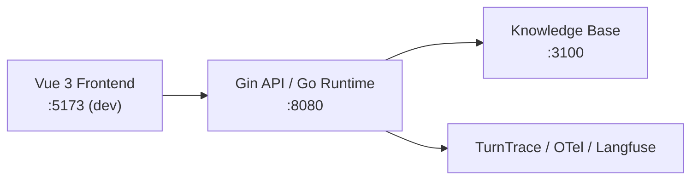
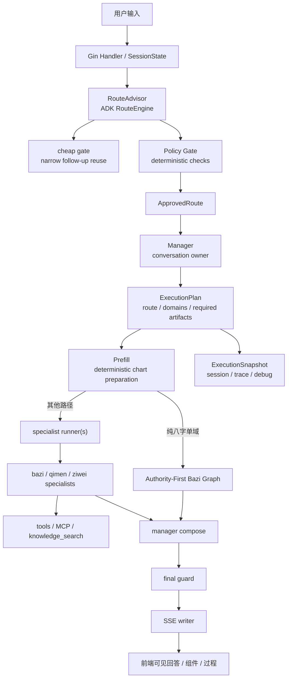
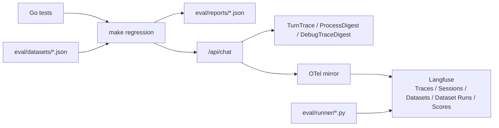

# 命理大师

<p align="center">
  
</p>

> 一个面向中文命理咨询场景的 AI Agent 应用，也是一个用 Go 构建可控 Agent runtime 的工程实践项目。

命理大师以命理咨询为业务载体，重点放在一类更接近真实产品的问题上：当场景进入高不确定性、强解释性、强追问承接的专业咨询后，如何把**路由、命盘 artifact 准备、知识检索、多轮上下文、结果验收、SSE 过程展示、trace 与回归验证**组织进一条稳定、可部署、可观察的主链里。

这个仓库当前主要关注三件事：

- 它包含完整的前端 + Go runtime + 独立知识库 + 回归体系。
- 它会把命盘卡片、知识依据、处理过程和最终回答一起展示出来。
- 它把工程控制面收敛成了明确的 runtime contract，而不是只停留在回答效果层。

## 这个项目是干什么的

这是一个中文命理咨询应用，当前统一承接：

- 八字
- 奇门
- 紫微

项目关注点是在覆盖这三个术数方向的基础上，把它们作为一个真实 AI 产品场景，验证下面这件事：

> 如何把高不确定性的专业咨询，做成一个可控、可验证、可演进的 Agent 系统。

## 项目关注点

- 围绕一个可运行、可演示、可继续迭代的 AI 咨询应用组织完整工程链路。
- 用 Go runtime 明确承接系统控制权，把状态、边界和执行流程落到可维护的程序侧。
- 用知识检索、结构化 SSE、trace 和回归门禁，让“为什么这样回答”变得可观察。
- 尽量把需求理解、系统设计、实现、部署和验证放在同一仓库里。

## 工程实现重点

- **统一 runtime 主链**
  八字、奇门、紫微三类咨询统一走 manager-owned runtime 主链。
- **Manager 统一收口**
  `Manager` 是 runtime 内唯一 conversation owner，specialist 只负责领域执行。
- **artifact-driven prefill**
  命盘准备按 `RequiredArtifacts` 确定性执行，减少跨域追问时的运行时歧义。
- **authority-first 八字主链**
  纯八字单域场景已收口为“分析模式判定 -> 证据规划 -> 受控检索 -> 静态/动态综合 -> 程序 renderer 成文”。
- **前端展示运行时证据**
  页面会同时展示命盘卡片、知识依据、处理过程和最终回答。
- **内置正式回归入口**
  `make regression` 已固定为当前官方回归入口，仓库内保留最小 smoke 数据集与结构化报告。
- **本地部署可落地**
  `deploy/app/` 已提供本地 Docker 入口，可直接启动主应用和独立知识库。

## 已支持的能力

| 能力 | 当前状态 | 说明 |
|---|---|---|
| 八字咨询 | 已接通 | 支持命盘、结构分析、用神、大运等主链能力 |
| 奇门咨询 | 已接通 | 走统一 runtime，支持当前时机类问题 |
| 紫微咨询 | 已接通 | 已接入统一 runtime 和前端组件渲染 |
| 多轮追问 | 已接通 | manager 负责上下文承接和最终回复收口 |
| 知识依据展示 | 已接通 | 后端通过 MCP/RAG 检索古籍资料，前端展示来源卡片 |
| 过程展示 | 已接通 | SSE 按 `thinking / tool_call / component / text / done` 分层输出 |
| 本地 trace | 已接通 | `TurnTrace`、`ProcessDigest`、`DebugTraceDigest` 已落地 |
| 最小正式回归 | 已接通 | `eval/` + `make regression` 已可跑通 |
| 本地 Docker 部署 | 已接通 | `deploy/app` 可启动 `app` 和 `knowledge` |

## 示例问题

- `我适合做技术管理还是继续走专家路线？`
- `这十年大运里，哪几年更适合主动换城市或换工作？`
- `如果今年想换工作，八字和奇门分别会给出什么角度的判断？`
- `结合命盘和古籍依据，解释为什么这里判断为身强而不是身弱。`

## 演示材料

- [交互页面存档（MHTML）](docs/screenshots/web.mhtml)
- [本地 Docker 部署说明](deploy/app/README.md)
- [评测与回归入口说明](eval/README.md)

## 系统技术栈

| 层 | 技术 | 作用 |
|---|---|---|
| 前端 | Vue 3 + TypeScript + Vite + SSE | 聊天界面、命盘卡片、处理过程卡、知识依据卡 |
| API / Runtime | Go + Gin | HTTP 接口、会话状态、工具执行、SSE 推送 |
| Agent 编排 | Eino ADK | 路由、agent runtime、tool adapter、callback tracing |
| 命理引擎 | `lunar-go` + 原生 Go 实现 | 八字排盘、奇门 / 紫微领域计算 |
| 知识检索 | 独立知识库服务 + MCP/RAG | 命理典籍检索、来源注入 |
| 观测 | TurnTrace + OpenTelemetry + Langfuse | 本地 trace、OTel 镜像、会话与 dataset run 观测 |
| 评测 | Go test + WSL bash runner + Python runner | 合同测试、最小 smoke、dataset 同步与 run 登记 |

## 架构总览

### 服务拓扑



| 服务 | 端口 | 说明 |
|---|---|---|
| 前端 | `:5173` | Vue 3 页面，消费 SSE 事件并渲染结构化组件 |
| 后端 | `:8080` | Go runtime 主入口，负责路由、状态、执行、SSE |
| 知识库 | `:3100` | 独立实例，负责命理资料检索 |
| Langfuse | `:3001` 可选 | 本地观测与 dataset run 记录，不是唯一真相源 |

### 后端执行主链

当前默认真实主链：

`RouteAdvisor -> Policy Gate -> Manager -> ExecutionPlan -> Prefill -> specialist runner(s) -> manager compose -> final guard -> SSE`

补充两层当前已经接进运行时、但过去文档常漏写的事实：

- `cheap gate`（负责极窄 follow-up 复用的轻量门）发生在 `RouteAdvisor.Approve()` 入口处，命中时会直接复用上一轮执行合同，但只放行“已有可复用结果的普通追问”。
- `ExecutionSnapshot`（负责记录本轮真实执行合同的快照）会同步进入会话状态、trace runtime meta 和前端 debug / execution-tree 面板。



### 后端分层职责

- `RouteAdvisor`
  负责 route approval、coarse routing 和 outer fallback。
- `Policy Gate`
  负责确定性策略修正、能力边界和硬约束。
- `Manager`
  是 runtime 内唯一 conversation owner，负责上下文承接、执行规划和最终回复装配。
- `ExecutionPlan`
  是 route approval 进入执行层后的正式合同，显式包含 `Route`、`Domains`、`RequiredArtifacts`。
- `Prefill`
  按 `RequiredArtifacts` 确定性准备命盘结果，避免 specialist 在缺 artifact 时盲跑。
- `specialist runner(s)`
  是 bounded workers，只负责领域执行，不直接拥有最终用户答复权。
- `final guard`
  负责最终合同校验，保证用户可见答案和主链状态一致。

### Agent 逻辑

系统当前不是“多个 agent 自由对话”，而是一个明确受控的 manager-subagent 架构：

1. `RouteAdvisor` 先做三层防御路由，必要时由 `cheap gate` 复用上一轮 follow-up 合同
2. `Policy Gate` 做确定性修正，避免错误领域或缺资料路径直接进入执行层
3. `Manager` 基于完整 `SessionState` 生成 `ExecutionPlan`
4. `Prefill` 按 `RequiredArtifacts` 先补齐命盘和领域前置结果
5. 进入领域执行：
   - 纯八字单域走 authority-first inner graph
   - 其他路径走 `specialist runner(s)` 调度 `bazi / qimen / ziwei`
6. specialist 返回结构化结果，由 `manager compose` 统一收口
7. `final guard` 做最后验收
8. `ExecutionSnapshot` 和 trace digest 同步写入调试投影，供前端恢复与 execution tree 展示
9. 通过 SSE 向前端推送 `thinking / tool_call / component / text / done`

### 会话恢复与可观测性

- `GET /api/session/:sessionID` 会话快照接口已上线，前端会持久化当前 `session_id` 并恢复历史消息。
- 快照不仅包含文本历史，也会尽量回放最近一轮 assistant 的 `thinking / component / text / error` 结构化片段。
- 前端 debug 面板和执行树面板读取的不是猜测路由，而是运行时真实写入的 `ExecutionSnapshot`。

### 八字主链为什么单独做 graph

纯八字单域场景的内层 graph 已经收口为一条更稳定的证据链：

- `analysis planner`
  判断本轮是 `static_full / dynamic_focus / topic_focus`
- `evidence planner`
  判断证据缺口和检索主题
- `controlled retrieval`
  由 runtime 执行受控检索，统一生成 evidence bundle
- `static synthesis`
  综合格局、调候、扶抑病药、气势/从化
- `dynamic synthesis`
  按需分析大运 / 流年如何兑现静态主轴
- `final composer`
  由 Go renderer 固定成文，而不是交给自由 writer

### 路由与状态模型

- 路由输出是四层结构：
  `L0 对话意图 -> L1 领域 -> L2 任务意图 -> L3 槽位`
- 会话状态由 `SessionState` 维护
- 对话连续性由 `ManagerContext` 承接
- 领域执行进度由 `DomainContexts` 承接
- 最近对话、滚动摘要、领域状态和 routing snapshot 都会进入 runtime 状态层

如果你想看当前有效架构，直接看 [docs/architecture.md](docs/architecture.md) 就够了。

## 快速开始

### 方式一：本地开发

前置条件：

- Windows 机器建议使用 **WSL2 Ubuntu** 作为开发终端
- Node.js >= 22（建议安装到 WSL 的 `/usr/bin/node`，不要依赖 Git Bash / Windows `node.exe` 混跑）
- Go >= 1.21（与 Node 保持在同一 WSL 环境）

开发约定：

- 统一从 **WSL2 Ubuntu** 里执行 Makefile 命令，不要混用 Git Bash / Windows Node。
- `make dev` 会拉起完整本地开发栈：Docker Langfuse + WSL 本地知识库、后端、前端。
- `make dev-core` 只拉起核心业务三服务：知识库、后端、前端；适合不看 Langfuse 时使用。
- 如果在 Windows + Codex 混合环境里遇到 `node/npm` 指向异常，先确认：

```bash
node -p "process.platform + ' ' + process.execPath"
```

输出应为 `linux /usr/bin/node` 或其他 WSL Linux 路径，而不是 `C:\Program Files\nodejs\node.exe`

1. 准备后端环境变量文件（当前真相源是 `backend/.env`）

```bash
cp backend/.env.example backend/.env
```

2. 至少填入 `backend/.env` 里的 `LLM_API_KEY`

3. 准备 Langfuse 本地凭据（只在使用 `make dev` 时需要）

```bash
cp deploy/langfuse/.env.example deploy/langfuse/.env
```

`deploy/langfuse/.env` 与 `backend/.env` 都被 Git 忽略；不要把真实模型 API Key、Langfuse project secret 或生产密码写进示例文件。

4. 安装前端与知识库依赖

```bash
cd /home/huang/workspace/suanming-agent/knowledge && npm install --legacy-peer-deps
cd /home/huang/workspace/suanming-agent/web && npm install
```

4. 启动本地开发栈

```bash
cd /home/huang/workspace/suanming-agent
make dev
```

如果这次不需要 Langfuse 观测，只想快速改业务和页面：

```bash
make dev-core
```

常用运维命令：

```bash
make status
make restart
make restart-core
make backend-restart
make knowledge-restart
make frontend-restart
```

5. 打开本地页面

- 前端：`http://localhost:5173`
- 后端健康检查：`http://localhost:8080/api/health`
- 知识库状态：`http://localhost:3100/api/status`
- Langfuse 健康检查：`http://localhost:3001/api/public/health`

说明：

- `backend/.env` 是当前唯一有效的后端 / Langfuse / OTel 配置真相源。
- `make dev` 是混合开发栈：Langfuse 用 Docker Compose，业务服务用 WSL 本地 tmux 进程。
- Windows 下如果出现 `knowledge_search` 全部 `hits=0`，先运行 `make status` 看知识库是否真的监听了 `:3100`。
- 如果启动失败，先看 `/tmp/suanming-agent/*.log`，对应 tmux 会话是 `suanming-backend`、`suanming-frontend`、`suanming-knowledge`。

### 方式二：本地 Docker 部署

如果你想直接启动一个可演示的本地应用栈，使用 `deploy/app/`：

```bash
cd deploy/app
cp .env.example .env
docker compose up -d --build
```

启动后默认会起来两个服务：

- `app`
  Go 后端 + 内嵌前端构建产物，对外提供主应用页面和 `/api/*`
- `knowledge`
  独立知识库服务

访问地址：

- 主应用：`http://localhost:8080/`
- 主应用健康检查：`http://localhost:8080/api/health`
- 知识库：`http://localhost:3100/`
- 知识库状态：`http://localhost:3100/api/status`

更详细的部署说明见 [deploy/app/README.md](deploy/app/README.md)。

## 回归与验证

常用基础命令：

```bash
go test ./backend/... -v
cd web && npx vue-tsc --noEmit
cd web && npm run build
```

官方主回归入口：

```bash
make regression
```

它当前会覆盖两类门禁：

- Go runtime / supervisor / policy 合同测试
- `eval/datasets/runtime-smoke-v1.json` 对真实 `/api/chat` 的最小 smoke

### 评测与可观测性栈



当前评测体系分成三层：

- **第一层：Go 合同测试**
  用于验证 runtime、supervisor、policy 等确定性合同没有被破坏。
- **第二层：最小 smoke 数据集**
  当前以 `eval/datasets/runtime-smoke-v1.json` 为核心，验证真实 `/api/chat` 主链能否稳定跑通。
- **第三层：Langfuse 观测与 dataset runs**
  用于补充 traces、sessions、scores 和 hosted datasets 视角。

当前正式 truth layer 包括：

- Go 合同测试
- `eval/datasets/*.json`
- `eval/reports/*.json`
- `backend/.env`
- Langfuse trace / session / dataset run / score 观测

### 当前使用的评测工具

- `go test ./backend/...`
  后端合同测试和包级测试
- `make regression`
  当前官方主回归入口，负责自启动 / 自清理后端并执行最小 smoke
- `make eval-smoke`
  运行单个本地 smoke 数据集
- `make eval-suite`
  运行整个本地 suite
- `eval/runner/sync-langfuse-datasets.py`
  同步本地数据集到 Langfuse hosted datasets
- `eval/runner/run-langfuse-experiment.py`
  登记 dataset run item、写回 score、生成结构化报告

### Langfuse 在这里负责什么

- 接收 OTel 镜像过来的 trace
- 聚合 session
- 存储 hosted datasets 和 dataset runs
- 存储 trace-level scores

它当前不承担的职责：

- 作为唯一真相源
- 替代本地 `eval/` 和结构化 report
- 直接提供完整的 v4-style eval workflow

如果你要继续扩评测体系，请先看 [eval/README.md](eval/README.md)。

## 项目结构

```text
suanming-agent/
├── backend/      # Go runtime、路由、state、tools、SSE、specialists
├── web/          # Vue 3 前端，负责聊天界面、命盘卡片与过程展示
├── knowledge/    # 独立知识库服务与命理资料索引
├── deploy/       # 本地 Docker 部署入口与可选观测栈
├── eval/         # 当前正式保留的评测层
├── docs/         # 架构、数据链路、验收标准等文档
└── PROGRESS.md   # 当前阶段的上下文恢复文件
```

## 文档入口

- [架构入口](docs/architecture.md)
- [数据链路](docs/data-flow.md)
- [验收标准](docs/acceptance-criteria.md)
- [本地部署说明](deploy/app/README.md)
- [评测说明](eval/README.md)
