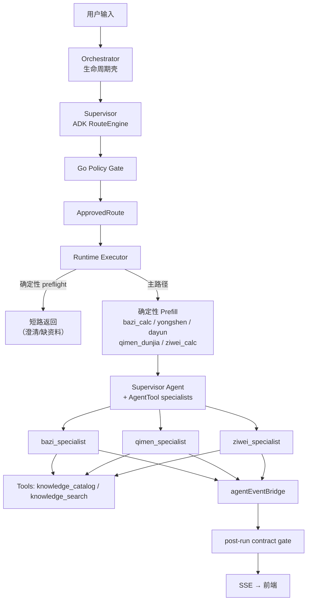

# 架构总览

> 本文是项目架构的**入口文档**。详细设计见 [docs/architecture/supervisor/](architecture/supervisor/) 下的专题文档。

## 服务拓扑

```
Vue 3 (SSE) ──→ Gin (:8080)
                     │
              Go Runtime / Eino ADK / lunar-go / MCP→RAG (:3100)
```

| 层 | 端口 | 技术栈 | 职责 |
|---|------|-------|------|
| 前端 | :5173 (dev) | Vue 3 + TypeScript + SSE | 聊天界面、命盘卡牌渲染、处理过程卡与调试抽屉 |
| 执行层 | :8080 | Go + Gin + Eino ADK | 会话管理、路由、策略门控、工具调度、SSE 推送 |
| 知识库 | :3100 | Yopedia (独立实例) | 命理典籍 RAG 检索 |

## 多 Agent 架构（当前：v1.5 收口 + Eino 迁移完成）

系统采用 **Supervisor Agent + AgentAsTool + Specialist Agent** 架构：



### 关键控制边界

- **模型负责理解**（语义路由、证据需求判断、回答生成）
- **程序负责控制**（状态管理、策略校验、工具执行、结果验收、SSE 推送、trace）

系统实现了以下硬控制边界：

- **显式术数 obey**：用户明确指定 `八字 / 紫微 / 奇门` 时，`applyExplicitMethodPreference` 做主领域纠偏；2026-06-26 起检测改用 **semantic router**（Eino Embedder + DashScope `text-embedding-v4`，正向+负向 utterance，negative 优先），regex 降为 `Confidence < 0.7` 时的兜底；三态开关 `ROUTER_MODE=off|shadow|enforce`
- **执行契约验收**：`primary_domain=qimen` 必须真拿到 `QimenResult`，`primary_domain=ziwei` 必须真拿到 `ZiWeiResult`

详细边界见 [01-overview.md](architecture/supervisor/01-overview.md)。

## 路由模型

Supervisor 输出四层结构化路由：

```
L0 对话意图   → consult / clarify / smalltalk / meta_help / switch_topic
L1 主/辅领域   → bazi / qimen / ziwei
L2 任务意图   → collect_profile / direct_bazi / interpret_chart / fortune_followup / timing_followup / cross_domain_consult
L3 槽位与标记 → profile slots / question text / time scope / target subject / qimen_mode / profile_requirement
```

当前 routing 不是“命中词表就切领域”，而是先判断：

1. 这是 **本命结构 / 长期趋势**，还是 **当前时机 / 行动选择**
2. 最需要的是 **出生盘**，还是 **当前时间盘**
3. 再决定 `bazi / ziwei / qimen`

## 会话与上下文工程

- **RecentTurns**：最近 8 轮对话保留，超过后滚动摘要
- **RunningSummary**：增量摘要合并，失败不丢历史
- **DomainStates**：领域状态持久化（八字命盘、奇门盘、紫微盘）
- **RoutingSnapshot**：每轮路由快照写入会话状态（含 `QimenMode`）

## 工具注册

所有命理工具通过 `internal/tools/Registry` 统一注册，由 `runtime` 通过 `adapter.go` 适配为 Eino `BaseTool`。

**排盘工具**（prefill 确定性执行，不挂载到 Specialist Agent）：

| 工具 | 领域 | 说明 |
|------|------|------|
| `bazi_calc` | 八字 | 排四柱命盘（晚子时 + 太阳时校正 + 神煞） |
| `yongshen` | 八字 | 日主强弱、用神忌神分析 |
| `dayun_analyzer` | 八字 | 大运走势分析 |
| `qimen_dunjia` | 奇门 | 奇门遁甲排盘 |
| `ziwei_calc` | 紫微 | 紫微斗数命盘 |
| `ziwei_liunian` | 紫微 | 紫微斗数流年分析 |

**知识检索工具**（挂载到 Specialist Agent，LLM 可直接调用）：

| 工具 | 说明 |
|------|------|
| `knowledge_catalog` | 获取知识库目录结构，用于规划检索策略 |
| `knowledge_search` | MCP 连接知识库检索古籍原文，每轮限 3 次调用 |

## Eino 迁移状态

| Phase | 状态 | 内容 |
|-------|------|------|
| Phase 1 | 完成 | `llm.Chat` 底座切 Eino，原生 HTTP 路径已删除 |
| Phase 2 | 完成 | `InvokableTool` 兼容层删除，registry 只保留 Get/List |
| Phase 3 | 完成 | ADK 固定为 route engine，`classic|adk` 开关已删除 |
| Phase 5A | 完成 | Eino callback tracing 覆盖 ChatModel 主回答 + supervisor |
| Phase 5B | 完成 | `knowledge_search` retriever span 已切 Eino callback |
| Phase 6 | 完成 | Execution Tree — TurnTrace → unified execution tree with phase grouping |
| Graph 编排 | 完成 | `orchestrationGraph`（preflight→prefill→agent→guard）已上线，含 Checkpoint 中断恢复 |

## Trace 架构

当前 trace 采用 **原始链路 + 双投影 + OTel** 模型：

- **`TurnTrace` 原始层**：继续作为本地 `logs/traces/` 的稳定 envelope 和投影输入
- **`ProcessDigest` 产品投影**：驱动前端 `TracePanel` 的“处理过程”主卡，只展示用户可读阶段摘要
- **`DebugTraceDigest` 调试投影**：驱动前端 debug drawer，承载原始 span、SSE `thinking/tool_call` 等排障信息
- **OTel 标准层**：逐步把 Go 业务 span 与 Eino callback span 映射到 OpenTelemetry GenAI 语义，供后端观测平台消费

首个推荐的 AI-native observability backend 是 **Langfuse**；`Phoenix` 作为对照参考和纯 tracing 方案候选。项目不会用外部平台私有 schema 直接替代本地 `TurnTrace`，前端主视图也不再直接暴露 raw trace step。

## 降级策略

三层降级保护 Supervisor 路由始终可工作：

```
ADK structured route → textDecide (LLM) → fallbackExtract (规则) → safeFallback (硬编码)
```

LLM 不可用时退到 `safeFallback` 的保守默认路由，不依赖额外 Python 推理层。

## 前端 SSE 协议

6 种结构化事件，前端按类型渲染：

| 事件类型 | 用途 |
|---------|------|
| `thinking` | 内部思考过程（supervisor 推理 + analysis 段） |
| `tool_call` | 工具调用事件与结果 |
| `component` | 结构化组件（排盘卡牌 / 过程面板 / 执行链路） |
| `text` | 流式回答文本 |
| `error` | 错误信息 |
| `done` | 本轮结束 |

## 关键设计决策

1. 八字引擎用 `lunar-go`，不自研
2. 不保留独立 Python 推理主链；当前统一走 Go runtime + Eino ADK
3. Go 负责路由审批、策略门控、工具执行和最终结果验收；Eino 承接受边界约束的 route engine 与 agent runtime
4. RAG 通过 MCP 调本地知识库服务，不内嵌
5. SSE 6 种结构化事件，前端按类型渲染
6. 后续统一入口采用 `LLM Supervisor + Go Runtime + bounded specialists`
7. 采用 Supervisor + AgentAsTool + Specialist 单层调度，不做自由 swarm 或多 agent 协作
8. `ApprovedRoute` 成为 runtime 主控输入，不再通过 legacy action bridge
9. 执行层迁移为 Supervisor Agent + AgentAsTool + Specialist Agent（2026-06-16）
10. Phase 1 路由收口改为“术数能力画像 + 显式术数 obey + post-run contract gate”（2026-06-19）
11. 可观测性采用“`TurnTrace` raw envelope + `ProcessDigest/DebugTraceDigest` 前端双投影 + OTel 标准层 + Langfuse 优先后端”的分层方案（2026-06-20）

## 详细文档索引

| 文档 | 内容 |
|------|------|
| [01-overview.md](architecture/supervisor/01-overview.md) | 架构总图、边界、迁移状态 |
| [02-routing-model.md](architecture/supervisor/02-routing-model.md) | 四层路由模型 |
| [03-session-state.md](architecture/supervisor/03-session-state.md) | 会话状态结构 |
| [04-specialists-and-capabilities.md](architecture/supervisor/04-specialists-and-capabilities.md) | 领域专家与能力层 |
| [05-policy-gate.md](architecture/supervisor/05-policy-gate.md) | 策略门 |
| [06-trace-and-observability.md](architecture/supervisor/06-trace-and-observability.md) | Trace 可观测性 |
| [07-rollout-plan.md](../archive/design/07-rollout-plan.md) | 发布计划（已归档） |
| [08-phase-1.5-route-driven.md](../archive/design/08-phase-1.5-route-driven.md) | Phase 1.5 路由驱动执行（已归档） |
| [09-retrieval-query-planning.md](architecture/supervisor/09-retrieval-query-planning.md) | Agentic RAG 方案（证据规划 + 条件反思） |
| [10-agentic-rag-basics.md](architecture/supervisor/10-agentic-rag-basics.md) | Agentic RAG 术语速览 |

## Guided Entry Boundary (2026-06-23 Cleanup)

- **lexical markers** 只有一份 truth source：`internal/intent`，供 supervisor 和 runtime 共同使用
- **`preflight`** 只做短路/执行分流：`ShortCircuit=true` 时才产出文本；`ForcedRoute != nil` 时 `ShortCircuit=false`，由 executor 先 emit transition text 后进入执行链
- **`executor`** 仍是 GuidanceState 的唯一 mutation owner
- **`HasTimingFocus` 与 `ContainsTimingKeyword`** 语义分离：前者 scope+intent 双条件供 guidance_gate 用，后者关键词宽松匹配供 supervisor 用

## 架构现状总评与演进方向 (2026-06-24)

> **事后注 (2026-06-26):** 本文写于 6/24，当时 Graph 编排处于设计阶段。截至 6/26，`orchestrationGraph` 已上线，Step 1（单领域直通）和 Step 2（多领域 fan-out）已实现，Checkpoint 中断恢复已启用。AgentAsTool 仍保留但主要用于 Supervisor ↔ Specialist 调度层，底层执行骨架已是 Graph。

### 当前架构状态

系统经过多轮迭代已收敛为以下拓扑：

```
用户 → Orchestrator → RouteAdvisor (ADK RouteEngine, 三层降级)
  → Policy Gate (Go 确定性修正)
  → Preflight (短路检查)
  → Prefill (Go 确定性排盘链)
  → Supervisor Agent + AgentAsTool specialists (Eino ADK)
  → agentEventBridge → SSE 推送
```

**控制边界清晰：** 排盘/用神/大运全部在 prefill 阶段由 Go 确定性执行，LLM Agent 只能调用 `knowledge_catalog` 和 `knowledge_search` 两个工具。Supervisor 为纯调度层，禁止做分析。

**但核心编排环节——Supervisor 如何调度 Specialist——仍然依赖 LLM 的 tool calling 隐式行为。**

### 已知问题

#### 1. AgentAsTool 的隐式控制模型

当前 supervisor 通过 AgentAsTool 机制调用 specialist。调用哪个、调用几次、何时停止，全部由 LLM 决定。约束这些行为的唯一手段是 supervisor instruction 中的自然语言规则：

> "如果只有一个专家可见 → 直接调用它"
> "不要重复、总结、缩写专家的分析内容"
> "你只做执行调度"

这些规则是脆弱的：模型升级、temperature 波动、上下文长度变化都可能导致行为偏移。这是**用 prompt 工程填补架构空洞**。

#### 2. agentEventBridge 的边界补丁

`internal/runtime/bridge.go` 的复杂度大部分来自 AgentAsTool 的隐式行为：

- **`specialistDone` 标记** — 因为 Eino 可能将 specialist 响应内联到 supervisor 的流式输出中，需要标记来防止内容被重复加入
- **`isSpecialistTool` 名称后缀匹配** — 通过 `_specialist` 后缀区分普通工具和 AgentTool，决定响应走 `text` 还是 `tool_call` 事件
- **流式/非流式双路径** — 同一种 specialist 响应有两种消费路径，行为不一致

这些本质上是 AgentAsTool 的隐式协议和前端期望的显式协议之间的适配层。换成显式编排后，bridge 可以大幅简化。

#### 3. Post-run contract gate 的外部校验

`guardFinalAnswerWithTrace` 在 Agent 运行完成后对输出做 contract 校验（如 qimen 必须有 QimenResult）。这种"事后检查"说明编排层不信任 Agent 的执行结果——如果编排本身就是确定性的（Graph 的每个节点 Go 侧可控），contract gate 就不需要了。

#### 4. Supervisor instruction 的脆弱性

`buildSupervisorInstruction` 的输出是一段注入大量 JSON 数据块的纯文本 prompt。当命盘数据很大时，instruction 膨胀，挤占上下文窗口。而 supervisor 实际只需要知道——主领域是谁、可见专家有哪些、调用规则——用几十行结构化配置就能覆盖，不需要把完整命盘 JSON 塞进 system prompt。

### 演进方向

#### 核心方向：AgentAsTool → Eino Graph 编排

用 `compose.Graph` 替代 AgentAsTool，把当前的隐式调度变成显式 Go 侧控制流：

```
当前 (AgentAsTool):
  Supervisor Agent (LLM 决定一切)
    ├─ bazi_specialist (AgentTool, LLM 决定何时调用)
    ├─ qimen_specialist (AgentTool)
    └─ ziwei_specialist (AgentTool)

目标 (Graph):
  [Prefill] → [Domain Router] → [Specialist*] → [Bridge] → [Done]
                   │                │
              Go 代码决定      Go 代码决定
              走哪个分支      单领域/并行 fan-out
```

Graph 带来的确定性收益：

- **控制流由 Go 管理** — 单领域直通、多领域并行 fan-out、循环次数、重试策略全部是代码而非 prompt
- **节点天然可观测** — 每个 Graph 节点是一个 trace span，不需要 bridge 手动补标记
- **中断恢复** — 长链路（排盘 → 确认 → 解读 → 追问）可以用 checkpoint 暂停等用户输入
- **bridge 简化** — 不需要 `specialistDone`、不需要 `_specialist` 后缀匹配，每个节点产出明确的 event

#### 次要方向

| 方向 | 说明 |
|------|------|
| **Instruction 瘦身** | Specialist instruction 中去掉"已就绪"数据块，改用结构化 `SessionValues` 注入，减少 prompt 膨胀 |
| **知识检索升级** | 当前每轮独立检索 3 次，可以考虑跨轮缓存检索结果，减少 MCP 调用 |
| **eval 体系** | 当前缺乏回归测试套件，路由变更和 prompt 调整没有自动化验证 |
| **OTel 标准化** | `TurnTrace` → OTel GenAI semantic conventions 的映射已完成基建，可推进到 Langfuse 后端 |

### 迁移策略

建议分三步，每步独立可验证：

**Step 1 — 单领域直通链路（风险最低）**

将 bazi 单领域场景用 Graph 串起来：`Prefill → BaziSpecialist → Bridge → Done`。Supervisor 不再参与单领域调用。AgentAsTool 路径保留，双轨运行。

**Step 2 — 多领域 fan-out**

当 PrimaryDomain + SecondaryDomains 同时存在时，Graph 并行调用多个 specialist，Go 侧合并结果后推送。

**Step 3 — 移除 AgentAsTool**

所有场景走 Graph 后，删除 supervisor agent、删除 bridge 中的 AgentAsTool 适配代码、删除 contract gate。

迁移过程中 Specialist 的业务逻辑（`BuildSpecialist` 产出的 Agent）无需重写，直接作为 Graph 节点复用。
