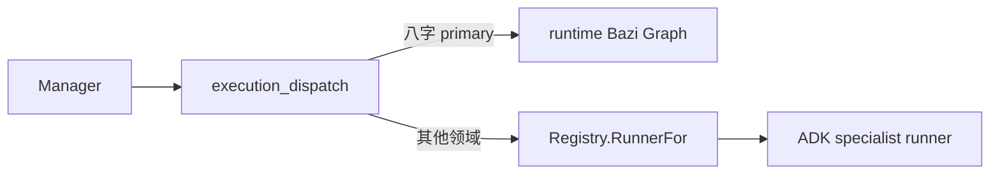
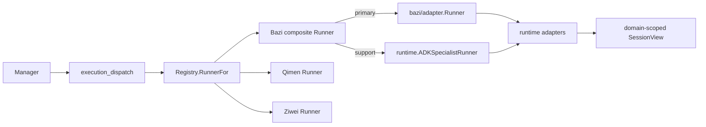
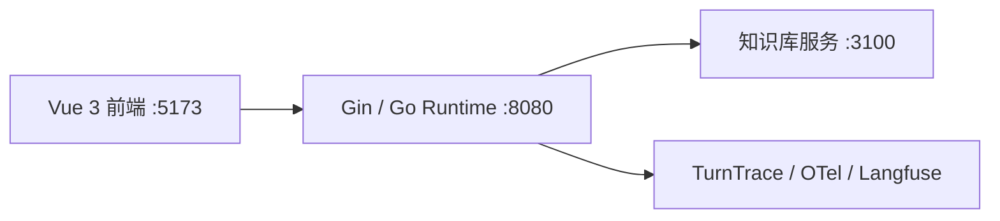
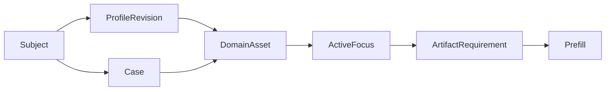
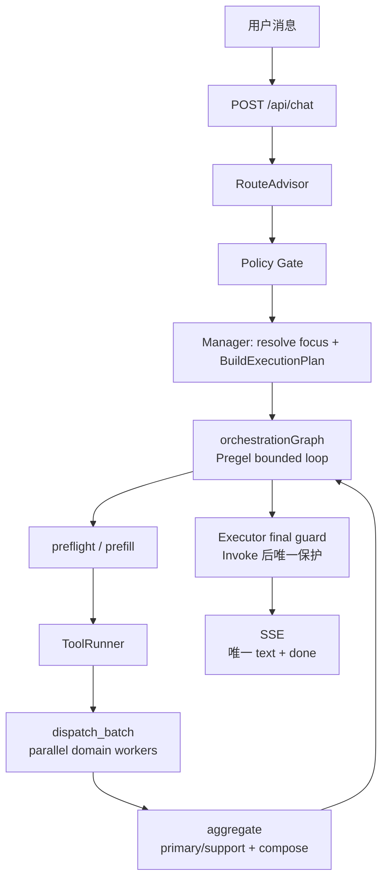

# 架构总览

> 当前架构的唯一事实来源。这里记录运行中的 owner、数据合同与主链；实施历史放在 Git 和专项设计文档。

## 架构结论

`RouteAdvisor -> Policy Gate -> Manager -> ExecutionPlan -> orchestration Graph loop -> Prefill/dispatch -> aggregate -> Executor final guard -> SSE`

- `RouteAdvisor` 只做路由审批，`Policy Gate` 只做确定性策略修正。
- `Manager` 是 runtime 内唯一的对话 owner：解析当前对象，生成执行合同，决定 follow-up 的处理方式，并做有限的直接答复或最终综合；它不是开放式 ReAct 主控。
- `orchestration` Graph 是外层单轮 bounded loop 的 owner：它持有下一动作、Prefill/dispatch 预算、primary/support outcome、降级和终止状态；不持有 Session、Executor 或 SSE sink。
- `specialist runner(s)` 是受限领域 worker，可在 `ExecutionPlan` 边界内使用 ADK 工具调用；程序控制状态、工具、资产校验和输出边界。

本轮领域单入口冻结：Manager 是唯一会话、跨领域协调和最终答复 owner；八字、奇门、紫微是独立业务领域，不直接调用。`specialists.Runner` 是 runtime 调用领域的唯一入口；其 `Request` 只携带当前领域、只读会话投影和可选工具结果回写，不携带 `ApprovedRoute` 或完整会话。八字只有一个组合 Runner，`primary` 委托 `specialists/bazi/adapter.Runner`，`support` 委托 `runtime.ADKSpecialistRunner`；共享 LLM、工具、RAG、追踪和事件能力由 runtime 的 `SpecialistServices` 投影提供，领域不得导入 runtime。`backend/internal/tools/runner.go` 保持独立且不修改。

该迁移的 RB2-RB4 和最终收口已完成：八字 Graph、模型、检索、schema、合同和展示实现归属 `specialists/bazi`；runtime 仅保留共享执行能力投影和跨领域资产门禁，不持有八字专用 runner。

2026-08-14 真实八字冒烟复测已通过：首轮建盘和同会话财运追问分别使用 trace `trc_78e066a5e44d`、`trc_4f683cbdb5b2`，均为 `status=ok`、`bazi.contract.failure_class=clean`、最终 audit clean，SSE 均保持唯一 `text -> done` 且无 `error`。本次复测未使用 Langfuse dataset runner，因为本机 Docker daemon 未运行；本地 TurnTrace 已验证运行链，Langfuse 平台 trace/score 仍待补验。

迁移前，dispatch 直接分支选择八字 Graph，导致它同时知道领域内部实现：



迁移后，runtime 对所有领域只调用统一 Runner 合同，八字内部角色选择由组合 Runner 承担：



## 服务拓扑



| 服务 | 职责 |
|---|---|
| 前端 | 聊天、命盘卡、知识依据、处理过程和调试视图 |
| 后端 | 路由、会话状态、执行编排、SSE 和 trace |
| 知识库 | 返回命理资料证据片段，不生成 runtime 最终答案 |
| 观测 | 本地 trace、dataset run 和 score；不是执行真相源 |

本地密钥配置为 `backend/.env`（模型与 OTel）和 `deploy/langfuse/.env`（Langfuse Docker）。示例文件只能包含占位符。

## Owner 与边界

| 层 | owner | 负责 | 不负责 |
|---|---|---|---|
| 接入 | handler / orchestrator | `/api/chat`、SSE、会话锁、状态读写、trace | 推理和资产选择 |
| 路由 | RouteAdvisor / Policy Gate | 意图、领域、槽位、确定性纠偏 | 最终执行方案和成文 |
| 主控 | Manager | 对话承接、焦点解析、`ExecutionPlan`、follow-up 策略、通用直答、最终 compose | 开放式 ReAct 循环、任意工具选择、自由计算命理确定性事实 |
| 确定性执行 | Prefill / ToolRunner | artifact 准备、所有 registry 工具的统一执行入口、参数校验、超时、重试、错误分类 | 语义路由或最终解释 |
| 领域 | specialist runner(s) | 限域分析、受控检索、领域结果 | 最终答复权和跨对象猜测 |
| 输出 | final guard / SSE bridge | 最终合同校验和事件输出 | 替代 prefill 的缺失资产检查 |

`ApprovedRoute` 不是执行合同，`ExecutionPlan` 才是。`RequiredArtifacts` 是迁移兼容投影；实际校验使用带 owner、subject、历法规则的 `ArtifactRequirement`。

## Backend 重构边界（Batch 1 冻结）

本节冻结后续文件迁移的事实边界；Batch 1 只改变架构事实文档，不改变运行时、API、SSE、Graph 或领域语义。Batch 2-8、DDD Batch B/C1/D0/D1 只读预检、D1A 终态 ownership 收口、D1B Request 收窄、D1C specialist 会话读 DTO、Qimen E1-E7、Ziwei E5-E18 和 Runtime R0.5 已完成；状态见下方批次表和 `PROGRESS.md`。

本轮 RB0-RB4 的迁移图、批次门禁、验收命令和禁止项以 `docs/ddd-domain-refactor-plan.md` 的“领域单入口与八字 Runner 迁移冻结”章节为准；本文件同步保留 owner 和依赖方向，不允许以 dispatch 内部八字分支恢复第二入口。

| owner | 负责 | 明确不负责 |
|---|---|---|
| `RouteAdvisor` | 根据用户输入形成候选路由并执行路由降级 | `ExecutionPlan`、最终成文、领域事实、模型调用 retry 决策 |
| `Policy Gate` | 对路由施加准入、白名单、澄清和确定性纠偏 | 领域解释、最终答复、模型 transport/retry 策略 |
| `Manager` | 持有会话焦点，解析对象和资产，生成 `ExecutionPlan`，决定 follow-up，并做最终 compose | 路由审批、低层模型 transport/retry、自由工具发现、确定性命理计算 |
| `ExecutionPlan` | 表达本轮 route、domain、subject、artifact requirement 和执行模式 | 执行副作用、模型调用、SSE 输出和状态持久化 |
| `Prefill / ToolRunner` | 按 `ArtifactRequirement` 准备确定性资产，并作为 prefill 与 ADK specialist adapter 调用 registry 工具的唯一入口，执行工具合同、参数校验、超时、工具 retry 和错误分类 | 语义路由、领域裁断、最终成文；不能替缺失资产让 specialist 猜测 |
| bounded specialist | 在计划边界内完成限域解释、受控检索和领域结果 | 会话 owner、计划改写、跨对象猜测、最终答复权 |
| `final guard / SSE bridge` | 校验最终输出合同，发送唯一最终 `text` 和 `done` 事件 | 补算资产、重做路由、替代领域解释或决定业务 retry |
| trace / observability | 记录运行事实、阶段、错误、repair 和诊断投影；提供 `TurnTrace`/OTel/Langfuse 观测 | 作为执行真相源、改变下一动作、替业务 owner 做判断 |
| `internal/repair` | 统一模型候选 failure class、repair action/policy、预算、attempt、短状态快照和安全 trace 投影 | 传输层通用 retry、路由决策、最终文本生成和事实猜测 |

### 依赖方向与禁止项

目标依赖方向为：`handler/orchestrator -> supervisor -> route contract`，以及 `handler/orchestrator -> runtime -> state / tools / bounded specialists / repair / llm`；输出桥接只消费 runtime 结果和合同，trace 只消费各 owner 的观测事件。跨层调用必须通过窄 DTO 或明确合同，不以共享内部状态代替边界。

- `supervisor` 不得反向依赖 `runtime`，尤其不得依赖 runtime 的模型调用、模型 transport 或 retry 决策。
- 模型 client、能力归一、transport timeout/retry 和相关错误合同已收敛到 `backend/internal/llm/`；Batch 2 已完成模型调用级 retry owner 迁移。
- `specialist` 不得依赖 `Manager`、路由策略、Session owner、SSE bridge 或 final compose；`runtime` 只能通过 bounded runner 消费领域结果。
- `final guard`、SSE bridge、trace 和 repair 不得反向决定路由、资产选择或领域语义；`ExecutionPlan` 不得依赖具体模型实现。
- `backend/internal/specialists/bazi/graph` 继续保持不依赖 `internal/runtime`；domain DTO 不依赖 runtime。任何新反向 import 都是迁移阻塞，不通过增加 adapter 绕过。
- `backend/internal/specialists/qimen/domain` 只允许保留 typed 盘面和纯符号合同；工具参数、`qimen-go`、Session、trace、SSE 和 map payload 适配留在外层。
- `backend/internal/specialists/qimen/application` 可承载不接触 runtime/SessionState 的问事合同和 prompt projection；它只能接收窄 DTO/旧 payload，不得拥有模型、工具、Session 写回或传输副作用。
- `backend/internal/specialists/qimen/adapter` 负责 `qimen-go` 排盘、工具参数校验、旧 map payload 恢复和 specialist 静态配置；工具实现不得直接依赖 runtime/state/Session/trace/SSE/LLM/MCP。
- `backend/internal/specialists/ziwei/application` 可承载不接触 runtime/SessionState 的 prompt projection；它只能接收窄 map payload，不得拥有模型、工具、Session 写回或传输副作用。
- `backend/internal/specialists/ziwei/domain` 只承载不依赖历法库的星曜值对象、常量、五行局/宫名/起紫微、年时定位和十二神排布规则、索引结果、索引辅助和主星排布；不得依赖 `lunar-go`、工具参数、旧 map payload、runtime/state/Session、模型、MCP、trace 或 SSE。
- `backend/internal/specialists/ziwei/adapter` 负责 specialist 静态配置、`lunar-go` 绑定的历法/宫位/月日定位、完整紫微排盘/流年工具和旧 map payload 恢复；算法工具不得直接依赖 runtime/state/Session/trace/SSE/LLM/MCP。真太阳时偏移和版本由中性 `internal/calendar` 提供，不依赖八字工具包。

### 当前结构清单

| 目录 / 文件组 | 当前职责与代表内容 |
|---|---|
| **[KNOWN]** `internal/supervisor/` | route、fallback、ADK；代表 `approved_route.go`、`cheap_gate.go`、`client.go`、`adk_engine.go`、`decision_contract.go` |
| **[KNOWN]** `internal/runtime/` | Manager、ExecutionPlan、Graph、Executor、Prefill、事件、观测及大量 Bazi 合同/适配文件；`artifact_calendar_rules.go` 是资产兼容门禁，runtime 结构过载是当前已确认的结构事实 |
| **[KNOWN]** `internal/calendar/` | 跨领域真太阳时版本和日期/经度分钟偏移；不含具体排盘工具或业务裁断 |
| **[KNOWN]** `internal/llm/` | 已有模型 factory、chat、embedding，并负责模型调用级 retry owner |
| **[KNOWN]** `internal/repair/` | failure class、policy、budget 和 attempt 合同 |
| **[KNOWN]** `internal/specialists/bazi/domain/` | 事实 DTO、授权范围、引用目录 |
| **[KNOWN]** `internal/specialists/bazi/graph/` | 八字 Graph 拓扑与状态机，禁止依赖 runtime |
| **[KNOWN]** `internal/specialists/bazi/presentation/` | 只消费 `FinalReplyInput` 的 Markdown 展示；不依赖 runtime 或外部适配器 |
| **[KNOWN]** `internal/specialists/qimen/domain/` | 奇门 typed `Chart`/`Cell` 和 `rotating_8` 符号校验；仅依赖标准库 |
| **[KNOWN]** `internal/specialists/qimen/application/` | 问事时间/Case 合同和已批准的 prompt projection；不接触 runtime 状态或外部副作用 |
| **[KNOWN]** `internal/specialists/ziwei/domain/` | ZiWeiStar、纯星曜常量、纯年/时定位规则、年/时索引结果、索引/时辰/亮度/四化辅助和紫微/天府主星排布；仅依赖标准库 |
| **[KNOWN]** `internal/specialists/ziwei/adapter/` | Ziwei specialist 配置、`lunar-go` 绑定的历法/宫位/月日定位、确定性排盘/流年工具和旧 map payload；不接触 runtime 状态、Session 写入、trace 或 SSE |
| **[KNOWN]** `internal/specialists/ziwei/application/` | ZiweiResult map 到 specialist instruction 的纯投影；不接触 runtime 状态或外部副作用 |
| **[KNOWN]** `internal/tools/`、`internal/state/`、`internal/tracing/`、`internal/sse/`、`internal/handler/`、`internal/orchestrator/` | 保持现有 owner 和对外合同，本计划不预先改写其职责 |

具体 executor、事件桥接、trace/final guard、Bazi renderer 拆分簇是 **[INFERRED]**，每批实施前需重读文件注释和调用图确认；D0 已确认 Graph/adapter 当前没有闭合生产簇；package 拆分安全性及部署级多实例高可用是 **[UNKNOWN]**，本计划不承诺。

### 最小目标目录树（先不拆 Go package）

以下是同 package 文件重组的最小目标形状；Batch 4-5 的目标文件名仍为建议名，实施前必须重读职责注释、函数注释和调用图确认。

```text
internal/
├── handler/
├── orchestrator/
├── supervisor/
├── policy/
├── runtime/
│   ├── manager.go
│   ├── execution_plan.go
│   ├── orchestration_graph*.go
│   ├── executor_entry.go       # Batch 3 已完成
│   ├── executor_prefill.go     # Batch 3 已完成
│   ├── executor_tools.go       # Batch 3 已完成
│   ├── event.go
│   ├── event_bridge.go          # Batch 4 已完成
│   ├── event_trace.go           # Batch 4 已完成
│   ├── final_guard.go           # Batch 4 已完成
│   ├── artifact_calendar_rules.go # Runtime R0.5 已完成同包职责重命名
│   └── bazi_*.go                 # 其余 Bazi 文件仍按 R0 盘点结果处理
├── llm/
├── repair/
├── tools/
├── specialists/
│   ├── bazi/
│       ├── domain/
│       ├── graph/
│       └── presentation/       # DDD Batch C1 已完成
│   └── qimen/
│       ├── domain/              # DDD Batch E1 已完成
│       ├── application/         # DDD Batch E2/E4 已完成
│       └── adapter/             # DDD Batch E3/E7 已完成配置与工具；graph/presentation 暂不拆分
│   └── ziwei/
│       ├── domain/              # DDD Batch E9-E18 已完成纯星曜、纯定位与命宫身宫索引；更深迁移 deferred
│       ├── application/         # DDD Batch E6 已完成 prompt projection
│       └── adapter/             # DDD Batch E5/E8-E18 保留配置、工具及 lunar-go/四柱/归一绑定
├── state/
├── sse/
└── tracing/
```

不预先指定删除文件；不新增 package、接口、DAG、checkpoint 或 supervisor。目标树只约束 owner 和文件职责，不承诺 Batch 7 的 package 拆分。

### 文件 / 文件组处置

| 文件组 | 处置 | 批次 | 目标 owner | 明确不负责 |
|---|---|---|---|---|
| `supervisor/*.go` | 保留同 package；Batch 2 只更新 retry 引用 | Batch 2 | `supervisor` | 模型 transport/retry owner、ExecutionPlan、最终成文 |
| `runtime/model_retry.go` → `llm/model_retry.go` | 已移动到已有 `internal/llm/` | Batch 2 | `internal/llm` | 路由审批、领域语义、SSE 输出 |
| `runtime/manager.go`、`execution_plan.go`、`orchestration_graph*.go` | 保留，暂缓拆分 | 暂缓 | `runtime` | 低层模型 retry、SSE sink、领域事实裁断 |
| `runtime/executor_entry.go`、`executor_prefill.go`、`executor_tools.go` | 已在同 package 内拆分执行入口、Prefill、工具调用 | Batch 3 已完成 | `runtime` | 路由、Graph 拓扑、最终 SSE 合同改写 |
| `runtime/event.go` | 保留事件合同 | 保留 | `runtime` | 改写事件类型、SSE wire shape |
| `runtime/event_bridge.go` | 保留事件桥接 | Batch 4 已完成 | `runtime` | 重新路由、补算资产、决定领域语义 |
| `runtime/event_trace.go`、`runtime/final_guard.go` | 拆分 event trace / final guard 函数簇 | Batch 4 已完成 | `runtime` | 让 trace 改变执行真相、让 guard 替代领域解释 |
| `runtime/bazi_final_renderer.go` | 保留 runtime 薄入口；把验收状态映射为 DTO 后调用 presentation | DDD Batch C1 已完成 | `runtime` | 读取 Session/模型/检索载荷、改写合同或直接输出 SSE |
| `specialists/bazi/presentation/renderer_{markdown,facts,sections,templates,topic}.go` | 消费 `FinalReplyInput` 组织 Markdown、事实/大运、报告章节和追问 | DDD Batch C1 已完成 | `presentation` | 读取 runtime 状态、重新裁断领域事实或接触外部适配器 |
| `runtime/artifact_calendar_rules.go` | Bazi/Ziwei 资产历法/方法版本兼容门禁；同包文件名已按真实职责校准 | Runtime R0.5 已完成 | `runtime` 暂留；不是 Bazi domain/adapter 迁移 | 排盘算法、领域裁断、Graph、Session、SSE 或用户答复 |
| `specialists/bazi/domain/` | 文本/大运事实、断言/审计、规则画像、Graph 输入、模型/综合、证据 DTO/质量与强弱一致性规则 | Runtime R1/R2 已完成；runtime 旧实现已删除或改为兼容别名/包装 | Bazi domain | 读取 Session、调用模型/检索、接触 trace/SSE 或决定最终答复 |
| `runtime/repair_compat.go` 及旧兼容别名 | 已完成直接引用迁移；旧兼容文件已删除 | Batch 8 已完成 | `internal/repair` | 重新定义 repair 合同、改变预算或错误分类 |
| `internal/llm/*.go` | 保留，负责模型调用级 retry owner | Batch 2 | `internal/llm` | 路由、资产准备、领域解释 |
| `specialists/bazi/domain/`、`graph/`、`presentation/` | 保留并强化现有边界 | DDD Batch B/C1 已完成 | Bazi domain / graph / presentation | 依赖 runtime、拥有 Manager 或接触外部 transport |
| `specialists/qimen/domain/chart.go`、`chart_test.go` | 新增 typed `Chart`/`Cell` 与转盘符号校验；外层 map 合同仍由工具 adapter 保持 | DDD Batch E1 已完成 | Qimen domain | 解析 HTTP/tool 参数、调用 `qimen-go`、访问 Session/trace/SSE、生成最终文本 |
| `specialists/qimen/adapter/qimen_tool.go`、`qimen_tool_test.go` | 由 adapter 组装 domain 盘面并恢复原有 map-shaped tool result；旧 `internal/tools/qimen` 文件已删除 | DDD Batch E7 已完成 | Qimen adapter | 把工具/传输细节下沉到 domain、改写 API 或 Case/SSE 合同 |
| `specialists/qimen/application/turn_contract.go`、`turn_contract_test.go` | 收敛问事时间参数与已存 Case 盘复用合同；不执行工具或写入状态 | DDD Batch E2 已完成 | Qimen application | 依赖 runtime、Executor、完整 SessionState、工具、模型、检索、trace、SSE |
| `runtime/agent_route.go` 中的 Qimen prompt projection | 将旧 `QimenResult` map payload 按既有顺序转换为 specialist instruction 数据块；不改变文本合同 | DDD Batch E4 已完成 | Qimen application | 读取 Session、调用模型/工具、写回状态、发送 SSE、trace 或最终用户文本 |
| `specialists/qimen/adapter/config.go`、`config_test.go` | 提供 Qimen specialist 的提示词、知识工具白名单和会话注入配置 | DDD Batch E3 已完成 | Qimen adapter | 拥有 Graph 状态、排盘事实、Session 写入、SSE、最终文本或路由决策 |
| `specialists/ziwei/specialist.go`、`specialist_test.go` | 已迁移到 `specialists/ziwei/adapter/config.go`、`config_test.go`，提供 Ziwei specialist 的提示词、知识工具白名单和会话注入配置 | DDD Batch E5 已完成 | Ziwei adapter | 排盘算法、工具参数、Graph、Session 写入、trace、SSE、最终文本或路由决策 |
| `runtime/agent_route.go` 中的 Ziwei prompt projection | 已迁移到 `specialists/ziwei/application`，只接收旧 `ZiWeiResult` map payload 并保留原文本投影合同 | DDD Batch E6 已完成 | Ziwei application | 读取 Session、调用模型/工具、写回状态、发送 SSE、trace 或生成最终用户文本 |
| `specialists/ziwei/domain/{constants,utils,star,major}.go` 及 focused test | 从 adapter 抽出纯星曜常量、索引/时辰/亮度/四化辅助、`ZiWeiStar` 值对象和主星排布；仅依赖标准库 | DDD Batch E9 已完成 | Ziwei domain | 依赖 `lunar-go`、组装完整命盘、工具参数、旧 map payload、Session/Graph/trace/SSE 或最终文本 |
| `specialists/ziwei/domain/star_indices.go` 及 focused test | 从 adapter 抽出不依赖 `lunar-go` 的年干/年支/时支定位规则、年系/时系索引结果；domain 仅依赖标准库 | DDD Batch E10 已完成 | Ziwei domain | 依赖历法库、完整命盘、工具参数、旧 map payload、Session/Graph/trace/SSE 或最终文本 |
| `specialists/ziwei/adapter/{adjective,chart,domain_compat,horoscope,liunian,location,minor,palace,tool,types}.go` 及测试 | 保留 `lunar-go`/四柱/闰月晚子时归一、命盘/流年组装、工具入口、配置和 `ToMap` 旧 payload；已下沉的纯规则只通过薄转发委托 domain | DDD Batch E5/E8-E18 已完成 | Ziwei adapter | 把历法/工具/Session/Graph/trace/SSE 下沉到 domain 或生成最终文本 |
| `specialists/runner.go` | 保留领域 runner 的最小输入/结果合同；Request 使用窄 `SessionView` 和可选工具回写回调 | DDD Batch D1C 已完成 | 承载 `UserMessage`、`ApprovedRoute`、只读会话投影和现有回写合同；不携带完整 `SessionState`、Manager/Domain context 或资产集合 | 让领域 runner 依赖完整 runtime 状态或扩大公共输入 DTO |
| `runtime/bazi_graph_adapter.go`、`bazi_graph_loop.go`、`bazi_internal_graph.go` | D0 已确认依赖/状态所有权和 DTO 尚未闭合；D1A 仅收口 Graph 终态结果 ownership，未复制或移动 | DDD Batch D0、D1A 已完成 | 暂留 `runtime`，未来条件目标为 `bazi/adapter` / `bazi/graph` | 通过复制掩盖 runtime 反向依赖、重复 Graph 入口或改变 SSE/trace |
| 其余 `runtime/bazi_*.go` | R0 已逐文件盘点；assertion、合同校验、综合、证据、Graph 与模型适配继续按 DTO 闭包迁移，不能按文件名机械迁移 | Runtime R0 与 R1 纯领域簇已完成 | 暂留 `runtime`，各文件目标目录以方案表为准 | 借重构改变 Graph、领域语义、repair 或 renderer 合同 |

### 分阶段迁移规则

Batch 2 已完成在既有 `internal/llm` 边界上的责任迁移，不是新增 package；其后先在现有 package 内按 owner 重组文件。只有同 package 重组完成、依赖图无新增反向边、合同验证通过后，才进入 package 拆分可行性审查；审查不等于承诺拆分。Batch 8 已完成 repair 兼容层收口，DDD Batch C1 已完成 presentation 迁移，DDD Batch D0 已确认 Graph/adapter 暂无闭合簇，DDD Batch D1B 已收窄未使用 Request 字段，D1C 已完成 specialist 会话输入收窄，E1-E18 已完成已证明的 Qimen/Ziwei 领域边界；Runtime R0 已完成八字文件盘点，R0.5 已完成跨领域资产兼容文件重命名，R1 已完成文本归一与大运纯事实簇迁移。后续 assertion、校验、综合和 Graph 只能在窄 DTO 证明后逐批继续。

| 批次 | 迁移顺序与范围 | 前置条件 | 必须保持的行为不变量 | 批次门禁 | 验证命令 | 失败回退 |
|---|---|---|---|---|---|---|
| Batch 0 | 基线冻结：只读核对当前 owner、依赖、API/SSE、Graph、错误出口和领域语义 | 已读取架构事实并完成工作区、引用和现状检查 | 不改文件、不改运行时；基线可被后续回归复核 | 只完成基线核对，不自动开始 Batch 1 | `go list ./backend/...`；`GOCACHE=/tmp/suanming-go-cache GOTMPDIR=/tmp go test ./backend/... -count=1`；`go build ./backend/cmd/server/`；`make eval-smoke` | 只读，无需回退 |
| Batch 1 | 冻结 owner、依赖方向、禁止依赖和迁移门禁文档 | Batch 0 基线已完成；仅允许修改架构事实文档 | 不改 API、SSE、Graph 拓扑、错误出口或领域语义 | 只完成文档冻结，不自动开始 Batch 2 | `git diff --check`；`git show --name-only --format= HEAD` / `git diff-tree --no-commit-id --name-only -r HEAD` 检查仅含两份文档；`rg -n "Batch 0|Batch 1|Batch 2|Batch 3|Batch 4|Batch 5|Batch 6|Batch 7|Batch 8|strict-json-schema-implementation-plan.md" docs/architecture.md PROGRESS.md` | 失败时 `git revert` 本批文档提交 |
| Batch 2 | 将模型调用级 retry 从 runtime 移到已有 `backend/internal/llm/`；涉及 `backend/internal/runtime/model_retry.go`、`backend/internal/supervisor/adk_engine.go`、`backend/internal/runtime/agent_route.go` 及对应测试和引用 | Batch 1 经复核并单独批准；确认调用图、合同、retry/错误/trace 测试和残余引用 | 消除 `supervisor -> runtime.ModelCallRetryDecision` 反向依赖；API、SSE、Graph 拓扑、错误出口和领域语义不变 | 只完成 retry owner 迁移；未获批准不得开始 Batch 3 | `go test ./backend/internal/llm ./backend/internal/runtime ./backend/internal/supervisor -count=1`；`go test ./backend/... -count=1`；`go build ./backend/cmd/server/`；`make eval-smoke`；`rg -n "runtime\.ModelCallRetryDecision" backend` 确认无残留 | 失败时 `git revert` 本批提交 |
| Batch 3（已完成） | 在同一 `runtime` package 内将 `executor.go` 重组为执行入口、prefill、工具调用职责文件 | Batch 2 完成并通过 retry/错误回归；已锁定 Executor 调用合同 | `ExecutionPlan`、资产校验、Graph 状态、工具合同、错误出口和 SSE 顺序不变 | 只完成执行入口文件重组，不自动开始 Batch 4 | `go test ./backend/internal/runtime -run 'Executor|Prefill|ExecutionPlan|Orchestration|Tool' -count=1`；`go test ./backend/... -count=1`；`go build ./backend/cmd/server/`；`make eval-smoke` 真实 SSE smoke | 失败时 `git revert` 本批提交 |
| Batch 4（已完成） | 在同一 package 内拆事件桥接、事件 trace、final guard 职责 | Batch 3 完成；事件类型、trace 字段和 final guard 合同已核对 | 唯一最终 `text`、`done` 顺序、trace 观测语义和最终合同边界不变 | 只完成事件/guard 文件重组；未进入 Batch 5 的 renderer 改造 | `go test ./backend/internal/runtime -run 'Event|Bridge|Trace|Guard|Turn' -count=1`；`go test ./backend/... -count=1`；`go build ./backend/cmd/server/`；`make eval-smoke`，SSE 到 `done` 并检查唯一 `text`/`done` 与 trace | 失败时 `git revert` 本批提交 |
| Batch 5（已完成） | 后置拆分 Bazi renderer | Batch 4 完成；renderer 输入投影、facts-only、引用清理和输出合同已有回归证据 | renderer 只转写已验证投影，不新增裁断；领域语义、错误出口和 SSE wire shape 不变 | 文件重组已完成；`bazi-quality-v1` 儿童首运前样例仍有 `static.contract_audit=not_run` 残余；Batch 6 已单独完成只读审计 | `go test ./backend/internal/runtime -run 'Render|Bazi|Liunian|Contract' -count=1`；`go test ./backend/... -count=1`；`go build ./backend/cmd/server/`；`make eval-bazi-answer-quality` 3/3；`make eval-bazi-quality` 需另行修复上游 trace 合同后复核 | 失败时 `git revert` 本批提交 |
| Batch 6（审计完成，无生产代码变更） | 只读审计兼容层并清理已确认的残余引用 | Batch 5 文件重组完成；全量符号、调用方、兼容别名和文档引用已核对 | 不改变兼容层语义、API、SSE、Graph、错误出口或领域语义；未确认的引用不得删除 | 当时确认 repair 类型、策略、预算和 trace 别名仍有调用，故延后到 Batch 8 机械迁移 | `rg -n` 符号/调用者审计；`go list -deps ./backend/internal/runtime ./backend/internal/specialists/bazi/graph` 确认共享 `internal/repair`；Batch 5 全量 test/build 已通过 | 无生产代码变更，无需回退 |
| Batch 7 | 审查 package 拆分可行性、依赖图和边界证据；不承诺执行 package 拆分 | Batch 6 完成；同 package 重组和依赖/合同审计通过 | 只读审查不改变运行时；不新增 package、接口、兼容代码或迁移实现 | 只输出可行性结论，package 拆分需另行批准 | `go list ./backend/...`；`go list -deps ./backend/...`；CodeGraph/import-cycle 审查 | 只读，无需回退 |
| Batch 8（已完成） | 将 runtime 对共享 repair 合同的引用从兼容别名迁移为 `internal/repair` 直接引用，并删除零调用者的 `repair_compat.go` | Batch 7 结论确认；所有别名调用者、Graph state、trace 和测试已盘点 | repair 类型值、预算、错误分类、trace key、Graph 拓扑、SSE 和领域语义不变 | 只完成机械引用迁移，不新增接口或改控制流 | `gofmt`；focused runtime test；授权环境 `go test ./backend/... -count=1`；`go build ./backend/cmd/server/`；授权环境 `make eval-smoke` 2/2；旧别名零残留 | 回退本批提交 |
| DDD Batch D0/D1（已完成，只读） | 复核 Bazi adapter/Graph 的调用闭包、状态所有权、依赖方向、Request 字段矩阵和最小 DTO；不移动生产代码 | Batch C1 已完成；CodeGraph caller/callee 可用 | 不改变任何运行时合同；不新增接口、package、Graph、SSE 或 trace 行为 | 只输出下一批进入条件；未证明闭合簇前不得复制/移动 Graph 文件 | CodeGraph；`go list ./backend/...`；授权环境 `go test ./backend/... -count=1`；server build；审阅 `bazi_graph_adapter.go`、`bazi_graph_loop.go`、`bazi_internal_graph.go`；C1 已有 SSE/trace 证据 | 仅回退本批文档增量 |
| DDD Batch D1A（已完成） | 删除 runtime 重复 `BaziGraphResult`，直接使用 `specialists/bazi/graph.Result`；保留 runtime 错误映射和终态 audit 投影 | D0/D1 只读闭包已完成；Graph `Result` 已存在 | Graph 拓扑、24 步上限、repair budget、错误字段、trace、SSE 和领域语义不变 | 只收口终态结果 ownership，不移动 Graph/adapter 文件或新增接口 | gofmt；focused runtime/Graph tests；授权环境 full test/build；旧符号零残留；合成非真人 Bazi SSE/trace 回放 | 恢复 runtime 结果包装，回退本批提交 |
| DDD Batch D1B（已完成） | 从 `specialists.Request` 删除未读取的 `SessionID`、`ManagerContext`、`DomainContext`，保留 `UserMessage`、`Route`、`Session`；清理因此产生的 runtime 孤儿 helper | D0/D1 字段审计完成；dispatch 是唯一构造点；无其他读取者或 import cycle | Runner 方法签名、ExecutionPlan dispatch、Graph、repair、错误出口、SSE、trace 和领域语义不变 | 只收窄输入 DTO，不移动 Graph/adapter、不新增接口 | gofmt；focused specialists/runtime test；`go test ./backend/... -count=1`；server build；`go list ./backend/...`；字段零读取审计；合成 SSE/trace 回放通过；真实数据集 smoke 因敏感载荷未执行 | 回退时恢复三个字段、唯一构造点赋值和被本批删除的 helper |
| DDD Batch D1C（已完成） | 将普通 specialist 的完整 `*state.SessionState` Request 输入替换为 `specialists.SessionView`，并把现有 `saveToolResult` 作为可选回写回调；Graph 仍由 runtime dispatch 先行分流 | D1B 完成；普通 runner 读字段、工具回写 owner 和 Graph 分流已确认；目标文件注释已复核 | prompt/session values、最近消息、工具结果、Graph 16/24 步、repair、错误出口、SSE 顺序、唯一 `text`/`done`、trace 和领域语义不变；不移动 Graph/adapter 文件 | gofmt；focused specialists/runtime test；授权环境 full backend test；server build；`go list ./backend/...`；旧完整 Request 字段/读取审计；合成 SSE/trace 到 `done`；trace `4a734b56256aceb9c3924e82f274df24` | 只恢复本批 Request/DTO/callback 与调用点，不触碰其他未提交修改 |
| DDD Batch E1（已完成） | 在 `specialists/qimen/domain` 增加 typed `Chart`/`Cell` 和 `rotating_8` 符号校验；`tools/qimen` 保持参数解析、`qimen-go` 排盘和旧 map payload | Qimen 工具已有参数/盘式/输出合同测试；CodeGraph 确认外部调用面；domain 依赖闭包仅含标准库 | `qimen_dunjia` 输入、API/JSON 字段、Case owner/time、外层 16 步、repair、SSE 顺序、唯一 `text`/`done`、trace 和领域语义不变 | 只完成纯领域最小簇，不新增 Qimen Graph/application/接口，不复制旧工具入口 | gofmt；Qimen focused test；授权 `go test ./backend/... -count=1`；server build；`go list`/domain 禁止依赖审计；非真人 SSE/trace 回放：`trc_5ac7a31df6b2` | 删除/恢复 E1 domain 类型、adapter 映射和测试，不触碰其他未提交修改 |
| DDD Batch E2（已完成） | 将 `qimenChartMatchesTurn`、`qimenQuestionTimeParams` 的纯问事合同迁入 `specialists/qimen/application/turn_contract.go`；runtime 只保留 prefill 编排和状态写入 | E1 完成；CodeGraph 仅确认 runtime 一个生产调用点；application 只依赖公共 `contracts.TurnContext` 与标准库，无 runtime 反向边 | `question_time` 仍是唯一排盘参数；Case owner/time、缓存复用判定、工具白名单、外层 16 步、repair、SSE 顺序、唯一 `text`/`done`、trace、错误出口和领域语义不变 | 只移动纯合同函数和测试，不新增接口、Graph、adapter、DAG、checkpoint 或 supervisor | gofmt；Qimen/application、runtime、tools focused test；授权 `go test ./backend/... -count=1`；server build；`go list ./backend/...`；禁止依赖审计；非真人 SSE/trace 回放：`trc_d594d57e201a` | 恢复 runtime 两个私有 helper、删去 application 合同文件及测试；不触碰 E1、D1C 或其他未提交修改 |
| DDD Batch E3（已完成） | 将 Qimen specialist 的 `GetConfig` 与配置测试从根包迁入 `specialists/qimen/adapter`；composition root 改用 adapter 配置，保持 Registry/Runner 合同不变 | E2 完成；CodeGraph 确认调用者仅为 container、Qimen 配置测试和公共工具白名单测试；adapter 只依赖 prompts 与 specialists 公共合同，无 runtime 反向边 | specialist 名称、提示词、工具白名单顺序、`InjectSessionContext`、Runner 注册、API、Graph 16 步、SSE、trace 和领域语义不变 | 只迁移配置 owner，不移动运行器、Graph、Session、工具执行或最终文本；不保留根包第二套 `GetConfig` | gofmt；Qimen adapter/specialists/container focused test；授权 `go test ./backend/... -count=1`；server build；`go list`/禁止依赖审计；非真人 Qimen SSE/trace 回放：`trc_77efa5501e84` | 恢复根包 `specialist.go`/测试和三个调用点；删除 adapter 配置文件；不触碰 E1/E2 或其他未提交修改 |
| DDD Batch E4（已完成） | 将 `runtime/agent_route.go` 的 Qimen `QimenResult` prompt projection 迁入 `specialists/qimen/application`；runtime 只负责从 `SessionView` 取出 map 并注入 instruction | E1/E2/E3 完成；CodeGraph 确认单一生产调用；application 输入收窄为 map payload 且无 runtime 反向边 | Prompt 字段顺序、空值/九宫/兜底 JSON、禁止重复排盘文案、配置、`question_time`、Case/time、Graph 16 步、repair、SSE、trace、错误出口和领域语义不变 | 只迁移纯 projection，不移动 Session、模型、工具、Graph、SSE 或最终文本；旧 runtime 方法零残留 | 目标注释复核；gofmt；Qimen/application/runtime focused test；授权 `go test ./backend/... -count=1`；server build；`go list`/`go list -deps`；禁止依赖审计；非真人 SSE/trace 到 `done` | trace `trc_e63c6a1a57e4` 通过；恢复 runtime 私有方法和测试调用，删除 E4 application 文件/测试；保留 E1-E3 和其他未提交修改 |
| DDD Batch E5（已完成） | 将 Ziwei specialist 的 `GetConfig` 与配置测试从 `specialists/ziwei` 根包迁入 `specialists/ziwei/adapter`；composition root 和公共工具白名单测试改用 adapter 配置 | E1-E4 完成；CodeGraph/全仓引用确认调用者闭合；adapter 只依赖 prompts 与 specialists 公共合同，无 runtime 反向边 | 配置字段、提示词原文、工具白名单顺序、`InjectSessionContext`、Runner 注册、API、Graph 16/24 步、repair、SSE、trace、错误出口和三域语义不变 | 只迁移静态配置，不移动紫微算法、工具、Session、Graph、模型或最终文本；根包旧 `GetConfig` 零残留 | 目标注释复核；gofmt；Ziwei adapter/specialists/container focused test；授权 `go test ./backend/... -count=1`；server build；`go list`/`go list -deps`；禁止依赖和旧根包引用审计；无个人资料的 Ziwei 澄清 SSE/trace 到 `done`：`trc_846f5802984f`，并记录该回放未进入 specialist | 恢复根包配置与调用点，删除 E5 adapter 文件/测试；保留 E1-E4 和其他未提交修改 |
| DDD Batch E6（已完成） | 将 `runtime/agent_route.go` 的 Ziwei `ZiWeiResult` prompt projection 迁入 `specialists/ziwei/application`；runtime 只负责从 `SessionView` 取出 map 并注入 instruction | E5 完成；CodeGraph 确认单一生产调用和 receiver 不参与计算；application 输入收窄为 map payload 且无 runtime 反向边 | 主星筛选、字段顺序、空值/流年 JSON/稀疏 JSON 兜底、禁止重复排盘文案、配置、Graph 16/24 步、repair、SSE、trace、错误出口和领域语义不变 | 只迁移纯 projection，不移动 Session、模型、工具、Graph、SSE 或最终文本；旧 runtime 方法零残留 | 目标注释复核；gofmt；Ziwei application/runtime focused test；授权 `go test ./backend/... -count=1`；server build；`go list`/`go list -deps`；禁止依赖审计和旧方法零残留；无个人资料的 Ziwei SSE/trace 到 `done`，并记录未进入 specialist 的边界 | trace `trc_babddfef660d` 通过；回放在 preflight 短路，SSE `text=1`、`done=1`、`error=0`；恢复 runtime 私有方法和唯一调用、删除 E6 application 文件/测试；保留 E1-E5 和其他未提交修改 |

| DDD Batch E7（已完成） | 将奇门外部排盘工具从 `internal/tools/qimen` 收敛到 `specialists/qimen/adapter`；保留 `tools.Tool` 隐式合同、`question_time` 参数和旧 map payload | E1-E6 已完成；CodeGraph/全仓引用确认调用闭合；adapter 工具实现无 runtime/state 直接边；`.git/index` 只读时采用复制、改包/调用者、删除旧 owner 的等价迁移 | `qimen_dunjia` 名称、参数校验、`rotating_8` 符号合同、Case/time、Prefill、外层 16 步、repair、SSE 顺序、唯一 `text`/`done`、trace、错误出口和领域语义不变 | 只迁移工具 adapter 文件簇，不移动 Qimen Graph/presentation，不新增接口、DAG、checkpoint 或 supervisor；公共 `specialists -> policy -> state` 间接闭包作为后续契约审查项 | 目标文件头/函数注释复核；gofmt；Qimen adapter/runtime focused test；授权 `go test ./backend/... -count=1`；server build；`go list`/`go list -deps`；旧路径/旧符号审计；合成 Qimen SSE/trace 回放到 `done` | trace `trc_ffd892d9b9bd` 通过；保留 Qimen route、`qimen_dunjia` 仅 `question_time`、`prefill`、`contract_gate=passed`、Case/time、外层 16 步、`completed` 和唯一 `text`/`done`；恢复旧工具路径和调用点，删除 E7 adapter 工具文件；不触碰 E1-E6 或其他未提交修改 |

| DDD Batch E9（已完成） | 将已证明纯的 Ziwei `constants.go`、`utils.go`、`ZiWeiStar` 值对象和 `major.go` 下沉到 `specialists/ziwei/domain`；adapter 保留 lunar-go 绑定、命盘/流年组装、工具和 `ToMap`，用薄转发保持同包调用名 | E8 完成；CodeGraph/全仓引用确认候选闭包；domain 不导入 lunar-go、runtime/state/Session、模型/MCP/trace/SSE；`types.go` 的 map 投影未混入 domain | 主星顺序、索引、亮度、四化、命盘/流年字段、`ziwei_calc`/`ziwei_liunian`、真太阳时、API、Graph 16/24 步、repair、SSE 顺序、唯一 `text`/`done`、错误出口、trace 和领域语义不变 | 只迁移纯星曜簇；不拆 location/palace/chart/horoscope/liunian，不改 lunar-go 输入，不新增接口/Graph/DAG/checkpoint/supervisor，不保留第二套算法 | domain/adapter focused test；授权 `go test ./backend/... -count=1`；server build；`go list`/domain `go list -deps`；gofmt、diff、禁止依赖、旧 owner/重复规则审计；因出生资料安全门禁，真实 specialist 主链回放仍标记 `[UNKNOWN]` | E9 domain focused test、Ziwei adapter/container/runtime focused test、授权全量 backend test、server build、`go list`、domain 依赖审计、gofmt、`git diff --check` 和旧 owner/重复实现审计通过；新增无个人资料澄清 trace `trc_4b7b30c408ed` 为 `status=ok`、`preflight.short_circuit=true`、外层 16 步、`short_circuit` 终态和唯一 `text`/`done`、无 `error`；未将其冒充工具调用证据；只恢复 E9 文件/转发，不触碰 E8 及其他未提交修改 |

| DDD Batch E10（已完成） | 将 Ziwei 纯年干/年支/时支定位规则、年系/时系索引结果迁入 `specialists/ziwei/domain/star_indices.go`；adapter 保留 `GetStartIndex`、月系/日系 `lunar-go` 输入和旧签名薄转发 | E9 完成；CodeGraph/全仓引用确认纯簇闭合；domain 直接 import 为空且依赖闭包仅含标准库；真实 specialist 主链安全门禁边界已记录 | 纯定位函数逐值、`BuildChart`/流年工具结果、`ziwei_calc`/`ziwei_liunian`、API、Graph 16/24 步、repair、错误出口、SSE 顺序、唯一 `text`/`done`、trace 和领域语义不变 | 只迁移 `star_indices.go` 纯簇；不把 `calendar.Solar/Lunar` 带入 domain，不改历法/工具入口，不新增接口/Graph/DAG/checkpoint/supervisor，不保留第二套规则 | domain/adapter/container/runtime focused test；授权 `go test ./backend/... -count=1`；server build；`go list ./backend/...`；domain/adapter `go list -deps`、gofmt、diff、禁止依赖和旧实现审计；无出生资料 Ziwei `/api/chat` 回放到 `done` | E10 focused/full test、server build、`go list`、gofmt、`git diff --check`、domain 禁止依赖和单一 owner 审计通过；trace `trc_c1ac116bf1b6` 为 `status=ok`、`preflight.short_circuit=true`、外层 `max_run_steps=16`、SSE 唯一 `text → component → done`、`error=0`；真实工具 Prefill/Case 绑定仍为 `[UNKNOWN]`；只恢复 adapter 纯规则和删除 E10 domain 文件，不触碰 E9 及其他未提交修改 |
| DDD Batch E11（已完成） | 将五行局、十二宫旋转和起紫微/天府纯索引规则迁入 `specialists/ziwei/domain/palace_rules.go`；adapter 保留 lunar-go 日数读取、晚子时修正和旧签名转发 | E10 完成；`chart.go` 是唯一生产调用面；domain 依赖闭包仅含自身包 | 五行局/宫名/星曜索引逐值、`BuildChart`/流年工具、`ziwei_calc`/`ziwei_liunian`、API、Graph 16/24 步、repair、错误出口、SSE 顺序、唯一 `text`/`done`、trace 和领域语义不变 | 不迁移月系/日系、大限、adapter JSON DTO、Graph 或 presentation；不新增接口、DAG、checkpoint 或 supervisor | domain/adapter/container/runtime focused test；授权 full test；server build；`go list`/依赖审计；gofmt/diff/重复实现审计；无资料 Ziwei SSE/trace | trace `trc_3a15c0307917` 为 `status=ok`、`preflight.short_circuit=true`、`short_circuit` 终态、唯一 `text → component → component → done` 且无 `error`；真实工具 Prefill/Case 绑定仍为 `[UNKNOWN]` |
| DDD Batch E12（已完成） | 将长生十二神和博士十二神纯排布规则迁入 `specialists/ziwei/domain/horoscope_rules.go`；adapter 保留未读取的 `*calendar.Solar` 兼容签名 | E11 完成；`chart.go` 是唯一生产调用面；domain 依赖闭包仅含自身包 | 十二神宫位字段、`BuildChart`/流年工具、API、Graph 16/24 步、repair、错误出口、SSE 顺序、唯一 `text`/`done`、trace 和领域语义不变 | 不迁移大限、月系/日系、adapter JSON DTO、Graph 或 presentation；不新增接口、DAG、checkpoint 或 supervisor | domain/adapter/container/runtime focused test；授权 full test；server build；`go list`/依赖审计；gofmt/diff/单一 owner 审计；无资料 Ziwei SSE/trace | trace `trc_04aeb2b2680a` 为 `status=ok`、`preflight.short_circuit=true`、`short_circuit` 终态、唯一 `text → component → component → done` 且无 `error`；真实工具 Prefill/Case 绑定仍为 `[UNKNOWN]` |
| DDD Batch E13（已完成） | 将大限纯计算和无 JSON 标签的 `DecadalInterval` 迁入 `specialists/ziwei/domain/horoscope_rules.go`；adapter 保留旧签名并投影回 `DecadalInfo` | E12 完成；`chart.go` 是唯一生产调用面；`solar`/`timeIndex`/`fixLeap` 不参与大限计算；domain 依赖闭包仅含自身包 | 大限起止年龄/干支、`BuildChart`/流年工具、API、Graph 16/24 步、repair、错误出口、SSE 顺序、唯一 `text`/`done`、trace 和领域语义不变 | 不迁移命宫身宫、月日星曜、完整命盘/工具/Graph/presentation；不新增接口、DAG、checkpoint 或 supervisor | domain/adapter/container/runtime focused test；授权 full test；server build；`go list`/依赖审计；gofmt/diff/单一 owner 审计；无资料 Ziwei SSE/trace | trace `trc_41e0da5b1c21` 为 `status=ok`、`preflight.short_circuit=true`、`short_circuit` 终态、唯一 `text → component → component → done` 且无 `error`；`domain/star.go` 的既有 JSON tags 为 P2，未由本批引入；真实工具 Prefill/Case 绑定仍为 `[UNKNOWN]` |
| DDD Batch E14（已完成） | 移除 `domain.ZiWeiStar` JSON 标签；adapter `ToMap` 单点投影为 `StarPayload`，保留星曜旧 payload | E13 完成；`ZiWeiCalcTool.Execute -> ToMap` 是生产输出唯一入口；domain 依赖闭包仅含自身包 | `name/type/brightness,omitempty/mutagen,omitempty`、星曜数组顺序、工具 map payload、API、Graph 16/24 步、repair、错误出口、SSE 顺序、唯一 `text`/`done`、trace 和领域语义不变 | 不改星曜算法、`BuildChart`、工具入口、Graph/presentation；不新增接口、DAG、checkpoint 或 supervisor | domain/adapter/container/runtime focused test；授权 full test；server build；`go list`/依赖审计；JSON 标签、单一 DTO owner、gofmt/diff 审计；无资料 Ziwei SSE/trace | 最终二进制 trace `trc_f9af1afbaa03` 为 `status=ok`、`preflight.short_circuit=true`、唯一 `text → component → component → done` 且无 `error`；真实工具 Prefill/Case 绑定仍为 `[UNKNOWN]`，短路回放不冒充工具 payload 证据 |
| DDD Batch E15（已完成） | 将月系/日系杂曜的标量纯计算与无标签索引值对象下沉到 `specialists/ziwei/domain`；adapter 保留 lunar-go 月日/闰月/晚子时提取和旧签名 | E14 完成；`chart.go` 是唯一生产调用者；domain 依赖闭包仅含自身包 | 月日索引、杂曜宫位、命盘 payload、API、Graph 16/24 步、repair、错误出口、SSE 顺序、唯一 `text`/`done`、trace 和领域语义不变 | 不迁移 lunar-go、命盘组装、杂曜输出、工具、Graph/presentation；不新增接口、DAG、checkpoint 或 supervisor | domain/adapter/container/runtime focused test；授权 full test；server build；`go list`/依赖、禁止依赖/单一 owner/gofmt/diff 审计；无资料 Ziwei SSE/trace | 最终二进制 trace `trc_ee327b7d78cb` 为 `status=ok`、`preflight.short_circuit=true`、唯一 `text → component → component → done` 且无 `error`；真实工具 Prefill/Case 绑定仍为 `[UNKNOWN]`，短路回放不冒充工具输出证据 |
| DDD Batch E16（已完成） | 将十四辅星/煞星纯组装迁入 `specialists/ziwei/domain/minor.go`；adapter 保留旧函数签名转发 | E15 完成；`chart.go` 是唯一生产调用者；输入、定位、亮度、四化和星曜值对象均已在 domain | 辅星名称/类别/宫位/亮度/四化、命盘 payload、API、Graph 16/24 步、repair、错误出口、SSE 顺序、唯一 `text`/`done`、trace 和领域语义不变 | 不迁移 lunar-go 月份提取、命盘组装、工具、Graph/presentation；不新增接口、DAG、checkpoint 或 supervisor | domain/adapter/container/runtime focused test；授权 full test；server build；`go list`/依赖、禁止依赖/单一 owner/gofmt/diff 审计；无资料 Ziwei SSE/trace | 最终二进制 trace `trc_e4707c07560f` 为 `status=ok`、`preflight.short_circuit=true`、唯一 `text → component → component → done` 且无 `error`；真实工具 Prefill/Case 绑定仍为 `[UNKNOWN]`，短路回放不冒充工具输出证据 |
| DDD Batch E17（已完成） | 将年/月/日/时杂曜纯组装迁入 `specialists/ziwei/domain/adjective.go`；adapter 保留旧函数签名转发 | E16 完成；`chart.go` 是唯一生产调用者；四类索引、红鸾天喜索引和星曜值对象均已在 domain | 杂曜名称/类别/宫位/顺序、命盘 payload、API、Graph 16/24 步、repair、错误出口、SSE 顺序、唯一 `text`/`done`、trace 和领域语义不变 | 不迁移 lunar-go 日期归一、命盘组装、工具、Graph/presentation；不新增接口、DAG、checkpoint 或 supervisor | domain/adapter/container/runtime focused test；授权 full test；server build；`go list`/依赖、禁止依赖/单一 owner/gofmt/diff 审计；无资料 Ziwei SSE/trace | 最终二进制 trace `trc_cb7003eb1912` 为 `status=ok`、`preflight.short_circuit=true`、唯一 `text → component → component → done` 且无 `error`；真实工具 Prefill/Case 绑定仍为 `[UNKNOWN]`，短路回放不冒充工具输出证据 |
| DDD Batch E18（已完成；本轮局部批次） | 将命宫/身宫及命宫干支纯索引下沉到 `specialists/ziwei/domain/palace_rules.go`；adapter 保留 lunar-go 日期、四柱、闰月/晚子时归一和兼容签名委托 | E17 完成；`BuildChart` 是唯一生产调用者；domain 标量输入闭合且无禁止依赖 | 命宫/身宫/命宫干支、命盘 payload、API、Graph 16/24 步、repair、错误出口、SSE 顺序、唯一 `text`/`done`、trace 和领域语义不变 | 只做局部纯索引；不改 runtime/runner/Graph/Session/SSE/trace/API，不继续 Ziwei domain/graph/presentation，不新增 E19 | domain/adapter/container/runtime focused test；授权 full backend test；server build；`go list`；domain/adapter 禁止依赖、单一 owner、gofmt/diff；无出生资料 SSE/trace 回放到 done | trace `trc_25f24af1692d` 为 `status=ok`、`preflight.short_circuit=true`、外层 16 步、唯一 `text`/`done`、无 `error`；真实 Prefill/Case 绑定仍为 `[UNKNOWN]`；只回退 E18，不触碰其他未提交修改 |

### 计划事实标记

- **[KNOWN]** `backend/internal/llm/model_retry.go` 负责模型调用级 retry；`supervisor/adk_engine.go` 和 `runtime/agent_route.go` 共享 `llm.DefaultModelRetryConfig`；当前 Graph、SSE、错误出口合同未因 Batch 2 改变。
- **[INFERRED]** executor、事件桥接、trace/final guard、Bazi renderer 的文件拆分簇来自当前结构推断；每批修改前必须重新验证文件、调用者和依赖边。
- **[KNOWN]** Batch 8 已完成 repair 兼容别名迁移；focused runtime test、授权环境全量 backend test、server build 和授权环境 `make eval-smoke` 2/2 通过。
- **[KNOWN]** DDD Batch D0 已确认 `bazi_graph_adapter.go` 将 `Executor`、完整 `SessionState`、`EventSink`、trace 和 12 个 Graph callback 绑定在 runtime；`baziInternalGraphState` 在三个 runtime 文件间高扇出，当前没有已证明闭合的 Graph/adapter 生产簇。
- **[INFERRED]** 已证明闭合的文件簇可以用 `git mv` 或“复制目标文件、改包/调用者、删除旧文件”的等价流程迁移；复制不能替代 DTO 闭包和依赖方向证明。
- **[KNOWN]** DDD Batch D1A 只改 runtime 对已有 `specialists/bazi/graph.Result` 的消费类型；`baziGraphTerminalText` 仍在 runtime 单点转换领域失败，Graph 拓扑和 callback 合同不变。
- **[KNOWN]** DDD Batch D1A 已通过明确标注非真人的 Bazi `/api/chat` 回放：trace `trc_7d72af48f598` 保留外层 16 步、Bazi 24 步、repair budget、`hard_error` 终态和唯一 `done` 收口；模型 `dynamic_synthesis/method_contract` 失败属于既有合同波动。
- **[KNOWN]** DDD Batch D1B 执行前的字段审计确认：`ADKSpecialistRunner.Run` 只读取 `UserMessage`、`Route`、`Session`；`SessionID`、`ManagerContext`、`DomainContext` 无 backend 读取者，dispatch 是唯一生产构造点。
- **[KNOWN]** DDD Batch D1B 已通过 focused/full test、server build、`go list`、字段零读取审计和合成 `/api/chat` 回放；trace `trc_fa7992ca3de4` 保留外层 16 步、Bazi 24 步和 completed 终态，SSE 保留唯一 `text`/`done` 收口。
- **[KNOWN]** DDD Batch D1C 已将普通 runner 的会话读字段收敛为 `Subject`、`Profile`、三类盘面、`RecentTurns` 和 `RunningSummary`；工具写回仍由 runtime 的 `saveToolResult` 单点处理，Bazi Graph 在 dispatch 层先行分流。
- **[KNOWN]** D1C focused/full test、server build、`go list`、gofmt、diff 检查、禁止依赖审计和明确非真人 SSE/trace 回放均通过；trace `4a734b56256aceb9c3924e82f274df24` 保留外层 16 步、Bazi 24 步、一次实际 repair、`completed` 终态和唯一 `text`/`done` 收口；adapter/Graph 仍未因本批获得可移动证明。
- **[KNOWN]** DDD Batch E1 的 Qimen domain 仅依赖标准库；`tools/qimen` 保持参数解析、`qimen-go` 排盘和原有 map payload，domain 只拥有 typed `Chart`/`Cell` 与 `rotating_8` 符号校验。
- **[KNOWN]** E1 focused/full test、server build、`go list`、domain 禁止依赖审计和非真人 SSE/trace 回放通过；trace `trc_5ac7a31df6b2` 保留 `qimen`、外层 16 步、`completed`、Case owner/time 绑定、`qimen_dunjia`/`prefill`/`contract_gate` 成功以及唯一 `text`/`done`。
- **[KNOWN]** DDD Batch E2 已将纯问事合同函数移入 `specialists/qimen/application`；该包不接触 Executor、完整 SessionState、工具、模型、检索、trace 或 SSE，runtime 仅调用其合同函数。
- **[KNOWN]** E2 focused/full test、server build、`go list`、gofmt、`git diff --check` 和禁止依赖审计通过；非真人 trace `trc_d594d57e201a` 保留 `qimen_dunjia` 仅接收 `question_time`、`prefill.executed=true`、`contract_gate=passed`、Case/time 绑定、外层 16 步、`completed` 和唯一 `text`/`done`。
- **[KNOWN]** DDD Batch E3 已将 Qimen specialist 配置迁入 `specialists/qimen/adapter`；配置直接依赖 `prompts` 和公共 `specialists.Config`，根包旧 `GetConfig` 零残留，composition root 注册链保持可用。
- **[KNOWN]** E3 focused/full test、server build、`go list`、adapter 禁止依赖和旧根包引用审计通过；非真人 trace `trc_77efa5501e84` 保留 Qimen route、`qimen_dunjia` `question_time` 参数、`prefill`、`contract_gate=passed`、外层 16 步、`completed` 和唯一 `text`/`done`。
- **[KNOWN]** DDD Batch E4 已将 Qimen `QimenResult` prompt projection 收敛到 `specialists/qimen/application.BuildDataBlock`；application 只依赖标准库和既有 `contracts`，runtime 只传入窄 map payload，旧 runtime 方法零残留。E4 focused/full test、server build、`go list`、依赖审计和非真人回放 trace `trc_e63c6a1a57e4` 通过，保留 `qimen_dunjia` 仅 `question_time` 且来源为 `prefill`、`contract_gate=passed`、外层 16 步、`completed` 和唯一 `text`/`done`；trace prompt input 仍按既有持久化限制截断，逐字 projection 由 application 测试覆盖。
- **[KNOWN]** DDD Batch E7 已将 Qimen 外部排盘工具迁入 `specialists/qimen/adapter`；`qimen_tool.go` 直接依赖 `lunar-go`、`qimen-go` 和 Qimen domain，旧 `internal/tools/qimen` 文件与符号零残留。adapter 包的完整 `go list -deps` 闭包仍经公共 `specialists -> policy -> state` 合同间接包含 `internal/state`，未发现 Qimen 工具/domain 的直接 state import 或 import cycle。
- **[KNOWN]** E7 focused/full test、server build、`go list`、gofmt、diff 检查、旧路径/旧符号审计和非真人 Qimen 回放通过；trace `trc_ffd892d9b9bd` 保留 Qimen route、`question_time`、`prefill`、`contract_gate=passed`、Case/time、外层 16 步、`completed` 和唯一 `text`/`done`，SSE 无 `error`。
- **[KNOWN]** E8 已将 Ziwei 12 个生产文件和 2 个测试文件迁入 `specialists/ziwei/adapter`；新包 focused/full test、server build、`go list`、gofmt、diff 检查和禁止依赖审计通过。旧 `internal/tools/ziwei` 目录为空，容器仍注册 `ziwei_calc`、`ziwei_liunian`，算法 fixture 和真太阳时跨日测试通过。
- **[KNOWN]** 无个人资料澄清 trace `trc_eca0c7aa18e1` 路由为 `ziwei`、状态 `ok`、`preflight.short_circuit=true`，SSE 唯一 `text`/`done` 收口且无 `error`；真实 Ziwei specialist 工具调用不能因安全门禁发送出生资料，保留为 `[UNKNOWN]`。
- **[KNOWN]** E9-E17 已将 Ziwei 纯星曜核心 `constants.go`、`utils.go`、`star.go`、`major.go`、`minor.go`、`adjective.go`、纯定位、五行局/宫名/起紫微、十二神、大限和月/日杂曜索引下沉到 `specialists/ziwei/domain`；`ZiWeiStar` 与杂曜索引结果均为无标签领域值对象，工具 JSON 字段名/空字段省略只由 adapter `StarPayload`/`ToMap` 持有。domain 依赖闭包仅含标准库，adapter 的同名兼容函数只委托 domain。`location.go`、`palace.go`、`chart.go`、`horoscope.go`、`liunian.go` 仍保留 lunar-go 或完整命盘/流年组装职责。
- **[UNKNOWN]** Qimen 其余 graph/presentation，以及公共 `specialists.Config` 是否应拆出不携带 `policy/state` 间接闭包的静态合同，尚未证明；Ziwei 剩余历法 domain、graph/presentation 是否存在更小闭合簇，尚未证明。
- **[UNKNOWN]** 原始 `runtime-smoke-v1` 两条含出生资料的样例尚未在 D1A 后重跑；其结果不得由合成回放替代。
- **[UNKNOWN]** Batch 10/11 package 拆分是否能证明无循环依赖，以及部署级多实例高可用；本计划不承诺这两项。

### 统一执行协议

每批只允许一个 subagent 实施，主 agent 负责审查；生产源码修改前必须重读目标文件头和目标函数注释。生产迁移优先 `git mv`，若索引不可写则使用复制目标文件、改包/调用者、删除旧文件并做旧路径零残留审计的等价流程。每批完成后执行 `gofmt`、focused test、`go test ./backend/... -count=1`；入口或运行时批次还必须执行 `go build ./backend/cmd/server/` 和真实 SSE 直到 `done`。只读预检批次只更新事实文档并验证依赖闭包，不虚构新的运行时回放证据。失败只允许 `git revert` 本批提交，不使用 `git reset` 或 `git checkout`；未获批准不得进入下一批。

### Pre-mortem

| 可能失败点 | 最早信号 | 预防与处置 |
|---|---|---|
| 错误归属迁移到错误 owner | retry、错误映射或领域语义同时出现在两个层 | 先按 owner 表核对调用图；只保留窄合同，失败回退本批提交 |
| 隐藏调用者未被发现 | `rg`/CodeGraph 仍有旧符号、测试或 trace 字段引用 | 修改前后做符号、调用者和文档全量审计，未确认引用不删除 |
| import 循环 | `go list` 或 `go list -deps` 失败，出现新的反向边 | 先在原 package 内重组；新反向 import 立即阻断，不用 adapter 掩盖 |
| 只编译不验行为 | build 通过但 SSE 缺 `done`、重复 `text` 或 trace 缺字段 | 每批保留 focused test、全量 test、真实 SSE/trace 检查 |
| SSE、trace、Graph 或领域合同破坏 | Graph phase/预算变化、错误出口漂移、wire shape 改变或 renderer 越权裁断 | 以现状合同为不变量逐项回归，按批门禁停在当前批次并回退 |
| 迁移范围过大，存在更小方案 | 同一批同时改变 package、接口和运行时语义 | 优先同 package 文件重组或已有 `internal/llm` 边界；只有小方案不足时才扩大，并单独批准 |
| 复制留下双轨实现 | 新旧路径同时编译、重复入口或出现两份 SSE/trace 输出 | 复制只作为索引不可写时的 `git mv` 等价流程；先证明闭合簇，迁移后做旧路径零残留、全量 test/build 和入口回放 |

### Batch 7 package 可行性结论

- **[KNOWN]** 当前 `go list ./backend/...` 通过，现有 package import 图没有已确认的循环；`internal/repair`、`specialists/bazi/domain` 和 `specialists/bazi/graph` 都不反向依赖 `runtime`。
- **[KNOWN]** `runtime` 仍是约 25k 行的单 package。外层 Graph state、`Executor`、`ExecutionPlan`、`EventSink`、Bazi adapter、合同校验和 renderer 通过大量同 package 未导出符号互相连接；`bazi_graph_adapter.go:19-40` 只对领域 Graph 暴露窄 callback，但 callback 的 owner 仍是 runtime `Executor`。
- **[KNOWN]** D1B 后 specialist 请求曾携带 `UserMessage`、`policy.ApprovedRoute` 和 `*state.SessionState`（`specialists/runner.go`）；D1C 已将普通 runner 的输入收窄为 `SessionView`，完整 `SessionState` 仍只允许留在 runtime/Graph 适配闭包内。
- **[INFERRED]** 直接把 `runtime` 按目录改成多个 Go package，会迫使未导出状态变成导出类型，或让子 package 反向 import 父 package；这会扩大 diff，并可能改变 Graph/SSE/错误合同。因此当前没有足够证据批准 `runtime` package 拆分。
- **[UNKNOWN]** package 拆分后是否能在不新增接口、不改变 DTO、不形成循环的前提下完成；部署级多实例高可用也未被当前代码证明。

#### 边界问题优先级

| 优先级 | 已确认或待证实问题 | 最小处置 |
|---|---|---|
| P0 | 当前没有已确认的 import cycle；任何新反向 import 都会阻断迁移 | 以 `go list ./backend/...` 为硬门禁，不用 adapter 掩盖循环 |
| P1 | `runtime` 同时服务 Manager、Graph、执行、Bazi 合同和输出 owner，package 级边界仍过宽 | 继续只做同 package 文件重组；先完成 alias/调用者清理，再证明稳定 DTO |
| P1 | Bazi 领域 Graph/domain 已独立，但 Bazi 适配、合同、恢复和 renderer 仍在 runtime | 保留现状，不跨边界搬语义；未来仅按稳定输入/输出 DTO 逐簇迁移 |
| P1 | `MemoryStore` + 本地 JSON 和 `MemoryLocker` 只证明单进程/单机协作（`state/store.go:19-24`、`state/locker.go:14-18`） | 单列高可用专项；未确定部署目标和共享存储前不改 provider |
| P2 | `runtime` 泛名和 `specialists/ziwei/adapter -> tools/bazi` 共享日历 helper 仍有归属提示噪声 | 只在明确 owner 后清理；不为目录整齐扩大 package 拆分 |

#### 目标结构方案比较

| 方案 | 核心差异 | 适用场景 | 优缺点 |
|---|---|---|---|
| A：同 package 文件级收口 | 保持 `internal/runtime` 一个 package，只按 owner 分组文件 | 先降低导航成本、保持行为合同 | 改动小、回退简单；编译器不能阻止跨职责调用 |
| B：contract-first package 拆分 | 先证明窄 DTO，再拆为 `runtime/plan`、`runtime/graph`、`runtime/execution`、`runtime/output` 等 package | 未导出依赖已收敛，且需要编译期边界 | 边界清晰；需处理导出面、依赖方向和循环风险，改动大 |
| C：Bazi domain-first 拆分 | 将 runtime 内 Bazi adapter/合同/renderer 迁入 Bazi 专属运行包 | Bazi 输入输出 DTO 已稳定，领域 owner 需要独立演进 | 领域导航最好；最容易反向依赖 Manager、SSE、trace，当前证据不足 |

当前执行基线只冻结方案 A；方案 B/C 不是默认迁移目标，必须在独立可行性证据和明确批准后选择。

#### 后续 gated 批次

| 批次 | 涉及文件 | 前置条件 | 行为不变量 | 验证命令 | 失败回退 |
|---|---|---|---|---|---|
| Batch 9A（只读） | 全部 `runtime/*.go` 的 import 图、CodeGraph caller/callee 和 package 依赖 | Batch 8 完成；工作区无未识别生产修改 | 不改代码、不新增接口、不改变任何合同 | `codegraph_explore`；`go list ./backend/...`；`go list -deps ./backend/...`；新旧路径全量审计 | 只读，无需回退 |
| Batch 9B（只读） | `execution_plan.go`、`orchestration_state.go`、`graph_loop_contracts.go`、`executor_entry.go`、`bazi_graph_adapter.go`、`event.go`、`final_guard.go`、`specialists/runner.go` | 9A 完成；状态 owner、可变对象、context 注入和 specialist 输入边界清单完整 | 不把 `SessionState`、`Executor`、SSE sink 或 Graph state 偷渡为新 package 公共 API | CodeGraph 符号关系；结构体字段/调用者清单；禁止依赖清单 | 只读，无需回退 |
| Batch 9C-0（已完成） | `execution_dispatch.go`、`execution_plan_runner_test.go`、`specialists/runner.go`、正式 specialist tool 配置和 SessionState 写入路径的并发审查 | 9B 完成；先区分测试夹具 race 与 active production 写入路径 | 并行启动、plan order、Runner 接口、SessionState owner 不变；不以测试加锁改变生产语义 | `recordingRunner` 夹具互斥；`go test -race ./backend/internal/runtime ./backend/internal/specialists ./backend/internal/state -count=1`；正式 specialist tool allow-list 审计；全量 test/build | 已完成；测试夹具改动可单独回退 |
| Batch 9C-1（进行中，未通过） | Graph/SSE/trace/错误出口/领域合同的行为基线矩阵 | 9C-0 完成；允许使用现有 eval 和真实服务，不改运行时 | 已确认 Graph 16/24 步上限、部分事件顺序和澄清路径唯一 `text`/`done`；完整八字动态合同和活动 cancel 证据仍有缺口 | focused contract tests、授权全量 test/build、真实澄清 SSE；mixed-domain/facts-only 有既有 trace/eval 证据；在线八字主链出现 `dynamic method_contract -> hard_error`，`/api/chat` 未接入 TurnLoop cancel | 只读，无需回退；不得进入 Batch 10 |
| Batch 10A（条件执行） | 只锁定一个由 9A-9C 证明为单向依赖的目标 package、窄 DTO、状态 owner 和禁止依赖 | 9A-9C 全部通过；儿童首运前 `bazi.static.contract_audit=not_run` 已查明或被明确批准为既有风险 | 不扩大导出面，不新增接口、DAG、checkpoint、supervisor 或框架 | 目标 package 设计审查；import-cycle 预演；DTO 编译期边界测试样例 | 回退计划，不改生产代码 |
| Batch 10B（条件执行） | 只移动一个已锁定文件簇，优先 `git mv`，不同时改变语义 | 10A 单独批准；目标文件头和函数注释已重读 | Graph phase/预算、错误出口、领域语义、唯一 `text`/`done` 和 trace 字段不变 | `git mv`；`gofmt`；相关 focused test；全量 test/build；对应真实 SSE/trace 回放 | 回退本批提交 |
| Batch 10C（条件执行） | 清理该文件簇的调用者、测试、文档和兼容路径 | 10B 通过；无新增反向依赖 | 仅清理已确认零调用者的旧路径，不改变公共入口 | `rg`/CodeGraph 全量引用审计；全量 test/build；对应 eval 和 SSE smoke | 回退本批提交 |
| Batch 11A（条件执行） | 下一簇 package 或在方案 A 内继续同 package 文件收口 | 10C 通过，且上一簇的行为基线无漂移 | 每次只推进一个 owner 簇；不得跨 Manager、Graph、SSE 和领域解释边界 | 重复 9A-9C 的依赖与行为门禁 | 回退本批提交 |
| Batch 11B（条件执行） | 最终残留引用、测试、文档和兼容路径清理 | 所有已批准簇通过；无未确认调用者 | 不删除仍有调用者的兼容代码，不改变公共 API | `rg`/CodeGraph 全量审计；全量 test/build；对应 eval 和 SSE smoke | 回退本批提交 |

Batch 10 的目标文件在 Batch 9 前不预先指定；若无法证明单向依赖，最终结构就停在方案 A，不为“高可用”新增接口、DAG、checkpoint、supervisor 或框架。Batch 9 任一子批次未通过，都不得进入 Batch 10。

#### 高可用专项（不与目录迁移混批）

当前代码只证明单进程会话锁、本地会话 JSON 和可选本地 trace 文件；它不证明多实例会话串行、共享 trace、故障转移、SSE 断线恢复或幂等提交。高可用专项必须先定义语义，再选 provider：

- H0：冻结部署拓扑、RTO/RPO、同 session 并发策略、进程在 route/prefill/dispatch/final text/done 前后崩溃时的恢复语义，以及 SSE 断线是续传还是整轮重跑。
- H1：分别验证 Store、Locker、trace provider 的跨实例读写、一致性、租约/超时和查询关联；不在未获部署选择前写 Redis、数据库或队列实现。
- H2：定义并验证保存提交失败、取消、超时、进程终止、重复请求、幂等提交和 SSE sink 写失败的错误出口；特别确认 `Store.Save`、trace 持久化和事件写失败哪些阻断请求、哪些只记录。
- H3：双实例并发、故障注入、断线重连、重复 text/done 检查和负载验证；只有 H0-H2 通过后才执行。

## Manager 自主性边界

- 当前 Manager 是 L2 工作流主控 + 定向 L3 编排器，不是 L4 autonomous agent，也不持有完整 ReAct 工具循环。
- Manager 的推理边界是：会话焦点、资产选择、追问策略、执行计划、通用术语直答，以及基于 specialist 输出的最终综合。
- 领域推理留在受限 worker 或八字 authority-first graph 内：specialist 可按配置工具调用；纯八字链路用证据规划、条件反思、静态/动态综合和合同审计。
- 综合领域或多工具问题由 Manager 生成多域 `ExecutionPlan` 处理：一个计划可包含多个 `ArtifactRequirement` 和多个领域 runner，Prefill/ToolRunner 先准备可复算资产，领域 runner 返回结构化结果，Manager 只做跨结果选择、冲突解释和最终成文。
- 多工具执行不是开放式 ReAct：Manager 不在运行中自由发现和调用任意工具；如需根据中间结果追加步骤，必须建成显式图节点或受控的 plan-review 节点，并把新增 requirement、工具来源、终止条件和 eval 覆盖写入合同。
- 若未来提升 Manager 能力，优先增加“计划审查/结果选择/缺口追问”这类有合同的节点；不得直接让 Manager 绕过 `ExecutionPlan` 自由调用领域工具或改写领域事实。

## 资产合同



- `Subject` 是咨询对象；`ProfileRevision` 是出生资料的可追溯修订；`Case` 是一次独立问事。
- 八字、紫微本命盘绑定 `ProfileRevision`；奇门盘绑定 `Case` 与起局时刻。
- `ActiveFocus` 只表示本轮焦点，不替代历史资产。存在多个候选且用户指代不唯一时，Manager 必须澄清。
- `InterpretationAsset` 绑定其输入命盘。follow-up 只能复用当前精确资产的解读，不得跨对象、资料版本或 Case 复用。
- 旧 `SessionState.BaziResult / QimenResult / ZiWeiResult` 仅是活动资产的兼容投影，不是事实存储主源。

## 一轮执行



1. RouteAdvisor 给出候选路由，Policy Gate 施加白名单、澄清和硬规则。
2. Manager 解析对象、资料版本、Case 与需满足的 `ArtifactRequirement`，然后生成 `ExecutionPlan` 和 `ExecutionSnapshot`。
3. Preflight 会将出生资料中的常见性别表达归一为“男/女”；无法识别时先短路追问，绝不把无效性别传给排盘工具。Prefill 只按精确 requirement 准备命盘。
4. `orchestration` Graph 先执行 prefill；缺失资产按 bounded budget 回到 prefill，不能让 worker 猜测资产。
5. `dispatch_batch` 对 pending domain 做并行 fan-out/fan-in；成功 domain 不会在 primary 重试时重跑。
6. 纯八字单域在 dispatch 的 bazi step 内进入 `bazi_deterministic` 内部 Graph；混合域保留 primary/support 汇合。
7. Graph 返回 raw result 后，Executor 执行 final guard，再发送唯一最终 `text`；Orchestrator 最后发送 `done`。

Run Inspector 是聊天页内唯一排障入口：后端在每轮结束时发送 `run-inspection` component，由本地 `TurnTrace` 投影出白名单 span、诊断结论和 runtime 摘要。旧 `process-panel / debug-trace / execution-tree` 前端展示链路已下线；原始追踪仍以 `TurnTrace` 和 OTel/Langfuse 为深挖来源。

全量 trace 不进入 SSE 主链。聊天页只在本地 debug 模式下通过 `GET /api/debug/traces/:trace_id` 懒加载持久化的完整 `TurnTrace`；接口仅在 `DEBUG_HTTP=1` 时注册，数据来源依赖 `DEBUG_TRACE=1` 写入 `logs/traces/`。前端 Raw Trace 默认折叠 `user_message`、`input.value`、`output.value`、prompt preview 等敏感字段，需要手动切换才显示。

## 领域执行

### 八字

八字单域采用 `bazi_deterministic` Graph：`bootstrap -> decide_next -> analysis_plan/evidence/static/lifetime_dayun/dynamic/repair/recover/render`。Graph 编译、Pregel 循环、下一动作、预算和终止位于 `backend/internal/specialists/bazi/graph/`，且不依赖 `internal/runtime`；runtime 仅适配既有模型、检索、SSE 和 trace 能力。四柱、大运顺逆、起运时刻、交运边界等确定性事实来自 Go 工具；LLM 只能解释结构化结果。

#### 结构化输出合同迁移状态

所有会被 Go 消费的 BaZi JSON Mode 输出均使用 DeepSeek `json_object` 传输。活跃模型 DTO 固定为 `analysis_plan`、`evidence_plan`、`static_synthesis`、`dynamic_synthesis`、`lifetime_dayun_synthesis`，各自维护 `specialists/bazi/adapter/schemas/` 下的 Draft-07 文件，由 registry 原样注入 prompt，再经 `gojsonschema`、`json.Decoder.DisallowUnknownFields` 和 EOF 单值检查，最后进入 DTO 语义与 fact/relation/claim catalog 校验。`evidence_plan` 只规划最多两条初检查询；静态 `claims` 必须以 `slot` 显式标识 `main_axis`、`strength`、`tiaohou`、`pattern_usage` 四个唯一槽位，领域层按名称归一，不能依赖数组位置。`json_object` 只保证 JSON 外形，不是 provider-native Strict JSON Schema；字段、引用和恢复合同均由 Go runtime 承担。Schema 错误允许一次独立 repair，transport transient 由模型调用重试单独计数，事实冲突与方法合同不交给模型改措辞。ADK output tool 保持原有 `InferTool/ReturnDirectly` 语义；Supervisor text fallback 使用独立严格 Schema。此次迁移不改 DeepSeek endpoint，也不等待 Responses/Beta strict；不得绕过 Manager、`ExecutionPlan`、Prefill、final guard、renderer 或 SSE wire shape。详细范围、清理顺序和验证命令见 [全局结构化输出实施方案](strict-json-schema-implementation-plan.md)。

八字 V2 是当前唯一确定性内图：`bootstrap -> decide_next -> analysis_plan -> decide_next -> evidence_action -> validate_evidence -> decide_next -> static_judgment -> contract_check -> decide_next -> dynamic_judgment -> contract_check -> decide_next -> render`，repair 和 recover_facts 是显式分支。`evidence_action` 由独立证据规划模型根据用户问题、命盘事实和本轮范围生成最多两条古籍查询；首次检索成功但没有可用原文或材料高冲突时，才允许一条补充查询，因此每轮实际检索为 `0/3`。空结果、超时、服务故障和低质量材料都归一为空 `EvidenceBundle`，不触发事实降级或主任务失败。`static_judgment` 是唯一静态模型裁断；`dynamic_judgment` 只允许引用 runtime 已绑定的当前大运和流年；`contract_check` 只校验并写 failure，repair 是否可调用由共享 `internal/repair` policy 决定。排盘、藏干层级、透干、受力、官星透藏、调候火状态、大运边界和关系属于可复算事实，由 `specialists/bazi/domain` 的事实胶囊提供给类型化语义策略，runtime 只做状态适配；年龄授权范围也由该 domain 计算。静态 DTO 为四个固定槽位提供受长度约束的短裁断和已声明的 `fact_ref`、`claim_ref`，不接收原局 `relation_ref`、自由边界、限制或推理文本；这些说明由 runtime 事实投影。主轴或格局路线若反转确定性强弱，静态阶段按既有 facts-only 恢复合同降级；调候火的有效性未知时，投影仅展示待确认边界。动态 DTO 可额外引用已绑定岁运关系，且只校验模型实际裁断的当前 period。renderer 只转写已验证投影；动态 facts-only 仅呈现已绑定当前大运或未定位边界，不把全量大运目录作为动态解读，并在最终文本出口删除内部引用语法，不重新裁断。

当前实现的 Graph 拓扑、状态字段、错误出口、并行汇合和仍未完成的语义代码拆包边界，见本节、[八字 Graph 当前事实快照](bazi-graph-current-snapshot.md) 和 [PROGRESS.md](../PROGRESS.md) 的 Graph 主链事实。

本命、全程运路与当前阶段是三个只读下游边界。静态层仍保留 `tier_assessment` 作证据审计，但完整命盘的主结论以本命格局为准；`lifetime_dayun_judgment` 必须覆盖全部已计算大运，并只输出其对本命结构的补、助、损、破；`dynamic_judgment` 继续只裁断当前大运的 `current_period_realization`（修复、助力、维持、扰动、压制）和流年走势。后两层不得改写本命，当前层不得改写全程逐运或总评。最终报告先以本命总览收束主轴、层次与限制，再依次展开静态视角、全程运路和当前应期，避免重复同一岁运结论。

大运合同必须保留出生分钟、顺逆和顺逆依据、起运时刻以及每步日期边界。流年判断优先比较真实交运日；缺少时间边界的历史资产才可回退虚岁区间。动态层可解释标准关系触发，但趋势和吉凶只能来自动态 synthesis；Go runtime 不按固定分值自动生成“承托/压力/结构承接”。当前运缺失时可按保留的日期边界回补，仍无法定位则明确标为未识别，不能猜测某一步为当前运。

### 奇门与紫微

奇门和紫微使用同一 Manager/Prefill/ToolRunner 边界。奇门新问事必须新建或选择正确的 `Case`，不能覆盖此前问事盘；紫微本命盘按资料版本隔离。

DDD Batch E1 已将奇门盘面的 typed `Chart`/`Cell` 和 `rotating_8` 符号合同放入 `specialists/qimen/domain`；E2/E4 将问事合同与 prompt projection 放入 `specialists/qimen/application`，E3/E7 将 specialist 配置、参数解析、`qimen-go` 排盘和旧 map payload 放入 `specialists/qimen/adapter`。DDD Batch E5-E6 已将 Ziwei specialist 配置和 prompt projection 放入 `specialists/ziwei/adapter`、`application`；E8 将紫微确定性算法、命盘/流年工具和旧 map payload 放入 `specialists/ziwei/adapter`，E9-E17 再将无历法依赖的纯星曜、纯定位、五行局/宫名/起紫微、十二神、大限、月/日杂曜索引、辅星和杂曜组装下沉到 `specialists/ziwei/domain`，并把星曜 JSON DTO 固定在 adapter 的 `ToMap` 边界。Session、trace、SSE 仍由 runtime/外层 owner 负责；Qimen graph/presentation、Ziwei 剩余历法 domain/graph/presentation 仍未获得闭合迁移证明，因此不复制或移动其余文件。

近期运势和问事的规范分类由 `ConsultationKind` 固定为四类：

| 分类 | 主线 | 复核 / 安全边界 | 奇门 |
|---|---|---|---|
| `period_fortune` | 八字 | 紫微 support | 不参与 |
| `event_question` | 奇门 | `ProfileRequirement=none` | 本轮提问时间起新 Case 盘 |
| `health_risk` | 八字 | 紫微 support，`health_observation` | 不参与 |
| `natal_chart` | 用户明确点名的方法 | 不自动扩域 | 不参与 |

`event_question` 的 `qimen_case_chart` 必须由 Manager 绑定到当前 Case；`Case.EventTime`、`TurnContext.QuestionTime` 和 payload 的 `question_time` 相同，OwnerRef.Kind 必须为 `case`。Prefill/ToolRunner 是唯一的奇门排盘入口，运行时和 Eino 适配器只暴露 `question_time`，Qimen specialist 只接收当前 Case 盘、问题文本和结构化问事事实，不接收 profile、出生历史或完整会话上下文。

阶段运势的 `DynamicFacts` 是本轮 Prefill 的临时能力投影，不是持久化资产；只有目标时点匹配的确定性事实才能标记 `ready`。流月尚未实现时固定为 `unavailable/degraded`，由 Manager 仅在 `ExecutionPlan.Route.Slots.TimeScope` 明确存在时明示缺口，模型不得补算。没有明确时间范围的静态或结构追问，即使动态事实状态不可用，也不得把流年/流月缺口追加到最终文本。健康类免责声明由 final guard 强制追加，不由 prompt 或 renderer 负责。

### 检索

`knowledge_catalog` 用于目录意识，`knowledge_search` 返回供模型参考的证据片段，并可附带一段完整、短小的 `quote` 供最终引用。知识库不承担最终解释或主轴、层次、暗合路线的前置条件；八字在排盘与分析范围就绪后由独立证据规划模型生成最多两条受限查询，初检无可用原文或材料高冲突时才允许一条补充查询，每轮实际检索为 `0/3`。adapter 向综合模型注入至多两段短引文，优先使用 `quote`，旧服务未提供时兼容原证据片段。指定古籍的检索结果只接受章节级原文，目录、书籍首页和元数据摘要在知识库路由与八字 adapter 双重过滤。检索不可用时只记录 trace，正常命盘裁断继续输出。命中且通过短引文过滤的内容在最终报告展示为“古籍参照”，只说明取法，不生成新结论。

## Follow-up 与恢复

- `ExecutionPlan` 明确选择 `direct`、`reuse_artifact` 或 `rerun_specialist`；preflight、renderer 和领域 graph 不再次暗判。
- 通用术语解释可由 Manager 直接答；依赖当前命盘结构的问题必须绑定资产并走领域链。
- 八字普通结构追问的 `直接回答` 按已验证字段回退：优先使用 `TopicDirectAnswer`，缺失时依次使用 `PatternOutcome`、`MainAxis`、`TopicFocusAnswer`；只有这些字段和适用的动态结论都不存在时，才允许输出“未形成直接裁断”。缺少专用 topic 字段本身不等于没有裁断。
- `timing_reason` 属于动态追问，直接回答优先使用当前动态趋势；它与普通结构追问的静态回退规则分开，不能互相覆盖。
- 动态事实缺口提示属于展示边界，不是静态合同失败：只有执行计划带明确 `TimeScope` 时才追加 `unavailable/degraded` 说明；静态追问不得因为缺少流年/流月事实而改变主线结论或追加无关提示。
- cheap gate 只复用窄范围同域普通追问，必须写入 `decision_source`、`gate_reason` 等观测信号，不能成为第二套路由器。
- 会话恢复恢复当前 session 和最近一轮展示态；`ExecutionSnapshot` 是 `RunInspection` 根 span 运行时摘要的来源。
- 共享 repair 分类、策略和预算位于 `backend/internal/repair/`；runtime 直接引用共享类型，旧兼容别名已删除。八字 Graph 控制已拆入 `backend/internal/specialists/bazi/graph/`；事实胶囊、年龄授权和引用目录 DTO 位于 `backend/internal/specialists/bazi/domain/`；`specialists/bazi/presentation` 只消费 runtime 适配后且已验收的 `FinalReplyInput`。catalog allow-list、合同、recovery 和 runtime 到 presentation 的映射不能绕过 Manager-owned `ExecutionPlan`、Prefill 或 final guard。

## 当前非目标

- 不是多用户生产 SaaS；没有用户体系、授权模型、会话列表或线上多租户保证。
- Langfuse v3 的 Experiments/Evals UI 不是主评测流程。
- 单个 `ActiveFocus` 不能实现多对象比较；比较需要单独的多目标合同。
- specialist ADK 内部工具尚未全部迁入 ToolRunner，当前工具治理覆盖 runtime-owned 确定性工具。

## 核心入口

- 路由：`backend/internal/supervisor/approved_route.go`、`cheap_gate.go`、`adk_engine.go`。
- 主控：`backend/internal/runtime/manager.go`、`execution_plan.go`、`orchestration_graph.go`、`orchestration_graph_loop.go`、`executor_entry.go`、`executor_prefill.go`、`executor_tools.go`。
- 资产：`backend/internal/state/session.go`、`assets.go`、`backend/internal/runtime/artifact_resolver.go`。
- 工具：`backend/internal/tools/contract.go`、`registry.go`、`runner.go`。
- 八字 Graph：`backend/internal/specialists/bazi/graph/graph.go`；domain 事实、年龄授权、引用目录、文本归一和大运事实合同：`backend/internal/specialists/bazi/domain/`；模型、检索、Graph 节点和 schema 适配：`backend/internal/specialists/bazi/adapter/`；用例投影：`backend/internal/specialists/bazi/application/`；最终展示：`backend/internal/specialists/bazi/presentation/`；确定性工具：`backend/internal/tools/bazi/`。runtime 只通过 `SpecialistServices` 注入共享模型、工具和事件能力，不持有八字专用 runner。
- repair：`backend/internal/repair/`。
- 验收：`docs/acceptance-criteria.md`、`eval/README.md`、`eval/datasets/runtime-smoke-v1.json`。
