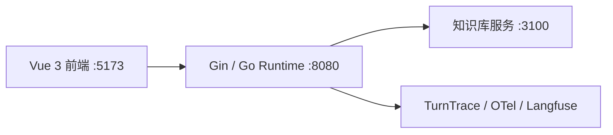
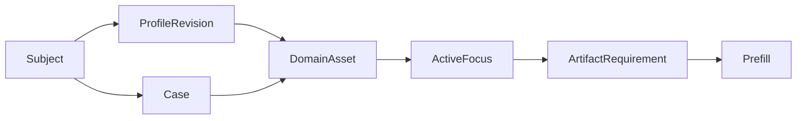
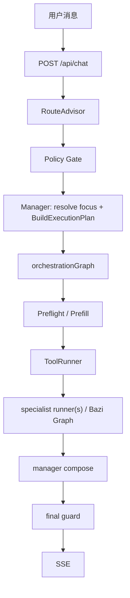

# 架构总览

> 当前架构的唯一事实来源。这里记录运行中的 owner、数据合同与主链；实施历史放在 Git 和专项设计文档。

## 架构结论

`RouteAdvisor -> Policy Gate -> Manager -> ExecutionPlan -> Prefill -> ToolRunner -> specialist runner(s) -> manager compose -> final guard -> SSE`

- `RouteAdvisor` 只做路由审批，`Policy Gate` 只做确定性策略修正。
- `Manager` 是 runtime 内唯一的对话 owner：解析当前对象，生成执行合同，决定 follow-up 的处理方式，并做有限的直接答复或最终综合；它不是开放式 ReAct 主控。
- `specialist runner(s)` 是受限领域 worker，可在 `ExecutionPlan` 边界内使用 ADK 工具调用；程序控制状态、工具、资产校验和输出边界。

## 服务拓扑

| 服务 | 职责 |
|---|---|
| 前端 | 聊天、命盘卡、知识依据、处理过程和调试视图 |
| 后端 | 路由、会话状态、执行编排、SSE 和 trace |
| 知识库 | 返回命理资料证据片段，不生成 runtime 最终答案 |
| 观测 | 本地 trace、dataset run 和 score；不是执行真相源 |

本地密钥配置为 `backend/.env`（模型与 OTel）和 `deploy/langfuse/.env`（Langfuse Docker）。示例文件只能包含占位符。

## Owner 与边界

| 层 | owner | 负责 | 不负责 |
|---|---|---|---|
| 接入 | handler / orchestrator | `/api/chat`、SSE、会话锁、状态读写、trace | 推理和资产选择 |
| 路由 | RouteAdvisor / Policy Gate | 意图、领域、槽位、确定性纠偏 | 最终执行方案和成文 |
| 主控 | Manager | 对话承接、焦点解析、`ExecutionPlan`、follow-up 策略、通用直答、最终 compose | 开放式 ReAct 循环、任意工具选择、自由计算命理确定性事实 |
| 确定性执行 | Prefill / ToolRunner | artifact 准备、工具合同、参数校验、超时、重试、错误分类 | 语义路由或最终解释 |
| 领域 | specialist runner(s) | 限域分析、受控检索、领域结果 | 最终答复权和跨对象猜测 |
| 输出 | final guard / SSE bridge | 最终合同校验和事件输出 | 替代 prefill 的缺失资产检查 |

`ApprovedRoute` 不是执行合同，`ExecutionPlan` 才是。`RequiredArtifacts` 是迁移兼容投影；实际校验使用带 owner、subject、历法规则的 `ArtifactRequirement`。

## Manager 自主性边界

- 当前 Manager 是 L2 工作流主控 + 定向 L3 编排器，不是 L4 autonomous agent，也不持有完整 ReAct 工具循环。
- Manager 的推理边界是：会话焦点、资产选择、追问策略、执行计划、通用术语直答，以及基于 specialist 输出的最终综合。
- 领域推理留在受限 worker 或八字 authority-first graph 内：specialist 可按配置工具调用；纯八字链路用证据规划、条件反思、静态/动态综合和合同审计。
- 综合领域或多工具问题由 Manager 生成多域 `ExecutionPlan` 处理：一个计划可包含多个 `ArtifactRequirement` 和多个领域 runner，Prefill/ToolRunner 先准备可复算资产，领域 runner 返回结构化结果，Manager 只做跨结果选择、冲突解释和最终成文。
- 多工具执行不是开放式 ReAct：Manager 不在运行中自由发现和调用任意工具；如需根据中间结果追加步骤，必须建成显式图节点或受控的 plan-review 节点，并把新增 requirement、工具来源、终止条件和 eval 覆盖写入合同。
- 若未来提升 Manager 能力，优先增加“计划审查/结果选择/缺口追问”这类有合同的节点；不得直接让 Manager 绕过 `ExecutionPlan` 自由调用领域工具或改写领域事实。

## 资产合同

- `Subject` 是咨询对象；`ProfileRevision` 是出生资料的可追溯修订；`Case` 是一次独立问事。
- 八字、紫微本命盘绑定 `ProfileRevision`；奇门盘绑定 `Case` 与起局时刻。
- `ActiveFocus` 只表示本轮焦点，不替代历史资产。存在多个候选且用户指代不唯一时，Manager 必须澄清。
- `InterpretationAsset` 绑定其输入命盘。follow-up 只能复用当前精确资产的解读，不得跨对象、资料版本或 Case 复用。
- 旧 `SessionState.BaziResult / QimenResult / ZiWeiResult` 仅是活动资产的兼容投影，不是事实存储主源。

## 一轮执行

1. RouteAdvisor 给出候选路由，Policy Gate 施加白名单、澄清和硬规则。
2. Manager 解析对象、资料版本、Case 与需满足的 `ArtifactRequirement`，然后生成 `ExecutionPlan` 和 `ExecutionSnapshot`。
3. Preflight 可因澄清或资料缺失短路；Prefill 只按精确 requirement 准备命盘。
4. ToolRunner 执行 runtime-owned 确定性工具，并记录工具版本、参数校验、超时、重试和错误分类。
5. 纯八字单域进入 authority-first graph；其他受限场景进入 specialist runner(s)。
6. Manager compose，final guard 校验后经 SSE 输出 `thinking / tool_call / component / text / done`。

Run Inspector 是聊天页内唯一排障入口：后端在每轮结束时发送 `run-inspection` component，由本地 `TurnTrace` 投影出白名单 span、诊断结论和 runtime 摘要。旧 `process-panel / debug-trace / execution-tree` 前端展示链路已下线；原始追踪仍以 `TurnTrace` 和 OTel/Langfuse 为深挖来源。

全量 trace 不进入 SSE 主链。聊天页只在本地 debug 模式下通过 `GET /api/debug/traces/:trace_id` 懒加载持久化的完整 `TurnTrace`；接口仅在 `DEBUG_HTTP=1` 时注册，数据来源依赖 `DEBUG_TRACE=1` 写入 `logs/traces/`。前端 Raw Trace 默认折叠 `user_message`、`input.value`、`output.value`、prompt preview 等敏感字段，需要手动切换才显示。

## 领域执行

### 八字

八字单域采用 authority-first graph：分析模式 -> 证据规划 -> 受控检索 -> 静态综合 -> 动态综合 -> 程序 renderer。四柱、大运顺逆、起运时刻、交运边界等确定性事实来自 Go 工具；LLM 只能解释结构化结果。

#### Strict Schema 迁移状态

项目已决定：所有会被 Go 消费的模型结构化结果必须迁移到 provider-native Strict JSON Schema，再经 Go 严格解码与通用事实引用校验。当前实现仍有 DeepSeek `json_object` JSON Mode，迁移尚未完成；当前 `deepseek-v4-flash` endpoint 已实测拒绝 `response_format.type=json_schema`。迁移不得绕过 Manager、`ExecutionPlan`、Prefill、final guard、renderer 或 SSE wire shape；详细范围、provider probe 和删除顺序见 [Strict JSON Schema 迁移实施方案](strict-json-schema-implementation-plan.md)。

八字输入继续细分为 `chart_facts -> rule_materials -> static/dynamic synthesis -> minimal_guard -> renderer -> eval`：排盘、藏干层级、透干和标准冲合刑害属于可复算事实；runtime 不再注入默认 `ziping_classic_v1` rule profile，也不从 Go 代码生成 claim、调候单行 overlay 或逐运趋势。静态/动态综合器负责整盘主轴、旺衰倾向、层次和逐运判断。硬门禁只阻断可证明的事实冲突、结构字段错误、大运覆盖缺失、未声明关系事实和直接医疗/法律/伤灾断语；未知 `fact_ref` 别名、未知 `claim_ref`、普通命理措辞进入 trace soft audit 与 eval，不得仅凭词面让整段综合失败。静态/动态综合第一次失败时把机器可读 violation 或审计 findings 注入同节点重试；重试后仍存在严重合同错误则返回 `RuntimeFailure`，只在缺少展示性细节且核心裁断、事实引用、逐运覆盖和年龄授权均成立时接受为 `model_partial` 并省略缺失展示块。renderer 只转写上游 synthesis verdict 或 partial 可展示字段，不把失败的模型输出改造成 facts-only 兜底。

大运合同必须保留出生分钟、顺逆和顺逆依据、起运时刻以及每步日期边界。流年判断优先比较真实交运日；缺少时间边界的历史资产才可回退虚岁区间。动态层可解释标准关系触发，但趋势和吉凶只能来自动态 synthesis；Go runtime 不按固定分值自动生成“承托/压力/结构承接”。当前运缺失时可按保留的日期边界回补，仍无法定位则明确标为未识别，不能猜测某一步为当前运。

### 奇门与紫微

奇门和紫微使用同一 Manager/Prefill/ToolRunner 边界。奇门新问事必须新建或选择正确的 `Case`，不能覆盖此前问事盘；紫微本命盘按资料版本隔离。

近期运势和问事的规范分类由 `ConsultationKind` 固定为四类：

| 分类 | 主线 | 复核 / 安全边界 | 奇门 |
|---|---|---|---|
| `period_fortune` | 八字 | 紫微 support | 不参与 |
| `event_question` | 奇门 | `ProfileRequirement=none` | 本轮提问时间起新 Case 盘 |
| `health_risk` | 八字 | 紫微 support，`health_observation` | 不参与 |
| `natal_chart` | 用户明确点名的方法 | 不自动扩域 | 不参与 |

`event_question` 的 `qimen_case_chart` 必须由 Manager 绑定到当前 Case；`Case.EventTime`、`TurnContext.QuestionTime` 和 payload 的 `question_time` 相同，OwnerRef.Kind 必须为 `case`。Prefill/ToolRunner 是唯一的奇门排盘入口，运行时和 Eino 适配器只暴露 `question_time`，Qimen specialist 只接收当前 Case 盘、问题文本和结构化问事事实，不接收 profile、出生历史或完整会话上下文。

阶段运势的 `DynamicFacts` 是本轮 Prefill 的临时能力投影，不是持久化资产；只有目标时点匹配的确定性事实才能标记 `ready`。流月尚未实现时固定为 `unavailable/degraded`，由 Manager 明示缺口，模型不得补算。健康类免责声明由 final guard 强制追加，不由 prompt 或 renderer 负责。

### 检索

`knowledge_catalog` 用于目录意识，`knowledge_search` 只返回证据片段。知识库不承担最终解释；检索不可用时，运行时保守降级并记录 trace，而不是将空结果伪装为事实。

## Follow-up 与恢复

- `ExecutionPlan` 明确选择 `direct`、`reuse_artifact` 或 `rerun_specialist`；preflight、renderer 和领域 graph 不再次暗判。
- 通用术语解释可由 Manager 直接答；依赖当前命盘结构的问题必须绑定资产并走领域链。
- cheap gate 只复用窄范围同域普通追问，必须写入 `decision_source`、`gate_reason` 等观测信号，不能成为第二套路由器。
- 会话恢复恢复当前 session 和最近一轮展示态；`ExecutionSnapshot` 是 `RunInspection` 根 span 运行时摘要的来源。
- 全局 Repair Harness 的目标设计见 `docs/repair-harness-implementation-plan.md`。落地前当前主链仍以现有 `RuntimeFailure`、领域恢复和 final guard 为准；实施时不得绕过 Manager-owned runtime、`ExecutionPlan`、Prefill 或 final guard。

## 当前非目标

- 不是多用户生产 SaaS；没有用户体系、授权模型、会话列表或线上多租户保证。
- Langfuse v3 的 Experiments/Evals UI 不是主评测流程。
- 单个 `ActiveFocus` 不能实现多对象比较；比较需要单独的多目标合同。
- specialist ADK 内部工具尚未全部迁入 ToolRunner，当前工具治理覆盖 runtime-owned 确定性工具。

## 核心入口

- 路由：`backend/internal/supervisor/approved_route.go`、`cheap_gate.go`、`adk_engine.go`。
- 主控：`backend/internal/runtime/manager.go`、`execution_plan.go`、`orchestration_graph.go`、`preflight.go`、`final_guard.go`。
- 资产：`backend/internal/state/session.go`、`assets.go`、`backend/internal/runtime/artifact_resolver.go`。
- 工具：`backend/internal/tools/contract.go`、`registry.go`、`runner.go`。
- 八字：`backend/internal/runtime/bazi_charter_graph.go`、`bazi_final_renderer.go`、`backend/internal/tools/bazi/`。
- 验收：`docs/acceptance-criteria.md`、`eval/README.md`、`eval/datasets/runtime-smoke-v1.json`。
