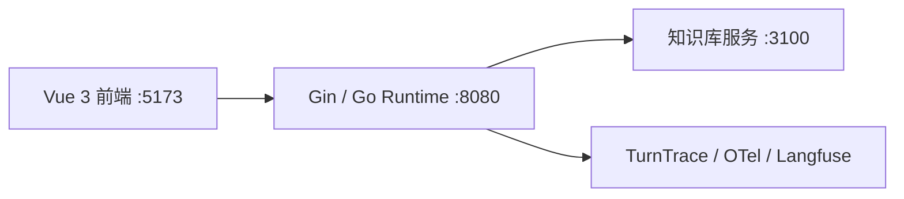
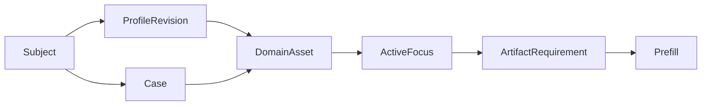
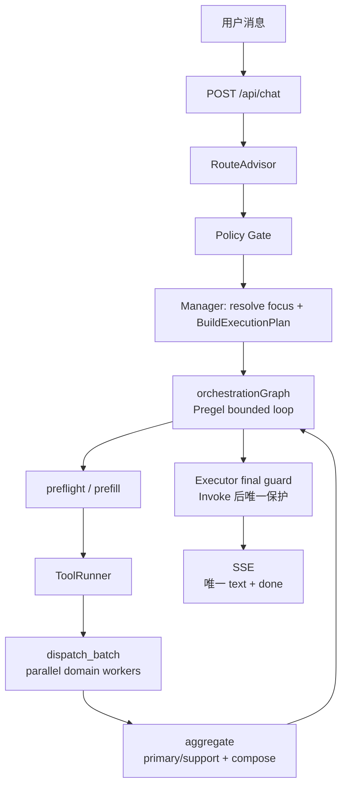

# 架构总览

> 当前架构的唯一事实来源。这里记录运行中的 owner、数据合同与主链；实施历史放在 Git 和专项设计文档。

## 架构结论

`RouteAdvisor -> Policy Gate -> Manager -> ExecutionPlan -> orchestration Graph loop -> Prefill/dispatch -> aggregate -> Executor final guard -> SSE`

- `RouteAdvisor` 只做路由审批，`Policy Gate` 只做确定性策略修正。
- `Manager` 是 runtime 内唯一的对话 owner：解析当前对象，生成执行合同，决定 follow-up 的处理方式，并做有限的直接答复或最终综合；它不是开放式 ReAct 主控。
- `orchestration` Graph 是外层单轮 bounded loop 的 owner：它持有下一动作、Prefill/dispatch 预算、primary/support outcome、降级和终止状态；不持有 Session、Executor 或 SSE sink。
- `specialist runner(s)` 是受限领域 worker，可在 `ExecutionPlan` 边界内使用 ADK 工具调用；程序控制状态、工具、资产校验和输出边界。

## 服务拓扑

| 服务 | 职责 |
|---|---|
| 前端 | 聊天、命盘卡、知识依据、处理过程和调试视图 |
| 后端 | 路由、会话状态、执行编排、SSE 和 trace |
| 知识库 | 返回命理资料证据片段，不生成 runtime 最终答案 |
| 观测 | 本地 trace、dataset run 和 score；不是执行真相源 |

本地密钥配置为 `backend/.env`（模型与 OTel）和 `deploy/langfuse/.env`（Langfuse Docker）。示例文件只能包含占位符。

## Owner 与边界

| 层 | owner | 负责 | 不负责 |
|---|---|---|---|
| 接入 | handler / orchestrator | `/api/chat`、SSE、会话锁、状态读写、trace | 推理和资产选择 |
| 路由 | RouteAdvisor / Policy Gate | 意图、领域、槽位、确定性纠偏 | 最终执行方案和成文 |
| 主控 | Manager | 对话承接、焦点解析、`ExecutionPlan`、follow-up 策略、通用直答、最终 compose | 开放式 ReAct 循环、任意工具选择、自由计算命理确定性事实 |
| 确定性执行 | Prefill / ToolRunner | artifact 准备、工具合同、参数校验、超时、重试、错误分类 | 语义路由或最终解释 |
| 领域 | specialist runner(s) | 限域分析、受控检索、领域结果 | 最终答复权和跨对象猜测 |
| 输出 | final guard / SSE bridge | 最终合同校验和事件输出 | 替代 prefill 的缺失资产检查 |

`ApprovedRoute` 不是执行合同，`ExecutionPlan` 才是。`RequiredArtifacts` 是迁移兼容投影；实际校验使用带 owner、subject、历法规则的 `ArtifactRequirement`。

## Backend 重构边界（Batch 1 冻结）

本节只冻结后续文件迁移的事实边界，不代表 Batch 2-7 已实施；Batch 1 不改变运行时、API、SSE、Graph 或领域语义。

| owner | 负责 | 明确不负责 |
|---|---|---|
| `RouteAdvisor` | 根据用户输入形成候选路由并执行路由降级 | `ExecutionPlan`、最终成文、领域事实、模型调用 retry 决策 |
| `Policy Gate` | 对路由施加准入、白名单、澄清和确定性纠偏 | 领域解释、最终答复、模型 transport/retry 策略 |
| `Manager` | 持有会话焦点，解析对象和资产，生成 `ExecutionPlan`，决定 follow-up，并做最终 compose | 路由审批、低层模型 transport/retry、自由工具发现、确定性命理计算 |
| `ExecutionPlan` | 表达本轮 route、domain、subject、artifact requirement 和执行模式 | 执行副作用、模型调用、SSE 输出和状态持久化 |
| `Prefill / ToolRunner` | 按 `ArtifactRequirement` 准备确定性资产，执行工具合同、参数校验、超时、工具 retry 和错误分类 | 语义路由、领域裁断、最终成文；不能替缺失资产让 specialist 猜测 |
| bounded specialist | 在计划边界内完成限域解释、受控检索和领域结果 | 会话 owner、计划改写、跨对象猜测、最终答复权 |
| `final guard / SSE bridge` | 校验最终输出合同，发送唯一最终 `text` 和 `done` 事件 | 补算资产、重做路由、替代领域解释或决定业务 retry |
| trace / observability | 记录运行事实、阶段、错误、repair 和诊断投影；提供 `TurnTrace`/OTel/Langfuse 观测 | 作为执行真相源、改变下一动作、替业务 owner 做判断 |
| `internal/repair` | 统一 failure class、repair action/policy、预算和 attempt 记录 | 传输层通用 retry、路由决策、最终文本生成和事实猜测 |

### 依赖方向与禁止项

目标依赖方向为：`handler/orchestrator -> supervisor -> route contract`，以及 `handler/orchestrator -> runtime -> state / tools / bounded specialists / repair / llm`；输出桥接只消费 runtime 结果和合同，trace 只消费各 owner 的观测事件。跨层调用必须通过窄 DTO 或明确合同，不以共享内部状态代替边界。

- `supervisor` 不得反向依赖 `runtime`，尤其不得依赖 runtime 的模型调用、模型 transport 或 retry 决策。
- 后续将模型 client、能力归一、transport timeout/retry 和相关错误合同收敛到 `backend/internal/llm/`；Batch 1 只记录目标，不移动代码、不新增兼容层。
- `specialist` 不得依赖 `Manager`、Session owner、SSE bridge 或 final compose；`runtime` 只能通过 bounded runner 消费领域结果。
- `final guard`、SSE bridge、trace 和 repair 不得反向决定路由、资产选择或领域语义；`ExecutionPlan` 不得依赖具体模型实现。
- `backend/internal/specialists/bazi/graph` 继续保持不依赖 `internal/runtime`；domain DTO 不依赖 runtime。任何新反向 import 都是迁移阻塞，不通过增加 adapter 绕过。

### 分阶段迁移规则

先在现有 package 内按 owner 重组文件，稳定符号、调用方向和窄 DTO；只有同 package 重组完成、依赖图无新增反向边、合同验证通过后，才允许拆分 Go package。拆 package 不是 Batch 1 的工作，不能以目录变干净为理由提前引入接口、兼容代码或双轨实现。

| 批次 | 迁移顺序与范围 | 前置条件 | 必须保持的不变量 |
|---|---|---|---|
| Batch 2 | 在 `supervisor` 内按 route、policy、fallback、adapter 重组文件 | Batch 1 文档冻结；完成符号和调用方清单 | 路由输出、准入规则、fallback 顺序和观测字段不变 |
| Batch 3 | 在 `runtime` 内按 manager、plan、prefill、graph、output 重组文件 | Batch 2 完成；锁定 `ExecutionPlan`/`ArtifactRequirement` 合同 | Graph 拓扑、预算、错误出口、唯一 `text`/`done` 不变 |
| Batch 4 | 在现有 package 内收拢 specialist runner、领域适配、trace/repair 调用边界 | Batch 3 完成；窄 DTO 和 owner 清单可验证 | specialist 无最终答复权；trace 只观测；repair 预算和分类不变 |
| Batch 5 | 拆出 `backend/internal/llm/`，收拢模型调用和 transport/retry | Batch 2-4 的调用方向稳定；具备 retry/错误/trace 回归证据 | supervisor 不依赖 runtime retry；模型错误语义和 retry 计数不变 |
| Batch 6 | 拆分 bounded specialist 与 domain package | Batch 5 完成；同 package 迁移无反向 import | specialist 只接收计划允许的输入；domain 不依赖 runtime；领域语义不变 |
| Batch 7 | 清理旧 owner、兼容别名和残余跨层引用，完成依赖图收口 | Batch 5-6 全部通过；全量引用、构建和合同回归通过 | API/SSE/Graph/trace/repair 合同稳定；不保留双 owner 或反向依赖 |

## Manager 自主性边界

- 当前 Manager 是 L2 工作流主控 + 定向 L3 编排器，不是 L4 autonomous agent，也不持有完整 ReAct 工具循环。
- Manager 的推理边界是：会话焦点、资产选择、追问策略、执行计划、通用术语直答，以及基于 specialist 输出的最终综合。
- 领域推理留在受限 worker 或八字 authority-first graph 内：specialist 可按配置工具调用；纯八字链路用证据规划、条件反思、静态/动态综合和合同审计。
- 综合领域或多工具问题由 Manager 生成多域 `ExecutionPlan` 处理：一个计划可包含多个 `ArtifactRequirement` 和多个领域 runner，Prefill/ToolRunner 先准备可复算资产，领域 runner 返回结构化结果，Manager 只做跨结果选择、冲突解释和最终成文。
- 多工具执行不是开放式 ReAct：Manager 不在运行中自由发现和调用任意工具；如需根据中间结果追加步骤，必须建成显式图节点或受控的 plan-review 节点，并把新增 requirement、工具来源、终止条件和 eval 覆盖写入合同。
- 若未来提升 Manager 能力，优先增加“计划审查/结果选择/缺口追问”这类有合同的节点；不得直接让 Manager 绕过 `ExecutionPlan` 自由调用领域工具或改写领域事实。

## 资产合同

- `Subject` 是咨询对象；`ProfileRevision` 是出生资料的可追溯修订；`Case` 是一次独立问事。
- 八字、紫微本命盘绑定 `ProfileRevision`；奇门盘绑定 `Case` 与起局时刻。
- `ActiveFocus` 只表示本轮焦点，不替代历史资产。存在多个候选且用户指代不唯一时，Manager 必须澄清。
- `InterpretationAsset` 绑定其输入命盘。follow-up 只能复用当前精确资产的解读，不得跨对象、资料版本或 Case 复用。
- 旧 `SessionState.BaziResult / QimenResult / ZiWeiResult` 仅是活动资产的兼容投影，不是事实存储主源。

## 一轮执行

1. RouteAdvisor 给出候选路由，Policy Gate 施加白名单、澄清和硬规则。
2. Manager 解析对象、资料版本、Case 与需满足的 `ArtifactRequirement`，然后生成 `ExecutionPlan` 和 `ExecutionSnapshot`。
3. Preflight 可因澄清或资料缺失短路；Prefill 只按精确 requirement 准备命盘。
4. `orchestration` Graph 先执行 prefill；缺失资产按 bounded budget 回到 prefill，不能让 worker 猜测资产。
5. `dispatch_batch` 对 pending domain 做并行 fan-out/fan-in；成功 domain 不会在 primary 重试时重跑。
6. 纯八字单域在 dispatch 的 bazi step 内进入 `bazi_deterministic` 内部 Graph；混合域保留 primary/support 汇合。
7. Graph 返回 raw result 后，Executor 执行 final guard，再发送唯一最终 `text`；Orchestrator 最后发送 `done`。

Run Inspector 是聊天页内唯一排障入口：后端在每轮结束时发送 `run-inspection` component，由本地 `TurnTrace` 投影出白名单 span、诊断结论和 runtime 摘要。旧 `process-panel / debug-trace / execution-tree` 前端展示链路已下线；原始追踪仍以 `TurnTrace` 和 OTel/Langfuse 为深挖来源。

全量 trace 不进入 SSE 主链。聊天页只在本地 debug 模式下通过 `GET /api/debug/traces/:trace_id` 懒加载持久化的完整 `TurnTrace`；接口仅在 `DEBUG_HTTP=1` 时注册，数据来源依赖 `DEBUG_TRACE=1` 写入 `logs/traces/`。前端 Raw Trace 默认折叠 `user_message`、`input.value`、`output.value`、prompt preview 等敏感字段，需要手动切换才显示。

## 领域执行

### 八字

八字单域采用 `bazi_deterministic` Graph：`bootstrap -> decide_next -> analysis_plan/evidence/static/lifetime_dayun/dynamic/repair/recover/render`。Graph 编译、Pregel 循环、下一动作、预算和终止位于 `backend/internal/specialists/bazi/graph/`，且不依赖 `internal/runtime`；runtime 仅适配既有模型、检索、SSE 和 trace 能力。四柱、大运顺逆、起运时刻、交运边界等确定性事实来自 Go 工具；LLM 只能解释结构化结果。

#### 结构化输出合同迁移状态

所有会被 Go 消费的 BaZi JSON Mode 输出均使用 DeepSeek `json_object` 传输。V2 的活跃模型 DTO 固定为 `analysis_plan`、`evidence_plan`、`static_judgment`、`dynamic_judgment`，各自维护 Draft-07 文件（`backend/internal/runtime/schemas/bazi-*.schema.json`），由 registry 原样注入 prompt，再经 `gojsonschema`、`json.Decoder.DisallowUnknownFields` 和 EOF 单值检查，最后进入 DTO 语义与 runtime fact/relation/claim catalog 校验。当前 registry 只注册这四类活跃节点合同。`json_object` 只保证 JSON 外形，不是 provider-native Strict JSON Schema；字段、引用和恢复合同均由 Go runtime 承担。Schema 错误允许一次独立 repair，transport transient 由模型调用重试单独计数，事实冲突与方法合同不交给模型改措辞。ADK output tool 保持原有 `InferTool/ReturnDirectly` 语义；Supervisor text fallback 使用独立严格 Schema。此次迁移不改 DeepSeek endpoint，也不等待 Responses/Beta strict；不得绕过 Manager、`ExecutionPlan`、Prefill、final guard、renderer 或 SSE wire shape。详细范围、清理顺序和验证命令见 [全局结构化输出实施方案](strict-json-schema-implementation-plan.md)。

八字 V2 是当前唯一确定性内图：`bootstrap -> decide_next -> analysis_plan -> decide_next -> evidence_action -> validate_evidence -> decide_next -> static_judgment -> contract_check -> decide_next -> dynamic_judgment -> contract_check -> decide_next -> render`，repair 和 recover_facts 是显式分支。`evidence_action` 最多消耗两次证据预算；`static_judgment` 是唯一静态模型裁断；`dynamic_judgment` 只允许引用 runtime 已绑定的当前大运和流年；`contract_check` 只校验并写 failure，repair 是否可调用由共享 `internal/repair` policy 决定。排盘、藏干层级、透干、受力、官星透藏、调候火状态、大运边界和关系属于可复算事实，由 `specialists/bazi/domain` 的事实胶囊提供给类型化语义策略，runtime 只做状态适配；年龄授权范围也由该 domain 计算。静态 DTO 为四个固定槽位提供受长度约束的短裁断和已声明的 `fact_ref`、`claim_ref`，不接收原局 `relation_ref`、自由边界、限制或推理文本；这些说明由 runtime 事实投影。动态 DTO 可额外引用已绑定岁运关系，且只校验模型实际裁断的当前 period。renderer 只转写已验证投影；动态 facts-only 仅呈现已绑定当前大运或未定位边界，不把全量大运目录作为动态解读，并在最终文本出口删除内部引用语法，不重新裁断。

当前实现的 Graph 拓扑、状态字段、错误出口、并行汇合和仍未完成的语义代码拆包边界，见本节、[八字 Graph 当前事实快照](bazi-graph-current-snapshot.md) 和 [PROGRESS.md](../PROGRESS.md) 的 Graph 主链事实。

本命、全程运路与当前阶段是三个只读下游边界。静态层仍保留 `tier_assessment` 作证据审计，但完整命盘的主结论以本命格局为准；`lifetime_dayun_judgment` 必须覆盖全部已计算大运，并只输出其对本命结构的补、助、损、破；`dynamic_judgment` 继续只裁断当前大运的 `current_period_realization`（修复、助力、维持、扰动、压制）和流年走势。后两层不得改写本命，当前层不得改写全程逐运或总评。最终“综合判定”按本命底盘、全程运路、当前阶段、流年触发依次呈现。

大运合同必须保留出生分钟、顺逆和顺逆依据、起运时刻以及每步日期边界。流年判断优先比较真实交运日；缺少时间边界的历史资产才可回退虚岁区间。动态层可解释标准关系触发，但趋势和吉凶只能来自动态 synthesis；Go runtime 不按固定分值自动生成“承托/压力/结构承接”。当前运缺失时可按保留的日期边界回补，仍无法定位则明确标为未识别，不能猜测某一步为当前运。

### 奇门与紫微

奇门和紫微使用同一 Manager/Prefill/ToolRunner 边界。奇门新问事必须新建或选择正确的 `Case`，不能覆盖此前问事盘；紫微本命盘按资料版本隔离。

近期运势和问事的规范分类由 `ConsultationKind` 固定为四类：

| 分类 | 主线 | 复核 / 安全边界 | 奇门 |
|---|---|---|---|
| `period_fortune` | 八字 | 紫微 support | 不参与 |
| `event_question` | 奇门 | `ProfileRequirement=none` | 本轮提问时间起新 Case 盘 |
| `health_risk` | 八字 | 紫微 support，`health_observation` | 不参与 |
| `natal_chart` | 用户明确点名的方法 | 不自动扩域 | 不参与 |

`event_question` 的 `qimen_case_chart` 必须由 Manager 绑定到当前 Case；`Case.EventTime`、`TurnContext.QuestionTime` 和 payload 的 `question_time` 相同，OwnerRef.Kind 必须为 `case`。Prefill/ToolRunner 是唯一的奇门排盘入口，运行时和 Eino 适配器只暴露 `question_time`，Qimen specialist 只接收当前 Case 盘、问题文本和结构化问事事实，不接收 profile、出生历史或完整会话上下文。

阶段运势的 `DynamicFacts` 是本轮 Prefill 的临时能力投影，不是持久化资产；只有目标时点匹配的确定性事实才能标记 `ready`。流月尚未实现时固定为 `unavailable/degraded`，由 Manager 仅在 `ExecutionPlan.Route.Slots.TimeScope` 明确存在时明示缺口，模型不得补算。没有明确时间范围的静态或结构追问，即使动态事实状态不可用，也不得把流年/流月缺口追加到最终文本。健康类免责声明由 final guard 强制追加，不由 prompt 或 renderer 负责。

### 检索

`knowledge_catalog` 用于目录意识，`knowledge_search` 只返回证据片段。知识库不承担最终解释；检索不可用时，运行时保守降级并记录 trace，而不是将空结果伪装为事实。

## Follow-up 与恢复

- `ExecutionPlan` 明确选择 `direct`、`reuse_artifact` 或 `rerun_specialist`；preflight、renderer 和领域 graph 不再次暗判。
- 通用术语解释可由 Manager 直接答；依赖当前命盘结构的问题必须绑定资产并走领域链。
- 八字普通结构追问的 `直接回答` 按已验证字段回退：优先使用 `TopicDirectAnswer`，缺失时依次使用 `PatternOutcome`、`MainAxis`、`TopicFocusAnswer`；只有这些字段和适用的动态结论都不存在时，才允许输出“未形成直接裁断”。缺少专用 topic 字段本身不等于没有裁断。
- `timing_reason` 属于动态追问，直接回答优先使用当前动态趋势；它与普通结构追问的静态回退规则分开，不能互相覆盖。
- 动态事实缺口提示属于展示边界，不是静态合同失败：只有执行计划带明确 `TimeScope` 时才追加 `unavailable/degraded` 说明；静态追问不得因为缺少流年/流月事实而改变主线结论或追加无关提示。
- cheap gate 只复用窄范围同域普通追问，必须写入 `decision_source`、`gate_reason` 等观测信号，不能成为第二套路由器。
- 会话恢复恢复当前 session 和最近一轮展示态；`ExecutionSnapshot` 是 `RunInspection` 根 span 运行时摘要的来源。
- 共享 repair 分类、策略和预算位于 `backend/internal/repair/`；runtime 只保留兼容别名。八字 Graph 控制已拆入 `backend/internal/specialists/bazi/graph/`；事实胶囊、年龄授权和引用目录 DTO 位于 `backend/internal/specialists/bazi/domain/`，catalog allow-list、合同、recovery 和 renderer 仍通过 runtime 适配，不能绕过 Manager-owned `ExecutionPlan`、Prefill 或 final guard。

## 当前非目标

- 不是多用户生产 SaaS；没有用户体系、授权模型、会话列表或线上多租户保证。
- Langfuse v3 的 Experiments/Evals UI 不是主评测流程。
- 单个 `ActiveFocus` 不能实现多对象比较；比较需要单独的多目标合同。
- specialist ADK 内部工具尚未全部迁入 ToolRunner，当前工具治理覆盖 runtime-owned 确定性工具。

## 核心入口

- 路由：`backend/internal/supervisor/approved_route.go`、`cheap_gate.go`、`adk_engine.go`。
- 主控：`backend/internal/runtime/manager.go`、`execution_plan.go`、`orchestration_graph.go`、`orchestration_graph_loop.go`、`executor.go`。
- 资产：`backend/internal/state/session.go`、`assets.go`、`backend/internal/runtime/artifact_resolver.go`。
- 工具：`backend/internal/tools/contract.go`、`registry.go`、`runner.go`。
- 八字 Graph：`backend/internal/specialists/bazi/graph/graph.go`；domain 事实、年龄授权与引用目录：`backend/internal/specialists/bazi/domain/facts.go`、`scope.go`、`reference_catalog.go`；runtime 适配与现有领域节点：`backend/internal/runtime/bazi_graph_adapter.go`、`bazi_internal_graph.go`、`bazi_graph_entry.go`、`bazi_charter_graph.go`、`bazi_contract_validation.go`、`bazi_final_contract.go`、`bazi_model_runtime.go`、`bazi_evidence_runtime.go`、`bazi_projection_views.go`、`bazi_final_renderer.go`；确定性工具：`backend/internal/tools/bazi/`。
- repair：`backend/internal/repair/`。
- 验收：`docs/acceptance-criteria.md`、`eval/README.md`、`eval/datasets/runtime-smoke-v1.json`。
