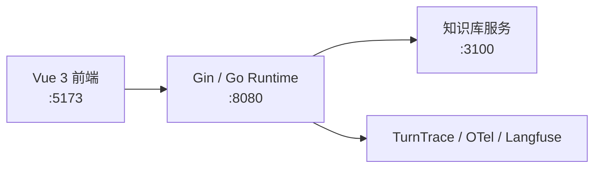
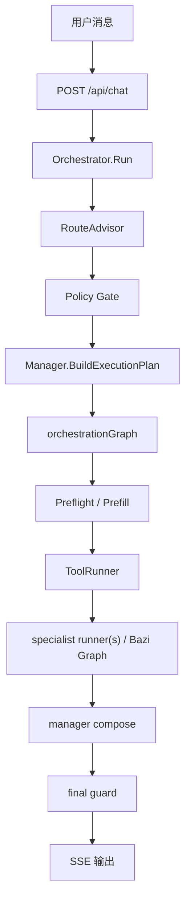

# 架构总览

> 本文是当前项目唯一的架构主文档。只保留当前有效结构，不再拆成多份分册，也不保留历史迁移说明。

## 一句话架构

当前稳定主链是：

`RouteAdvisor -> Policy Gate -> Manager -> ExecutionPlan -> Prefill -> ToolRunner -> specialist runner(s) -> manager compose -> final guard -> SSE`

对应的控制原则是：

- `thin supervisor`
- `manager-owned runtime`
- `bounded specialists`

也就是说：

- `RouteAdvisor` 负责理解和批准路由
- `Policy Gate` 负责确定性硬边界
- `Manager` 负责持有对话、规划执行、收口最终回复
- `ToolRunner` 负责确定性工具调用的合同校验、重试、超时、错误分类和 trace
- `specialist runner(s)` 只负责领域执行，不直接拥有最终答复权
- Go 程序负责状态、工具、验收和输出

## 服务拓扑

| 服务 | 端口 | 职责 |
|---|---|---|
| 前端 | `:5173` | 聊天界面、命盘卡片、知识依据、处理过程、调试视图 |
| 后端 | `:8080` | 路由、会话状态、执行编排、SSE、trace 主入口 |
| 知识库 | `:3100` | 命理资料检索 |
| 观测 | 可选 | 本地 trace、OTel、Langfuse dataset run |

本地密钥边界：`backend/.env` 保存模型与 OTel 配置，`deploy/langfuse/.env` 保存 Langfuse Docker 凭据；两者均被 Git 忽略。示例文件只能保留占位符，不能写入真实 API Key、project secret 或生产密码。

## 分层与 Owner

### 1. 接入层

负责：

- 接收 `/api/chat`
- 建立 SSE 输出
- 按 `session_id` 加载和持久化会话状态
- 启动一轮 trace

关键文件：

- `backend/internal/handler/chat.go`
- `backend/internal/orchestrator/orchestrator.go`
- `backend/internal/state/session.go`

关键对象：

- `SessionState`
- `ManagerContext`
- `DomainContexts`
- `ExecutionSnapshot`

### 2. 路由审批层

负责：

- 理解当前问题
- 产出主领域、任务意图、槽位信息
- 在进入运行时前做 deterministic 修正

关键文件：

- `backend/internal/supervisor/approved_route.go`
- `backend/internal/supervisor/cheap_gate.go`
- `backend/internal/supervisor/adk_engine.go`

边界：

- 它负责“能不能这么走”
- 不负责“这一轮最终怎么执行”
- 不负责“最终对用户怎么说”

### 3. 运行时主控层

负责：

- 承接完整会话语义
- 把 `ApprovedRoute` 转成正式执行合同
- 决定 follow-up 是直接答、复用资产，还是重跑领域执行

关键文件：

- `backend/internal/runtime/manager.go`
- `backend/internal/contracts/runtime_contracts.go`

关键对象：

- `Manager`
- `ExecutionPlan`
- `ExecutionSnapshot`

这里的核心约束是：

- `Manager` 是 runtime 内唯一 conversation owner
- route 不是执行合同，`ExecutionPlan` 才是

### 4. 确定性执行层

负责：

- 在进入 LLM 之前补齐命盘和硬前置结果
- 在 dispatch 前阻断缺 artifact 的执行
- 通过工具合同控制 runtime-owned 工具调用

关键文件：

- `backend/internal/runtime/orchestration_graph.go`
- `backend/internal/runtime/preflight.go`
- `backend/internal/runtime/execution_dispatch.go`
- `backend/internal/runtime/specialist_runner.go`
- `backend/internal/tools/contract.go`
- `backend/internal/tools/runner.go`

边界：

- 这层不做自由推理
- 这层只做程序可控的准备和校验
- 工具治理先覆盖 `Prefill` 中由 Go runtime 主动调用的确定性工具，specialist ADK 内部工具调用后续单独迁移

### 4.1 工具治理层

负责：

- 给每个工具声明 `ToolContract`，包括版本、风险、副作用、参数、超时、重试、审批和幂等要求
- 在真实工具执行前做参数校验、审批阻断和幂等键阻断
- 按错误类型决定是否有限重试
- 把工具名、版本、风险、副作用、尝试次数、状态和错误分类写入 trace

关键文件：

- `backend/internal/tools/contract.go`
- `backend/internal/tools/registry.go`
- `backend/internal/tools/runner.go`
- `docs/tool-governance.md`

设计边界：

- `Registry` 只保存工具和合同，不执行工具
- `ToolRunner` 只做治理和执行，不持有业务编排
- `Executor.callTool` 只是 runtime 接入点，不把治理策略散落回运行时
- 有副作用工具必须走审批和幂等入口，不能依赖 Agent 自己“记得不要重复调用”

### 5. 领域执行层

负责：

- 在明确领域范围内完成命理分析
- 调工具、做知识检索、返回领域结果

关键文件：

- `backend/internal/runtime/specialist_runner.go`
- `backend/internal/specialists/bazi/specialist.go`
- `backend/internal/specialists/qimen/specialist.go`
- `backend/internal/specialists/ziwei/specialist.go`

当前有两种执行形态：

#### 八字单域 authority-first graph

流程：

- 分析模式判定
- 证据规划
- 受控检索
- 静态综合
- 动态综合
- 程序 renderer 成文

关键文件：

- `backend/internal/runtime/bazi_charter_graph.go`
- `backend/internal/runtime/bazi_evidence_bundle.go`
- `backend/internal/runtime/bazi_final_renderer.go`

#### 其他场景 bounded specialist

流程：

- 构建当前领域 specialist
- 注入会话上下文和已准备 artifact
- 限域调用工具
- 返回领域结果

### 6. 收口与输出层

负责：

- 把领域结果整理成最终用户可见回答
- 确保用户看到的是经过验收的结果

关键文件：

- `backend/internal/runtime/manager.go`
- `backend/internal/runtime/final_guard.go`
- `backend/internal/runtime/bridge.go`

关键职责：

- `manager compose`：按当前问题组织单域 / 多域回答
- `final guard`：做最终合同校验
- `SSE bridge`：输出 `thinking / tool_call / component / text / done`

## 运行时主链

### 1. 入口

- `POST /api/chat`
- 创建 SSE writer
- 按 `session_id` 取会话锁
- 加载 `SessionState`
- 启动 trace

### 2. RouteAdvisor

流程：

- 优先尝试 `cheap gate`
- 未命中则进入 ADK route engine
- 再过 deterministic `Policy Gate`
- 产出 `ApprovedRoute`

产出关键信息：

- `PrimaryDomain`
- `SecondaryDomains`
- `TaskIntent`
- `Slots.Profile`
- `Slots.TargetSubject`
- `PolicyHints`

### 3. Manager

流程：

- `ReconcileRoute`
- `selectDomains`
- `selectRequiredArtifacts`
- `resolveFollowupPolicy`
- 生成 `ExecutionPlan`

这一步解决：

- 本轮到底触达哪些领域
- 哪些 artifact 必须先补齐
- follow-up 是直接答、复用资产还是重跑 specialist
- 这一轮真实执行合同如何写入 `ExecutionSnapshot`

### 4. orchestrationGraph

执行骨架是：

`preflight -> prefill -> agent/runner -> guard`

其中：

- `preflight` 负责短路澄清、缺资料、强约束路径
- `prefill` 负责按 `RequiredArtifacts` 确定性排盘

### 5. 领域执行

两条主路径：

- 纯八字单域：进入 authority-first inner graph
- 其他场景：进入 `specialist runner(s)`

### 6. 最终收口

- `manager compose`
- `final guard`
- `SSE 输出`

## 当前关键能力

### 1. 路由审批能力

能做什么：

- 识别八字 / 奇门 / 紫微
- 识别首轮采集、命盘解读、追问、时机问题、多域咨询
- 在进入运行时前做 deterministic 修正

### 2. artifact-driven prefill

能做什么：

- 不再按 `primary_domain` 猜测要不要排盘
- 明确按 `RequiredArtifacts` 准备 `bazi_chart / qimen_chart / ziwei_chart`
- 在 dispatch 前拦截缺 artifact

### 3. manager-owned follow-up

能做什么：

- 根据 `SessionState` 做 session-aware reinterpretation
- 支持 `direct / reuse_artifact / rerun_specialist` 三种 follow-up 模式

### 4. authority-first 八字主链

能做什么：

- 分析模式判定
- 证据缺口判断
- 受控检索
- 静态 / 动态综合
- 程序 renderer 固定成文

### 5. 知识检索能力

能做什么：

- 通过独立知识库服务检索命理资料
- `knowledge_catalog` 先看目录，`knowledge_search` 再拉原文片段
- 运行时只消费证据片段，不让知识库替代最终回答

### 6. 会话恢复能力

能做什么：

- 恢复当前 `session_id`
- 恢复最近一轮 assistant 的结构化展示态
- 让 debug 面板和 execution tree 基于真实 `ExecutionSnapshot`

### 7. SSE 结构化展示能力

能做什么：

- 同时输出文本、工具调用、命盘组件、处理过程
- 前端按事件类型分层渲染

### 8. 可观测与回归能力

能做什么：

- `TurnTrace` 落盘
- `ProcessDigest / DebugTraceDigest` 双投影
- cheap gate 命中样本沉淀
- 最小 smoke 和 dataset run 验证

### 9. 本地部署能力

能做什么：

- 用 `deploy/app` 启动主应用和知识库
- 知识库目录采用仓库直挂载
- WSL2 Ubuntu 作为默认本地运行环境

## 当前文档边界

这份文档现在负责：

- 架构主链
- owner 边界
- 关键能力
- 关键入口文件

它不再负责：

- 历史迁移说明
- 归档设计文档索引
- 多份分册式拆解

## 关键入口文件

### 运行时主链

- `backend/internal/supervisor/approved_route.go`
- `backend/internal/supervisor/cheap_gate.go`
- `backend/internal/supervisor/adk_engine.go`
- `backend/internal/runtime/orchestration_graph.go`
- `backend/internal/runtime/preflight.go`
- `backend/internal/runtime/manager.go`
- `backend/internal/runtime/final_guard.go`
- `backend/internal/runtime/observability.go`

### 八字 authority-first

- `backend/internal/runtime/bazi_charter_graph.go`
- `backend/internal/runtime/bazi_final_renderer.go`
- `backend/internal/runtime/bazi_evidence_bundle.go`

### 检索、状态、观测

- `backend/internal/tools/knowledge_search.go`
- `backend/internal/tools/knowledge_catalog.go`
- `backend/internal/state/session.go`
- `backend/internal/handler/session.go`
- `backend/internal/tracing/`
- `backend/internal/observability/cheap_gate_reporter.go`
- `web/src/composables/useSSE.ts`
- `web/src/components/ChatPanel.vue`

## 一句话总结

当前项目不是“很多 agent 自由协作”，而是：

> 路由审批在外层，执行 owner 在 manager，领域能力在 bounded specialists，程序负责边界、artifact、验收和输出。
