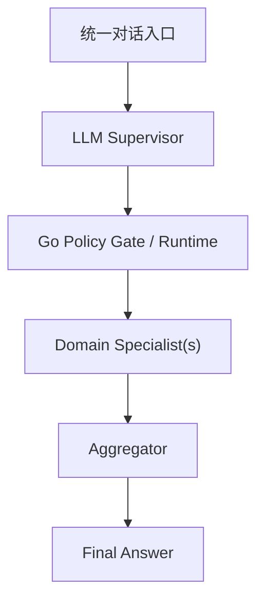

# 命理大师 — 架构设计

**版本：** v1.5  
**日期：** 2026-06-12  
**原则：** 本文档是系统架构的单一事实来源。主线实现、实施顺序和验收标准都以此为准。

---

## 1. 架构结论

本项目分成两条线：

- **v1 主线：Go / Eino 实现**
  - 目标是先做出稳定、可演示、可讲清楚的命理咨询产品
  - 状态管理、工具执行、SSE、流式输出全部在 Go
  - 知识检索通过**项目自己的知识库 MCP / skill 知识库 MCP**
- **v2 对照版：LangGraph 增强实现**
  - 目标是学习 LangGraph 在复杂状态编排、条件边、reasoning flow 上的价值
  - 保持同一产品域，对比 v1 的实现边界和复杂度

结论很明确：

- **v1 不把 LangGraph 放进主链路**
- **LangGraph 不是否定，而是延后到更适合学习的位置**

这样做的原因是：当前八字聊天 MVP 的主业务复杂度，还不足以证明双栈主线的成本是值得的。

### 1.1 Supervisor Phase 1（2026-06-12 已实现）

Supervisor phase 1 已实现，核心变化：

- **新增 `SupervisorDecision` 结构化路由决策**（`internal/schemas/`）
- **新增 LLM Supervisor Client**（`internal/supervisor/`），负责语义理解、路由建议、槽位提取
- **新增 Policy Gate**（`internal/policy/`），负责 phase-1 域白名单、并行硬禁用、低置信度强制澄清
- **抽取 Bazi / Qimen Specialist 边界**（`internal/specialists/bazi/`、`internal/specialists/qimen/`）
- **Orchestrator 集成**：`supervisor → policy gate → specialist dispatch → aggregate`
- **新增路由级 trace span**：`supervisor_decision`、`policy_gate`
- **Session 扩展**：`RoutingSnapshot`、`BaziState`、`QimenState`

**当前约束：**
- 仅 `bazi`（主域）和 `qimen`（辅助域）启用
- 并行 fan-out 硬禁用
- `emotion` / `career` / `general` 仅结构预留
- 前端协议不变，核心工具不变

详细设计：见 `docs/architecture/supervisor/` 系列文档。

---

### 1.2 Supervisor 演进方向（后续阶段）

在不改变当前 v1 主线归属的前提下，后续多专业域扩展采用：

- **统一入口**
- **LLM Supervisor 做语义理解与路由建议**
- **Go Runtime / Orchestrator 做状态、策略、执行、聚合、SSE**
- **Specialist 做窄职责专业处理**

这不是平级 swarm，也不是放弃 Go 主控，而是：



当前主线边界不变：

- `bazi` 仍是第一主域
- `qimen` 是第一辅助域
- 非命理域先做结构预留，不进入 phase 1 主线

详细设计见：

- [Supervisor Architecture Design](./superpowers/specs/2026-06-12-supervisor-architecture-design.md)
- [Supervisor Architecture Pages](./architecture/supervisor/01-overview.md)

---

## 2. v1 主线架构

```text
Vue 3 (:5173)
  │
  │ POST /api/chat  (Vite proxy → :8080)
  ▼
Gin / Go (:8080)
  ├── Session State Store (data/sessions/*.json, 持久化)
  ├── Orchestrator (主编排)
  ├── Tools
  │    ├── bazi_calc        → lunar-go (含晚子时 Sect=1 + 神煞)
  │    ├── yongshen         → 日主强弱 + 用神喜忌
  │    ├── dayun_analyzer   → 大运十神分类
  │    ├── qimen_dunjia     → qimen-go 时家奇门
  │    └── knowledge_search → yopedia MCP (:3100)
  ├── LLM Clients
  │    ├── flash (deepseek-v4-flash, temp=0.0) → 意图分类
  │    └── pro   (deepseek-v4-pro,  temp=0.3) → 八字解读
  ├── Tracer (trace/span → logs/traces/*.json)
  └── SSE Writer (thinking/tool_call/component/text/error/done/trace)
```

### 2.1 Go 负责什么

- 接收用户请求
- 管理会话状态
- 解析当前会话阶段
- 决定是否追问、是否排盘、是否复用已有命盘
- 围绕用户当前问题组织咨询回答
- 调用工具和 LLM Client
- 把结构化结果转成 SSE
- 流式输出最终解答

### 2.2 Go 不负责什么

- 不做跨进程复杂编排
- 不为了“像 Agent”而引入多 agent 闭环
- 不展示原始 chain-of-thought

---

## 3. v1 状态模型

Go 侧持有唯一会话状态：

```json
{
  "session_id": "uuid",
  "profile": {
    "calendar_type": "solar",
    "year": 1990, "month": 5, "day": 20,
    "hour": 8, "minute": 0,
    "gender": "男",
    "birthplace": "北京",
    "longitude": 116.4
  },
  "bazi_result": {
    "pillars": [...],
    "dayGan": "甲",
    "yongshen": {"day_master":"甲", "yong_shen":["水","木"], ...},
    "dayun_analyzed": [...],
    "shensha_summary": {...}
  },
  "conversation_stage": "collecting | ready | completed",
  "last_user_question": "",
  "needs_qimen": false,
  "needs_knowledge": true
}
```

说明：
- `profile` 含 birthplace/longitude 用于真太阳时校正，minute 精度支持晚子时
- `bazi_result` 可复用，含用神、大运分析、神煞
- `needs_qimen`/`needs_knowledge` 由 flash 模型分类时设定，控制追问链路
- 会话持久化到 `data/sessions/{sessionID}.json`，重启不丢

---

## 4. 出生信息输入契约

MVP 统一收集以下字段：

```json
{
  "calendar_type": "solar | lunar",
  "year": 1990, "month": 5, "day": 20,
  "hour": 8, "minute": 0,
  "gender": "男 | 女",
  "birthplace": "北京",
  "longitude": 116.4
}
```

规则：
- 用户明确说"农历/阴历/正月/腊月"等，再标为 `lunar`
- `birthplace` 和 `longitude` 用于真太阳时校正（东经 120° 基准，每度±4分钟）
- 23:00 后出生自动启用晚子时处理（`Sect=1`），日柱算次日
- 未明确说明时，默认按 `solar`
- `hour` 必须精确到 0-23
- “早上/晚上/子时”这类模糊表达一律追问确认
- MVP 固定 `timezone=Asia/Shanghai`
- 如果用户明确表示不知道出生时辰，MVP 不做完整四柱排盘，并直接说明能力边界

---

## 5. v1 对话状态机

v1 用 Go 内部确定性状态机处理对话：

```text
START
  ↓
extract profile patch
  ↓
merge profile
  ↓
check missing fields
  ├── missing → ask user
  ├── complete and no bazi_result → full_reading
  ├── complete and profile changed → recalc_reading
  └── complete and bazi_result reusable → followup_reading
```

状态机负责回答 4 个问题：

1. 现在信息够不够排盘
2. 需不需要重算命盘
3. 当前问题是“首次排盘”还是“基于已有命盘的咨询追问”
4. 当前回答是否需要围绕特定问题重新组织知识检索

---

## 6. v1 执行流水线

### 6.1 full_reading / recalc_reading

1. `bazi_calc(profile)`
2. `build_knowledge_query(bazi_result, user_message)`
3. `knowledge_search(query)`
4. `llm_generate(profile, bazi_result, passages, user_message)`

### 6.2 followup_reading

1. 复用 `bazi_result`
2. `build_knowledge_query(bazi_result, user_message)`
3. `knowledge_search(query)`，不可用时可跳过
4. `llm_generate(...)`

关键约束：

- 知识检索 query 必须基于 `bazi_result` 生成
- 不允许在排盘前拍脑袋查“年份+日主+运势”
- `knowledge_search` 的数据源是**项目知识库 MCP / skill 知识库 MCP**

### 6.3 `llm_generate` 的实现边界

v1 中的 `llm_generate` 是一个**逻辑阶段**，不是必须注册进 Tool Registry 的 Eino Tool。

原因：

- `bazi_calc / knowledge_search` 是确定性工具，适合统一走 Tool 接口
- `llm_generate` 需要绑定当前请求的 SSE 输出上下文
- 如果把 `onChunk` 在应用启动时注入 Tool，会丢失“当前连接”这个运行时上下文

因此 v1 采用：

- Orchestrator 负责组装 prompt 和 messages
- Orchestrator 直接调用 `internal/llm.Client`
- Orchestrator 在 `onText` 回调里推送 `text` SSE

这样做更简单，也更符合流式输出的实际边界。

---

## 7. 项目知识库 MCP

v1 的 RAG 不是一个抽象“本地 RAG 服务”，而是明确指向：

- **项目自己的知识库 MCP**
- **skill 知识库 / 命理资料知识页**

Go 侧只需要一个稳定的 `KnowledgeClient` 抽象：

```text
knowledge_search(query, top_k) -> passages[]
```

知识库 MCP 的职责：

- 检索命理典籍或规则页
- 返回结构化引用
- 为最终问题解答提供出处和 supporting evidence

v1 不要求把 MCP 生命周期做得很重，先保证：

- 接口稳定
- 返回格式稳定
- 失败时可优雅降级

---

## 8. SSE 协议

SSE 事件类型：

| 事件 | 用途 | 示例 |
|------|------|------|
| `thinking` | 结构化阶段信息 | “信息齐全，开始排盘...” |
| `tool_call` | 工具调用 | bazi_calc, yongshen, qimen_dunjia, knowledge_search |
| `component` | 可视化卡片 | bazi-chart, qimen-chart, knowledge-sources, trace-panel |
| `text` | 流式 LLM 解读 | 逐字输出 |
| `error` | 错误信息 | "排盘失败: ..." |
| `done` | 本轮结束 | — |

注意：

- 不展示模型原始 CoT
- DeepSeek v4 默认关闭 `thinking` 输出，避免把 reasoning content 暴露到产品界面
- 只展示对用户有意义的结构化推理过程

---

## 8.1 v1 可探测性边界（已实现阶段 0-2）

v1 已具备回合级 trace 能力，但不接入外部 observability 平台。

### 已实现

- **`TurnTrace` 统一模型**：`internal/tracing/turn_trace.go`
  - `1 个聊天回合 = 1 个 TurnTrace`
  - 包含 `trace_id`、`session_id`、`turn_type`、`status`、`spans[]`
  - span kind 参考 OpenInference：AGENT / CHAIN / TOOL / RETRIEVER / LLM
- **文件持久化**：`DEBUG_TRACE=1` 时落盘到 `logs/traces/{date}/{trace_id}.json`
- **前端 digest**：通过 `component` SSE 事件（`trace-panel`）推送回合摘要到前端
- **Span 覆盖**：classify / ask / bazi_calc / yongshen / dayun_analyzer / knowledge_search / qimen_dunjia / llm_generate / fallback / degrade
- **结构化 debug 输出**：`DEBUG_HTTP=1` 时写入 JSON Lines（`logs/debug/*.jsonl`），包含 timestamp / session_id / trace_id / event_type / payload

### 配置

| 变量 | 含义 | 默认值 |
|------|------|--------|
| `DEBUG_HTTP` | 是否落盘结构化 SSE 事件日志 | `0` |
| `DEBUG_TRACE` | 是否落盘完整 TurnTrace | `0` |

### 约束

- 不展示模型原始 CoT
- 不新增第 7 种 SSE 事件，trace 摘要通过 `component` 事件承载
- Token usage 在流式接口中不可用，记录为 `null`
- 外部平台接入（Langfuse / Phoenix / OTLP）属于后续增强

---

## 9. 失败与降级

| 环节 | 策略 |
|------|------|
| `bazi_calc` 失败 | 终止本轮，返回错误 |
| 知识库 MCP 不可用 | 返回空 passages，继续回答 |
| `llm_generate` 失败 | 返回 `error` 事件并结束 |
| 用户信息不全 | 继续追问，不进行伪排盘 |
| 用户资料变更 | 清除旧 `bazi_result`，重新排盘 |

---

## 10. 为什么 v1 不上 LangGraph

因为当前主业务只有一层确定性对话状态机：

- 收集出生信息
- 排盘
- 查知识
- 围绕用户问题解答
- 追问复用

这套流程用 Go 写清楚，比双栈更有利于：

- 快速落地
- 保持调试简单
- 明确 Eino 的真实边界
- 为后续 LangGraph 对照版提供基线

---

## 11. v2 LangGraph 对照版

LangGraph 不是取消，而是延后到更适合学习的版本。

v2 目标：

- 保持同样的产品域
- 只增强 Eino/手写状态机开始吃力的部分
- 明确展示 LangGraph 的收益和代价

### 11.1 v2 值得引入 LangGraph 的场景

- 农历/公历/模糊时辰等复杂信息收集
- 多主题咨询路由：基础排盘 / 年运 / 婚恋 / 事业
- 条件边增多：是否重排、是否查知识库、是否复用已有结果
- 需要图形化展示 reasoning flow

### 11.2 v2 预期边界

- Go 仍然可以继续做 tool host
- LangGraph 负责 planner / conditional routing
- 是否保留双栈，到 v1 完成后再评估

重点是：**v2 用来回答“LangGraph 什么时候值得上”**，而不是为了履历先把它塞进 v1。

---

## 12. 技术选型判断

- **Gin**：合适
- **Eino**：合适，主线就该先把它吃透
- **lunar-go**：合适，强烈建议直接复用
- **Vue 3 + Naive UI**：合适，MVP 成本低
- **项目知识库 MCP**：合适，能把检索能力和知识资产直接串起来
- **LangGraph**：适合放在 v2 对照版，而不是当前主线

---

## 13. ADR

| # | 决策 | 理由 |
|---|------|------|
| ADR-1 | v1 主线采用 Go / Eino | 先保证产品稳定落地 |
| ADR-2 | LangGraph 延后到 v2 对照版 | 让学习收益更可对比 |
| ADR-3 | Go 持有唯一会话状态 | 避免双栈状态同步成本 |
| ADR-4 | 知识检索走项目知识库 MCP | 对齐现有 skill / 知识资产 |
| ADR-5 | 只展示结构化 reasoning flow | 不展示原始 CoT |
| ADR-6 | v1 先建立本地回合级 trace 模型 | 统一服务 debug、UI 和未来 exporter |

---

## 14. 当前实施建议

v1 主线顺序：

1. M0 项目脚手架
2. M1 八字引擎
3. M3 Go Orchestrator
4. M4 项目知识库 MCP + LLM
5. M5 Vue 前端
6. M6 集成联调

v2 对照版：

7. `docs/v2/implementation/m2-langgraph.md`

先把 v1 做成，再决定是否把 v2 接入同仓库主分支，还是单独开对照目录实现。

---

## 15. 学习路线图

本项目的 Agent 学习顺序单独整理在：

- [docs/learning-roadmap.md](/Users/wikiglobal/workSapce/suanming-agent/docs/learning-roadmap.md)
- [docs/long-term-consulting-evolution.md](/Users/wikiglobal/workSapce/suanming-agent/docs/long-term-consulting-evolution.md)
- [docs/v2/README.md](/Users/wikiglobal/workSapce/suanming-agent/docs/v2/README.md)

简要原则：

- v1 学 Tool / State Machine / MCP
- v2 学 LangGraph / Conditional Edges / Bounded Loop
- v3 再考虑 Skill-based / Manager / 多 Agent
