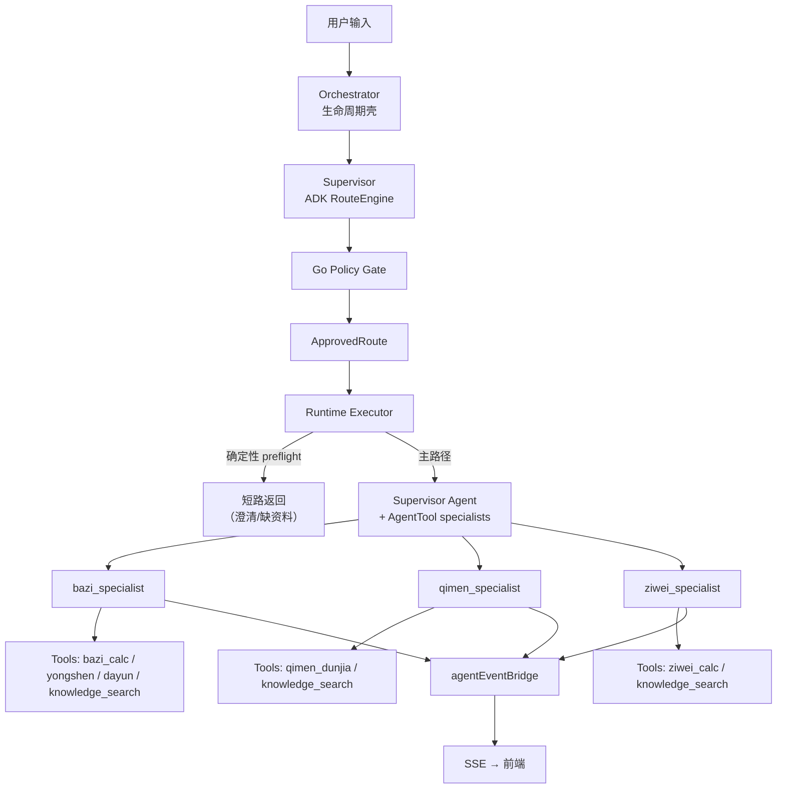

# 架构总览

> 本文是项目架构的**入口文档**。详细设计见 [docs/architecture/supervisor/](docs/architecture/supervisor/) 下的专题文档。

## 服务拓扑

```
Vue 3 (SSE) ──→ Gin (:8080) ──→ LangGraph (:8000)       推理层
                      │
                lunar-go / MCP→RAG (:3100) / Eino ADK     执行层
```

| 层 | 端口 | 技术栈 | 职责 |
|---|------|-------|------|
| 前端 | :5173 (dev) | Vue 3 + TypeScript + SSE | 聊天界面、命盘卡牌渲染、trace 面板 |
| 执行层 | :8080 | Go + Gin + Eino ADK | 会话管理、路由、工具调度、SSE 推送 |
| 推理层 | :8000 | Python + LangGraph | LLM 推理编排（可选，当前直连 Eino） |
| 知识库 | :3100 | Yopedia (独立实例) | 命理典籍 RAG 检索 |

## 多 Agent 架构（当前：v1.5 + Eino Phase 1-5A）

系统采用 **Supervisor Agent + AgentAsTool + Specialist Agent** 架构：



### 关键控制边界

- **模型负责理解**（语义路由、证据需求判断、回答生成）
- **程序负责控制**（状态管理、策略校验、工具执行、SSE 推送、trace）

详细边界见 [01-overview.md](docs/architecture/supervisor/01-overview.md)。

## 路由模型

Supervisor 输出四层结构化路由：

```
L0 对话意图   → consult / clarify / smalltalk / meta_help / switch_topic
L1 主/辅领域   → bazi / qimen / ziwei
L2 任务意图   → collect_profile / direct_bazi / interpret_chart / fortune_followup / timing_followup / cross_domain_consult
L3 槽位与标记 → profile slots / question text / time scope / target subject
```

## 会话与上下文工程

- **RecentTurns**：最近 8 轮对话保留，超过后滚动摘要
- **RunningSummary**：增量摘要合并，失败不丢历史
- **DomainStates**：领域状态持久化（八字命盘、奇门盘、紫微盘）
- **RoutingSnapshot**：每轮路由快照写入会话状态

## 工具注册

所有命理工具通过 `internal/tools/Registry` 统一注册，由 `runtime` 通过 `adapter.go` 适配为 Eino `BaseTool` 后挂载到 Specialist Agent。

| 工具 | 领域 | 说明 |
|------|------|------|
| `bazi_calc` | 八字 | 排四柱命盘（晚子时 + 太阳时校正 + 神煞） |
| `yongshen` | 八字 | 日主强弱、用神忌神分析 |
| `dayun_analyzer` | 八字 | 大运走势分析 |
| `qimen_dunjia` | 奇门 | 奇门遁甲排盘 |
| `ziwei_calc` | 紫微 | 紫微斗数命盘 + 流年 |
| `knowledge_search` | 通用 | MCP 连接知识库，BM25 + 向量混合检索 + LLM rerank |

## Eino 迁移状态

| Phase | 状态 | 内容 |
|-------|------|------|
| Phase 1 | 完成 | `llm.Chat` 底座切 Eino，原生 HTTP 路径已删除 |
| Phase 2 | 完成 | `InvokableTool` 兼容层删除，registry 只保留 Get/List |
| Phase 3 | 完成 | ADK 固定为 route engine，`classic|adk` 开关已删除 |
| Phase 5A | 完成 | Eino callback tracing 覆盖 ChatModel 主回答 + supervisor |
| Phase 5B | 进行中 | `knowledge_search` retriever span 已切 Eino callback；通用 tool callback 待推进 |
| Graph | 推迟 | 等 runtime 需要更深分支/并行/中断恢复时再做 |

## 降级策略

三层降级保护 Supervisor 路由始终可工作：

```
ADK structured route → textDecide (LLM) → fallbackExtract (规则) → safeFallback (硬编码)
```

LLM 不可用时 LangGraph 推理层降级为直接 `llm_generate`。

## 前端 SSE 协议

5 种结构化事件，前端按类型渲染：

| 事件类型 | 用途 |
|---------|------|
| `thinking` | 思考过程 |
| `tool_call` | 工具调用及结果 |
| `component` | 排盘卡牌（八字/奇门/紫微） |
| `text` | 流式回答文本 |
| `done` | 本轮结束 |

## 关键设计决策

1. 八字引擎用 `lunar-go`，不自研
2. 推理层用 LangGraph StateGraph，不用 Eino 编排
3. Go 只做工具执行，Eino 只用 Tool + ChatModel + Session Memory 三个底层组件
4. RAG 通过 MCP 调本地知识库服务，不内嵌
5. SSE 5 种结构化事件，前端按类型渲染
6. 后续统一入口采用 `LLM Supervisor + Go Runtime + bounded specialists`
7. Phase 1 不做自由 swarm 或多 agent 协作
8. `ApprovedRoute` 成为 runtime 主控输入，不再通过 legacy action bridge
9. 执行层迁移为 Supervisor Agent + AgentAsTool + Specialist Agent（2026-06-16）

## 详细文档索引

| 文档 | 内容 |
|------|------|
| [01-overview.md](docs/architecture/supervisor/01-overview.md) | 架构总图、边界、迁移状态 |
| [02-routing-model.md](docs/architecture/supervisor/02-routing-model.md) | 四层路由模型 |
| [03-session-state.md](docs/architecture/supervisor/03-session-state.md) | 会话状态结构 |
| [04-specialists-and-capabilities.md](docs/architecture/supervisor/04-specialists-and-capabilities.md) | 领域专家与能力层 |
| [05-policy-gate.md](docs/architecture/supervisor/05-policy-gate.md) | 策略门 |
| [06-trace-and-observability.md](docs/architecture/supervisor/06-trace-and-observability.md) | Trace 可观测性 |
| [07-rollout-plan.md](docs/architecture/supervisor/07-rollout-plan.md) | 发布计划 |
| [08-phase-1.5-route-driven.md](docs/architecture/supervisor/08-phase-1.5-route-driven.md) | Phase 1.5 路由驱动执行 |
| [09-retrieval-query-planning.md](docs/architecture/supervisor/09-retrieval-query-planning.md) | Agentic RAG 方案（证据规划 + 条件反思） |
| [10-agentic-rag-basics.md](docs/architecture/supervisor/10-agentic-rag-basics.md) | Agentic RAG 术语速览 |
| [runtime-adk-agent.md](docs/implementation/runtime-adk-agent.md) | ADK Agent 运行时实施文档 |
