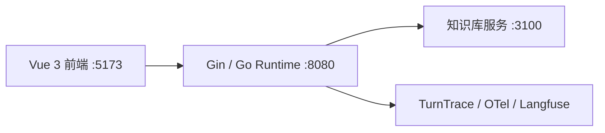
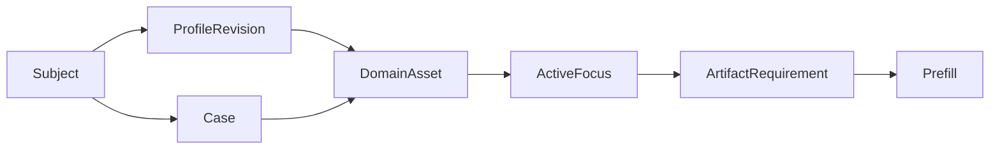
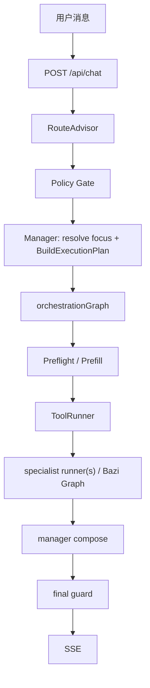

# 架构总览

> 当前架构的唯一事实来源。这里记录运行中的 owner、数据合同与主链；实施历史放在 Git 和专项设计文档。

## 架构结论

`RouteAdvisor -> Policy Gate -> Manager -> ExecutionPlan -> Prefill -> ToolRunner -> specialist runner(s) -> manager compose -> final guard -> SSE`

- `RouteAdvisor` 只做路由审批，`Policy Gate` 只做确定性策略修正。
- `Manager` 是 runtime 内唯一的对话 owner：解析当前对象，生成执行合同，决定 follow-up 的处理方式并收口回答。
- `specialist runner(s)` 是受限领域 worker，只能返回领域结果；程序控制状态、工具、资产校验和输出边界。

## 服务拓扑

| 服务 | 职责 |
|---|---|
| 前端 | 聊天、命盘卡、知识依据、处理过程和调试视图 |
| 后端 | 路由、会话状态、执行编排、SSE 和 trace |
| 知识库 | 返回命理资料证据片段，不生成 runtime 最终答案 |
| 观测 | 本地 trace、dataset run 和 score；不是执行真相源 |

本地密钥配置为 `backend/.env`（模型与 OTel）和 `deploy/langfuse/.env`（Langfuse Docker）。示例文件只能包含占位符。

## Owner 与边界

| 层 | owner | 负责 | 不负责 |
|---|---|---|---|
| 接入 | handler / orchestrator | `/api/chat`、SSE、会话锁、状态读写、trace | 推理和资产选择 |
| 路由 | RouteAdvisor / Policy Gate | 意图、领域、槽位、确定性纠偏 | 最终执行方案和成文 |
| 主控 | Manager | 对话承接、焦点解析、`ExecutionPlan`、follow-up 策略、最终 compose | 自由计算命理确定性事实 |
| 确定性执行 | Prefill / ToolRunner | artifact 准备、工具合同、参数校验、超时、重试、错误分类 | 语义路由或最终解释 |
| 领域 | specialist runner(s) | 限域分析、受控检索、领域结果 | 最终答复权和跨对象猜测 |
| 输出 | final guard / SSE bridge | 最终合同校验和事件输出 | 替代 prefill 的缺失资产检查 |

`ApprovedRoute` 不是执行合同，`ExecutionPlan` 才是。`RequiredArtifacts` 是迁移兼容投影；实际校验使用带 owner、subject、历法规则的 `ArtifactRequirement`。

## 资产合同

- `Subject` 是咨询对象；`ProfileRevision` 是出生资料的可追溯修订；`Case` 是一次独立问事。
- 八字、紫微本命盘绑定 `ProfileRevision`；奇门盘绑定 `Case` 与起局时刻。
- `ActiveFocus` 只表示本轮焦点，不替代历史资产。存在多个候选且用户指代不唯一时，Manager 必须澄清。
- `InterpretationAsset` 绑定其输入命盘。follow-up 只能复用当前精确资产的解读，不得跨对象、资料版本或 Case 复用。
- 旧 `SessionState.BaziResult / QimenResult / ZiWeiResult` 仅是活动资产的兼容投影，不是事实存储主源。

## 一轮执行

1. RouteAdvisor 给出候选路由，Policy Gate 施加白名单、澄清和硬规则。
2. Manager 解析对象、资料版本、Case 与需满足的 `ArtifactRequirement`，然后生成 `ExecutionPlan` 和 `ExecutionSnapshot`。
3. Preflight 可因澄清或资料缺失短路；Prefill 只按精确 requirement 准备命盘。
4. ToolRunner 执行 runtime-owned 确定性工具，并记录工具版本、参数校验、超时、重试和错误分类。
5. 纯八字单域进入 authority-first graph；其他受限场景进入 specialist runner(s)。
6. Manager compose，final guard 校验后经 SSE 输出 `thinking / tool_call / component / text / done`。

## 领域执行

### 八字

八字单域采用 authority-first graph：分析模式 -> 证据规划 -> 受控检索 -> 静态综合 -> 动态综合 -> 程序 renderer。四柱、大运顺逆、起运时刻、交运边界等确定性事实来自 Go 工具；LLM 只能解释结构化结果。

八字输入继续细分为 `chart_facts -> rule_materials -> static/dynamic synthesis -> minimal_guard -> renderer -> eval`：排盘、藏干层级、透干和标准冲合刑害属于可复算事实；runtime 不再注入默认 `ziping_classic_v1` rule profile，也不从 Go 代码生成 claim、调候单行 overlay 或逐运趋势。静态/动态综合器负责整盘主轴、旺衰倾向、层次和逐运判断。硬门禁只阻断可证明的事实冲突、结构字段错误、大运覆盖缺失、未声明关系事实和直接医疗/法律/伤灾断语；未知 `fact_ref` 别名、未知 `claim_ref`、普通命理措辞进入 trace soft audit 与 eval，不得仅凭词面让整段综合失败。静态与动态独立降级：静态失败才输出完整 `facts_only_degraded`；静态有效而动态失败时保留原局解读，只把大运、流年切为事实展示。renderer 仅转写上游 synthesis verdict 或相应阶段的 facts-only 降级事实。详细合同见 `docs/bazi-rule-contract.md`。

大运合同必须保留出生分钟、顺逆和顺逆依据、起运时刻以及每步日期边界。流年判断优先比较真实交运日；缺少时间边界的历史资产才可回退虚岁区间。动态层可解释标准关系触发，但趋势和吉凶只能来自动态 synthesis；Go runtime 不按固定分值自动生成“承托/压力/结构承接”。当前运缺失时可按保留的日期边界回补，仍无法定位则明确标为未识别，不能猜测某一步为当前运。

### 奇门与紫微

奇门和紫微使用同一 Manager/Prefill/ToolRunner 边界。奇门新问事必须新建或选择正确的 `Case`，不能覆盖此前问事盘；紫微本命盘按资料版本隔离。

### 检索

`knowledge_catalog` 用于目录意识，`knowledge_search` 只返回证据片段。知识库不承担最终解释；检索不可用时，运行时保守降级并记录 trace，而不是将空结果伪装为事实。

## Follow-up 与恢复

- `ExecutionPlan` 明确选择 `direct`、`reuse_artifact` 或 `rerun_specialist`；preflight、renderer 和领域 graph 不再次暗判。
- 通用术语解释可由 Manager 直接答；依赖当前命盘结构的问题必须绑定资产并走领域链。
- cheap gate 只复用窄范围同域普通追问，必须写入 `decision_source`、`gate_reason` 等观测信号，不能成为第二套路由器。
- 会话恢复恢复当前 session 和最近一轮展示态；`ExecutionSnapshot` 是 debug/process 投影的来源。

## 当前非目标

- 不是多用户生产 SaaS；没有用户体系、授权模型、会话列表或线上多租户保证。
- Langfuse v3 的 Experiments/Evals UI 不是主评测流程。
- 单个 `ActiveFocus` 不能实现多对象比较；比较需要单独的多目标合同。
- specialist ADK 内部工具尚未全部迁入 ToolRunner，当前工具治理覆盖 runtime-owned 确定性工具。

## 核心入口

- 路由：`backend/internal/supervisor/approved_route.go`、`cheap_gate.go`、`adk_engine.go`。
- 主控：`backend/internal/runtime/manager.go`、`execution_plan.go`、`orchestration_graph.go`、`preflight.go`、`final_guard.go`。
- 资产：`backend/internal/state/session.go`、`assets.go`、`backend/internal/runtime/artifact_resolver.go`。
- 工具：`backend/internal/tools/contract.go`、`registry.go`、`runner.go`。
- 八字：`backend/internal/runtime/bazi_charter_graph.go`、`bazi_final_renderer.go`、`backend/internal/tools/bazi/`。
- 验收：`docs/acceptance-criteria.md`、`eval/README.md`、`eval/datasets/runtime-smoke-v1.json`。
