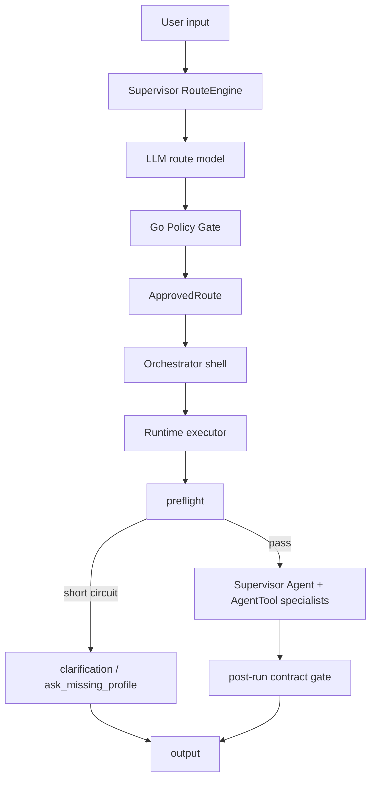
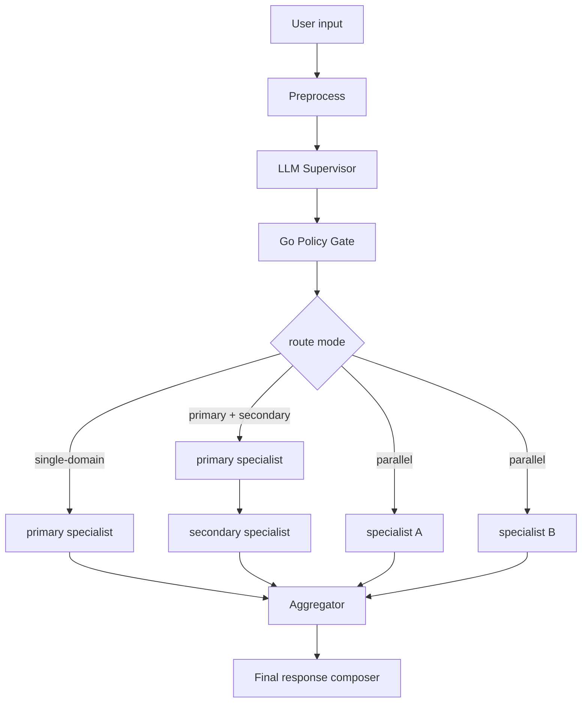
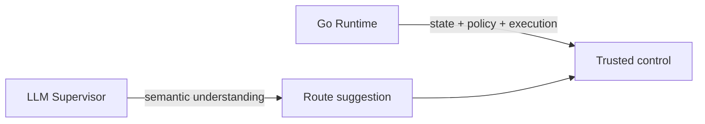

# 01 Overview

## Goal

Build a unified-entry consulting system that can grow from a mingli-focused assistant into a multi-domain specialist platform without turning the Go orchestrator into an unmaintainable rules engine, while adopting Eino incrementally under a Go-owned control boundary.

## Current Architecture (Phase 1.5 + Eino Phase 1-3 / 5A-5B)

In the current architecture, `ApprovedRoute` directly drives runtime execution through a dedicated `internal/runtime` package. The legacy `action -> switch` conversion has been removed, and Eino is only allowed to take over bounded infrastructure responsibilities.

`Supervisor RouteEngine` 当前运行时固定使用 Eino ADK 实现：

- `adk`: Eino `ChatModelAgent` 只承载 layer-1 structured route
- Go 侧继续保留 `textDecide -> fallbackExtract -> safeFallback` 作为外层降级

## Previous Architecture (Phase 1, pre-1.5)

The original phase 1 used a bridge from `ApprovedRoute` back to legacy `action` strings. That bridge has now been fully removed.

## Current Pain Points

- route approval and route execution are now separated, but domain-selection semantics were previously too prompt-fragile
- specialist prompts could say “use qimen/ziwei” without the runtime verifying the required chart actually existed
- `prefill` was starting to leak from reuse/latency concerns into correctness concerns
- dialect, multilingual input, and unusual phrasing are still poor fits for code-heavy routing
- some low-level observability is now callback-driven, but tool and graph-wide coverage is not unified yet

## Target Architecture

## Design Principle

The system should follow:

- Model for understanding
- Code for control

## Architecture Boundary

The final answer owner remains the Go runtime in the current architecture.

- Go owns session state
- Go owns tool execution
- Go owns policy validation
- Go owns post-run output validation
- Go owns SSE and the trace envelope
- Go owns the final response assembly
- Eino owns the ChatModel backend abstraction
- Eino may own the supervisor layer-1 structured route loop
- Eino callback handlers may emit low-level ChatModel spans into the existing trace envelope

The supervisor does not become a free-form autonomous top-level runtime. It becomes the semantic control plane inside a Go-owned host.

## Current Migration Position

The current Eino migration is intentionally hybrid:

- Phase 1: `llm.Chat` backend now Eino-only; the native HTTP client and `LLM_BACKEND` switch have been removed
- Phase 2: legacy Eino tool adapter (`InvokableTool`) has been removed; the registry now retains only `Get/List` for Go-side dispatch
- Phase 3: ADK is the fixed route engine; the `classic|adk` switch and `SUPERVISOR_ENGINE` configuration are gone; Go still owns `textDecide → fallbackExtract → safeFallback` as the outer fallback layer
- Phase 5A: callback tracing covers ChatModel calls (main answer + supervisor); the classic structured route and text fallback both produce `supervisor_model` spans via callback
- Phase 5B: `knowledge_search` retriever spans are now sourced from Eino retriever callbacks; generic tool callback migration is deferred

Graph migration is deferred until the runtime actually needs deeper branching, true parallel fan-out, or interrupt/resume.

## Phase 1 Routing Tightening (2026-06-19)

The current routing contract was tightened without changing the top-level schema:

- **Supervisor** now chooses `bazi / ziwei / qimen` by problem frame first:
  - natal structure / long-term trend
  - palace-oriented life themes
  - current timing / action decision
- **normalizeApprovedRoute** performs deterministic override only when the user explicitly names the method
- **runtime** blocks final output when a `qimen` or `ziwei` primary route did not actually produce the required chart result
- **prefill** is narrowed back to reusable bazi preparation only; it is no longer allowed to silently satisfy ziwei correctness
