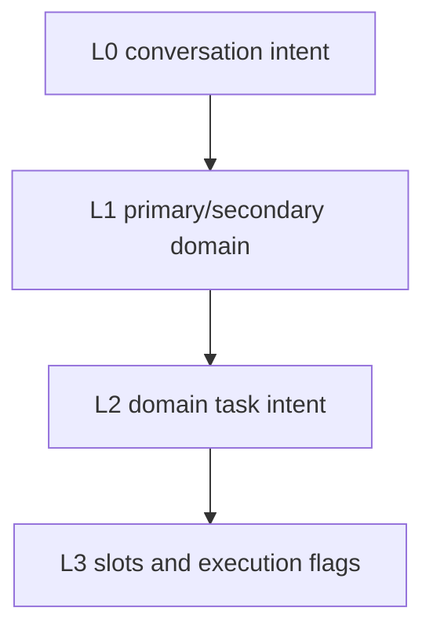
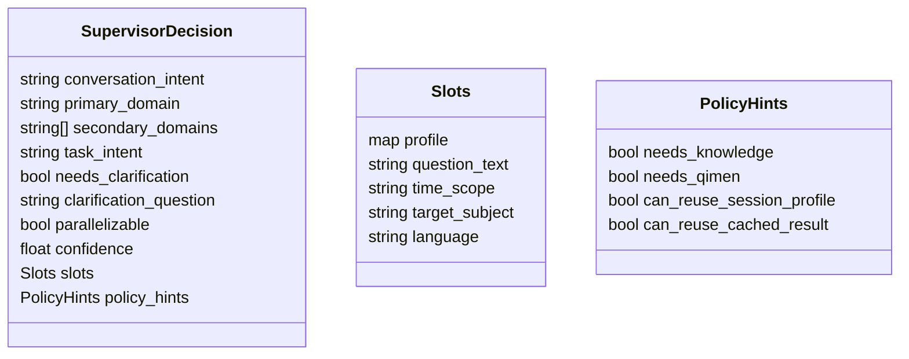
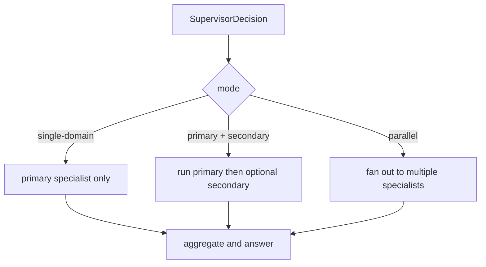
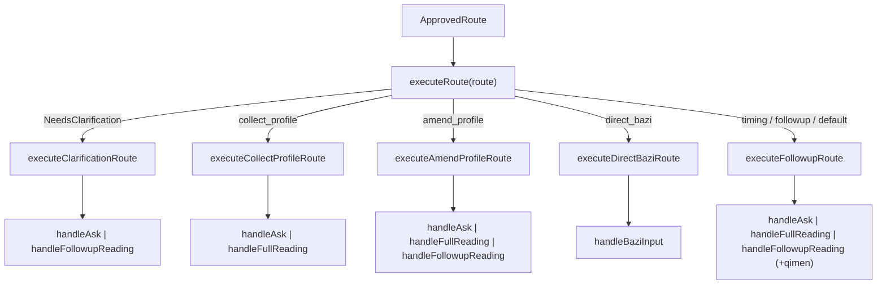
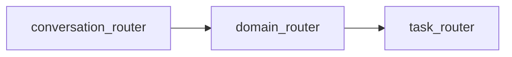

# 02 Routing Model

## Routing Layers

The supervisor should output layered decisions, not a single `action`.

## Layer Definitions

### L0 Conversation Intent

- `consult`
- `clarify`
- `smalltalk`
- `meta_help`
- `switch_topic`

### L1 Domain

- `bazi`
- `qimen`
- `emotion`
- `career`
- `general`

### L2 Task Intent

Initial `bazi` tasks:

- `collect_profile`
- `amend_profile`
- `direct_bazi`
- `interpret_chart`
- `fortune_followup`
- `timing_followup`
- `cross_domain_consult`

### L3 Slots And Flags

- profile slots
- question text
- time scope
- target subject
- language
- `needs_clarification`
- `parallelizable`
- `needs_knowledge`
- `needs_qimen`
- `can_reuse_session_profile`

## Supervisor Decision Contract

## Execution Modes

## Phase 1.5: Route-Driven Dispatch

Since phase 1.5, the `ApprovedRoute` (post-policy-gate) directly drives runtime execution via `executeRoute()`. The intermediate `action` string conversion has been removed from the supervisor path.

**Key principle:** `ApprovedRoute` fields (`TaskIntent`, `NeedsClarification`, `PolicyHints`) are now the primary control inputs. The `bridgeDecision()` function only extracts slot data (`profilePatch`, `questionText`, `needsQimen`, `rawBazi`) — it no longer decides execution flow.

## Mode Selection Rules

- Default to `single-domain`
- Use `primary + secondary` when the primary domain can determine whether secondary help is necessary
- Use `parallel` only when:
  - the user explicitly asks for a combined view, or
  - the domains are independent, and
  - required profile/context is already available, and
  - answer aggregation can remain coherent

## Router Strategy

The first implementation should use a layered router design, even if runtime calls are later merged for token efficiency.

This keeps the design debuggable even if an optimized implementation later compresses these into one structured call.
