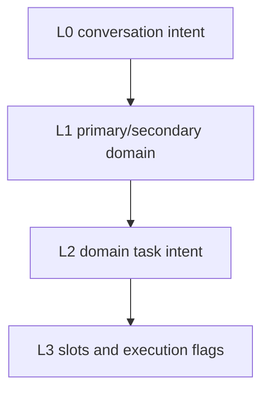
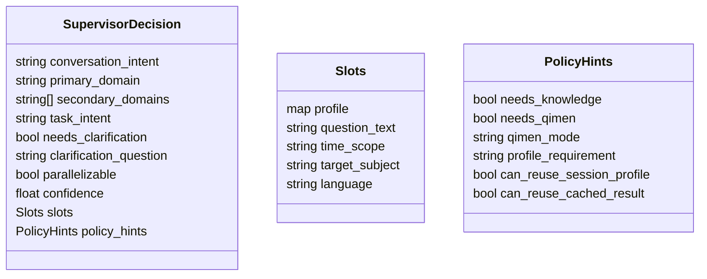
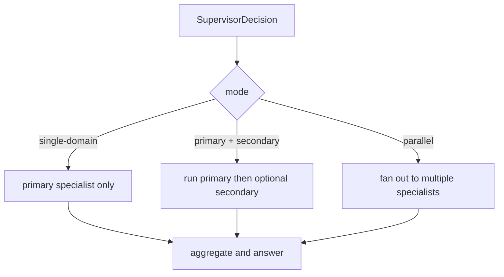
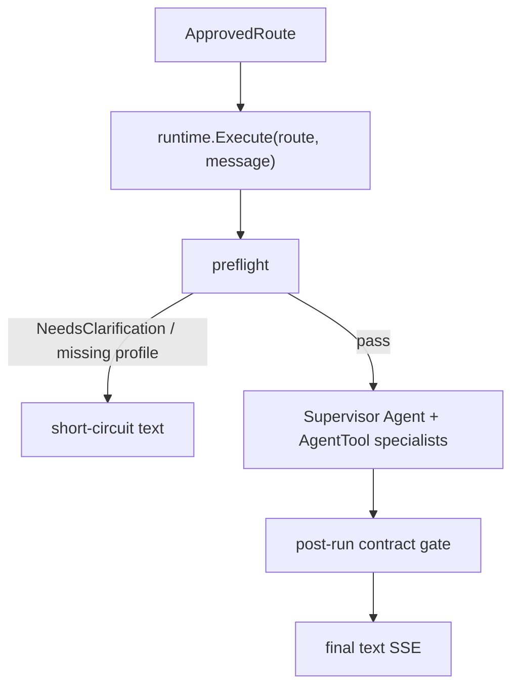
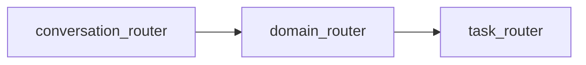

# 02 Routing Model

> **Status:** Implemented
## Routing Layers

The supervisor should output layered decisions, not a single `action`.

## Layer Definitions

### L0 Conversation Intent

- `consult`
- `clarify`
- `smalltalk`
- `meta_help`
- `switch_topic`

### L1 Domain

- `bazi`
- `qimen`
- `ziwei`

### L2 Task Intent

Initial `bazi` tasks:

- `collect_profile`
- `amend_profile`
- `direct_bazi`
- `interpret_chart`
- `fortune_followup`
- `timing_followup`
- `cross_domain_consult`

### L3 Slots And Flags

- profile slots
- question text
- time scope
- target subject
- language
- `needs_clarification`
- `parallelizable`
- `needs_knowledge`
- `needs_qimen`
- `qimen_mode`
- `profile_requirement`
- `can_reuse_session_profile`
- `can_reuse_cached_result`

## Supervisor Decision Contract

## Domain Selection Strategy

The current router is not intended to be a large keyword table. It should reason in this order:

1. Is the user asking about **natal structure / long-term baseline**?
2. Is the user asking about a **palace-oriented life theme** such as marriage structure, children, or life-role distribution?
3. Is the user asking about **current timing / whether to act now / short-window fortune**?
4. Did the user explicitly name a method and therefore constrain the answer space?

That maps to domains as follows:

| Problem frame | Preferred primary domain |
|---|---|
| natal structure / long-term trend | `bazi` |
| palace-oriented life theme | `ziwei` |
| current timing / action decision | `qimen` |

Important clarifications:

- marriage questions do **not** automatically mean `ziwei`
- “marriage structure / spouse traits / relationship pattern” usually points to `ziwei`
- “recent relationship timing / should I push this month / is now suitable” usually points to `qimen`
- “long-term marriage fortune / destiny tendency” should remain `bazi` or `ziwei`, not `qimen`

## Execution Modes

## Phase 1.5: Route-Driven Dispatch

Since phase 1.5, the `ApprovedRoute` (post-policy-gate) directly drives runtime execution through `runtime.Execute()`. The intermediate `action` string conversion has been removed from the supervisor path.

**Key principle:** `ApprovedRoute` fields (`TaskIntent`, `NeedsClarification`, `PolicyHints`) are now the primary control inputs. Runtime no longer converts route intent back into a separate legacy control language.

## Phase 1 Contract Tightening

As of 2026-06-19, route execution has two additional guarantees:

1. **explicit method obey**
   - if the user explicitly says "use ziwei / qimen / bazi", `applyExplicitMethodPreference` forces the corresponding primary domain
   - as of 2026-06-26: detection done by **semantic router**（embedding 余弦相似度，[spec](../../../docs/superpowers/specs/2026-06-26-embedding-intent-router-design.md)）replacing the old `MentionsXxxMethod` regex; router 配正向+负向 utterance，negative 优先（"我不看紫微" 不覆盖）；regex 降为兜底，仅在 `Confidence < 0.7` 且 router 不可用时启用
   - 三态开关 `ROUTER_MODE`：`off`（regex only）/ `shadow`（旁路 log）/ `enforce`（router 接入决策）
2. **post-run contract check**
   - if `primary_domain=qimen`, runtime must observe `QimenResult`
   - if `primary_domain=ziwei`, runtime must observe `ZiWeiResult`
   - otherwise the final domain conclusion is blocked instead of silently shipping a fake success

## Mode Selection Rules

- Default to `single-domain`
- Use `primary + secondary` when the primary domain can determine whether secondary help is necessary
- Use `parallel` only when:
  - the user explicitly asks for a combined view, or
  - the domains are independent, and
  - required profile/context is already available, and
  - answer aggregation can remain coherent

## Router Strategy

The first implementation should use a layered router design, even if runtime calls are later merged for token efficiency.

This keeps the design debuggable even if an optimized implementation later compresses these into one structured call.

The practical routing stack today is:

- prompt-level **domain capability framing**
- policy-level **deterministic explicit-intent correction**（semantic router 优先，regex 兜底，[spec](../../../docs/superpowers/specs/2026-06-26-embedding-intent-router-design.md)）
- runtime-level **artifact contract validation**
