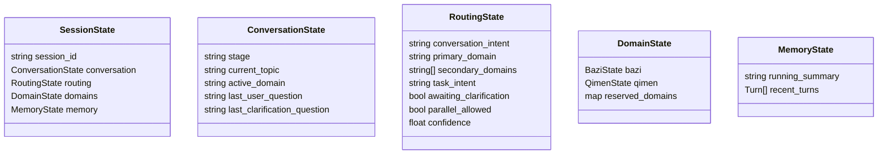
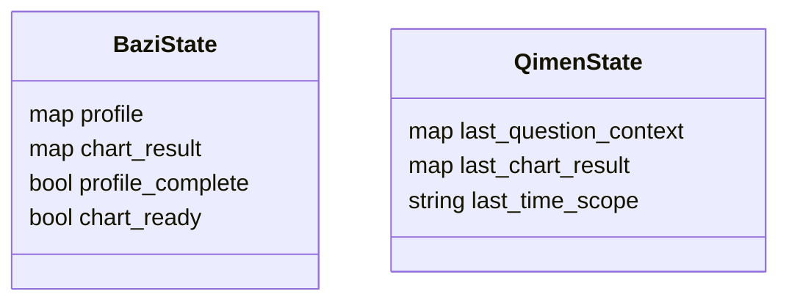
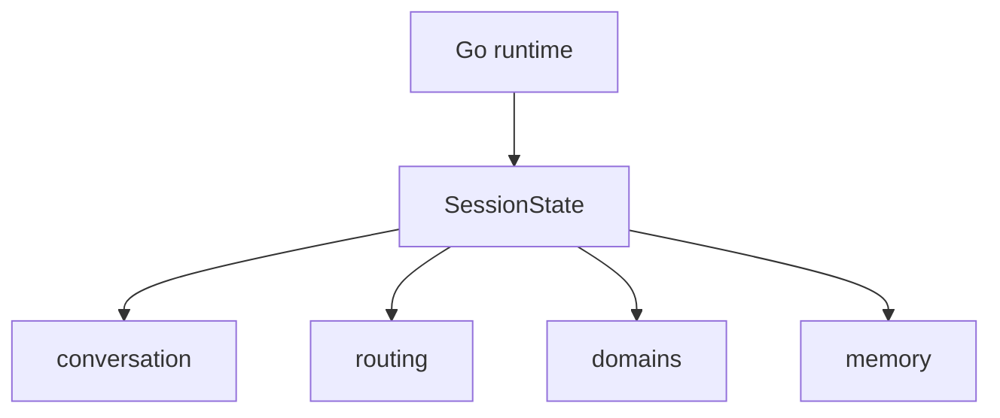

# 03 Session State

> **Status:** Implemented
## Goal

Upgrade the session model from a single-domain reading state into a unified consulting state that can support multiple specialists while preserving the existing Go-owned persistence model.

## Target Shape

## Domain State

Phase 1 only requires detailed state for `bazi` and `qimen`.

Future domains should not reuse `BaziResult`-shaped data blindly. Each domain owns its own result cache and reuse rules.

## State Ownership

The LLM supervisor can suggest updates, but it does not own persistence. Go writes the canonical session.

## Migration Principle

Keep the existing session store mechanism and evolve the payload shape.

- keep file-backed session persistence
- keep recent turns and running summary
- introduce routing/domain substructures gradually
- keep backward compatibility where practical
