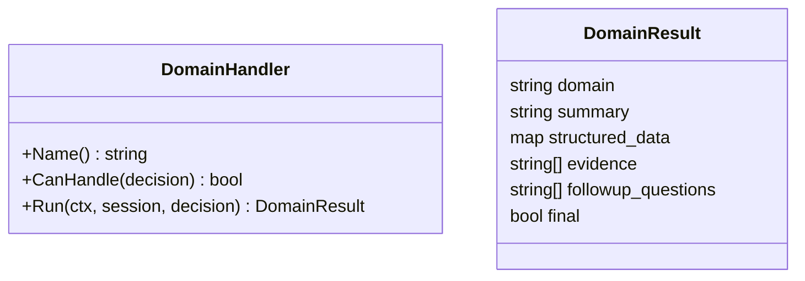
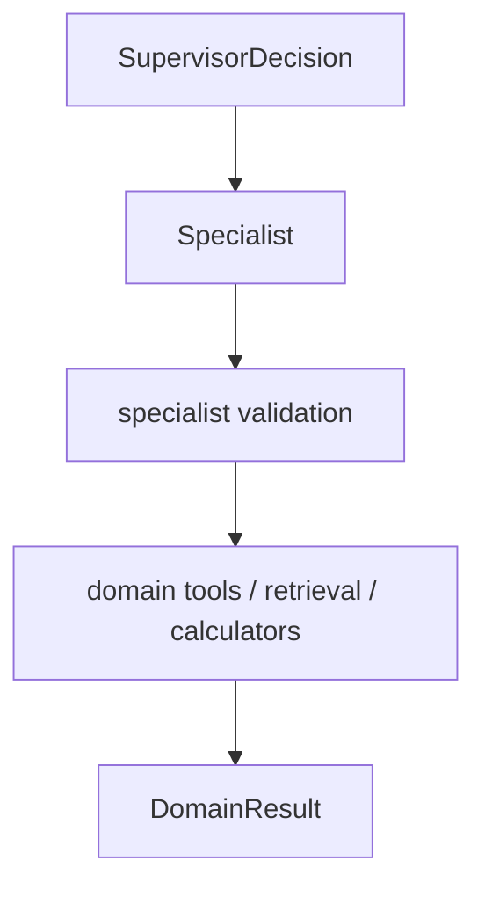
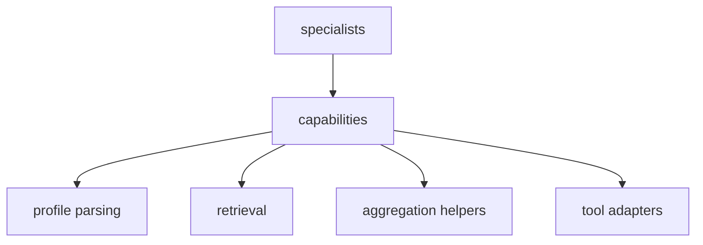

# 04 Specialists And Capabilities

## Objective

Make domain expertise explicit and bounded, instead of continuing to hide multiple roles inside one orchestrator flow.

## Specialist Model



## Phase 1 Specialists

- `bazi_specialist`
- `qimen_specialist`

Reserved but not required in phase 1:

- `emotion_specialist`
- `career_specialist`
- `general_specialist`

## Specialist Execution Pattern

Each specialist should be `agent + workflow`, not pure free-form prompting.



Examples:

- `bazi_specialist`
  - validate or complete profile
  - calculate chart
  - build domain retrieval query
  - generate interpretation or followup answer

- `qimen_specialist`
  - confirm timing-type question
  - resolve question time scope
  - compute qimen chart
  - return timing-focused supplement

## Capability Layer

Specialists should not call raw infra everywhere. Shared capability modules should sit below them.



## Agentic RAG Capability

Retrieval should not start from the raw user sentence alone, and it should not be reduced to string expansion only. For this repo, the stronger abstraction is an `Agentic RAG` capability built on top of the current controlled runtime.

- `agentic retrieval planning`: decide what evidence is missing for the current turn
- `controlled retrieval`: let Go enforce scope, budget, and source boundaries
- `retrieval quality check`: assess whether the evidence is good enough
- `conditional reflection`: only for weak, conflicting, or complex cases

This means specialists should not merely "build a query". They should help produce a bounded evidence request from:

1. `user focus`
   - what the user wants answered in this turn
2. `domain structure`
   - compact structured features from bazi / qimen / ziwei
3. `evidence gap`
   - what the model still lacks to answer with confidence

For this repo, the important takeaway is:

- We do **not** want a fully autonomous retrieval agent as the default path
- We do **not** want to search using only the user's original wording
- We do **not** want always-on multi-step reflection for every request
- We **do** want a bounded `agentic retrieval` layer between domain understanding and retrieval

Recommended default shape:

- preserve the original user question
- extract structured domain features in code
- let the model express missing evidence in a small structured form
- run domain-scoped hybrid retrieval
- perform a lightweight retrieval quality check
- trigger reflection only when evidence is weak or conflicting

This design keeps control in code, lets the model participate where code is weak, and is easier to extend across bazi, qimen, and ziwei than a query-only planning layer.

## Proposed Directory

```text
internal/
  supervisor/
  specialists/
    bazi/
    qimen/
    emotion/
    career/
  capabilities/
    profile/
    routing/
    retrieval/
    aggregation/
```
