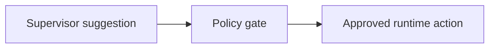
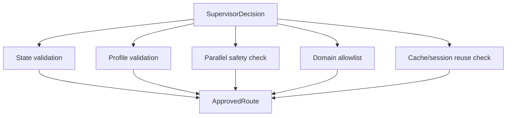

# 05 Policy Gate

## Objective

Program logic must remain the trusted control layer. The policy gate converts supervisor suggestions into approved runtime actions.

## Core Principle

## Responsibilities

- validate session compatibility
- validate required profile completeness
- decide whether secondary domains are allowed
- decide whether parallel execution is allowed
- normalize low-confidence routes into clarification
- enforce domain allowlists and rollout-stage rules

## Gate Structure

## Examples

- if `primary_domain=bazi` but profile is incomplete, do not allow full reading
- if `secondary_domains` contains unsupported domains during phase 1, drop them
- if `parallelizable=true` but state is insufficient, downgrade to single-domain or clarification
- if confidence is below threshold, force clarification
- if the primary domain is `bazi` and the secondary domain is `qimen`, allow sequential supplement before allowing parallel

## Phase 1 Safety Defaults

- default deny for parallel fan-out
- allow only `bazi`
- allow `qimen` only as secondary or timing-oriented primary
- reserve non-mingli domains in schema and directory structure, but keep them disabled in policy
