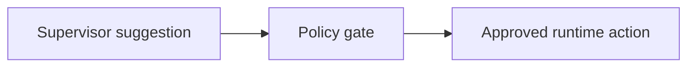
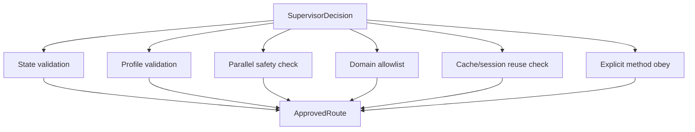

# 05 Policy Gate

> **Status:** Implemented
## Objective

Program logic must remain the trusted control layer. The policy gate converts supervisor suggestions into approved runtime actions.

## Core Principle

## Responsibilities

- validate session compatibility
- validate required profile completeness
- decide whether secondary domains are allowed
- decide whether parallel execution is allowed
- normalize low-confidence routes into clarification
- enforce domain allowlists and rollout-stage rules
- obey explicit user-selected methods through deterministic normalization

## Gate Structure

## Examples

- if `primary_domain=bazi` but profile is incomplete, do not allow full reading
- if `secondary_domains` contains unsupported domains during phase 1, drop them
- if `parallelizable=true` but state is insufficient, downgrade to single-domain or clarification
- if confidence is below threshold, force clarification
- if the primary domain is `bazi` and the secondary domain is `qimen`, allow sequential supplement before allowing parallel
- if the user explicitly requests `ziwei` / `qimen` / `bazi`, normalize the approved route to obey that method choice

## Phase 1 Safety Defaults

- default deny for parallel fan-out
- allow only mingli domains: `bazi`, `qimen`, `ziwei`
- allow `qimen` as timing-oriented primary or explicit supplement
- keep policy deterministic and small; do not turn it into a large case-by-case business router
- reserve non-mingli domains in schema and directory structure, but keep them disabled in policy

## What Policy Gate Should Not Do

The policy gate is not the place to encode an ever-growing list such as:

- “marriage always means ziwei”
- “career always means bazi”
- “recent fortune always means qimen unless X”

Those belong to the supervisor's **domain capability framing**, not to policy.

Policy should stay responsible for:

- explicit user method obey
- state-aware deterministic corrections
- rollout-stage domain safety
