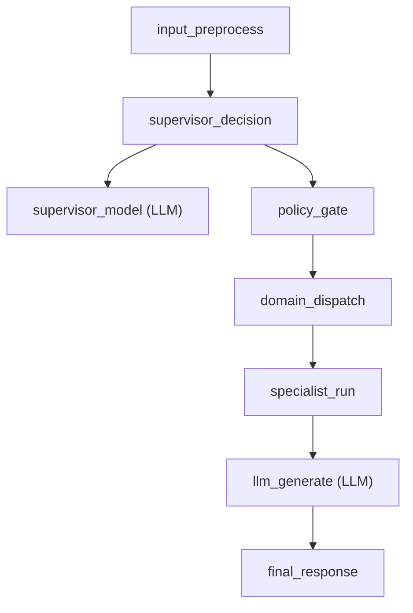
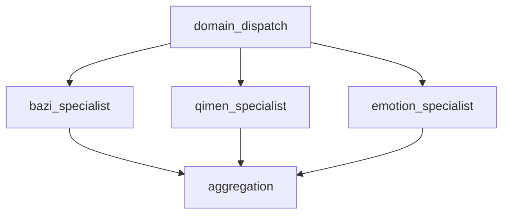

# 06 Trace And Observability

## Objective

Make supervisor decisions, policy overrides, specialist dispatch, and Eino-backed model calls visible enough to debug routing failures and future domain expansion.

## Minimum Trace Spine

## Parallel Trace Shape

## Fields To Record

- normalized user input summary
- supervisor decision snapshot
- route engine mode: ADK (fixed; classic path removed)
- confidence
- clarification requirement
- policy overrides
- selected specialists
- execution mode: single / primary-secondary / parallel
- per-specialist latency
- aggregation summary
- low-level model metadata such as model name, retry side-effects, and token usage when available

## Existing Trace Reuse

The current tracing subsystem should be extended, not replaced.

- keep turn trace as the top-level envelope
- keep business-chain spans such as `supervisor_decision`, `policy_gate`, and `domain_dispatch`
- let Eino callback handlers emit low-level ChatModel spans such as `supervisor_model` and `llm_generate`
- keep tool spans and retriever spans under the existing TurnTrace model

## Direction

Tracing is moving toward **framework-first collection with a stable local envelope**.

- Eino callbacks and future graph events should become the primary event source whenever the framework can expose them
- `TurnTrace` remains the persisted envelope and the frontend-facing contract during migration
- an adapter layer should translate framework events into the existing `TurnTrace` span shape
- new observability work should prefer framework hooks over adding more hand-written spans in business code

## Current Implementation (2026-06)

The current implementation is deliberately mixed, but the intended direction is to reduce hand-written model instrumentation over time:

- `TurnTrace` remains the only persisted trace envelope and the only thing the frontend `TracePanel` reads
- `supervisor_decision`, `policy_gate`, and route/runtime spans are still opened manually by Go
- Eino callback tracing adds `supervisor_model` and `llm_generate` LLM spans into the same turn trace
- `knowledge_search` retriever spans now come from Eino retriever callbacks instead of a hand-written `SpanFromContext` call
- the old hand-written `llm_generate` span is suppressed on the Eino answer path to avoid duplicate LLM rows

Next candidates to move under framework instrumentation are generic tool calls and, later, graph execution events if the runtime adopts Eino graph nodes.

## Streaming Callback Scope

Eino callback tracing is currently step-level, not chunk-level.

- `OnStart` / `OnEnd` style callbacks are enough for the current TurnTrace model, because the UI renders per-step latency rather than token-by-token timing
- streaming intermediate chunks do not create separate trace spans today
- this does not break current tracing semantics; it only means the trace is a run-step view, not a token timeline
- if future product work needs token-level observability, that should be modeled as a new trace layer rather than forced into the current span schema

## Why This Matters

The current architecture needs both business and model visibility:

- why was a domain selected
- why was another domain dropped
- why was clarification forced
- why was parallel execution denied
- whether route latency came from policy logic or the underlying model call
