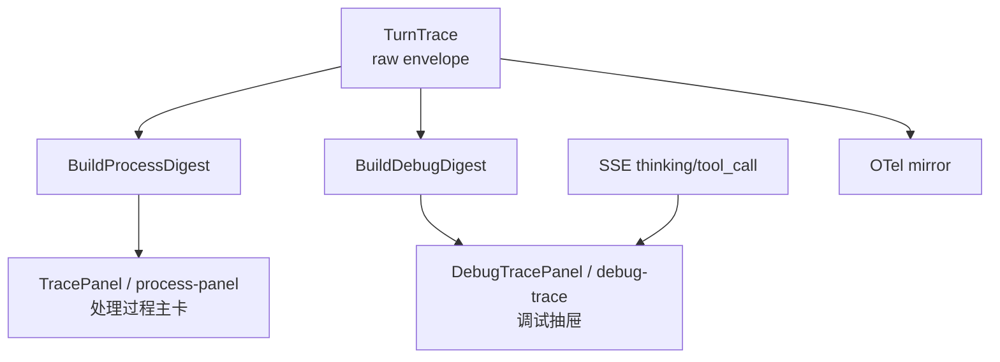
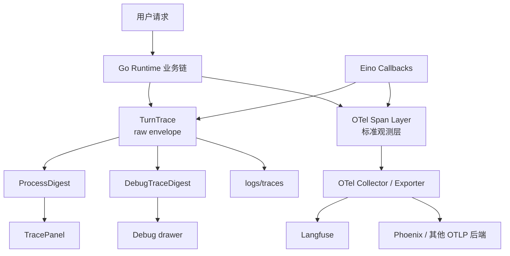
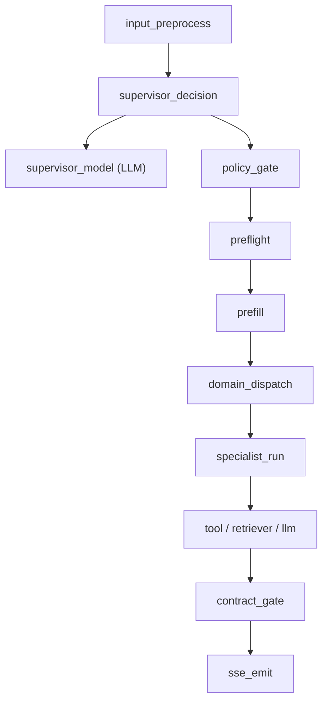

# 06 Trace And Observability

## 目标

让 **路由决策、策略纠偏、prefill 复用、specialist 执行、Eino callback 事件、SSE 输出** 都落到同一条可排查链路里，同时把**产品主视图**和**原始排障视图**明确分层，不再把 raw trace step 直接暴露给用户主界面。

本专题的核心结论只有一条：

> **保留 `TurnTrace` 作为 raw envelope；前端改走 `ProcessDigest / DebugTraceDigest` 双投影；新增 `OpenTelemetry` 作为标准观测层；首个 AI-native backend 优先接 `Langfuse`。**

这不是“把现有 trace 推翻重做”，而是把当前项目从“本地可看”升级成“标准化、可扩展、可接线上评估”。

## 为什么现在要做

当前项目已经具备一条可用但不够标准化的追踪链：

- Go 业务链手工创建 `supervisor_decision`、`policy_gate`、`domain_dispatch` 等 span
- Eino callback 已补入 `supervisor_model`、`llm_generate`、`knowledge_search` retriever span
- `TurnTrace` 会持久化到本地文件，并派生出前端需要的 process/debug 两类 digest

这套体系足够支撑单机排障，但还缺三件事：

1. **统一语义。** 现在 span 名称与属性仍以本项目私有约定为主，不方便接标准观测后端。
2. **跨系统关联。** 未来如果引入 OTLP exporter、在线评估、报警或外部 provider 追踪，当前 trace 无法直接 fan-out。
3. **trace -> eval 闭环。** 现在能看发生了什么，还不够容易把线上失败回流成回归用例。

## 架构决策

### 决策 1：`TurnTrace` 不下线，但不再直接充当前端主视图模型

`TurnTrace` 继续作为：

- 本地 `logs/traces/` 的唯一落盘 envelope
- `ProcessDigest` / `DebugTraceDigest` 的共同事实来源
- 业务排障时可回放的 raw trace 基底

理由：它已经承载了当前排障习惯和文件落盘协议，直接替换成某家平台私有数据模型会让本地分析、回放和线上平台接入绑死在一起，不值当。

但这次前端问题已经说明，**raw span step 不适合直接作为产品化“处理过程”文案**。因此主视图不再直接消费 legacy `TraceDigest`，而是改由更稳定的阶段投影驱动。

### 决策 1.5：前端显示采用双投影，而不是继续堆主界面规则

规则如下：

- **`ProcessDigest`** 只保留用户可读、可稳定归纳的阶段摘要
- **`DebugTraceDigest`** 保留原始 span、状态、耗时与 meta，供排障使用
- SSE `thinking` / `tool_call` 不再混入主回答，也不再撑爆主界面“处理过程”步数

### 决策 2：新增 OTel 标准层，而不是继续堆本地字段

新增一层 **OpenTelemetry GenAI Semantic Conventions** 兼容的 span/attribute 映射，作为对外标准面。

- `ProcessDigest` 解决“用户主界面怎么看”
- `DebugTraceDigest` 解决“前端排障抽屉怎么看”
- `TurnTrace` 解决“本地文件和原始事实怎么存”
- OTel 解决“平台和工具怎么接”

这层标准面不要求一开始就百分百覆盖官方全部语义，但要求：

- trace/span id 能稳定传播
- 关键业务动作能映射到可搜索的 span
- LLM/tool/retriever 使用标准属性名优先

### 决策 3：数据源分层，不强行统一到一种生成方式

规则如下：

- **Go** 继续负责业务语义跨度较大的 span，例如 `supervisor_decision`、`policy_gate`、`prefill`、`contract_gate`
- **Eino callback** 负责更贴近框架事件的 span，例如 `supervisor_model`、`llm_generate`、`knowledge_search` retriever、generic tool call
- **projection 层** 负责把 `TurnTrace` 翻译成 `ProcessDigest` / `DebugTraceDigest`
- **adapter 层** 负责把 Go 与 callback 事件同时翻译进 `TurnTrace` 和 OTel

### 决策 4：首个观测 backend 选 `Langfuse`

本项目第一阶段推荐接 `Langfuse`，不是因为它“唯一正确”，而是因为它和当前约束最匹配：

- 支持直接接收 OTLP
- 可先当 observability backend，不强迫运行时改成它的 SDK 形态
- 后续可继续承接 prompt、score、dataset、online eval

`Phoenix` 作为第二参考实现很有价值，尤其适合：

- 纯 tracing / 纯 OSS 诉求更强
- 更重视 OTel / OpenInference 对齐
- 想先把 trace 看清楚，再决定是否接运营能力

`OpenLIT` 更适合作为 **插桩补充层**，不是当前项目的主平台。
`Helicone` 更适合作为 **模型网关层** 的后续议题，不作为第一阶段主观测后端。

## 分层职责

| 层 | 职责 | 事实来源 |
|---|---|---|
| `TurnTrace` | raw envelope、本地落盘、回放基底 | Go + callback 翻译后的完整链路 |
| `ProcessDigest` | 前端主界面“处理过程”摘要 | `TurnTrace` 的用户安全投影 |
| `DebugTraceDigest` | 调试抽屉、原始 step 排障 | `TurnTrace` 的 debug 投影 |
| OTel span | 标准化 trace、跨系统关联、后端对接 | Go 业务 span + Eino callback span |
| AI-native backend | 查询、过滤、聚合、评分、失败聚类 | OTLP 导出的标准 trace |

边界要求：

- **不要** 让某家平台的字段直接反向定义业务语义
- **不要** 让前端 `TracePanel` 直接渲染 raw step 列表或外部平台返回
- **不要** 为了平台接入删除已有本地 trace 文件

## 最小 Trace Spine

相比旧版本，这条 spine 新增了三个必须显式可见的阶段：

- `prefill`
- `contract_gate`
- `sse_emit`

因为这三个阶段正是“很多奇怪问题”最容易藏住副作用的位置。

## Span Taxonomy

| Span 名称 | Kind | 主要责任 | 推荐来源 |
|---|---|---|---|
| `supervisor_decision` | `CHAIN` | 路由语义判断、候选领域选择 | Go 手工 |
| `supervisor_model` | `LLM` | route engine / text fallback 的底层模型调用 | Eino callback |
| `policy_gate` | `CHAIN` | obey、资料要求、并行限制、澄清决策 | Go 手工 |
| `preflight` | `CHAIN` | 确定性短路、缺资料澄清 | Go 手工 |
| `prefill` | `CHAIN` | 可复用工具链、缓存命中、来源标记 | Go 手工 |
| `domain_dispatch` | `CHAIN` | 进入哪条领域执行 lane | Go 手工 |
| `specialist_bazi` | `AGENT` | 八字主链执行 | Go 手工 |
| `specialist_qimen` | `AGENT` | 奇门主链执行 | Go 手工 |
| `specialist_ziwei` | `AGENT` | 紫微主链执行 | Go 手工 |
| `bazi_calc` / `qimen_dunjia` / `ziwei_calc` | `TOOL` | 命盘工具执行 | Eino callback 优先 |
| `knowledge_search` | `RETRIEVER` | 证据检索 | Eino callback |
| `llm_generate` | `LLM` | specialist 最终解读 | Eino callback |
| `contract_gate` | `CHAIN` | 领域产物验收、回答 guardrail | Go 手工 |
| `sse_emit` | `CHAIN` | 是否缓冲、是否最终输出、输出类型 | Go 手工 |

原则：

- 业务跨度大的阶段继续由 Go 明确打开 span
- 框架能自然暴露的低层事件优先走 callback
- 不再新增“同一动作手工记一遍、callback 再记一遍”的双记路径

## Attribute Contract

### 通用字段

所有 trace 至少应可推导或直接记录：

- `trace_id`
- `session_id`
- `turn_type`
- `user_message_summary`
- `status`
- `duration_ms`

当前实现说明：

- `session_id`、`turn_type`、`user_message_summary` 已开始写入 root trace
- ApprovedRoute 的关键路由信息已开始写入 root trace attributes

### 路由与策略字段

这些字段是本项目的高价值业务语义，必须进入标准层：

| 属性 | 说明 |
|---|---|
| `approved_route.primary_domain` | 最终批准的主领域 |
| `approved_route.secondary_domains` | 辅助领域 |
| `task_intent` | 本轮任务意图 |
| `qimen_mode` | `none / supplement / primary` |
| `profile_requirement` | `none / partial / full` |
| `route_obey_applied` | 是否发生显式术数 obey |
| `needs_clarification` | 是否需要澄清 |
| `clarification_reason` | 澄清原因 |

### 执行与复用字段

| 属性 | 说明 |
|---|---|
| `prefill.source` | `prefill / mainline / reuse` |
| `cache_hit` | 是否命中结果级缓存 |
| `knowledge.hits` | 检索命中文档数 |
| `tool.name` | 工具名 |
| `tool.args_summary` | 参数摘要，避免记录敏感原文 |
| `artifact_present` | 领域关键产物是否真实生成 |
| `guardrail.result` | 回答 guardrail 结果 |
| `sse.buffer_mode` | 是否缓冲最终回答 |
| `sse.event_type` | `thinking / tool_call / component / text / done` |

### LLM 标准字段

下列字段优先对齐 OTel GenAI 语义：

- `gen_ai.request.model`
- `gen_ai.request.temperature`
- `gen_ai.usage.input_tokens`
- `gen_ai.usage.output_tokens`
- `gen_ai.operation.name`

若某家 backend 需要额外私有字段，放到 **vendor namespace**，例如 `langfuse.*`，但不能替代上述通用字段。

当前实现说明：

- Eino ChatModel callback 已开始为 `llm_generate` / `supervisor_model` 一类 LLM span 记录 `gen_ai.request.model`
- token usage 已开始同步到 `gen_ai.usage.input_tokens` / `gen_ai.usage.output_tokens`

## `TurnTrace`、前端投影与 OTel 的关系

`TurnTrace` 不是 OTel 的副本，也不是 OTel 的竞争者；`ProcessDigest` / `DebugTraceDigest` 也不是新的 trace 存储层。

两者关系如下：

- `TurnTrace` 保留 **raw span、中文标签、可落盘 envelope**
- `ProcessDigest` 保留 **用户可读阶段摘要**
- `DebugTraceDigest` 保留 **原始 step 与 debug meta**
- OTel 保留 **trace/span id、标准属性、跨系统关联能力**
- adapter / projection 在写 span 后维护多套视图，但这些视图用途不同

这意味着：

- 不必把所有 OTel 原始属性都暴露给前端
- 不必把 raw `TurnTrace` step 全部塞给主界面
- 也不必把 `ProcessDigest` 的中文摘要强行塞回 OTel 里

## 实施阶段

### Phase A：补齐本地 taxonomy

目标：先把本地 trace 补成完整的排障链。

- 补 `preflight`、`prefill`、`contract_gate`、`sse_emit` span
- 为现有 `tool` / `retriever` / `llm` span 统一命名
- 清理重复 span 和隐藏副作用路径

验收：

- 看一条 trace 就能回答“为什么进了这个领域、为什么用了这个工具、为什么最终发了这段 SSE”

### Phase B：接 OTel exporter

目标：在不改前端协议的前提下，把同一条 trace 导出到 OTLP backend。

- 新增 OTel tracer/provider 初始化
- 为现有 span 增加标准属性映射
- 支持 fan-out 到 `TurnTrace` 落盘和 OTLP exporter

验收：

- 同一轮请求可同时在本地 `logs/traces/` 和 `Langfuse` 中被定位
- exporter 默认关闭；未配置时不影响现有 `TurnTrace`

### Phase C：接线上评分与失败回流

目标：让 trace 不只“能看”，还“能回归”。

- 基于 trace 生成在线评分维度
- 自动标记 `wrong-domain`、`missing-artifact`、`duplicate-chart`、`unexpected-clarification`
- 将失败 trace 回流为回归数据集

验收：

- 每个线上真实故障都能沉淀为可复跑的 regression case

## 在线评分建议

第一批在线评分不要贪多，优先围绕已经暴露过的问题建：

| 评分项 | 判断方式 |
|---|---|
| `domain_correctness` | 路由领域与真实执行产物是否一致 |
| `artifact_integrity` | `qimen/ziwei` 主域时是否真实起盘 |
| `duplicate_tool_execution` | 同一轮是否出现异常重复起盘 |
| `clarification_correctness` | 是否在不该追问资料时追问 |
| `streaming_contract` | `bazi` 是否恢复为流式输出，`qimen/ziwei` 是否按 gate 缓冲 |

## 当前实现状态（2026-06-19）

当前代码已经具备这条路线的基础，而且 Phase A 已经落下第一刀：

- `TurnTrace` 仍是唯一持久化 envelope
- 前端主视图已改为依赖 `ProcessDigest`
- 前端 debug 抽屉已改为依赖 `DebugTraceDigest + thinking/tool_call`
- Eino callback 已接入 ChatModel、retriever、tool 三类低层事件
- `knowledge_search` retriever span 已迁到 callback
- `prefill` 已具备 `source=prefill` 这类可继续标准化的属性
- `Execute` 已显式记录 `preflight` span
- `prefill` 已提升为业务级 span，而不只是零散 tool span
- 最终回答验收已落到 `contract_gate` span
- runtime 发往前端的 `text / thinking / tool_call / component` 已统一经过 `sse_emit` span
- legacy raw `turn-chain` 已从主界面移除，避免 `SSE 输出` 这类低价值 step 撑爆产品视图
- 已支持通过可选 OTLP exporter 将同一批 span 镜像到外部 backend，而不替代本地 `TurnTrace`

## OTLP 配置

当前实现使用标准 OTLP HTTP exporter，并保持默认关闭。

| 环境变量 | 用途 |
|---|---|
| `OTEL_ENABLED` | 显式开启 OTel mirror |
| `OTEL_EXPORTER_OTLP_TRACES_ENDPOINT` | traces 专用 OTLP endpoint，优先级最高 |
| `OTEL_EXPORTER_OTLP_ENDPOINT` | 通用 OTLP endpoint，当前作为 traces fallback |
| `OTEL_EXPORTER_OTLP_HEADERS` | 逗号分隔的 header 列表，例如 `Authorization=Basic xxx` |
| `OTEL_EXPORTER_OTLP_INSECURE` | 是否允许不安全连接（本地 collector 时常用） |
| `OTEL_SERVICE_NAME` | 服务名，默认 `suanming-agent` |

### Langfuse 接法

若要接 Langfuse，可直接使用其 OTLP endpoint：

- endpoint 指向 Langfuse 的 `/api/public/otel`
- header 通过 `OTEL_EXPORTER_OTLP_HEADERS` 传 `Authorization=Basic ...`

当前实现不会要求 runtime 改成 Langfuse SDK 模式；仍然是 **本地 `TurnTrace` 主导 + 前端投影分层 + OTel mirror 外发**。

所以接下来的工作重点不是“换框架”，而是：

1. 把观测边界再收紧一层
2. 建立 OTel 标准映射
3. 接一条 AI-native backend 做线上观察与评估

## 为什么这条路线适合本项目

本项目不是 LangGraph 风格的“框架先行”系统，而是 **Go 主控 + bounded Eino infrastructure**。

因此最健康的做法不是把 trace 全部交给外部 SDK，而是：

- **业务语义仍掌握在 Go 手里**
- **框架事件由 callback 自动补齐**
- **标准输出交给 OTel**
- **产品主视图走 `ProcessDigest`，原始排障走 `DebugTraceDigest`，二者都由 `TurnTrace` 派生**

这条路线既符合当前代码现实，也能支撑后续多领域扩展、线上评估和长期排障。
