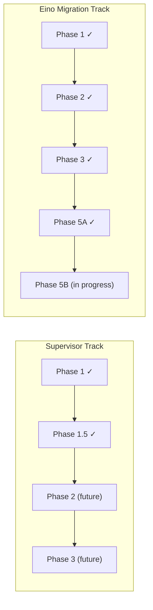
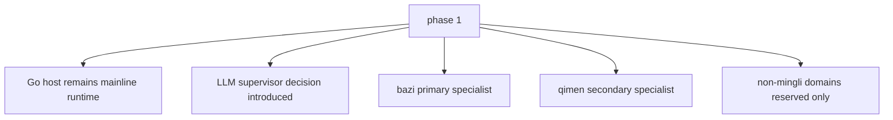
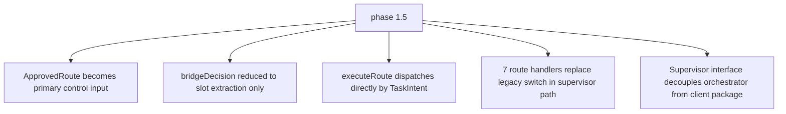
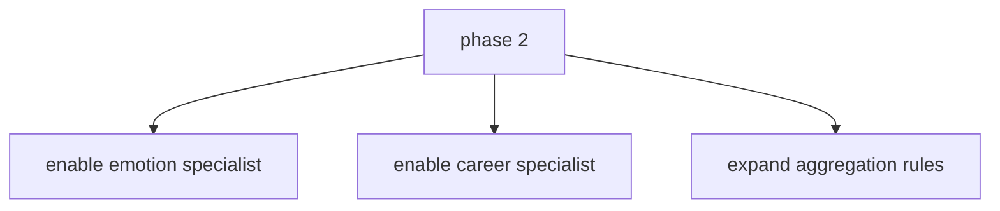
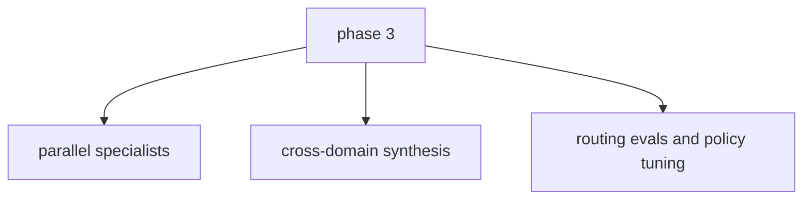
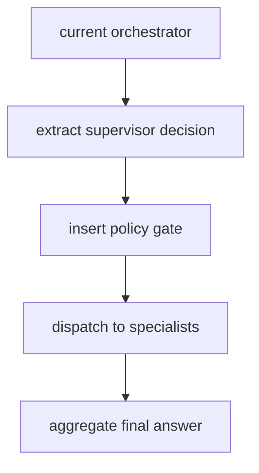

# 07 Rollout Plan

## Objective

Adopt the supervisor architecture without destabilizing the current mingli mainline.
Incrementally migrate the LLM infrastructure toward Eino while keeping Go as the
runtime owner for deterministic control, state, and execution.

## Rollout Strategy

Two parallel tracks, with supervisor-domain expansion gated behind infrastructure migration:

## Supervisor Track

### Phase 1: Supervisor Skeleton, Mingli Mainline :white_check_mark: Complete

Scope:

- introduce `SupervisorDecision`
- introduce policy gate
- keep `bazi` as primary domain
- allow `qimen` as the first real secondary specialist
- keep non-mingli domains disabled by policy

### Phase 1.5: Route-Driven Dispatch, Runtime Close :white_check_mark: Complete

Scope:

- `executeRoute()` directly consumes `policy.ApprovedRoute` -- no intermediate `action` string
- `bridgeDecision()` returns `(patch, question, needsQimen, rawBazi)` -- no `action` mapping
- 7 route handlers: clarification / collect / amend / direct_bazi / direct_qimen / followup / interpret
- `Supervisor` interface defined locally in orchestrator package, mockable in tests
- Legacy `classifyAndExtract -> switch action` preserved as fallback when supervisor is nil
- Go-side deterministic correction: if a message contains full birth info but supervisor misroutes to followup/interpret, Go forces `collect_profile` and extracts `birthplace`
- `bridgeDecision` reduced to pure slot extraction; no longer returns `action`
- No changes to `internal/tools/`, frontend protocol, or specialist interfaces

### Phase 2: Specialist Expansion (future)

Scope:

- turn reserved domains into real specialists
- keep most traffic single-domain
- allow curated primary + secondary workflows

### Phase 3: True Cross-Domain Fan-Out (future)

Scope:

- allow true parallel fan-out for clearly independent cross-domain questions
- expand aggregation and evaluation coverage

---

## Eino Migration Track

Goal: incrementally adopt Eino infrastructure underneath the existing Go-controlled
runtime, without giving model agents autonomous tool execution or replacing the
supervisor decision plane.

### Phase 1: ChatModel Backend :white_check_mark: Complete

- Eino-only factory; native HTTP client removed
- `internal/llm/eino_chat.go`: classic Eino `ToolCallingChatModel` adapts to existing `llm.Chat` interface
- Supervisor flash route uses an independent `DisableThinking` client to avoid DeepSeek `tool_choice` + thinking 400 errors
- No change to orchestrator control flow or deterministic tool dispatch

### Phase 2: Tool Boundary Cleanup :white_check_mark: Complete

- legacy Eino tool adapter/export has been removed
- `internal/tools/registry.go`: retains only `Get/List`
- Mingli tools remain dispatched explicitly by Go runtime, not handed to model agents

### Phase 3: Structured Route Engine (minimal) :white_check_mark: Complete

- `internal/supervisor/client.go`: injectable `RouteEngine` for layer-1 structured route
- `internal/supervisor/adk_engine.go`: Eino ADK `ChatModelAgent` + `output` tool drives structured routing
- `internal/supervisor/decision_contract.go`: shared `output` tool contract (name, description, validation) for ADK path
- `internal/container/container.go`: always wires the ADK route engine
- Go retains `textDecide` / `fallbackExtract` / `safeFallback` as a three-layer degradation skeleton
- ADK route engine: when ToolNode validation fails, the outer layer extracts the feedback and retries locally once (structured self-correction); Go-layer fallback is unchanged

### Phase 5A: Eino Callback Tracing (minimal) :white_check_mark: Complete

- `internal/tracing/eino_callback.go`: `EinoTraceCallbackHandler` maps ChatModel calls into existing `TurnTrace` spans via Eino `callbacks.Handler`
- `streamInterpretation`: under Eino backend, `llm_generate` span comes from callback (avoids double-recording with manual LLM span)
- Classic structured route, text fallback, and ADK route run all produce `supervisor_model` LLM spans under Eino backend
- Installed once at startup
- Does **not** replace existing `TurnTrace` / business spans; only adds model-call instrumentation

### Phase 5B: Framework-first Trace Sources :hourglass_flowing_sand: In Progress

- `knowledge_search` retriever spans are now sourced from Eino retriever callbacks; generic tool callback migration is deferred
- if later Eino graph/runtime nodes are adopted, route their events through the same adapter path
- keep `TurnTrace` as the persisted envelope and `TracePanel` input contract during the migration
- prefer removing duplicated hand-written model/tool spans over adding more manual instrumentation

---

## Current Status Summary

| Track | Phase | Status |
|-------|-------|--------|
| Supervisor | Phase 1 | ✓ Complete |
| Supervisor | Phase 1.5 | ✓ Complete |
| Supervisor | Phase 2 | Not started |
| Supervisor | Phase 3 | Not started |
| Eino | Phase 1 (ChatModel) | ✓ Complete |
| Eino | Phase 2 (Tool adapter) | ✓ Complete |
| Eino | Phase 3 (ADK route engine) | ✓ Complete (minimal) |
| Eino | Phase 5A (callback tracing) | ✅ Complete |
| Eino | Phase 5B (framework-first trace sources) | 🔄 In progress; knowledge_search retriever migrated |

**Boundary:** Go owns the runtime control loop. Eino infrastructure is used underneath
for model calls, tool views, and structured routing — but does not replace the
orchestrator's deterministic execution, state management, or policy decisions.

**Environment gating:**
- `LLM_API_KEY` / `LLM_BASE_URL` / `LLM_MODEL` / `LLM_FLASH_MODEL` drive the Eino runtime
- route engine no longer has a classic switch; production path is always Eino ADK + Go fallback

---

## Migration Plan From Current Code

Recommended implementation order:

1. introduce supervisor schema and parsing
2. wrap current `classifyAndExtract` responsibilities into supervisor output
3. add policy gate
4. extract `bazi` flow into `bazi_specialist`
5. extract timing/qimen flow into `qimen_specialist`
6. add aggregation layer
7. add route-level tracing

## Files To Change First

- `internal/orchestrator/extract.go`
- `internal/orchestrator/orchestrator.go`
- `internal/state/session.go`
- `internal/tracing/*`

New areas:

- `internal/supervisor/`
- `internal/specialists/`
- `internal/policy/`
- `internal/schemas/`
- `internal/prompts/`

## Files To Avoid Rewriting Early

- core tool implementations under `internal/tools/`
- session storage backend
- SSE event transport
- current frontend rendering model

The architecture should first change the decision plane, not rebuild every layer at once.
