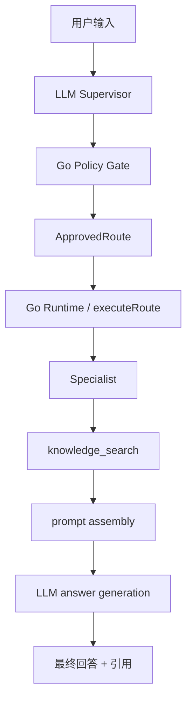
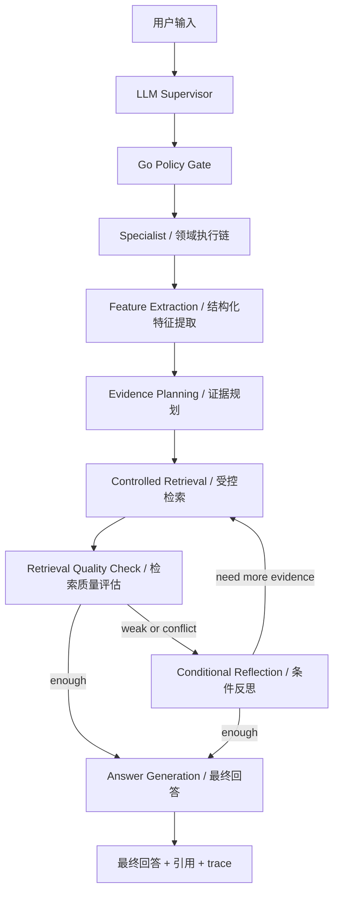

# 09 Agentic RAG 方案（含检索质量门控与条件反思）

**日期：** 2026-06-14  
**状态：** 方案重写 / 待实施  
**适用范围：** 八字、奇门、紫微等命理域统一检索与推理增强  
**目标：** 在保留当前 `LLM Supervisor + Go Runtime + bounded specialists` 主线控制边界的前提下，引入更贴近主流权威实践的 `Agentic RAG` 增强链路，用来解决复杂命理问题中的证据缺口、检索纠偏和条件反思。

---

## 1. 先说结论

我们当前真正缺的，不是一层更强的“检索词生成器”，而是一条更完整的 **Agentic RAG 增强链路**。

旧思路的核心问题是：  
它主要回答“该搜哪些词”，但你现在更关心的是：

> **这次推理还缺什么知识？应该去哪个领域、哪类典籍里补？补回来后是否需要修正原判断？**

因此，方案主轴应该从：

- `query planner / 检索词规划`

切换为：

- `classic / hybrid RAG` 作为基础链路
- `agentic retrieval / agentic RAG` 作为复杂题升级链路
- `retrieval quality gate / 检索质量门控`
- `conditional reflection / 条件反思`

其中：

- `Agentic RAG` 是当前最主流、最容易被外部理解的总称
- `Self-RAG` 更偏学术上的“按需检索 + 自反思”范式
- `CRAG` 更偏“检索质量评估 + 检索纠偏”范式

这不是小修补，而是设计中心改变。

---

## 2. 我们目前的架构是什么

截至 **2026-06-14**，当前主线架构仍然是：

- `LLM Supervisor` 负责语义理解、结构化路由建议
- `Go Runtime` 负责状态、策略、执行、工具调度、SSE、最终回答组装
- `Specialists` 负责八字、奇门、紫微等领域 workflow
- `knowledge_search` 负责知识库检索
- 回答阶段仍然是 prompt 驱动的大模型生成

抽象链路如下：



这条主链当前已经解决了很多昂贵问题：

- 会话状态归属明确
- 首轮出生信息和追问路由已有兜底
- 八字 / 奇门主链已经打通
- Go 负责 SSE、trace、工具执行
- 回答 prompt、知识引用、降级路径都已有基础

所以这次不是推翻当前主线，而是补齐当前主线最薄弱的一段：

> **从“已有结构化信息”到“该补什么证据”之间的中间层。**

---

## 3. 为什么旧方案不够

旧方案把问题定义成：

> 如何提炼对本轮问题最关键的检索词，再去搜索。

这个定义不算错，但不够深。

### 3.1 它只能解决“搜词”，不能解决“证据缺口”

比如用户问：

- 最近适合换工作吗
- 2026 年感情会不会有结果
- 这个奇门盘现在该主动还是观望

真正困难的不是“词不够”，而是：

- 当前判断缺的是事业断法、婚姻断法，还是时机判断依据？
- 缺的是八字结构依据、奇门时空依据，还是紫微宫位依据？
- 应该优先补《滴天髓》、`career` 类知识页，还是奇门门星宫关系？
- 拿到证据后，是确认原判断，还是推翻原判断？

这些问题本质上不是 query string 问题，而是 **evidence gap** 问题。

### 3.2 纯代码 planner 感知不到“模型现在还不知道什么”

代码擅长：

- 提取稳定结构化特征
- 做领域限域
- 控制检索预算
- 阻止系统乱搜

但代码不擅长：

- 判断本轮还缺哪一类证据
- 感知这次推理是否证据不足
- 判断某个模糊知识点该去哪类典籍里补

如果你要补的是“模型不知道的、模糊的推算知识”，那就必须保留模型参与“证据需求判断”这一层。

### 3.3 纯 query planner 容易把真正的难点藏起来

如果只盯着：

- query rewrite
- query expansion
- query routing

会让人误以为问题只是检索工程问题。

但对命理系统来说，真正高价值的部分是：

- 证据规划
- 证据质量判断
- 冲突证据处理
- 必要时自我校验

所以旧方案已经不够准确了。

---

## 4. 这套方案在主流术语里到底叫什么

为了避免内部文档自造术语，这里先把名称钉清楚：

- **主流工程/产品叫法：** `Agentic RAG`
- **Azure 官方产品侧更常见叫法：** `Agentic Retrieval`
- **如果强调按需检索 + 自反思：** `Self-RAG`
- **如果强调检索质量评估与补救：** `CRAG`

对本项目来说，更准确的对外表达应是：

> **以 Classic/Hybrid RAG 为基础、以 Agentic RAG 为复杂题升级链路，并带 Retrieval Quality Gate 的命理专业检索增强架构。**

也就是说，我们内部前面说的：

- 证据规划
- 受控检索
- 条件反思

并不是一个完全独立于主流的新体系，而是把主流 `Agentic RAG` 在命理场景里翻译成更贴业务的说法。

---

## 5. 新方案到底要解决什么问题

新方案要解决的是 4 个连续问题：

### 4.1 这次推理缺什么证据？

不是先问“搜什么词”，而是先问：

- 缺长期格局依据？
- 缺流年应期依据？
- 缺奇门时机依据？
- 缺紫微宫位依据？

### 4.2 去哪里补？

补证据时要明确：

- 哪个命理域
- 哪类典籍或知识页
- 哪种主题范围

### 4.3 补回来的证据质量够不够？

不是搜到了就直接信，而是要判断：

- 命中内容是否够聚焦
- 是否只是泛内容
- 是否彼此冲突
- 是否足以支撑这次结论

### 4.4 是否需要反思或补检索？

只有当：

- 检索质量差
- 证据不够
- 证据冲突
- 问题复杂多跳

才值得再做一轮补检索或反思。

---

## 6. 新方案主链

新主链不再是“直接 query planner -> search”，而是：



这里最重要的是：  
**反思不是默认发生，而是条件触发。**

---

## 7. 角色分工：谁负责什么

这是这套方案的核心边界。

### 6.1 Go Runtime 负责

- 会话状态
- 路由与策略门禁
- 工具调用
- 检索预算
- 领域限域
- 典籍/知识源过滤
- trace / activity log
- 最终回答组装
- 降级和 fallback

### 6.2 模型负责

- 判断本轮缺什么证据
- 形成证据需求计划
- 在已有证据下综合判断
- 在必要时做一轮自检 / 反思

### 6.3 为什么这样分工

因为我们仍然遵循当前主线原则：

- **模型负责理解**
- **程序负责控制**

模型不能直接接管整条 retrieval orchestration；  
它可以提出“我还缺什么证据”，但不能自由决定全系统怎么跑。

---

## 8. 新方案的三个核心能力层

## 8.1 结构化特征提取层

这是代码最擅长的一层，应该由程序主导。

按领域分别抽：

- 八字：
  - 日主
  - 月令
  - 强弱
  - 十神组合
  - 格局候选
  - 用神
  - 大运 / 流年
- 奇门：
  - 局数
  - 值符 / 值使
  - 门 / 星 / 神
  - 宫位关系
  - 用神落宫
- 紫微：
  - 命宫
  - 主星
  - 四化
  - 三方四正
  - 大限 / 流年
  - 目标宫位

这一层产出的不是检索词，而是 **领域结构化上下文**。

## 8.2 Agentic Retrieval Planning 层

这是新方案真正的核心，也是我们把 `Classic RAG` 升级为 `Agentic RAG` 的关键一层。

它的输入是：

- 原始问题
- 当前领域
- 结构化特征
- 当前会话上下文

它的输出不是最终答案，而是：

- 是否需要检索
- 当前缺哪些证据类型
- 建议补哪些主题
- 优先搜哪个领域
- 是否需要拆分成多个证据子问题

例子：

```json
{
  "need_evidence": true,
  "primary_domain": "bazi",
  "target_topic": "career",
  "evidence_gaps": [
    "官杀结构对事业方向的经典依据",
    "流年事业变动的应期判断依据"
  ],
  "suggested_queries": [
    "官杀混杂 事业 断法",
    "流年 事业 变动 应期"
  ],
  "suggested_sources": [
    "子平真诠",
    "三命通会"
  ],
  "needs_reflection_if_weak": true
}
```

## 8.3 条件反思层

只有在下面情况才触发：

- 检索结果过泛
- 证据明显不足
- 证据彼此冲突
- 问题复杂多跳
- 模型自评低置信度

它的职责不是重新自由发挥，而是受控地回答：

- 当前证据哪块不足
- 是否需要补检索
- 原判断是否需要收缩或修正

---

## 9. 两条执行路径：快路径与慢路径

这是整套方案能落地的关键，不然系统会过重。

## 9.1 快路径：普通问题

适用：

- 问法清晰
- 领域清晰
- 已有盘面充分
- 证据需求简单

流程：

1. 结构化特征提取
2. 证据规划
3. 单轮受控检索
4. 直接回答

特点：

- 调用少
- 延迟低
- 适合大多数问题

## 9.2 慢路径：复杂问题

适用：

- 多跳问题
- 边界盘
- 冲突证据
- 模型低置信度
- 明显缺知识支撑

流程：

1. 结构化特征提取
2. 证据规划
3. 首轮受控检索
4. 检索质量评估
5. 条件反思
6. 必要时补检索
7. 最终回答

特点：

- 成本更高
- 延迟更高
- 但能处理真正麻烦的问题

这就是主流实践里的：

- 普通题走 `Classic / Hybrid RAG`
- 复杂题升级到 `Agentic RAG`

而不是 every turn 都走重型多步反思。

---

## 10. 为什么这比纯 query planner 更适合

### 9.1 更符合真实目标

你们不是只想“把词搜准”，而是想：

- 补模型不知道的模糊推算知识
- 找到更像样的典籍依据
- 在复杂题上不要只靠模型瞎猜

这本质上就是证据规划问题，不是纯 query string 问题。

### 9.2 更符合当前主线

你们当前已经明确：

- Go 是状态和控制中心
- 模型不是顶层 runtime

新方案没有打破这个边界，只是在 Go 主链里给模型增加了一层更合理的职责。

### 9.3 更适合跨八字 / 奇门 / 紫微

跨域统一抽象不再是：

- 如何拼词

而是：

- 如何表达证据缺口
- 如何表达证据计划
- 如何判断是否要补检索

这比单纯的 query planner 更通用。

---

## 11. 最佳实践建议

### 11.1 不要让模型直接接管检索执行

模型可以说“我缺什么证据”，  
但检索执行、检索预算、检索范围、域过滤必须由程序掌控。

### 11.2 不要默认每轮都反思

反思要条件触发，否则：

- 延迟明显上升
- 成本明显上升
- trace 复杂度上升

### 11.3 检索结果必须做质量判断

不是搜到就算完成。至少要判断：

- 是否够聚焦
- 是否只是泛内容
- 是否有冲突
- 是否够支撑当前问题

### 11.4 保留原问题，不要只靠改写 query

检索时应保留：

- 原始问题
- 领域结构特征
- 模型提出的证据需求

三者共同构成检索上下文。

### 11.5 把这层能力做成可追踪对象

trace 至少应该能看到：

- 原问题
- 结构化特征摘要
- 本轮证据缺口
- 发出的检索请求
- 检索质量评估
- 是否触发反思

这样后面调试时，才知道问题出在：

- 证据规划
- 检索命中
- 反思逻辑
- 还是最终回答

---

## 12. 对当前项目的具体建议

### 12.1 不建议继续沿用旧命名

旧命名 `retrieval query planner` 会把问题过度缩窄成“搜词层”。  
新命名建议优先挂到主流术语上：

- `Classic / Hybrid RAG`
- `Agentic RAG`
- `Retrieval Quality Gate`
- `Conditional Reflection`

### 12.2 不建议直接变成自由多 agent 反思系统

当前阶段没必要做：

- 自由 swarm
- 平级 agent 自治协作
- 不受控多轮反思

因为你们现在真正要验证的，不是“能不能做很复杂的 agent”，而是：

> **证据规划 + 条件补检索 + 条件反思，是否能显著提升命理回答质量。**

### 12.3 推荐的最小可落地版本

第一阶段只做：

1. 结构化特征提取标准化
2. 一轮 evidence planning
3. 一轮受控检索
4. 一轮检索质量评估
5. 只有低质量时才触发 reflection

也就是：

> **先做“轻量 Agentic RAG”，不要一步上重型反思系统。**

---

## 13. 当前需要先回答的几个问题

### Q1：证据规划是单独模型调用，还是并入主回答前的一步？

建议：

- 独立成一步
- 输出结构化 evidence plan
- 不和最终回答混在一起

这样更稳定，也更可观测。

### Q2：检索质量评估由谁做？

建议：

- 先做程序侧基础规则评估
- 再允许模型做补充判断

不要完全依赖模型自评。

### Q3：什么时候触发 reflection？

建议至少满足其一：

- evidence gap 过大
- retrieval 结果太弱
- 多个来源冲突
- 问题复杂多跳
- 低置信度

### Q4：紫微要不要第一阶段一起做？

建议：

- 第一阶段先定义统一 contract
- 八字、奇门先落地
- 紫微先预留输入输出接口

---

## 14. 参考与术语映射

这份方案对应的外部主流术语如下：

- 我们说的“普通题快路径”
  - 对应：`Classic RAG / Hybrid Search`
- 我们说的“复杂题慢路径”
  - 对应：`Agentic RAG / Agentic Retrieval`
- 我们说的“按需补证据 + 自反思”
  - 对应：`Self-RAG` 风格
- 我们说的“检索质量差时补救”
  - 对应：`CRAG` 风格

主参考方向：

- Microsoft Learn：Classic RAG vs Agentic Retrieval
- Azure AI Search：Agentic Retrieval
- AWS Amazon Q：Agentic RAG
- Anthropic：Simple, composable agent patterns

---

## 15. 最终建议

这次方案重写后，建议用下面这句话来定义新主线：

> **在当前 `LLM Supervisor + Go Runtime + specialists` 主线不变的前提下，以 `Classic / Hybrid RAG` 为基础，以 `Agentic RAG` 为复杂题升级链路，并加入 `Retrieval Quality Gate` 与 `Conditional Reflection`，用来解决命理问题中的证据缺口、模糊知识补充和复杂题自校验。**

这比“query planner”更准确，也更接近当前主流、可验证、可落地的做法。
