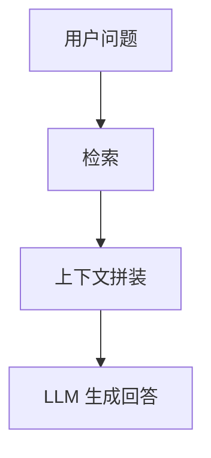
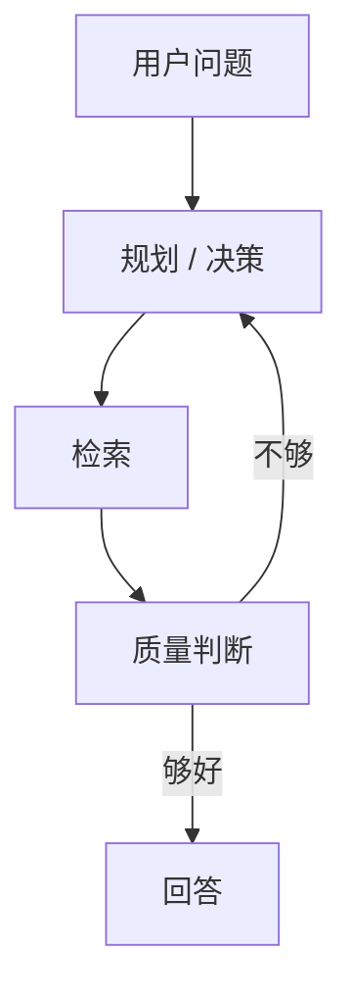

# 10 Agentic RAG 基础知识速览

> **Status:** Reference (background reading, not project design)
**日期：** 2026-06-14  
**用途：** 给方案评审前的统一背景知识。先把术语和范式讲清楚，再回头看具体方案，避免把不同概念混成一团。

---

## 1. 先说结论

如果只记一件事，请记这句：

> **`Agentic RAG` 不是和 `RAG` 完全不同的东西，而是“带决策循环的 RAG”。**

普通 RAG 更像：

- 先搜
- 再答

Agentic RAG 更像：

- 先判断怎么搜
- 去搜
- 看搜得够不够
- 必要时再搜 / 再修正
- 再答

所以：

- `RAG` 是大类
- `Agentic RAG` 是更复杂的 RAG 形态
- `Self-RAG`、`CRAG` 可以理解成 `Agentic RAG` 里的不同具体范式

---

## 2. 什么是 RAG

`RAG` 全称是 `Retrieval-Augmented Generation`，中文常译为“检索增强生成”。

它的基本思想很简单：

1. 用户提问
2. 先从外部知识库检索相关资料
3. 再把检索结果喂给模型
4. 模型基于这些资料生成回答

最经典的流程是：



它解决的是：

- 模型训练知识过时
- 模型参数里没有某些外部知识
- 需要基于私有知识库回答

---

## 3. 什么是 Classic RAG

`Classic RAG` 就是最传统、最直接的 RAG。

典型特点：

- 一个问题通常只发一次检索
- 可能是向量检索，也可能是 BM25 + 向量混合
- 检索完就进入回答
- 整体链路简单、快、可控

优点：

- 实现简单
- 延迟低
- 成本低
- 便于调试

缺点：

- 面对复杂问题时不够灵活
- 如果第一次检索不准，后面基本没有补救能力
- 很难处理“这次到底缺哪类证据”这种问题

适合：

- 简单问答
- 单主题问题
- 已有良好索引和清晰 query 的场景

---

## 4. 什么是 Hybrid RAG / Hybrid Search

`Hybrid` 的意思不是新架构，而是“检索方法混合”。

最常见的是：

- `BM25 / lexical search`
- `vector search`

一起用，再做融合或 rerank。

为什么要混？

- 关键词检索擅长命中术语、书名、固定表达
- 向量检索擅长语义相近、口语化表达

在命理领域：

- 术语性很强
- 同时又有很多生活化问法

所以 hybrid 通常比只用一种检索更稳。

要注意：

> `Hybrid Search` 只是检索层技术，不等于 `Agentic RAG`。

它们是两层不同概念。

---

## 5. 什么是 Agentic RAG

`Agentic RAG` 可以理解成：

> **带决策循环的 RAG。**

它不满足于“搜一次就答”，而是允许系统在回答前或回答中：

- 判断要不要检索
- 判断搜哪个域
- 把复杂问题拆成多个 subqueries
- 选择不同 retrieval tools
- 检索后评估结果是否够好
- 必要时再补检索或修正回答

抽象流程如下：



这就是为什么它叫 `agentic`：

- 它不只是被动生成
- 而是会“想下一步该干什么”

---

## 6. 什么是 Self-RAG

`Self-RAG` 是一篇论文提出的具体范式。  
它更强调两件事：

1. **按需检索**
   - 不是每次都固定检索一堆内容
2. **自反思**
   - 模型会对 retrieved passages 和自己的生成做反思/批判

所以可以把 `Self-RAG` 理解成：

> **更强调“自我判断 + 自我校验”的 Agentic RAG。**

它更像“学术范式名”。

在工程里，别人未必直接说“我们用了 Self-RAG”，  
但如果系统具备：

- 按需检索
- 检索后自评
- 证据不足时再补检索

那它就很有 `Self-RAG` 味道。

---

## 7. 什么是 CRAG

`CRAG` 全称是 `Corrective RAG`。

它的核心思想是：

> **先检查这次检索质量，如果检索结果差，就做补救。**

补救方式可能包括：

- 改 query
- 重检索
- 切换搜索源
- 扩大或缩小范围

所以你可以把 `CRAG` 理解成：

> **更强调“检索质量门控”和“检索纠错”的 Agentic RAG。**

如果说：

- `Self-RAG` 更偏“模型自反思”
- 那 `CRAG` 更偏“检索质量评估 + 补救流程”

---

## 8. 它们之间到底是什么关系

最简单的关系图可以这样看：

```text
RAG
├── Classic RAG
├── Hybrid RAG / Hybrid Search
└── Agentic RAG
    ├── Self-RAG
    ├── CRAG
    └── 其他 query planning / routing / tool-using 检索型 agent
```

这里要注意：

- `Classic RAG` 和 `Agentic RAG` 更像是链路复杂度不同
- `Hybrid Search` 更像是检索实现技术
- `Self-RAG` / `CRAG` 更像是 Agentic RAG 里的具体风格

---

## 9. 为什么现在大家会从 Classic RAG 走向 Agentic RAG

因为很多真实问题不是“搜一下就答”能解决的。

典型复杂点包括：

- 问题本身是对话化、模糊的
- 需要跨多个知识点
- 需要拆成多个证据子问题
- 第一次检索经常不够好
- 不知道这次到底缺哪类知识

所以行业里才会逐步从：

- 一次检索 -> 一次回答

升级到：

- 规划 -> 检索 -> 评估 -> 必要时补检索 -> 回答

但这不意味着所有问题都要走复杂链路。

---

## 10. 为什么不是 every turn 都用 Agentic RAG

因为复杂链路有明显代价：

- 更慢
- 更贵
- 更难调试
- trace 更复杂

所以主流最佳实践通常不是：

- “一律多轮反思”

而是：

- **简单问题走 Classic / Hybrid RAG**
- **复杂问题才升级到 Agentic RAG**

这也是为什么“链路门控”很重要。

---

## 11. 什么是 Retrieval Quality Gate

这是理解 `CRAG` 和复杂 RAG 很关键的一点。

它的意思是：

> **检索完以后，不要立刻相信结果，而是先判断检索质量是否足够支撑当前回答。**

常见要判断的点：

- 命中内容是否够聚焦
- 是否只是泛内容
- 是否遗漏核心依据
- 是否存在冲突证据

如果质量不够，就：

- 重新检索
- 改写 query
- 拆子 query
- 或者收缩结论

这层门是复杂 RAG 和简单 RAG 的一个关键分水岭。

---

## 12. 命理系统为什么天然更适合 Agentic RAG

因为命理问题经常同时具备下面几个特点：

- 领域知识强术语化
- 用户问法又常常很口语
- 很多问题不是缺“答案”，而是缺“依据”
- 常常需要区分：
  - 长期格局判断
  - 短期时机判断
  - 流年应期判断
  - 多领域交叉判断

这意味着：

- `Classic RAG` 可以作为基础
- 但复杂题很容易需要 `Agentic RAG`

尤其当你想做的是：

- 典籍依据更像样
- 模糊问题先补知识再答
- 复杂题不要瞎猜

那 Agentic RAG 会比单轮 RAG 更贴合目标。

---

## 13. 对本项目最有用的认知框架

看回我们这个项目，可以先这样记：

### 当前主线

- `LLM Supervisor + Go Runtime + specialists`

### 当前基础检索层

- 更接近 `Classic / Hybrid RAG`

### 未来增强方向

- 在复杂题上升级到 `Agentic RAG`

### 如果再细分风格

- 强调按需补证据 + 自反思
  - 更像 `Self-RAG`
- 强调检索质量评估 + 补救
  - 更像 `CRAG`

---

## 14. 学完这页后，回看方案时重点看什么

你再去审方案时，重点不是看它名字起得多花，而是看它有没有把下面几件事说清楚：

1. 基础链路是不是 `Classic / Hybrid RAG`
2. 复杂题是不是才升级 `Agentic RAG`
3. 有没有 `Retrieval Quality Gate`
4. 反思是不是条件触发，而不是每轮都反思
5. 模型和程序的控制边界是不是清楚

如果这几件事都清楚，那方案通常就是靠谱的。

---

## 15. 推荐参考

- Microsoft Learn:
  - `RAG in Azure AI Search`
  - `Agentic Retrieval Overview`
  - `Build advanced RAG systems`
- AWS:
  - `Agentic RAG in Amazon Q Business`
- Anthropic:
  - `Building effective agents`
- Papers:
  - `Self-RAG`
  - `CRAG`
