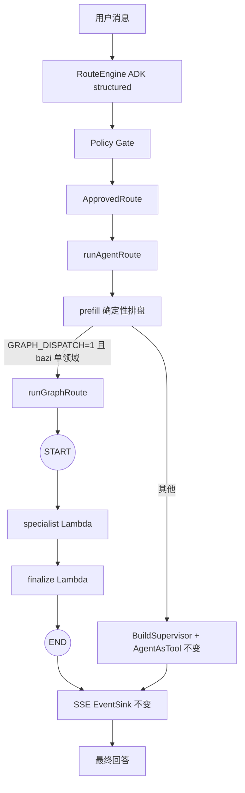
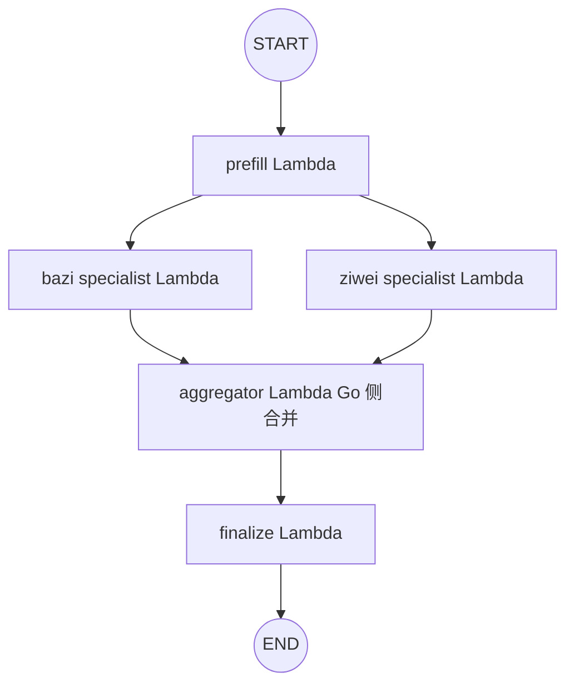
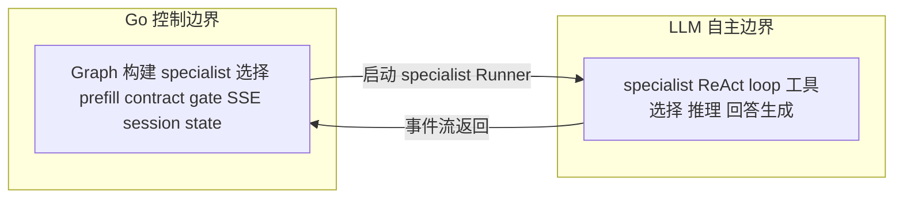
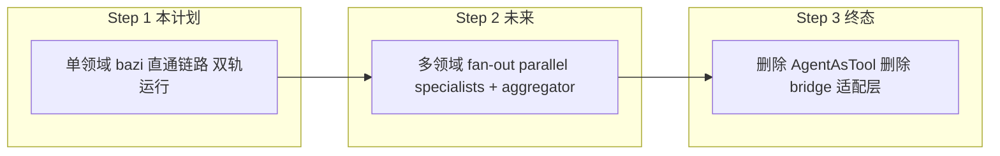

# 11 Graph Dispatch — Architecture Design

> **Status:** Design (pre-implementation)  
> **Parent:** [architecture.md](../../architecture.md) 演进方向  
> **Implementation Plan:** [2026-06-24-agent-graph-dispatch.md](../../superpowers/plans/2026-06-24-agent-graph-dispatch.md)  
> **Date:** 2026-06-24

本文档是 AgentAsTool -> Eino compose.Graph 迁移的正式架构设计。方法论来自 architecture-design skill。

## 1. 自主性级别决策 (L0-L4)

### 当前：dispatch 层是 L3（Orchestrator-Workers）

Supervisor Agent 通过 AgentAsTool 动态决定调哪个 specialist、调几次、何时停止。LLM 的调度决策通过 instruction 中的自然语言约束，无编译期保证。

### 目标：dispatch 层降为 L2（Workflow）

dispatch 决策不需要 LLM 参与。原因：

1. **路由决策已完成** — ApprovedRoute 在 dispatch 之前就已确定 PrimaryDomain + SecondaryDomains，由 RouteEngine 产出
2. **专家集合已确定** — allowedSpecialists() 是 Go 确定性函数，已将可见专家缩减到 1-3 个
3. **单领域占多数流量** — 单领域场景下 len(allowed) == 1，Supervisor LLM 实际上没有选择空间
4. **降级信号明确** — 执行路径可提前描述、错误代价高（错调专家 = 错误命理分析）、需要可预测性

**每个 specialist 内部保持 L4**（Autonomous Agent）— ReAct 循环内的工具选择仍然由 LLM 自主完成，这是价值所在。

**结论：dispatch 层 L3 -> L2，specialist 层保持 L4。** Go 管编排，LLM 管推理。

## 2. 设计模式组合

按 architecture-design skill 的 6 种标准原语分析。迁移前后组合变化：

| 层 | 当前 (AgentAsTool) | 迁移后 (Graph) | 理由 |
|---|---|---|---|
| route 分类 | Routing (ADK structured) | 不变 | 路由决策不在本次迁移范围 |
| dispatch 层 | Orchestrator-Workers (LLM Supervisor) | Prompt Chaining (Go 确定性 pipeline) | 路径已知，可预测性优先 |
| specialist 内部 | Autonomous Agent (ReAct loop) | 不变 | 工具选择的价值在于 LLM 自主性 |
| 多领域 (Step 2) | N/A (LLM 串行调) | Parallelization (graph fan-out) | 子任务真正独立（bazi + ziwei） |

**核心变化：dispatch 层从 Orchestrator-Workers 降为 Prompt Chaining。**

Graph 的 pipeline 结构（Step 1）：

```
START -> [specialist Lambda] -> [finalize Lambda] -> END
         ADK ReAct + 事件桥接    contract gate + 推送
```

每一步之间是代码门控（code gate），不是 LLM 自由跳转。specialist 产出非空文本才进入 finalize。

> **注意：** prefill 当前在 runAgentRoute 中以方法调用完成（非 Graph 节点）。Step 1 保持这种结构——prefill 留在 executor 方法中，Graph 从 specialist 开始。将 prefill 纳入 Graph 节点是 Step 2+ 的优化项。

## 3. 单 Agent vs 多 Agent

按 skill 的决策算法判断：

| 问题 | 单领域 (Step 1) | 多领域 (Step 2) |
|---|---|---|
| 子任务能否独立并行？ | 否（一个 specialist） | 是（bazi + ziwei 无共享状态） |
| 下游是否依赖上游完整历史？ | 是（连贯对话） | 否（各自独立分析） |
| 工作是否在一个上下文窗口内？ | 是 | 否（需隔离） |
| 探索型 vs 连贯生成型？ | 连贯生成 | 探索型 |
| **结论** | **单 Agent** | **多 Agent** |

**Step 1 是单 Agent 场景** — 一个 specialist Lambda 处理完整对话，共享同一上下文窗口。

**Step 2 引入多 Agent** — 多个 specialist Lambda 并行执行，各自独立上下文窗口，Go 侧 aggregator 合并结果。这对应 2026 多 Agent 共识模式（编排器 + 隔离工作者）。

**规则遵循：** 单 Agent baseline 已建立（当前 AgentAsTool 路径），Step 2 扩展为多 Agent 不违反 "先 baseline 再 multi" 原则。

## 4. GoF 设计模式应用

迁移涉及以下设计模式：

### Strategy（策略模式）— 双轨切换

GRAPH_DISPATCH feature flag 在运行时选择 dispatch 策略。两条路径实现同一隐式契约：

```
runAgentRoute(route, st, message) -> (turnType, finalText, error)
```

flag 关 -> 走 AgentAsTool（现有逻辑）；flag 开 -> 走 Graph（新逻辑）。两条路径产出相同的 SSE 事件序列。

**风险：** 两条路径的事件行为可能在边界场景有细微差异（如 thinking 事件的 agent 标签不同）。通过 Step 4 端到端验证覆盖。

### Builder（建造者模式）— 动态 Graph 构建

buildSingleDomainGraph() 每轮根据 ApprovedRoute 动态构建 Graph 拓扑。与 BuildSupervisor() 对称——后者每轮动态构建 supervisor agent。Graph 的节点类型在编译期确定（specialist + finalize），运行期数据通过闭包/入参注入。

### Adapter（适配器模式）— 事件桥接简化

collectSpecialistEvents 是 agentEventBridge (345 行) 的简化适配器：

| agentEventBridge (345 行) | collectSpecialistEvents (~60 行) | 消除原因 |
|---|---|---|
| specialistDone / specialistRunning 标记 | 不需要 | 无 supervisor 混合输出 |
| processedSpecialists 去重 map | 不需要 | 单 agent 无重复 |
| isSpecialistTool 后缀匹配 | 不需要 | 节点类型编译期确定 |
| 流式/非流式双路径 | 统一 | 无 AgentAsTool 转发层 |

### Pipeline（管道模式）— Graph 拓扑

Graph 本身是一个 pipeline：每个阶段转换 input -> output，阶段间有代码门控。这是 Prompt Chaining 的代码实现形式。

### Wrapper / Decorator（包装器）— InvokableLambda

compose.InvokableLambda 包装 specialist ChatModelAgent，透明地添加 SSE 事件桥接和 trace span，不修改 specialist 内部逻辑。specialist 的 ReAct 循环完全无感知。

### Facade（外观模式）— runGraphRoute

runGraphRoute 对外暴露一个方法签名，内部隐藏：Graph 构建 -> specialist 构建 -> Runner 执行 -> 事件收集 -> contract gate -> SSE 推送。调用方（runAgentRoute）只看到一个 return (turnType, text, error)。

## 5. 参考范本

| 本项目场景 | 参考范本 | 关键教训 |
|---|---|---|
| LLM 编排 -> 显式 Graph | LangGraph (Python 生态) | Graph state 作为一等公民；显式边优于隐式工具选择 |
| dispatch 从 LLM 降为 workflow | Anthropic "Building Effective Agents" | 大多数生产 agent 是 L2 + 定向 L3；对 L4 持怀疑态度 |
| 多领域 fan-out (Step 2) | Anthropic Research orchestrator-workers | 编排器规划 + 隔离工作者执行 + 合成结果返回 |
| Go 生态 Graph 框架 | Eino compose.Graph | 本项目唯一可选项；Lambda 节点 + 类型安全边 |

## 6. 架构草图

### Step 1：单领域直通链路



### Step 2（未来）：多领域 fan-out



### 追踪点 (Trace Points)

| 追踪点 | 来源 | span 名称 |
|---|---|---|
| Graph 执行 | runGraphRoute 内 WithEinoCallbackSpan | graph_dispatch |
| Specialist 构建 | Lambda 内部 BuildSpecialist | 复用现有 specialist trace |
| LLM 调用 | Eino ChatModel callback | llm_generate (已有) |
| Contract gate | guardFinalAnswerWithTrace | 复用现有 |
| Final text 推送 | emitEventWithTrace | 复用现有 |

### 状态管理

| 状态 | 归属 | 迁移影响 |
|---|---|---|
| SessionState (profile/命盘) | Go，通过闭包传入 Graph | 不变 |
| SessionValues (prefill 结果) | Go，通过 graphInput.Vals 传入 | 不变 |
| 对话历史 | Go，buildConversationMessages | 不变 |
| Specialist 执行状态 | ADK Runner 内部 | 不变 |

### 权限边界



**不变项：** Go 拥有 session state、tool execution、policy validation、SSE、trace envelope。LLM 只在 specialist 内部拥有工具选择权。

## 7. 影响边界

### 新增文件

| 文件 | 职责 | 行数估算 |
|---|---|---|
| graph_events.go | collectSpecialistEvents — 单 agent 事件桥接 | ~60 |
| graph.go | Graph 类型 + buildSingleDomainGraph + runGraphRoute | ~120 |

### 修改文件

| 文件 | 改动 | 风险 |
|---|---|---|
| executor.go | graphDispatch 字段 + runAgentRoute 双轨分支 | 低（分支隔离） |
| config.go | GraphDispatch 配置项 | 低（getEnvBool 已有） |
| container.go | 注入配置 | 低（一行） |

### 不变文件

| 文件 | 原因 |
|---|---|
| agent_route.go BuildSpecialist | 直接复用，作为 Graph 节点内容 |
| bridge.go | AgentAsTool 路径保留，Step 3 才删除 |
| observability.go | emitEventWithTrace / guardFinalAnswerWithTrace 直接复用 |
| event.go | Event/EventSink 接口不变 |
| RouteEngine / Policy Gate | 不在本次迁移范围 |
| SSE 协议 / 前端 | 事件类型和格式不变 |

### Step 3 预期删除（本次不做）

- bridge.go 中 AgentAsTool 适配逻辑（~265 行）
- BuildSupervisor (agent_route.go:367)
- post-run contract gate（移入 finalize 节点后外层不再需要）

## 8. 故障模式 (Eval 识别)

以下三种故障模式需要在 eval 集中覆盖：

### FM-1: Specialist 静默失败 — Lambda 返回空字符串

**场景：** specialist 的 LLM 调用超时或返回空 content，collectSpecialistEvents 返回空 finalText，finalize 的 contract gate 放行空文本。

**影响：** 用户收到空白回答。

**检测：** finalText 为空且无 error -> 应在 finalize Lambda 中转为明确错误而非静默推送空文本。

**eval 断言：** assert finalText != "" or error != nil

### FM-2: Graph 编译失败 — buildSingleDomainGraph 返回 error

**场景：** Eino compose API 版本不兼容、Lambda 签名错误、AddEdge 失败。

**影响：** dispatch 层不可用。

**降级：** runGraphRoute 返回 error -> runAgentRoute 应 fallback 到 AgentAsTool 路径，而非传播错误给用户。实施计划 Task 3 需确保这个 fallback。

**eval 断言：** assert error 时 fallback 到 AgentAsTool path

### FM-3: 事件顺序错乱 — thinking 事件与 finalize text 事件交织

**场景：** specialist 的 thinking 事件还在 SSE buffer 中，finalize 的 text 事件就发出了。前端先看到完整回答、再看到推理碎片。

**影响：** 前端渲染异常（推理文本闪烁在最终回答之后）。

**检测：** Graph 的 Lambda 执行是同步的（specialist Lambda 完成后才进入 finalize Lambda），所以事件顺序天然保证。但 streaming 模式下 specialist 的 thinking chunk 可能延迟到达。

**eval 断言：** assert all thinking events arrive before text event

## 9. 三步迁移路线总览



| Step | 目标 | 风险 | 前置条件 |
|---|---|---|---|
| 1 | bazi 单领域走 Graph，双轨运行 | 低（feature flag 隔离） | 无 |
| 2 | 多领域并行 fan-out | 中（aggregator 逻辑、事件合并） | Step 1 稳定运行 |
| 3 | 删除 AgentAsTool 全部适配代码 | 中（删除路径不可逆） | Step 1 + 2 全覆盖 |

每一步都满足 architecture-design skill 的升级规则：当前 L 级在 eval 集上达到可靠表现前不升到 L+1。

## 10. 决策记录

| 决策 | 选择 | 理由 |
|---|---|---|
| dispatch 层自主性 | L2 (Workflow) | 路径已知、可预测性优先、错误代价高 |
| specialist 层自主性 | L4 (Autonomous) | 工具选择价值在于 LLM 自主性 |
| Graph vs AgentAsTool | Graph (dispatch) + 保留 AgentAsTool (双轨) | Go 控制 > LLM 隐式决策；双轨降低风险 |
| 单 vs 多 Agent | Step 1 单 Agent；Step 2 多 Agent | 单领域深度优先；多领域真正并行 |
| 事件桥接策略 | 简化为 collectSpecialistEvents | 单 agent 无需去重/标记/后缀匹配 |
| prefill 纳入 Graph | 暂不（Step 1） | prefill 已在 executor 中工作；纳入 Graph 是优化非必需 |

## Related

- [01-overview.md](01-overview.md) — 架构总图、设计原则
- [07-rollout-plan.md](07-rollout-plan.md) — Eino 迁移 track
- [architecture.md](../../architecture.md) 演进方向 — 迁移路线 Step 1-3
- [implementation plan](../../superpowers/plans/2026-06-24-agent-graph-dispatch.md) — Step 1 TDD 执行计划
