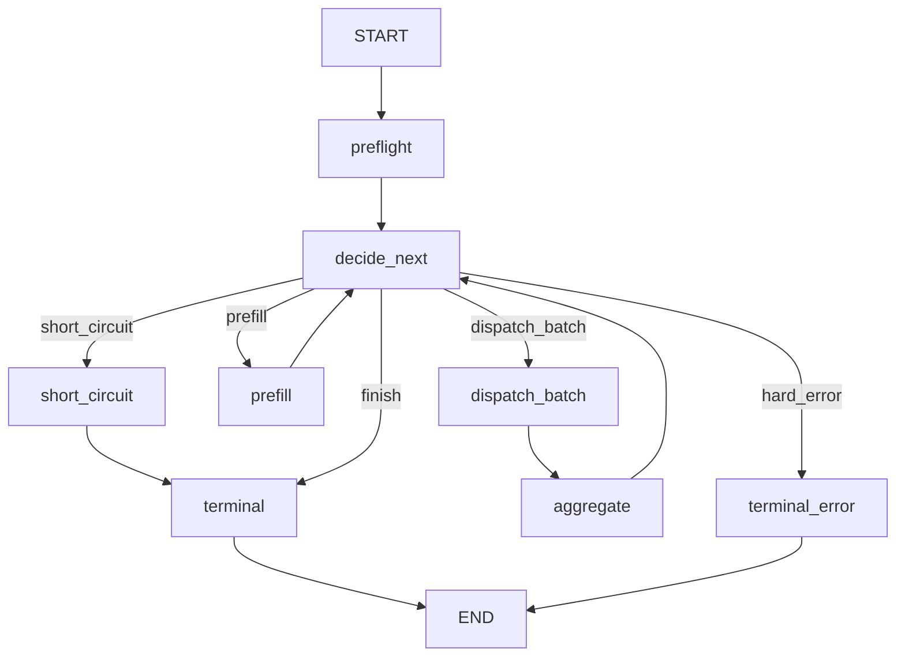
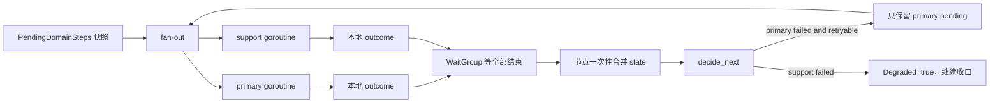
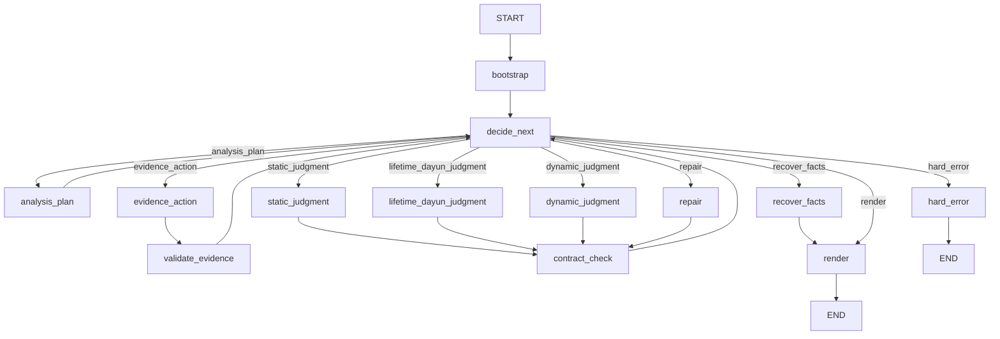
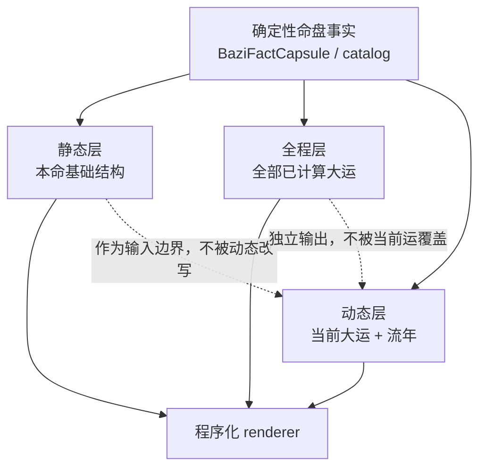
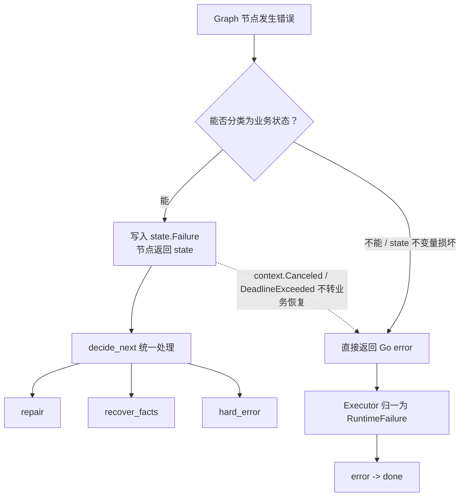
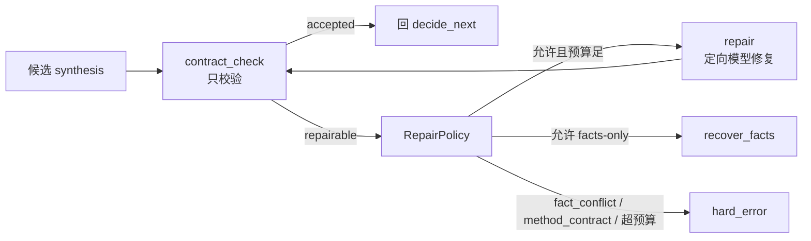
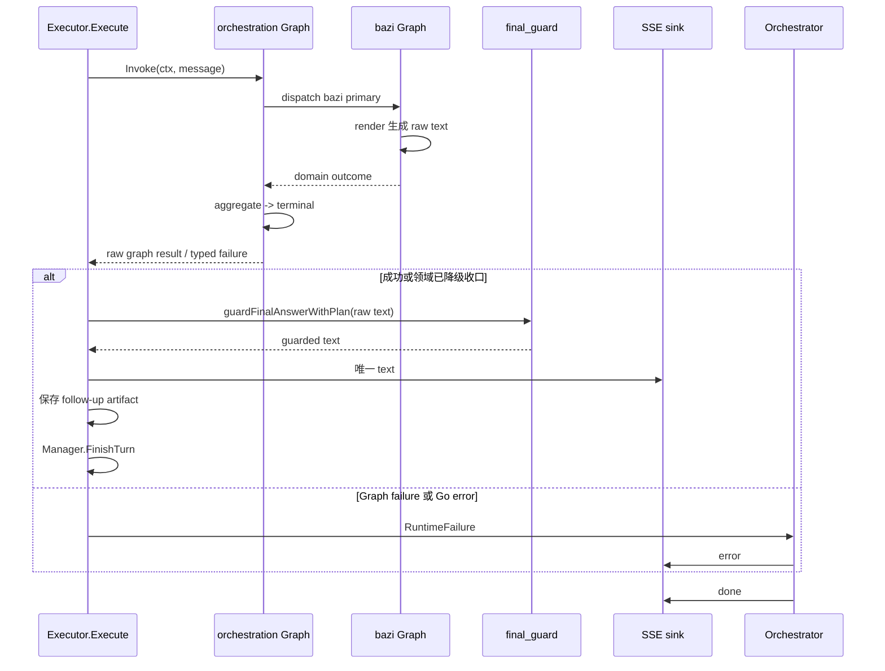
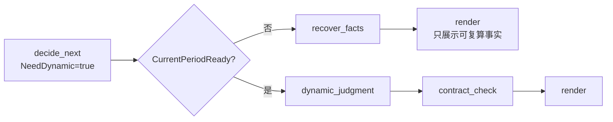

# 八字 Graph 当前流程快照

> **快照日期：2026-08-10**<br>
> 本文描述当前代码已经运行的流程、状态和边界，不记录改造过程，也不描述未来计划。代码变更后，本文需要与 `docs/architecture.md` 和 `PROGRESS.md` 一起复核。

## 1. 先看结论

当前八字请求经过两层确定性有界 Graph：

1. 外层 `orchestration` Graph 负责本轮执行计划、资料准备、领域并行调度、重试、降级和终止。
2. 八字内层 `bazi_deterministic` Graph 负责命盘事实检查、分析计划、证据、静态裁断、全程大运、当前动态、合同校验、repair、facts-only 和领域文本生成。
3. Graph 只生成并返回结果；普通 specialist 结果必须在 `orchestrationGraph.Invoke` 返回后经过 `final_guard`，再由 Executor 发送唯一一次 `text`。preflight 的 `short_circuit` 澄清文本是明确例外：它在 Invoke 后由 Executor 直接发送。失败时仍保持 `error -> done`。

这不是 LLM Controller，也不是完整 ReAct。下一动作由 Graph state 中的确定性状态机选择，LLM 只参与被节点明确授权的规划、检索和裁断。

## 2. 阅读本文前需要知道的 4 个词

| 词 | 在本项目中的含义 |
|---|---|
| Graph | 有节点和边的执行图。这里使用 Eino Graph 的 Pregel 模式，因此允许节点回到 `decide_next` 形成循环。 |
| Node | 一个边界清晰的动作，例如准备资产、调用八字裁断、校验合同或生成文本。节点执行动作，但不越权替别的节点决定流程。 |
| Graph state | Graph 自己拥有的单轮状态，保存动作、预算、候选是否完成、失败和终止信息。它不保存模型 client、Executor 或 SSE sink。 |
| Adapter | 把 runtime 中已有的模型、检索、事件和领域函数接到 Graph 的窄依赖接口上。当前八字 Graph 的拓扑在 specialist 包，领域事实和合同实现仍有一部分在 runtime。 |

## 3. 两层 Graph 总图

```mermaid
flowchart LR
    U["用户问题"] --> RA["RouteAdvisor\n路由决策"]
    RA --> PG["Policy Gate\n白名单与澄清"]
    PG --> M["Manager\n会话与执行计划 owner"]
    M --> EP["ExecutionPlan\n本轮要执行什么"]
    EP --> OG["orchestration\n外层 bounded Graph"]

    OG --> PF["Prefill\n准备精确资产"]
    PF --> DB["dispatch_batch\n并行领域执行"]
    DB --> BG["bazi_deterministic\n八字内层 Graph"]
    DB --> SP["其他 specialist\n或 support 领域"]
    BG --> DO["domain outcome"]
    SP --> DO
    DO --> AG["aggregate\n按 primary/support 汇合"]
    AG --> TER["terminal\nGraph 输出"]
    TER --> INV["Invoke 返回"]
    INV --> FG["final_guard\n最终合同保护"]
    FG --> TXT["发送唯一 text"]
    TXT --> ART["保存 artifact\nFinishTurn"]
    ART --> DONE["Orchestrator 发送 done"]

    OG -. "不可恢复失败" .-> TE["terminal_error"]
    TE --> INVERR["Invoke 返回结构化 failure"]
    INVERR --> ERR["Executor 归一为 RuntimeFailure"]
    ERR --> ERRDONE["error -> done"]
```



上图的 `final_guard` 表示普通领域结果的出口。若 `preflight` 选择 `short_circuit`，Graph 仍先返回给 Executor，但该澄清文本不需要 artifact guard；它也不会在 Graph 节点内提前发送 SSE。

### 3.1 谁拥有哪一段

| 责任 | 当前 owner | 不负责什么 |
|---|---|---|
| 路由用户意图 | RouteAdvisor + Policy Gate | 不执行 specialist，不生成最终命理解读 |
| 生成本轮步骤和资产要求 | Manager | 不在 Graph 内重新猜路由或资产 |
| 选择外层下一动作 | `orchestration` Graph | 不决定八字语义裁断 |
| 选择八字下一动作 | `bazi_deterministic` Graph | 不直接发送最终 SSE `text` |
| 生成命理领域 raw text | 八字内层 `render` 节点 | 不绕过合同校验，不拥有最终答复权 |
| 最终文本保护 | `Executor.Execute` 中的 `guardFinalAnswerWithPlan` | 不重新执行领域 Graph |
| `text` / `error` / `done` wire 合同 | Orchestrator + SSE writer | 不改变 Graph 的领域状态机 |

## 4. 外层 `orchestration` Graph

外层 Graph 是 Manager 执行计划的运行壳。它不直接决定“命局是什么”，只保证计划内的资产和领域步骤按照有限预算完成。

### 4.1 当前拓扑



编译时的固定参数：

- Eino Graph，`compose.AnyPredecessor`，即允许循环回到 `decide_next`。
- `compose.WithMaxRunSteps(16)`。
- Graph name 为 `orchestration`，用于保持已有 trace 查询兼容。
- Graph 只保存单轮内存状态，不接入 checkpoint。

对应代码：

- 编译和节点注册：`backend/internal/runtime/orchestration_graph.go`
- 动作选择、分支、终态和汇合：`backend/internal/runtime/orchestration_graph_loop.go`
- state、context carrier 和结果 side channel：`backend/internal/runtime/orchestration_state.go`
- action 与 failure 合同：`backend/internal/runtime/graph_loop_contracts.go`

### 4.2 外层 state

外层 state 类型是 `orchestrationGraphState`。字段可按生命周期分成 5 组：

| 组 | 字段 | 用途 |
|---|---|---|
| 循环控制 | `NextAction`、`LoopStep`、`MaxRunSteps` | 记录当前要走的边、已走决策步数和上限 |
| 输入与计划 | `PreflightResult`、`Route`、`Plan`、`DynamicFacts` | 保存前置结果、当前有效路由、Manager 计划和本轮确定性动态资料能力 |
| 执行中间态 | `PendingDomainSteps`、`DomainOutcomes`、`AggregatedResult`、`RawFinalText` | 记录未完成领域、各领域结果、汇合结果和 raw 文本 |
| 预算与降级 | `PrefillAttempts`、`DispatchAttempts`、`PrefillCompleted`、`Degraded` | 控制资料准备/主领域执行重试，记录 support 降级 |
| 终止 | `Failure`、`TerminationReason`、`TurnType` | 保存结构化失败、结束原因和本轮类型 |

`Failure` 是可描述的结构，不是 Go `error` 接口：

```text
FailureClass
FailureStage
FailureCode
Domain
Retryable
Degraded
Message
MissingRefs / AllowedRefs
```

不可放入 Graph state 的内容通过 context 注入：

```text
orchestrationInit:
    SessionState、Route、ExecutionPlan、UserMsg、SessionValues

orchestrationRuntime:
    EventSink、Executor、Router
```

这样做的边界是：Graph 可以恢复业务状态，但不会把运行时指针当成可恢复数据。

### 4.3 外层节点职责

| 节点 | 做什么 | 明确不做什么 |
|---|---|---|
| `preflight` | 按 Manager 已生成的 `ExecutionPlan` 做澄清、资料完整度和 guided fallback 检查；只写 `PreflightResult`。 | 不直接修改 session，不直接决定下一节点。 |
| `decide_next` | 读取 state、预算和失败，唯一选择下一动作，并写 trace。 | 不调用 specialist，不生成命理解读。 |
| `short_circuit` | 缓存 preflight 的澄清或资料提示文本，写 `short_circuit` 终止原因。 | 不发送 SSE，不经过普通 specialist 流程。 |
| `prefill` | 按当前有效计划准备命盘等精确资产，校验 owner、subject 和历法规则；失败写结构化 failure。 | 不让 worker 猜测缺失资产，不在节点内自行结束 Graph。 |
| `dispatch_batch` | 只执行当前 `PendingDomainSteps`，并行收集每个领域的本地 outcome，再一次性写回 state。 | 不决定重试次数，不因单个 worker 失败直接返回业务终态。 |
| `aggregate` | 按 `primary/support` 角色做一次 fan-in，附加 `DynamicFacts`，必要时调用 Manager 的 compose。 | 不再次执行领域，不把 support 文本按数组顺序当成主线。 |
| `terminal` | 把 Graph 结果复制到 Invoke 后的结果 side channel。 | 不调用 `final_guard`，不发送最终 `text`，不保存 artifact。 |
| `terminal_error` | 保存最后的结构化 failure 和终止原因。 | 不把失败候选文本作为答案返回。 |

### 4.4 `decide_next` 的固定顺序

`decide_next` 先增加 `LoopStep`。如果达到 16 步：有安全 primary/raw 结果就以 `graph_step_limit_degraded` 收口，否则写 `ORCHESTRATION_MAX_STEPS` 并进入 `terminal_error`。

未达到上限时，动作判断按以下顺序执行：

| 顺序 | 状态条件 | 下一动作 | 说明 |
|---:|---|---|---|
| 1 | 已有 support 失败 | 继续后续判断，并把 `Degraded=true` | support 失败不会覆盖成功的 primary |
| 2 | `PreflightResult.ShortCircuit`，且尚未 prefill、没有领域结果 | `short_circuit` | 澄清和资料收集在 Graph 内正常终止 |
| 3 | prefill 阶段失败、可重试、`PrefillAttempts < 2` | `prefill` | 最多一次回环重试 |
| 4 | primary 失败、可重试、`DispatchAttempts < 2` | `dispatch_batch` | 只保留失败 primary 为 pending |
| 5 | 没有 primary 失败，但 support 失败 | `finish` | 清掉 support failure，保留 degraded 结果 |
| 6 | 其他已分类 failure | `hard_error` | 不把不可安全展示的结果硬拼出来 |
| 7 | 资产尚未准备完成 | `prefill` | 计划先于 specialist |
| 8 | `PendingDomainSteps` 非空 | `dispatch_batch` | 只执行尚未成功的领域 |
| 9 | 有 raw 文本或安全 primary 结果 | `finish` | 进入正常终态 |
| 10 | 没有任何安全结果 | `hard_error` | 写 `ORCHESTRATION_NO_RESULT` |

guided fallback 是外层的特殊边界：如果 preflight 接受了切换到奇门，`prefill` 会重建有效 `ExecutionPlan`，同时替换 `Route` 和 `PendingDomainSteps`。因此 dispatch 和 final guard 使用的是同一份终态计划。

### 4.5 外层并行和重试



执行规则：

- 每个 goroutine 只写自己的局部 `executionStepOutcome`；等待全部结束后才合并 Graph state。
- `DomainSteps` 必须有且只有一个 `primary`，领域不能重复。
- 成功领域从 `PendingDomainSteps` 移除；下一轮不会重复执行成功 domain。
- primary 失败保留 pending，最多按外层 dispatch 预算重跑一次。
- support 失败标记 degraded，不阻断已有 primary。
- `context.Canceled` 和 `context.DeadlineExceeded` 不转换为业务 retry，而是直接沿 Go error 出口返回。

## 5. 八字内层 `bazi_deterministic` Graph

八字内层 Graph 是领域执行的状态机。它接收已由外层准备好的命盘资产，并把“事实、模型候选、合同和恢复”分开。

### 5.1 当前拓扑



编译时的固定参数：

- Eino Graph，`compose.AnyPredecessor`，允许动作完成后回到 `decide_next`。
- `MaxRunSteps = 24`，编译时传入 `compose.WithMaxRunSteps(24)`。
- Graph name 为 `bazi_deterministic`，保持 trace 和测试兼容。
- Graph 的公开控制类型在 `backend/internal/specialists/bazi/graph/graph.go`；runtime 通过 adapter 接入当前领域实现。

### 5.2 八字动作集合

```text
analysis_plan
evidence_action
static_judgment
lifetime_dayun_judgment
dynamic_judgment
repair
recover_facts
render
hard_error
```

### 5.3 八字 state 的两层结构

当前实现有意把“Graph 控制状态”和“runtime 领域 payload”分开。两者都属于本轮内存，但职责不同。

#### A. Graph 控制 state：`specialists/bazi/graph.State`

| 组 | 字段 | 作用 |
|---|---|---|
| 控制 | `Phase`、`NextAction`、`LoopStep`、`MaxRunSteps` | 选择下一动作和限制循环 |
| 输入状态 | `ChartReady`、`AnalysisPlanned`、`NeedDynamic`、`NeedLifetimeDayun`、`CurrentPeriodReady` | 表示前置事实、计划和当前大运引用是否就绪 |
| 完成状态 | `EvidenceValidated`、`EvidenceNeedsAction`、`StaticAttempted/Accepted`、`LifetimeAttempted/Accepted`、`DynamicAttempted/Accepted` | 防止遗漏阶段或重复执行已完成阶段 |
| 失败与恢复 | `Failure`、`RecoveryPolicy`、`RepairState`、`RepairFailure`、`RepairAction` | 让合同门后的恢复成为显式动作 |
| 预算 | `EvidenceAttempts`、`TransportAttempts`、`RepairAttempts` | 分开记录证据、传输和业务 repair |
| 终态 | `RecoveryState`、`TerminationReason`、`Output` | 供 render、hard error 和外层读取 |
| 领域载体 | `Payload` | 指向 runtime 的 `baziInternalGraphState`；不参与动作选择，JSON 中排除 |

#### B. runtime 领域 payload：`baziInternalGraphState`

它保存具体八字流程需要的内容：

```text
Question
ChartState / ChartInput
FactCapsule
RuntimeCatalog
Canonical
StaticCandidate / LifetimeCandidate / DynamicCandidate
AcceptedStatic / AcceptedDynamic
FailureStage / RecoveryCode / FailureClass / RecoveryPolicy
RepairFeedback / BranchPath
Output
各阶段 attempted / accepted 标志与预算
```

`bazi_graph_adapter.go` 在每个节点调用前，把 Graph control fields 同步进 payload；节点完成后，再把 `ChartReady`、计划标志、accepted 标志、failure、预算和输出投影回 Graph state。候选文本、catalog allow-list 和语义校验仍由 runtime payload 维护；事实胶囊、年龄授权和引用目录 DTO 由无 runtime 依赖的 `specialists/bazi/domain` 负责，payload 只保存适配结果。

因此，当前事实不是“所有八字语义代码都已经搬进 `specialists/bazi/graph`”，而是：

- Graph 拓扑、动作选择、上限和终止已经在 specialist 包；
- runtime 负责窄适配；
- 八字事实胶囊、年龄授权和引用目录 DTO 已位于 `backend/internal/specialists/bazi/domain/`；catalog allow-list、projection、合同、recovery 和 renderer 的实际实现仍有一部分位于 `backend/internal/runtime/`。

### 5.4 八字 `decide_next` 的固定顺序

`decide_next` 在决定动作前先增加 `LoopStep`。达到 24 步时：

- 如果已有安全静态结果，且动态尚未接受，进入 `recover_facts`，以 `graph_step_limit_degraded` 收口；
- 如果静态也没有安全结果，进入 `hard_error`，写 `BAZI_MAX_STEPS`。

正常判断顺序如下：

| 顺序 | 状态条件 | 下一动作 | 边界 |
|---:|---|---|---|
| 1 | 已有 failure | 先交给 `RepairPolicy`；可 repair 则 `repair`，允许 fallback 则 `recover_facts`，否则 `hard_error` | `fact_conflict`、`method_contract` 不调用模型 repair |
| 2 | 没有命盘事实 | `hard_error` | `BAZI_CHART_MISSING`，不允许模型补盘 |
| 3 | 没有分析计划 | `analysis_plan` | planner 失败时仍有确定性默认计划 |
| 4 | 证据需要动作 | `evidence_action` | 首次规划/检索，必要时一次定向缺口补检 |
| 5 | 静态尚未尝试 | `static_judgment` | 静态裁断必须先于动态 |
| 6 | 需要全程大运且尚未尝试 | `lifetime_dayun_judgment` | 全程运路有独立输出，不写入静态或当前动态字段 |
| 7 | 需要全程大运但未接受 | `hard_error` | 不能把未通过合同的全程运路当成完整结果 |
| 8 | 需要动态且当前大运已绑定 | `dynamic_judgment` | 模型只能引用 runtime 已绑定的 `current_period_ref` |
| 9 | 需要动态但当前大运未绑定 | `recover_facts` | 不调用动态模型，避免伪造某个 `dayun[n]` |
| 10 | 动态已尝试但未接受 | `recover_facts` | 按动态 facts-only 或现有 recovery policy 收口 |
| 11 | 所有必需阶段已接受 | `render` | 只渲染已验证投影 |

### 5.5 节点职责和数据边界

| 节点 | 输入与动作 | 成功后状态 | 失败后的处理 |
|---|---|---|---|
| `bootstrap` | 检查 session 是否有 `BaziResult`；建立 `ChartState`、`FactCapsule` 和 `RuntimeCatalog`。 | `ChartReady=true`。 | 缺失命盘写 `artifact_missing / BAZI_CHART_MISSING`，转 `hard_error`。 |
| `analysis_plan` | 调用分析规划器，规范化 `Mode`、`NeedDynamic`、`NeedLifetimeDayun`、重点主题和 writer template。 | `AnalysisPlanned=true`。 | planner 调用失败使用确定性默认计划，不在这里直接终止。 |
| `evidence_action` | 首次执行 evidence plan + 检索；第二次只针对缺失或冲突的 A 级主题补检，并合并 bundle。 | 更新 `EvidenceAttempts`、`EvidencePlan`、`EvidenceQuality`。 | 记录 failure，交回 `decide_next`。 |
| `validate_evidence` | 单独检查证据前置条件。 | `EvidenceValidated=true`，保留缺口和冲突分数。 | 只写 failure，不直接选择 repair。 |
| `static_judgment` | 进行唯一静态模型裁断，再投影到静态 synthesis。 | 生成 `StaticCandidate`。 | 进入 `contract_check`，合同失败写 failure。 |
| `lifetime_dayun_judgment` | 对全部已计算大运生成全程运路 synthesis。 | `LifetimeCandidate`，只包含逐运/全程结果。 | 进入同一合同门；未接受不能伪装成完整结果。 |
| `dynamic_judgment` | 只处理当前已绑定大运和目标流年；没有合法 `current_period_ref` 时不调用模型。 | 生成 `DynamicCandidate` 或确定性动态 facts-only。 | 合同失败由 policy 决定 repair、facts-only 或 hard error。 |
| `contract_check` | 根据当前 `Phase` 校验静态、全程或动态 projection；不调用模型。 | 标记对应 `Accepted`，清理 failure。 | 只写结构化 failure，动作由 `decide_next` 重新选择。 |
| `repair` | 先调用 `RepairPolicy`，再记录 `RecordRepairAttempt`，只对允许的合同错误调用定向模型 repair。 | 新候选回到 `contract_check`。 | repair 失败仍回合同门，由 policy 决定 fallback 或 hard error。 |
| `recover_facts` | 只应用已经批准的 deterministic facts-only fallback，丢弃被拒绝的候选文本。 | 标记 degraded recovery，并转 `render`。 | 没有允许的 fallback 时改为 `hard_error`。 |
| `render` | 合并 field audit，发 thinking/reasoning 和 trace，调用程序化 BaZi renderer 生成 `Output`。 | `TerminationReason=completed`（若未提前设置）。 | final writer 合同失败写 failure，最终转 hard error。 |
| `hard_error` | 标记 `hard_error` 和 recovery state。 | Graph 结束，返回 typed failure。 | 不暴露被拒绝的模型文本。 |

## 6. 八字三层结果不能互相改写

当前八字流程把以下三层分开：



- **静态层**回答本命底色、格局、强弱、调候和基础层次。它不能使用动态关系把原局事实改写成岁运事实。
- **全程层**由 `lifetime_dayun_judgment` 负责全部已计算大运的补、助、损、破和轨迹。它不是当前动态，也不覆盖静态层。
- **动态层**只回答当前已绑定大运和目标流年。模型必须使用 runtime 绑定的 `current_period_ref`；不能把全量大运目录数组位置当成当前运，也不能凭空补算流月。
- 如果尚未交入第一步大运，动态节点直接生成 facts-only；这不是静态失败，也不是把静态层降级，而是动态资料边界收口。
- 最终 renderer 只展示已通过投影和合同校验的三层字段，不重新裁断。

## 7. 合同、repair、facts-only 和 hard error

### 7.1 两种错误出口



**写入 state、不立即返回 Go error**的典型情况：

- transport transient、schema/parse、projection mismatch；
- evidence overclaim、domain unauthorized；
- specialist primary/support failure；
- 缺失资产或当前动态事实不可用；
- 合同校验失败且已有明确 recovery policy。

**直接返回 Go error**的范围：

- `context.Canceled` 或 `context.DeadlineExceeded`；
- Graph state 为 nil、payload 类型错误、依赖不完整；
- Graph 编译/Invoke 失败；
- 无法分类的基础设施错误或状态机不变量损坏。

### 7.2 合同门和 repair 的责任分割



约束：

- `contract_check` 不调用模型，只把发现写成机器可读 failure。
- `repair` 是唯一允许调用 business repair model 的节点。
- `fact_conflict` 和 `method_contract` 不得调用模型 repair。
- transport retry 与 business repair 分开计数；不能用一次 transport 重试冒充一次业务修复。
- 单阶段 repair 受 `RepairPolicy` 和共享 `internal/repair/` 状态限制；每次 attempt 都要经过 `RecordRepairAttempt`。
- facts-only 只使用确定性事实和已批准边界；候选模型文本被丢弃，不能把“部分模型成功”当成成功状态。

### 7.3 外层和内层失败的关系

八字内层先把自己的 failure 变成 typed `BaziGraphResult`。只有到 runtime adapter 的边界，才转换为外层可识别的 `graphFailure`；外层再决定 primary 是否重试。

```text
bazi node failure
    -> bazi State.Failure
    -> repair / recover_facts / hard_error
    -> BaziGraphResult
    -> baziGraphTerminalText / specialist outcome
    -> orchestration DomainOutcome
    -> outer decide_next
```

这意味着：

- 八字合同 repair 不等于外层 dispatch retry；
- 八字 facts-only 是领域内已安全收口的结果，外层通常把它当作 primary 成功结果；
- 八字 hard error 会让 primary outcome 失败，外层可按 `Retryable` 决定有限重试，超过预算后终止。

## 8. 最终文本和 SSE 边界

下面的时序图展示普通 specialist 结果路径；`short_circuit` 走同一个 Invoke 返回边界，但跳过 `final_guard`，直接由 Executor 发送 preflight 文本。



必须区分 5 个“结果”概念：

1. 八字 `render` 的 `Output`：领域内部生成的 raw text。
2. 外层 `aggregate` 的 `RawFinalText`：把领域 outcome 汇合成外层可用结果；单域八字不再次 compose 同一段文本。
3. 外层 `terminal` 的结果 side channel：把 Graph state 交给 `Executor.Execute`。
4. `final_guard` 的 guarded text：最终合同保护后的文本。
5. SSE `text`：只有 Executor 在 Graph 返回后发送的用户可见事件；普通结果是 guarded text，short-circuit 是 preflight text。

Graph 内可以继续发 thinking、reasoning、tool 状态和 trace；这些不等于最终 `text`。Orchestrator 无论正常还是失败，最后都发送 `done`；失败顺序固定为 `error -> done`。

## 9. 完整案例：已有命盘，要求本命 + 全程大运 + 当前流年

### 9.1 用户问题

```text
用户：请先判断我的命格基础层次，再结合全部大运，重点看当前大运和 2026 流年。
```

假设 session 已有完整八字资产，且本轮路由为 `bazi primary`，计划明确包含时间范围。这个问题同时要求：

- 静态本命层；
- 全程大运层；
- 当前大运和流年动态层。

因此分析计划通常会得到 `NeedDynamic=true`、`NeedLifetimeDayun=true`。如果 planner 不可用，代码的确定性默认计划也包含这两个阶段。

### 9.2 从入口到终点

```mermaid
flowchart TD
    Q["用户问题\n本命 + 全部大运 + 2026流年"]
    Q --> PLAN["Manager 生成 ExecutionPlan\nbazi primary\nchart + dynamic facts"]
    PLAN --> OPF["外层 preflight\n资料已齐，不短路"]
    OPF --> ODN1["外层 decide_next\n未 prefill -> prefill"]
    ODN1 --> PREF["prefill\n校验命盘 owner/subject/rule"]
    PREF --> ODN2["外层 decide_next\npending bazi -> dispatch"]
    ODN2 --> DIS["dispatch_batch\n执行 bazi primary"]
    DIS --> BB["bootstrap\nChartReady=true"]
    BB --> BD1["decide_next\nanalysis_plan"]
    BD1 --> AP["analysis_plan\nNeedDynamic=true\nNeedLifetimeDayun=true"]
    AP --> BD2["decide_next\nevidence_action"]
    BD2 --> EV["evidence_action\n首次检索 A 级主题"]
    EV --> V["validate_evidence"]
    V --> BD3["decide_next\nstatic_judgment"]
    BD3 --> ST["static_judgment\n生成本命候选"]
    ST --> C1["contract_check"]
    C1 --> BD4["decide_next\nstatic accepted"]
    BD4 --> LD["lifetime_dayun_judgment\n生成全部大运结果"]
    LD --> C2["contract_check"]
    C2 --> BD5["decide_next\nlifetime accepted"]
    BD5 --> DY["dynamic_judgment\n当前大运 + 2026流年"]
    DY --> C3["contract_check"]
    C3 --> BD6["decide_next\n全部接受 -> render"]
    BD6 --> R["render\n程序化生成八字 raw text"]
    R --> OUT["bazi outcome"]
    OUT --> OA["outer aggregate\n单域八字不重复 compose"]
    OA --> OT["outer terminal"]
    OT --> FG["Invoke 后 final_guard"]
    FG --> TEXT["唯一 text"]
    TEXT --> DONE["artifact + FinishTurn + done"]
```



### 9.3 关键 state 如何变化

| 时点 | 关键状态 | 发生了什么 |
|---|---|---|
| 外层启动 | `PendingDomainSteps=[bazi:primary]`、`PrefillCompleted=false` | Manager 的计划进入 Graph，Graph 尚未执行领域。 |
| prefill 成功 | `PrefillCompleted=true`、`DynamicFacts` 已投影 | 资产满足精确要求，动态能力是否 ready 也被显式记录。 |
| bootstrap 后 | `ChartReady=true`、`FactCapsule`、`RuntimeCatalog` 就绪 | 后续模型只能看到 runtime 允许的事实和引用范围。 |
| analysis plan 后 | `AnalysisPlanned=true`、两个 `Need*` 标志确定 | `decide_next` 不再凭问题文本猜阶段。 |
| evidence 后 | `EvidenceValidated=true` | 证据缺口由质量字段表达；若仍需补检，按预算回到 evidence。 |
| static 合同通过 | `StaticAccepted=true` | 本命候选才成为可渲染静态层。 |
| lifetime 合同通过 | `LifetimeAccepted=true` | 全程运路成为独立可渲染层，不改静态层。 |
| dynamic 合同通过 | `DynamicAccepted=true` | 当前大运和 2026 流年只在绑定 period 范围内生效。 |
| render 完成 | `Output` 非空、`TerminationReason=completed` | 内层返回 raw text，不发送最终 SSE text。 |
| outer terminal 后 | `RawFinalText`、`AggregatedResult` 就绪 | 外层结果交回 Executor。 |
| final guard 后 | `guardedText` | 只有这份文本写入 SSE `text` 和 follow-up artifact。 |

### 9.4 证据补检分支

如果第一次 `evidence_action` 后 `EvidenceQuality` 发现 A 级主题缺失：

```text
evidence_action #1
    -> validate_evidence
    -> decide_next 发现 missing_topics
    -> evidence_action #2（只查询缺失主题）
    -> validate_evidence
    -> decide_next
```

第二次仍不完整时，不会无限检索。后续合同门根据缺口和 recovery policy：

- 允许保守 facts-only：进入 `recover_facts -> render`；
- 事实/方法冲突：进入 `hard_error`；
- 可修复的合同错误：进入 `repair -> contract_check`，而不是重新跑整个流程。

### 9.5 尚未交入第一步大运的分支

同一个问题如果出生时刻早于第一步大运交运日，`CurrentPeriodReady=false`：



这条路径不表示静态层失败，也不把全量大运目录冒充当前运；它只表示动态模型没有合法的当前 period 引用。

## 10. Trace 如何阅读这条流程

排障时按“外层动作 → 内层动作 → 合同 failure → 最终收口”顺序看，不要先从最终中文文本反推 Graph 状态。

### 10.1 外层字段

```text
orchestration.loop_step
orchestration.next_action
orchestration.max_run_steps
orchestration.termination_reason
orchestration.failure_code
```

重点看：

- 是否真的从 `prefill` 回到 `decide_next`；
- 是否只重跑失败 primary；
- support 失败是否只是 `Degraded`；
- 是否因 `ORCHESTRATION_MAX_STEPS` 或 `ORCHESTRATION_NO_RESULT` 结束。

### 10.2 八字字段

```text
bazi.loop_step
bazi.next_action
bazi.max_run_steps
bazi.evidence_attempts
bazi.transport_attempts
bazi.repair_attempts
bazi.termination_reason
bazi.internal_graph.node
bazi.internal_graph.path
bazi.internal_graph.recovery_state
```

合同和输出来源重点看：

```text
bazi.contract.failure_class
bazi.contract.recovery_policy
bazi.contract.finding_code
bazi.static.source
bazi.dynamic.source
bazi.dynamic.current_period_ref
bazi.dynamic.current_period_realization
bazi.final.audit_result
repair.attempt
repair.action
```

常见判断：

| trace 现象 | 含义 |
|---|---|
| `bazi.next_action=repair` | 合同门发现可修复问题，已进入业务 repair，不代表已经重试成功。 |
| `repair.attempt` 有值且之后回到 `contract_check` | 发生过实际 repair；是否接受要看下一次合同结果。 |
| `bazi.dynamic.source=facts_only_degraded` | 动态层只展示确定性事实，不能当成动态模型成功。 |
| `bazi.termination_reason=hard_error` | 内层没有安全结果或不可修复，不应继续向 renderer 传候选文本。 |
| 外层 `Degraded=true` 但有 primary outcome | support 降级，主线仍可返回。 |
| SSE 有 `error` 后有 `done` | 这是稳定失败合同；不能因为 Graph 内节点没有直接返回 Go error 就认为成功。 |

## 11. 当前代码地图

| 代码位置 | 当前功能 |
|---|---|
| `backend/internal/runtime/executor_entry.go` | `Executor.Execute` 入口；创建计划、注入 context、调用外层 Graph、执行 final guard、保存 artifact 和结束 turn。 |
| `backend/internal/runtime/orchestration_graph.go` | 外层 Graph 的节点注册、边、分支和编译参数。 |
| `backend/internal/runtime/orchestration_graph_loop.go` | 外层 `decide_next`、short circuit、dispatch、aggregate、terminal 和错误分支。 |
| `backend/internal/runtime/orchestration_state.go` | 外层 Graph state、请求 context carrier 和 Invoke 后结果 side channel。 |
| `backend/internal/runtime/graph_loop_contracts.go` | 外层 action、failure、16 步上限和取消错误边界。 |
| `backend/internal/runtime/execution_dispatch.go` | primary/support 角色校验、并行 worker、outcome 和 fan-out/fan-in 的底层执行。 |
| `backend/internal/specialists/bazi/graph/graph.go` | 八字 Graph 的 action、state、Deps、拓扑、分支、24 步上限和终态包装；不依赖 runtime。 |
| `backend/internal/specialists/bazi/domain/` | 确定性事实胶囊、可读事实视图、年龄授权范围和引用目录 DTO；不依赖 runtime、模型客户端或 SSE。 |
| `backend/internal/runtime/bazi_graph_adapter.go` | 把 runtime 节点适配为 specialist Graph 的 `Deps`，同步 control state 与 payload。 |
| `backend/internal/runtime/bazi_graph_loop.go` | evidence、evidence validation、contract check、全程大运、repair、facts-only、typed result 等循环动作实现。 |
| `backend/internal/runtime/bazi_internal_graph.go` | bootstrap、analysis plan、静态/动态模型节点、render、failure 记录和领域 payload。 |
| `backend/internal/runtime/bazi_graph_entry.go` | 八字内图选择、外层调用入口和领域失败归一；保留 Manager/Executor 的调用合同。 |
| `backend/internal/runtime/bazi_charter_graph.go` | 补证触发、trace 审计、阶段事件和 final writer 适配。 |
| `backend/internal/runtime/bazi_contract_validation.go` | 静态/动态投影、证据边界和年龄授权合同校验。 |
| `backend/internal/runtime/bazi_final_contract.go` | 最终 writer 的标题顺序、结构和边界保留合同校验。 |
| `backend/internal/runtime/bazi_model_runtime.go` | 分析规划、阶段提示构建和内层 agent 的文本/JSON 适配。 |
| `backend/internal/runtime/bazi_final_renderer.go` 及 `bazi_final_renderer_{templates,facts,sections,topic,markdown}.go` | 把已接受的静态、全程和动态投影转成程序化中文文本，不负责重新裁断。 |
| `backend/internal/repair/` | repair class、policy、attempt 和共享预算。 |
| `backend/internal/orchestrator/orchestrator.go` | 把 runtime 返回的错误转为 SSE `error`，并保证最后发送 `done`。 |

## 12. 当前明确不属于 Graph 的内容

- `RouteAdvisor` 的路由决策不移入 Graph。
- Manager 的会话 owner、`ExecutionPlan` 构建和 `FinishTurn` 不移入八字 Graph。
- checkpoint、跨轮恢复和持久化 Graph state 当前未接入。
- 不新增 LLM Controller，不把确定性 action selector 改成 ReAct。
- 八字 Graph 不拥有最终答复权；`render` 的输出仍需经过外层终态和 Executor 的 final guard。
- 流月等尚未有确定性资料时，不由模型补算；只能按 `unavailable` / `degraded` 合同说明。
- 普通命理质量分歧不写成命盘专项分支，进入 eval fixture 和 trace 复核。

## 13. 最小验证入口

验证 Graph 结构和关键状态迁移：

```bash
go test ./backend/internal/specialists/bazi/graph ./backend/internal/runtime -count=1
```

验证完整后端编译和回归：

```bash
go test ./backend/... -count=1
go build ./backend/cmd/server/
make eval-bazi-quality
make eval-bazi-answer-quality
```

真实运行时，应同时检查：

1. Graph trace 是否出现 `loop_step`、`next_action`、`termination_reason`。
2. 正常路径是否只有一条最终 `text`，随后 `done`。
3. 失败路径是否为 `error -> done`，没有把候选文本继续发出。
4. facts-only 是否有明确 source/recovery state，而不是伪装成完整模型解读。
