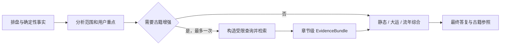

# 八字古籍证据增强收敛方案

## 目标

将古籍检索收敛为八字领域的一次可选证据增强：它向领域模型提供可追溯的原文材料，可以影响模型对命理解释的取舍；它不改变排盘事实，也不以空结果、超时或服务故障决定结论状态。

本轮只处理八字领域内的检索时机、材料质量和传递范围。不修改 HTTP、SSE、`tools/runner.go`、奇门或紫微。

## 已验证现状

2026-08-15 直接调用 `GET /api/wiki/retrieve` 得到：

| 查询 | 观察 | 结论 |
|---|---|---|
| `八字 格局 调候 大运 流年` | 命中书籍总目录、泛案例和现代解释 | 泛查询不适合作为模型证据 |
| `穷通宝鉴 丙火 亥月 调候` | 能定位典籍，但首项仍可能是书籍入口 | 需按章节或原文片段返回 |
| `子平真诠 月令 取格` | 能命中相应章节 | 典籍名加主题可稳定收窄 |
| `丙火生于亥月` | 无关案例可排在前面 | 仅命盘事实不足以约束来源 |

当前后端只把检索 API 的 `snippet` 映射为 `Passage.Content`。书籍入口页的短摘要会占用模型上下文，却不能提供可用原文。`EvidenceQuality` 还会参与 Graph 的检索补证和流程选择，这与“检索失败不影响回答”冲突。

## 冻结决策

1. 一次八字领域运行最多执行三次实际知识检索：证据规划后的初检最多两次，材料为空或高冲突时最多补一次；普通排盘、资料澄清和直接复用已有答复为零次。
2. 检索在排盘事实与本轮分析范围就绪后、静态综合前执行。它不在排盘前、最终渲染时或静态/大运/流年各节点重复执行。
3. 同一份 `EvidenceBundle` 只在本轮八字 Graph 内共享给静态、全程大运和流年综合节点；不写入完整会话，不进入其他领域。
4. 检索失败、空结果和低质量结果都归一为空材料。它们只能写 trace，不得触发补检、事实降级、`暂定`文案或主任务失败。
5. 只有包含可读原文的章节级材料可以注入模型和展示为“本轮古籍参照”；书籍目录、索引页、无关案例和只有元数据的结果必须过滤。

## 目标链路



### 检索触发与查询选择

代码决定是否进入检索和三次总预算；独立证据规划模型根据用户问题、命盘事实和本轮范围生成最多两条受约束查询，adapter 再限制每条长度和初检总数。首次检索成功但没有可用原文或材料高冲突时，才允许一条补充查询：

| 条件 | 是否检索 | 唯一查询主题 |
|---|---:|---|
| 仅排盘、补资料、`direct`、`reuse_artifact` | 否 | 无 |
| 用户明确问古籍、依据、原文或流派差异 | 是 | 用户重点 |
| 完整八字解读且重点为岁运 | 是 | 大运或流年 |
| 完整八字解读且存在调候约束 | 是 | 调候 |
| 其他完整八字解读 | 是 | 格局 |

查询由模型结合主题、已确认命盘事实和限定典籍改写。例如：

- 调候：`穷通宝鉴 + 日主五行 + 月令 + 调候`
- 格局：`子平真诠 + 月令 + 格局候选`
- 大运/流年：`三命通会 + 大运或流年 + 本轮重点`

查询最多返回三段，经质量过滤后向模型注入不超过两段短引文。模型可以采用、比较或不采用这些材料；它不能把未命中的材料伪造成出处，也不能改写确定性排盘事实。

## 实施批次

### KR0：冻结基线

- 为上述四类查询保留本地知识库检索回归夹具。
- 记录当前 `snippet` 误命中书籍入口和泛案例的行为。
- 不运行在线模型评测。

验证：本地知识库可用；回归夹具能区分泛查询与章节级命中。

### KR1：建立材料质量底线

- 知识库 `/api/wiki/retrieve` 优先返回章节级原文片段，而不是书籍入口摘要；返回合同明确 `content`、`source` 和可追溯 slug。
- `internal/mcp.Client` 消费该原文片段；八字 adapter 拒绝目录、索引、元数据和不含实质原文的命中。
- 不引入第二套检索器、向量库或 RAG 框架。

验证：三个受限查询至少返回一条可读章节原文；泛查询不被用作八字证据。

### KR2：收敛八字检索语义

- 在 `specialists/bazi/adapter` 用独立证据规划模型输出最多两个经校验的 `QueryPacket`；无效输出回退到确定性保底查询，反思补证最多再发一个 query。
- 删除检索质量驱动的补检和 Graph 分支；`EvidenceBundle{}` 是完全合法输入。
- 保持排盘、静态/动态合同、修复预算、HTTP 和 SSE 不变。

验证：完整八字最多一条实际 `knowledge_search`；空结果、超时和服务错误均继续进入同一综合路径。

### KR3：领域内共享与展示

- 在现有八字 `ChartState.EvidenceBundle` 保留本轮唯一材料快照，并投影给静态、全程大运和流年综合节点。
- 最终报告只显示有效短引文，标题为“本轮古籍参照”；没有有效材料时省略该章节。
- 不把材料写进 `SessionView`、`DomainContextPatch` 或跨领域合同。

验证：三个综合节点接收同一 bundle；最终仅有一个 `text` 和一个 `done`。

## 回归合同

- `0/3`：每次八字运行的实际知识检索次数只能为零到三；初检最多两次，反思补证最多一次。
- `non-blocking`：强制空结果、超时或服务错误时，静态/动态综合不降级为“因检索失败而暂定”。
- `shared`：静态、大运、流年输入指向等价的本轮证据快照。
- `grounded`：展示的每条引文有可追溯来源且含实质原文；目录页不展示。
- `isolation`：奇门、紫微和完整会话投影不接收八字古籍材料。
- `transport`：HTTP 与 SSE 事件形状不变，每轮仍只有一个最终 `text` 和一个 `done`。

## 文件落点

| 落点 | 负责 | 不负责 |
|---|---|---|
| `knowledge/src/app/api/wiki/retrieve/` | 章节级检索结果与排序 | 八字解释和模型调用 |
| `backend/internal/mcp/client.go` | 知识库响应到原文片段的适配 | 选择八字检索主题 |
| `backend/internal/specialists/bazi/adapter/bazi_evidence_runtime.go` | 单次检索、质量过滤和 bundle 汇集 | Graph 拓扑和最终渲染 |
| `backend/internal/specialists/bazi/adapter/bazi_graph_loop.go` | 不再把检索质量作为流程门槛 | 检索实现和材料内容 |
| `backend/internal/specialists/bazi/presentation/` | 已验证短引文的最终展示 | 发起检索或判定引用质量 |

## 不做

- 不把古籍检索提升为跨领域总线、会话记忆或第二套 Runner。
- 不增加补检循环、模型评审循环、全局缓存或新的外部依赖。
- 不把古籍命中当作排盘、格局、用神或岁运确定性事实的唯一来源。
- 不因知识库不可用输出“结果未定”或中断主答复。

## 验收命令

```bash
GOCACHE=/tmp/suanming-go-cache go test ./backend/internal/mcp ./backend/internal/tools ./backend/internal/specialists/bazi/... -count=1 -timeout=180s
GOCACHE=/tmp/suanming-go-cache go test ./backend/... -count=1 -timeout=180s
GOCACHE=/tmp/suanming-go-cache go build ./backend/cmd/server/
git diff --check
```

不运行 `make regression`。只有需要验证真实 SSE 或知识库实际返回内容时，才执行一条明确标记为测试用途的请求。
