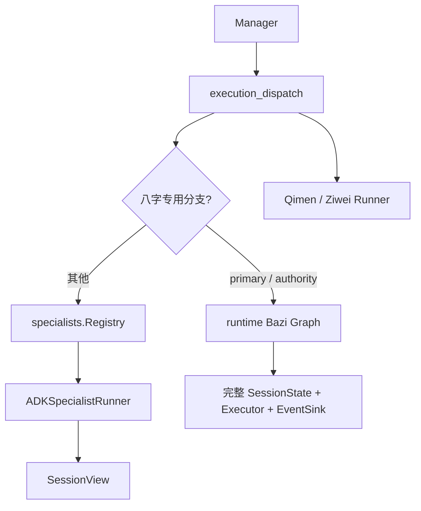
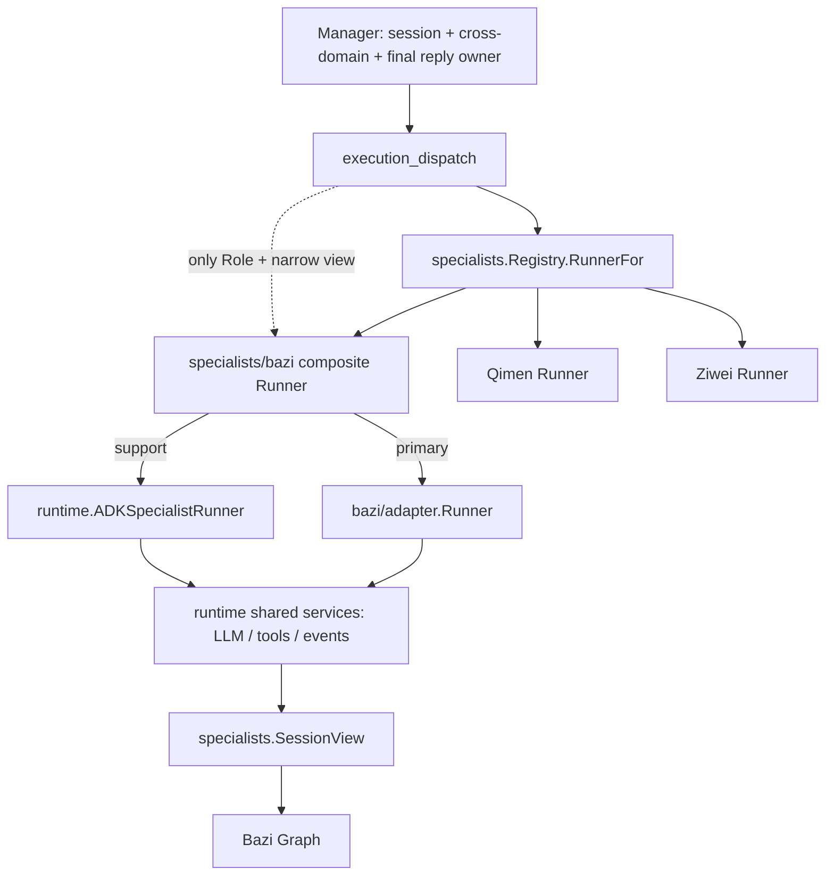

# DDD / Clean Architecture 领域重构方案

状态：[KNOWN] Batch A、B、C0、C1、D1A、D1B、D1C、DDD Batch E1-E18 和本轮 RB0-RB4 已完成。八字 Graph、模型/检索、schema、合同和展示实现已迁入 `specialists/bazi`；Qimen Graph/presentation 与 Ziwei 更深的 domain/graph/presentation 迁移 deferred。

当前运行事实以 `docs/architecture.md` 和 `PROGRESS.md` 为准；本文件描述已完成批次和后续迁移门禁。目标是让目录反映真实职责边界，降低阅读和维护成本，同时保持业务行为、API 合同、Graph 拓扑、SSE 事件顺序和领域解释语义不变。

结论先行：

- [KNOWN] E18 只把命宫/身宫纯索引计算下沉到 Ziwei domain；adapter 仍拥有 lunar-go、四柱、闰月/晚子时归一和兼容签名，生产行为未变。
- [KNOWN] 八字 Graph、模型/检索适配、schema、合同和 presentation 生产实现已迁入 `specialists/bazi/{adapter,domain,application,presentation}`；runtime 只保留通用执行能力、共享能力投影、SessionView 适配和跨领域历法资产门禁，不再持有八字专用 runner。
- [KNOWN] Runtime R1 已迁移两个闭合纯领域簇：文本归一和大运目录/标签/已验收判断文本。domain 仍无 runtime 依赖，局部 runtime/domain 测试通过。
- [UNKNOWN] assertion、校验、综合、证据和 Graph 业务状态仍共享 runtime 私有 DTO；在不改变 Graph、repair budget、SSE、trace、错误出口和领域语义的前提下，其下一闭合簇尚未证明。

## 0.1 领域单入口与八字 Runner 迁移冻结（RB0-RB4）

本节是本轮迁移的冻结合同，优先级高于旧的候选批次描述。Manager 是唯一的会话、跨领域协调和最终答复 owner；八字、奇门、紫微是相互独立的业务领域，不直接调用彼此。`specialists.Runner` 是 runtime 调用领域的唯一入口，领域包不得绕过它接收 Executor、EventSink 或完整 SessionState。

八字领域只提供一个组合 Runner：`primary` 委托已有 Bazi Graph 适配器，`support` 委托现有 ADK runner。共享 LLM、工具、RAG、追踪和事件能力由 runtime adapter 提供；`specialists/bazi` 不得导入 `internal/runtime`。`backend/internal/tools/runner.go` 是独立的工具执行治理 owner，本轮不得修改。

### 迁移前



### 迁移后



### RB0-RB4 批次合同

| 批次 | 实施范围 | 批次门禁 |
|---|---|---|
| RB0（完成） | 冻结本文档、架构图和现有行为基线 | 局部基线测试通过；失败则停止且不改业务实现 |
| RB1（完成） | `Request.Role`、`RolePrimary`/`RoleSupport`、八字组合 Runner 和最小单测；不切换容器 | focused specialists/container 测试通过，空值/未知角色/缺少委托错误合同锁定 |
| RB2（完成） | 拆出 `runtime/specialist_session_view.go`；按领域投影；Bazi Graph 调用收窄到 `specialists.SessionView`；建立 adapter 主入口 | Graph、SessionView、模型/事件/检索适配和 Graph 步数/repair 合同测试通过 |
| RB3（完成） | 容器注册八字组合 Runner；dispatch 统一走 `RunnerFor -> Request{Role} -> Run`；删除八字分支和旧 authority 符号 | primary/support、并发顺序、direct/reuse/rerun 回归及旧符号审计通过 |
| RB4（完成） | 更新生产文件头/函数合同、架构文档、PROGRESS；CodeGraph 复查依赖边 | focused/full test、build、list、diff、禁止符号/依赖审计和真实 SSE 回放通过 |

### 验收命令

```bash
GOCACHE=/tmp/suanming-go-cache go test ./backend/internal/specialists/... ./backend/internal/runtime ./backend/internal/container -count=1 -timeout=180s
GOCACHE=/tmp/suanming-go-cache go test ./backend/... -count=1 -timeout=180s
GOCACHE=/tmp/suanming-go-cache go build ./backend/cmd/server/
go list ./backend/...
git diff --check
rg -n 'UseAuthorityGraph|shouldUseBaziAuthorityGraph|runBaziAuthorityFirstGraph' backend/internal
rg -n 'internal/runtime' backend/internal/specialists/bazi
```

最后两条审计必须无结果。不得运行 `make regression` 或其他在线模型评测。

### 禁止项

- 不增加领域总线、事件总线、能力 DAG、万能 Capabilities、BaseAgent、DomainInput、插件框架或第二套 Runner 接口。
- 不修改 `tools/runner.go`，不让 `specialists/bazi` 导入 `internal/runtime`。
- 不把 Executor、EventSink 或完整 SessionState 传入领域层；不向领域暴露其他领域的结构化结果。
- 不顺手移动全部 `runtime/bazi_*.go`，不改变 HTTP/SSE/Graph/renderer/repair 合同，不做无关重构。

## 1. 目标与约束

- 把八字领域代码从通用 `runtime/` 逐步收拢到 `specialists/bazi/`。
- 让通用咨询编排、领域执行、工具适配、结果展示、传输输出各有明确 owner。
- 先移动文件和收敛依赖，依赖稳定且无环后才拆 Go package。
- 每次只迁移一个可证明闭合的小批次，立即格式化、测试、检查引用并可回退。

必须保持：HTTP/API 合同、SSE 类型与顺序、唯一 `text` / `done`、Graph 节点/边/循环/预算/repair、RouteAdvisor/Policy Gate/Manager/ExecutionPlan 所有权、八字领域解释语义。

## 2. 当前目录基线 [KNOWN]

以下是当前仓库目录基线；目录名只能证明文件位置，具体职责以源码和调用关系为准。

```text
backend/
  cmd/server/
  internal/
    config/ container/ contracts/ guidance/ handler/ intent/
    llm/ mcp/ observability/ orchestrator/ policy/ prompts/
    repair/ runtime/ schemas/ specialists/ sse/ state/ structured/
    supervisor/ tools/ tracing/
    runtime/
      schemas/              # 结构化输出 Schema 资源
    specialists/
      bazi/domain/ bazi/graph/ qimen/ ziwei/
    tools/
      bazi/ qimen/ ziwei/
```

功能与主要边界：

- `handler/` 是 HTTP 入站，`sse/` 是 SSE 编码输出，均不应拥有领域解释。
- `orchestrator/` 是请求级入口；`supervisor/` 负责 RouteAdvisor 路由；`policy/` 负责策略门控。
- `runtime/` 当前承载 Manager、ExecutionPlan、跨域调度、Graph 适配、最终 guard 和输出收口，也承载大量八字实现。
- `state/` 持有会话状态、资产、Store 和 Locker；`tools/` 持有工具注册及执行治理；`tracing/` 持有 trace 适配。
- `specialists/bazi/domain/` 当前仅依赖标准库；`specialists/bazi/graph/` 当前主要承载 Eino compose、repair 和标准库。

### 2.1 runtime 通用文件组 [KNOWN]

主链与调度：`manager.go`、`executor_entry.go`、`executor_context.go`、`execution_plan.go`、`agent_route.go`、`artifact_resolver.go`、`execution_dispatch.go`、`orchestration_*.go`、`specialist_runner.go`。

准备与治理：`preflight.go`、`executor_prefill.go`、`dynamic_facts.go`、`guidance_gate.go`、`executor_tools.go`、`final_guard.go`、`structured_output.go`、`sanitizer.go`。

事件、错误与 repair：`event.go`、`event_bridge.go`、`event_trace.go`、`repair_*.go`、`runtime_failure.go`、`graph_loop_contracts.go`、`followup_*.go`。

这些文件暂不因八字迁移整体搬动；上面是职责初判，不等于已经证明可以拆包。

### 2.2 八字生产文件簇 [KNOWN]

迁移前盘点曾记录 `runtime/` 有 32 个 `bazi_*.go` 生产文件；该数字是历史基线，不代表当前 owner：

| 文件簇 | 文件 | 当前职责 | 目标方向 | 状态 |
|---|---|---|---|---|
| 合同/类型/策略 | `bazi_assertion_contract.go`、`bazi_charter_types.go`、`bazi_contract_failure.go`、`bazi_validation_error.go`、`bazi_semantic_policy.go`、`bazi_static_feedback.go` | 合同、状态、策略、失败语义 | domain/application | 先做依赖矩阵 |
| canonical/投影/恢复 | `bazi_canonical_projection.go`、`bazi_canonical_synthesis.go`、`bazi_projection_views.go`、`bazi_validation_recovery.go`、`bazi_value_helpers.go`、`bazi_profile_synthesis.go` | 确定性事实、投影、恢复和转换 | domain/application/adapter | 按依赖拆分 |
| 审计/证据 | `bazi_contract_audit.go`、`bazi_contract_validation.go`、`bazi_evidence_bundle.go`、`bazi_fact_capsule.go` | 证据包、合同校验、事实封装 | domain/application | 先固定 hard-error/recovery 合同 |
| Graph/运行桥 | `bazi_charter_graph.go`、`bazi_graph_adapter.go`、`bazi_graph_entry.go`、`bazi_graph_loop.go`、`bazi_internal_graph.go`、`bazi_charter_agents.go`、`bazi_model_runtime.go`、`bazi_evidence_runtime.go` | Eino、模型、Session、trace、工具、事件桥接 | graph/adapter | 最后迁移，禁止先搬 loop/internal graph |
| 历法/大运 | `artifact_calendar_rules.go`、`bazi_lifetime_dayun.go`、`bazi_runtime_catalog.go`、`specialists/bazi/domain/dayun_facts.go` | 历法版本门禁、大运模型运行、原始大运事实归一、引用目录 | domain/application/adapter | R0.5 已完成历法门禁文件同包重命名；R1 已完成纯大运事实迁移 |
| 最终展示 | `bazi_final_contract.go`、`bazi_final_presentation.go`、`bazi_final_renderer.go` | 已验收结果到最终文本；纯 Markdown 已在 presentation | runtime/presentation | 入口保留，映射与合同仍需按 DTO 证明 |

`specialists/runner.go` 是 specialist 请求/结果合同；`tools/runner.go` 是工具执行治理；`runtime/specialist_runner.go` 是 runtime 调度。三个 `runner.go` 命名相同但职责不同，属于导航问题，不是已确认循环依赖。

### 2.3 Batch A 依赖矩阵结果

以下结论来自当前源码、CodeGraph caller/callee、全仓引用和 package 级构建检查；“候选簇”只表示审查对象，不表示已经可以移动。

| 候选簇 | 已确认依赖与调用面 | 结论 |
|---|---|---|
| `runtime/bazi_authority_sources.go` | [KNOWN] 仅包含来源层级数据和按阶段选择函数；无 `state`、LLM、MCP、trace、SSE 或 `Executor` 依赖。调用者是 `bazi_evidence_bundle.go`、`bazi_evidence_runtime.go`、`bazi_projection_views.go` 及现有证据测试。 | [INFERRED] 可作为最小纯核心抽取簇；需把类型/函数提升为 domain 的窄公开合同，并只改上述调用点。 |
| `runtime/bazi_value_helpers.go` | [KNOWN] `stringValue` 有 37 个调用者，横跨多个 runtime 文件；`intValue`、`minInt` 也被其他运行逻辑使用。 | [KNOWN] 非闭合簇，暂缓；不能借 Batch B 顺手抽成通用 util。 |
| `runtime/bazi_fact_capsule.go` | [KNOWN] 依赖 `baziCharterState`，负责从 runtime 状态提取当前大运和证据覆盖，再调用已有 domain facts。 | [KNOWN] 是 runtime → domain 适配桥，不属于 domain 纯核心，留在 runtime。 |
| `runtime/bazi_projection_views.go` | [KNOWN] 生成 planner/synthesis 模型 payload，读取 `baziCharterState`、证据 bundle 和 runtime catalog。 | [KNOWN] 含 application/adapter 职责，暂缓；不能迁入 domain。 |
| `runtime/bazi_charter_types.go` | [KNOWN] 是大量私有 DTO 和状态类型的中心定义，被 Graph、合同校验、renderer、模型运行时共同引用。 | [KNOWN] 高扇出且非闭合，暂缓；先做窄 DTO 证明再拆。 |
| `runtime/bazi_contract_failure.go` | [KNOWN] 依赖 `repair`、`structured`，决定恢复分类和 fallback；调用链连接 Graph repair 与最终错误出口。 | [KNOWN] 属于 application/runtime 治理，不得作为 domain 纯核心移动。 |
| `specialists/bazi/domain/*.go` | [KNOWN] 当前 package 只依赖标准库，已有 chart view、fact capsule、reference catalog、scope 及测试。 | [KNOWN] 是已存在的纯 domain 基线；Batch B 只向其增加一个可验证的来源策略簇。 |

Batch A 的关键边界结论：当前未发现 import cycle；但“目标 package 拆分后仍无环”仍是 [UNKNOWN]，必须由每个迁移批次的 `go list`、focused test 和 server build 重新证明。

## 3. Clean Architecture / DDD 审查

bounded context（有明确模型和边界的领域上下文）是代码演进边界，不代表立即独立部署。

### P0

- [KNOWN] 当前没有已确认 import cycle。
- [UNKNOWN] 目标 package 拆分后的无环性尚未证明；每批必须用 `go list` 和 focused build 验证。
- [P0 gate] 任何 `specialists/<domain>/adapter → runtime` 反向 import、或 runtime 直接 import 领域 adapter 的方案都立即停止；先把最小端口下沉到公共合同边界。

### P1：必须修复的边界问题

1. [KNOWN] 八字领域、Manager、Graph、Session、模型、证据、renderer 混在 `runtime/`；[INFERRED] 其他领域继续增加会放大维护成本。最小方向：先按文件簇收拢，再拆包。
2. [KNOWN] D0 审查时 `specialists/runner.go` 的 Request 直接携带 `policy.ApprovedRoute`、`state.ManagerContext`、`state.DomainContext`、`*state.SessionState`；[INFERRED] 领域用例难独立测试。D1B 已先移除未读取的三项，完整 `SessionState` 仍待后续 DTO 证明。
3. [KNOWN] `bazi_graph_loop.go` 的运行结构直接携带 `*Executor`、`*state.SessionState`、`EventSink`；最小方向：保留为 adapter 桥接，最后迁移，不先搬到 domain/application。

### P2：可暂时保留

- `runtime` 包名暂留，远期再考虑 `consultation/`；不把改名当领域迁移前置条件。
- `bazi_` 前缀暂留，避免移动和改名叠加。
- `runtime`、`mcp` 产生的本地日志等运行产物不纳入本轮代码结构重构；它们不是当前源码目录基线。
- Qimen 已完成纯领域、application 和 adapter 最小批次；Ziwei 已完成无历法依赖的纯星曜 domain 核心，剩余历法 domain/graph/presentation 仍需逐领域证明闭合簇，不因目录对称性新建空实现。

## 4. 目标结构

```text
backend/internal/
  handler/                 # HTTP 入站，不解释领域
  sse/                     # SSE 编码，不决定答案
  orchestrator/            # 请求入口，不实现领域规则
  supervisor/              # RouteAdvisor 路由
  policy/                  # 策略门控
  runtime/                 # 现阶段通用咨询执行主链
  state/                   # 会话、资产、Store、Locker
  tools/                   # 工具注册和治理
  tracing/ repair/         # 通用适配
  container/               # composition root
  specialists/
    types.go                # specialist 公共配置与 registry
    runner.go               # specialist 有界执行合同；暂不为对称命名改名
    bazi/
      domain/              # 八字事实、规则、领域合同
      application/         # 八字用例、投影、合同编排
      graph/               # Graph 控制状态、repair 编排
      adapter/             # runtime/state/model/tool/trace 桥接
      presentation/        # 已验收投影到最终文本
    qimen/
      domain/ application/ graph/ adapter/ presentation/
    ziwei/
      domain/ application/ graph/ adapter/ presentation/
```

| 目录 | 负责 | 不负责 |
|---|---|---|
| `bazi/domain` | 八字概念、事实、规则、合同 | LLM、MCP、HTTP、SSE、trace、完整 SessionState |
| `bazi/application` | 八字用例、投影、合同校验编排 | Executor、EventSink、跨域路由、模型客户端 |
| `bazi/graph` | Graph 节点/边控制状态和领域 repair | SSE、transport、最终对话 owner |
| `bazi/adapter` | 外部 runtime/state/model/tool/trace 桥接 | 八字规则、最终文本裁断 |
| `bazi/presentation` | 已验收投影到用户文本 | 补事实、重判合同、发 SSE |
| `ziwei/adapter` | 紫微 specialist 配置、确定性排盘/流年工具、lunar-go 与旧 map payload 适配 | Session 写入、Graph、trace、SSE、最终文本；纯算法进一步下沉 domain 仍待独立证明 |
| `runtime` | ExecutionPlan、跨域调度、最终 guard、唯一输出收口、共享能力投影 | 新增八字规则、直接依赖领域 adapter |

依赖方向分为调用与组装两条边：`handler → orchestrator → runtime → specialists` 公共有界 runner 合同；`container` 只负责同时组装 `runtime` 与 `specialists/<domain>/adapter`，不把 adapter 作为 runtime 的下游依赖。领域内部为 `specialists/<domain>/adapter → application → domain`，`presentation → application/domain`。adapter 通过 runtime 提供的共享能力投影接触模型、检索和事件；runtime 不得反向 import 领域 adapter。

若 adapter 需要当前定义在 `runtime` 的事件类型或能力，先把最小 DTO/回调合同放到已有公共合同包或 `specialists` 公共合同边界；不得让 adapter import runtime。除现有 `Runner` 和确有替换需求的最小回调外，不新增宽接口。

禁止：domain 依赖 runtime/state/HTTP/SSE/LLM/MCP/trace；application 依赖 Executor、EventSink、完整 SessionState；graph 依赖 SSE sink 或最终 renderer；presentation 依赖 LLM/MCP、工具执行或合同裁断源；领域互相依赖内部实现。

## 5. 当前到目标映射

| 当前文件组 | 目标位置 | 动作 | 前置证明 | 批次 |
|---|---|---|---|---|
| `specialists/runner.go`、`types.go` | `specialists` 根包 | 保留现有公共 runner/config/registry 合同；不为文件名对称改名 | 全仓引用、测试、import | 全程 |
| `tools/runner.go` | `tools` 根包 | 保留工具执行治理 owner；不与 specialist runner 做无收益的命名同步 | 工具调用者、工具测试 | 全程 |
| `runtime/executor_*.go`、`specialist_runner.go` | runtime，远期 consultation | 暂缓 | 通用边界和调用链稳定 | 暂缓 |
| 合同/类型/策略簇 | `bazi/domain` / `application` | 按依赖移动/拆分 | 窄 DTO、无反向依赖 | B |
| canonical/投影/恢复簇 | `bazi/domain` / `application` / `adapter` | 先分纯部分与运行时部分 | state 输入输出窄化 | B |
| 审计/证据簇 | `bazi/domain` / `application` | 按 owner 移动 | hard-error/recovery 测试 | B |
| `bazi_graph_*.go`、`bazi_internal_graph.go`、模型/证据运行时 | `bazi/graph` / `adapter` | 最后移动，当前暂缓 | 拓扑快照、DTO、无环 | D |
| 历法/大运簇 | `bazi/domain` 或 `tools/bazi` | 纯规则与外部访问拆开 | 规则边界明确 | B/D |
| `bazi_final_contract.go`、`bazi_final_renderer*.go` | `bazi/presentation` | 条件移动 | 只消费验收投影 | C |
| `specialists/bazi/domain`、`specialists/bazi/graph` | 原位 | 保留并作为目标边界 | 依赖持续通过 | 全程 |
| `specialists/qimen`、`specialists/ziwei` | 各自 `domain/application/graph/adapter/presentation` | Bazi 收口后逐领域迁移；无现有 bounded Graph 时不为对称性新建 Graph 拓扑 | Bazi 模式验收、各自依赖矩阵 | E |
| `specialists/ziwei/specialist.go`、`specialist_test.go` | `specialists/ziwei/adapter/config.go`、`config_test.go` | 迁移 specialist 静态配置；不复制或迁移紫微排盘工具 | composition root 调用闭合、配置值逐项一致、无 runtime 反向依赖 | E5 |
| `runtime/agent_route.go` 中的 Ziwei prompt projection | `specialists/ziwei/application` | 迁移只读 map payload 到 specialist instruction 的纯投影；不迁移 AgentBuilder 或 Session | 字段顺序、空值、JSON 兜底和禁止重复排盘文案逐字锁定；application 无 runtime 反向依赖 | E6 |
| `tools/qimen/qimen.go`、`qimen_test.go` | `specialists/qimen/adapter/qimen_tool.go`、`qimen_tool_test.go` | 迁移奇门外部排盘工具 adapter；保留公共 `tools.Tool` 隐式实现和旧 map payload；不迁移领域规则或 runtime 编排 | 容器注册与 runtime adapter 测试调用闭合；仅依赖外部历法/排盘库和 Qimen domain；无 runtime/state/Session/trace/SSE 反向边 | E7 |
| `tools/ziwei/*.go`、对应测试 | `specialists/ziwei/adapter/` | 整体迁移互相引用的紫微算法、命盘工具和流年工具；保留公共 `tools.Tool` 隐式实现与旧 map payload；不拆 domain、不改算法 | CodeGraph/全仓引用确认闭合；目标包无 runtime 反向边；容器注册、真太阳时跨日和算法 fixture 可复核 | E8 |
| `ziwei/adapter/palace.go` 的五行局/宫名纯规则、`location.go` 的起紫微纯计算 | `specialists/ziwei/domain/palace_rules.go` | 迁移无历法依赖的纯规则；adapter 只提取 lunar-go 农历日并保留旧签名转发；不迁移 adapter DTO、月系/日系或大限 | domain 仅依赖标准库；`BuildChart`、工具 map payload 和旧调用闭合；无第二套实现 | E11 |
| `ziwei/adapter/horoscope.go` 的长生/博士十二神纯规则 | `specialists/ziwei/domain/horoscope_rules.go` | 迁移纯排布规则；adapter 保留 `GetBoShi12(*calendar.Solar, ...)` 的旧签名并忽略未读取的兼容参数 | domain 仅依赖标准库；`BuildChart` 宫位字段与旧调用闭合；无第二套实现 | E12 |
| `ziwei/adapter/palace.go` 的大限纯计算 | `specialists/ziwei/domain/horoscope_rules.go` | domain 返回无 JSON 标签的 `DecadalInterval`；adapter 保留旧签名并投影回 `DecadalInfo` JSON DTO | domain 无历法/transport 类型；`BuildChart` 的大限 map payload 与调用闭合 | E13 |

## 6. 分批计划与验证

### Batch A：依赖矩阵（只读）[COMPLETED]

盘点 32 个 Bazi 生产文件的 import、CodeGraph caller/callee、跨 package 私有符号和 runtime/adapter 方向；本批未修改或移动生产代码。

已验证结果：

- [KNOWN] `go list ./backend/...` 通过。
- [KNOWN] `go list -f '{{.ImportPath}}: {{join .Imports " "}}' ./backend/internal/...` 通过；未发现目标边界反向依赖。
- [KNOWN] 禁止依赖扫描无匹配；`specialists/bazi/domain` 仍只依赖标准库，`specialists/bazi/graph` 未依赖 runtime。
- [KNOWN] `gofmt -l backend/internal/runtime backend/internal/specialists` 无输出。
- [KNOWN] focused test 通过：`go test ./backend/internal/specialists/bazi/domain ./backend/internal/specialists/bazi/graph ./backend/internal/runtime -count=1 -timeout=180s`。
- [KNOWN] `go test ./backend/... -count=1 -timeout=180s` 在授权环境通过；首次 sandbox 尝试仅受本地 `httptest.NewServer` 端口绑定限制，重跑通过。
- [KNOWN] `go build ./backend/cmd/server/` 通过。
- [KNOWN] 本批没有 `git mv`、生产代码编辑或运行时行为变化；当前工作区新增物仅本方案文档。

本批失败处理：不动运行代码；只修正审查记录或删除本方案文档的未提交产物。Batch A 已完成，执行停止于 Batch B 审批门。

### Batch B：来源层级策略纯核心（已完成）

本批只迁移来源层级纯核心，不包含 Graph、Session、模型、repair、renderer 或 SSE 改造：

- 核心文件：`backend/internal/runtime/bazi_authority_sources.go` → `backend/internal/specialists/bazi/domain/authority_sources.go`，优先使用 `git mv`。
- 必要的窄合同改名：`authoritySourceSet` → `domain.AuthoritySourceSet`，`stageAuthoritySources` → `domain.StageAuthoritySources`；只暴露来源层级数据，不新增通用大接口。
- 必要调用点：`backend/internal/runtime/bazi_evidence_bundle.go`、`backend/internal/runtime/bazi_evidence_runtime.go`、`backend/internal/runtime/bazi_projection_views.go`；现有 `bazi_evidence_bundle_test.go` 同步改为验证 domain 合同。
- 必要测试：在 `specialists/bazi/domain` 增加静态、动态、未知 stage 和重复调用独立性的表格测试；runtime 证据测试继续覆盖调用方使用的结果。
- 明确不动：`bazi_charter_types.go`、`bazi_fact_capsule.go`、`bazi_projection_views.go` 的其他 payload 逻辑、`bazi_graph_*.go`、`bazi_internal_graph.go`、`specialists/runner.go`、`state`、`repair`、模型和传输层。

Batch B 只读落地预检：

- [KNOWN] CodeGraph 和全仓引用只确认上述 3 个生产调用点、1 个现有测试调用点；未发现额外 caller、动态分发跳转或跨包私有类型依赖。
- [KNOWN] `specialists/bazi/domain` 当前只依赖标准库；3 个 runtime 调用点新增对 domain 的依赖不会形成 domain → runtime 反向边，当前 `go list` 也未发现环。
- [KNOWN] 现有 `Primary`、`Secondary`、`Auxiliary` 字段已导出且没有 JSON tag；从 runtime 私有类型改为 domain 导出类型不会改变默认 JSON 字段名，仍需迁移后快照验证。
- [KNOWN] 迁移后 `specialists/bazi/domain` 仍仅依赖标准库；runtime 只依赖 `domain.AuthoritySourceSet` 与 `domain.StageAuthoritySources`，旧私有符号无残留。
- [KNOWN] 真实编译、全量测试、SSE 和 trace 回放已完成；完整八字回放的领域错误来自知识检索无命中，已保留既有错误出口，未发现本批迁移引入的公共合同变化。

前置条件：Batch A 已完成；用户已明确批准 Batch B；迁移前已确认来源层级调用闭合；domain 包无 runtime 依赖、调用点不依赖未导出旧类型、`go list` 预检无环。

必须保持的不变量：

- `static`、`dynamic` 和未知 stage 的 `Primary`、`Secondary`、`Auxiliary` 内容及顺序完全不变。
- 证据覆盖判断、检索阶段选择、模型输入字段、Graph 节点/边/步数、repair budget、错误出口、SSE 顺序、唯一 `text` / `done` 和 trace 字段完全不变。
- domain 文件不接触 runtime、Session、Executor、EventSink、LLM、MCP、trace、HTTP、Gin 或 SSE；runtime 只能依赖该窄 domain 合同，不反向依赖 adapter。

验证结果：

- [KNOWN] `go test ./backend/internal/specialists/bazi/domain ./backend/internal/runtime -count=1 -timeout=180s` 通过；`go test ./backend/... -count=1 -timeout=180s` 在授权环境通过；`go list ./backend/...`、禁止依赖扫描、`gofmt -l backend/internal/runtime backend/internal/specialists`、`go build ./backend/cmd/server/` 和 `git diff --check` 均通过。
- [KNOWN] 由于环境禁止写 `.git/index`，`git mv` 返回 `.git/index.lock: Read-only file system`；已采用等价的目标文件新增加旧文件删除完成迁移，未覆盖或回退其他未提交修改。
- [KNOWN] 使用明确标注为虚构且不对应真人的 `/api/chat` 回放，session 为 `batch-b-synthetic-complete-20260811`，trace 为 `trc_83741ae75873`。SSE 事件顺序为 `component(bazi-chart) → thinking×6 → error → component(route-decision) → component(run-inspection) → done`；`done` 唯一 1 次，错误出口为既有 `ORCHESTRATION_NO_RESULT`。
- [KNOWN] 该 trace 已进入八字证据主链：`bazi_calc`、`yongshen`、`dayun_analyzer`、`bazi_liunian`、`knowledge_search` 均出现；`bazi.evidence_attempts=2`、`bazi.max_run_steps=24`，检索 span 共 29 个（source tier A 28 个、B 1 个）。
- [KNOWN] 完整回放未产生用户可见 `text`，因为知识库请求连续无命中后按既有合同发 `error` 并仍收口 `done`；这证明了错误出口和唯一 `done` 的保持，但不把该次外部依赖降级误写成业务成功。
- [UNKNOWN] 在知识库恢复命中后，来源层级数据是否与迁移前线上样本逐字段相同，仍需下一次可用检索服务的成功回放确认；本批纯 domain 表格测试和 runtime 证据测试已覆盖静态、动态、未知 stage 及独立性。

本批结论：[KNOWN] 纯来源策略迁移完成，未发现 import cycle、Graph/SSE 顺序变化、repair budget 变化或领域语义变化。按执行规则停在 Batch C，不自动开始 presentation 迁移。

回退：只反向执行该批次的 `git mv` 和调用点恢复，保留方案文档及未提交用户修改；禁止 `git reset --hard`、`git checkout --` 或其他破坏性回退。

### Batch C0：窄 presentation input DTO 与 runtime 映射（已完成）

本批先闭合展示输入，不移动 renderer 文件。目标是让现有 runtime renderer 只消费一个不含
Graph、Session、模型和检索载荷的展示 DTO；下一批再把已证明闭合的 renderer 文件簇移动到
`specialists/bazi/presentation`。

#### C0 数据闭包

- [KNOWN] `bazi_final_renderer*.go` 实际读取：模板选择字段；静态主轴、强弱、调候、格局、层次、限制、优势、风险和主题槽位；动态当前大运/流年槽位、触发关系和事实降级状态；全程大运状态与逐运枚举；古籍短引文；年龄带；以及四柱、日主、强弱、流年和大运的少量确定性展示事实。
- [KNOWN] renderer 不读取完整 `SessionState`、`EvidencePlan`、`EvidenceQuality`、Graph 计数、repair 状态、模型原始 DTO 或检索原文元数据。
- [KNOWN] `buildBaziFactCapsule`、`buildBaziSubjectContext`、`buildFactsOnlyDynamicSynthesis` 是 runtime → presentation 映射阶段需要执行的确定性投影，不应由 presentation 重新计算。
- [INFERRED] `specialists/bazi/presentation.FinalReplyInput` 可用 `Plan`、静态/动态/全程槽位、引用、年龄带和已计算事实六组字段闭合；其中大运目录只暴露展示所需的 ref、标签、干支和运干十神，不暴露原始 `map[string]any`。
- [KNOWN] C0 完成后，C1 已证明 renderer 可在不引入反向 runtime helper 的前提下迁移；仅保留合同和投影共用的原始事实解析。

#### C0 文件与职责

| 文件/文件组 | 归属 | 动作 |
|---|---|---|
| `specialists/bazi/presentation/input.go` | presentation | 新增窄 `FinalReplyInput` 及展示专用嵌套 DTO；不依赖 runtime |
| `runtime/bazi_final_presentation.go` | runtime/application 边界 | 从 `baziCharterState` 做一次性确定性映射；负责事实胶囊、年龄带、引用和大运目录投影 |
| `runtime/bazi_final_renderer.go` | 保留 runtime 薄入口 | 只做状态到 DTO 映射和 presentation 调用 |
| `bazi_final_contract.go` | runtime/application | 继续保留 final contract gate；不混入 presentation DTO |

依赖方向：`runtime → specialists/bazi/presentation`；`presentation` 只依赖标准库和已完成的 Bazi
domain 值对象，不依赖 runtime、Session、HTTP、Gin、SSE、LLM、MCP 或 trace。C0 不新增接口、DAG、
checkpoint、supervisor、框架或重试。

#### C0 前置条件、不变量、验证与回退

前置条件：Batch B 已完成；用户已批准全部方案；renderer 字段闭包、生产调用者和 runtime 私有
helper 依赖已完成只读量化。

必须保持：既有最终 Markdown 字节内容、facts-only 降级范围、未成年人年龄边界、当前大运绑定、
全程运路顺序、唯一 `text`/`done`、SSE 顺序、Graph 16/24 步上限、repair budget、错误出口、trace
字段和领域语义完全不变。DTO 不得携带原始 `SessionState`、模型对象、检索对象或 `map[string]any`。

验证：presentation/domain focused test；runtime renderer focused test；`gofmt`；
`go test ./backend/... -count=1`；`go build ./backend/cmd/server/`；`go list ./backend/...`；
`git diff --check`。因 renderer 仍在 runtime，本批先做既有 renderer 输出快照/断言回归；入口 SSE/trace
回放在 C1 文件移动批次再次执行；C1 已完成该入口回放。

回退：删除 C0 DTO 和映射文件，恢复 renderer 函数参数为原 runtime 类型；不使用
`git reset --hard`、`git checkout --` 或其他破坏性命令，不触碰未提交用户修改。

### Batch C1：presentation renderer 迁移（已完成）

当前不能直接迁移 `bazi_final_contract.go` 与 `bazi_final_renderer*.go`，原因已由 CodeGraph 和目标文件复核确认：

- [KNOWN] `bazi_final_contract.go` 的 `validateFinalWriterOutput` 在 `bazi_charter_graph.go` 的 Graph 返回后执行，是 final contract gate（最终合同门禁），不是只消费投影的展示函数；直接搬入 presentation 会把应用合同校验错误归属到展示层。
- [KNOWN] `bazi_final_renderer*.go` 直接消费 runtime 私有 `baziCharterState`、`baziAnalysisPlan`、`baziCitation`，并调用 `buildBaziFactCapsule`、`dayunPeriods`、`stringValue` 等 runtime 内部 helper；这些依赖不是闭合的 presentation 文件簇。
- [KNOWN] `renderBaziFinalReply` 有 `bazi_charter_graph.go` 调用者，renderer 测试也构造 runtime 私有状态；直接 `git mv` 会产生未导出类型/函数断裂，或迫使 presentation 反向依赖 runtime，均违反目标依赖方向。
- [KNOWN] C0 已提供独立的窄 presentation input DTO 和 runtime → presentation 映射；DTO 不携带完整 `SessionState`、模型 DTO 或 Graph 状态，合同 gate 仍在 runtime/application。
- [KNOWN] C1 已完成测试调用者迁移，未保留第二套生产 renderer；`.git/index` 只读导致 `git mv` 无法写入索引，采用复制目标文件、机械改包、删除旧文件的等价迁移。

#### C1 已完成的只读闭包审查

- [KNOWN] `bazi_final_renderer.go` 是 runtime 的薄入口：它接收 `baziCharterState`、调用 C0 映射并按模板派发；
  它必须留在 runtime，改为调用 presentation 的唯一公开渲染入口。
- [KNOWN] `bazi_final_renderer_{markdown,sections,templates,topic}.go` 的生产函数只消费 `FinalReplyInput`、标准库
  和同簇 helper，可整体 `git mv` 到 `specialists/bazi/presentation/`。
- [KNOWN] `bazi_final_renderer_facts.go` 混有展示函数及 `dayunPeriods`、`anyMapSlice`、
  `dayunPeriodDisplayLabel`、`shortPeriodTime`、`renderDayunJudgmentLines` 五个 runtime 原始事实/合同 helper；
  后者仍被 canonical projection、contract、fact capsule 和 profile synthesis 调用，不能迁入 presentation。
- [INFERRED] 最小安全实施是先用 `git mv` 移动四个纯展示文件和 renderer facts 的展示部分；把五个 raw helper
  留在新建的 runtime 事实解析文件。presentation 内部自行完成 period-ref 查找，不导出 runtime 类型或 helper。
- [KNOWN] 移动前已用 CodeGraph 与 `rg` 核对测试调用者；runtime 只保留 `_test.go` 的 DTO 渲染适配，生产包没有第二套 renderer。

#### C1 文件与不变量

| 文件/文件组 | 动作 | 边界 |
|---|---|---|
| `runtime/bazi_final_renderer.go` | 保留入口，改调 `presentation.RenderFinalReply` | 唯一允许读取 runtime state 的 renderer 位置 |
| `runtime/bazi_final_renderer_{markdown,sections,templates,topic}.go` | 已迁移到 `specialists/bazi/presentation/` | 仅依赖 `FinalReplyInput` 和标准库 |
| `runtime/bazi_final_renderer_facts.go` | 展示函数已迁移并拆分 | 原始事实解析未迁出 runtime |
| `specialists/bazi/domain/{dayun_facts,text_list}.go` | 已承接 raw 大运事实与共用列表归一 | 只服务确定性领域事实，不承担 Markdown 输出、模型或运行时能力 |
| `runtime/bazi_final_contract.go` | 保持不动 | final contract gate 仍在 runtime/application |

前置条件：C0 full backend test、build、依赖扫描通过；移动前确认所有测试直接调用者；真实回放所需的
敏感测试载荷外发已获授权。必须保持 Markdown 字节内容、facts-only/未成年人边界、当前大运绑定、全程运路
顺序、Graph 16/24 步上限、repair budget、SSE 顺序、唯一 `text`/`done`、错误出口和 trace 字段不变。

验证：presentation focused renderer test、runtime final-contract test、迁移前后 renderer 快照对比、`gofmt`、
`go test ./backend/... -count=1`、`go list ./backend/...`、server build、真实 `/api/chat` SSE 至 `done` 和 trace
回放。结果：[KNOWN] focused presentation/runtime test、授权环境全量 backend test、server build、`go list`、
gofmt、`git diff --check` 和授权 `make eval-smoke` 均通过；presentation 依赖扫描未发现 runtime、state、MCP、
trace、SSE、LLM 或框架依赖。回退：只反向移动 C1 文件并恢复 runtime 入口调用；禁止 `git reset --hard`、`git checkout --` 和删除
其他未提交修改。

### Batch D0：adapter / Graph 桥接只读预检（已完成，未移动生产代码）

结论先行：当前没有已证明可直接复制或移动的闭合 Graph/adapter 生产簇；D0 停在依赖、状态所有权和 DTO 前置条件，不修改生产代码。

#### D0 只读证据

- [KNOWN] `runtime/bazi_graph_adapter.go` 同时导入 `repair`、`specialists/bazi/graph`、`state` 和 `tracing`；`runBaziDomainGraph` 创建 `baziInternalGraphState`，通过 context 注入 `Executor`、完整 `SessionState` 和 `EventSink`，再绑定 12 个 Graph callback。它是 runtime-owned 外层适配入口，不是可独立编译的领域 adapter 簇。
- [KNOWN] D0 时 `runtime/bazi_graph_loop.go` 持有 `baziGraphRuntime{Executor, Session, Sink}`、重复的 `BaziGraphResult` 和 `baziRepairFailureState`；D1A 已删除重复结果类型，但 8 个节点调用者仍在该文件或 `bazi_internal_graph.go`，直接移动仍会把 runtime 私有合同、Session、trace/SSE 能力一起带入目标包。
- [KNOWN] `runtime/bazi_internal_graph.go` 的 `baziInternalGraphState` 被 `bazi_graph_adapter.go`、`bazi_graph_loop.go` 和自身共 31 个调用点使用，字段包含 `baziCharterState`、`baziCanonicalSynthesis`、runtime catalog、合同失败、repair state、候选和终止信息；不是窄领域 DTO。
- [KNOWN] `specialists/bazi/graph` 已独立拥有动作选择、16/24 步边界和 Graph 状态；其 `State.Payload` 只是 adapter-owned payload 的隔离槽，`runBaziGraphNode` 仍负责 runtime 状态与 Graph 控制位的双向投影，不能据此判定 runtime Graph 桥已经可移动。
- [KNOWN] D0 审查时 `specialists.Request` 包含 `SessionID`、`UserMessage`、`policy.ApprovedRoute`、`state.ManagerContext`、`state.DomainContext` 和 `*state.SessionState`；D1B 已删除未读取的 `SessionID`、`ManagerContext`、`DomainContext`，D1C 又将普通 runner 收窄为 `SessionView`，Qimen 仍通过 `specialistSessionView` 做 Case/盘面隔离。
- [KNOWN] `state.DomainContext` 仍由 state 持有并持久化，包含 `RuntimeValues map[string]any`；`ManagerContext` 由 Manager 写入。直接把它们改成领域 DTO 会同时触及 Session clone/store、Manager、dispatch、specialist runner 和序列化合同，不能作为 D1 的隐式顺手修改。
- [INFERRED] 直接 `cp` 后改包名只会复制当前耦合关系：若把上述文件放进 `specialists/bazi/adapter`，目标包要么反向依赖 runtime，要么被迫导出大量 runtime 私有类型；若保留旧文件则会形成两套 Graph 入口、重复 trace/SSE 发送或结果合同漂移。
- [UNKNOWN] 在不改变 Graph 状态机、repair budget、错误出口、trace 字段和 SSE 顺序的前提下，`Request`、Graph payload 和终态结果的最小公共 DTO 尚未由当前调用图证明；也未证明 container 能在不新增宽接口的情况下完成组装。

#### D0 最小候选与停止条件

当前唯一安全候选是“先冻结边界证据”，不是新增接口或复制生产文件。D1 进入条件为：

1. 明确 specialist Request、ManagerContext、DomainContext 中真正跨领域使用的字段，并将 adapter 所需输入收敛为现有公共合同或最小值对象；当前字段矩阵已确认，尚未形成可改代码的闭包。
2. 明确 `SessionState`、`Executor`、`EventSink`、trace 的所有权和注入方向，使 runtime 不 import `specialists/bazi/adapter`，adapter 也不反向 import runtime。
3. 对 Graph 控制 `State`、adapter payload、终态 result 建立字段闭包和迁移前快照；不得用 `any`、完整 Session 或 runtime 私有状态替代 DTO 证明。
4. 先用 CodeGraph、`go list` 和 focused contract tests 证明一个闭合 DTO/转换簇；若出现 import cycle、Graph/SSE/错误合同差异或需要新增宽接口，立即停止并保留当前 runtime 方案。

验证结果：[KNOWN] CodeGraph caller/callee 复核、`go list ./backend/...`、D0 后的授权环境 `go test ./backend/... -count=1`、`go build ./backend/cmd/server/` 和 `git diff --check` 均通过；C1 已有授权 `make eval-smoke` 回放证据。D0 本次没有生产代码变更，因此未产生新的 SSE/trace 行为；本次 smoke 重跑请求被审批器以“上游请求在完成前断开”拒绝，不能把它写成 D0 新证据。回退：D0 仅修改方案/进度事实，删除本批文档增量即可；不回退或覆盖其他未提交修改。

#### 关于 `git mv` 与 `cp`

`git mv` 只是索引级重命名，适合已证明闭合的同 package 文件簇；`cp` 后改 package、同步调用者、跑编译/测试、再删除旧文件，在 `.git/index` 只读时是等价的物理迁移。两者都不能解决依赖方向、未导出符号、重复入口或双写事件问题，所以 D0 不因用户已授权就复制 Graph 文件；等 D1 形成闭合簇后，优先 `git mv`，失败时按上述 `cp` 流程执行并做旧路径零残留审计。

### Batch D1：adapter / Graph 小批次（条件执行）

仅在 D0 的四项进入条件全部满足后定义具体文件簇。前置条件：Request/ManagerContext/DomainContext 字段已窄化，Session/trace/EventSink 由 adapter 承担，runtime 只消费公共 runner/结果合同，container 负责组装，Graph 拓扑快照已建立。必须保持 Graph 16/24 步上限、repair budget、节点序列、错误出口、trace 字段、唯一 `text`/`done` 和领域语义；验证 focused contract test、`go test ./backend/... -count=1`、server build、真实 SSE 到 done、trace span/repair/budget 回放。出现 cycle、SSE 顺序变化、trace 缺失或 Graph 差异即停止，不进入下一批。

### Batch D1B：specialist Request 最小输入合同（已完成）

本批只收窄已有 runner 输入 DTO，未移动 Graph/adapter 文件，未新增接口，未改变
`Runner` 方法签名、领域执行顺序或任何运行时输出合同。

- [KNOWN] `ADKSpecialistRunner.Run` 的生产实现只读取 `UserMessage`、`Route` 和
  `Session`；`SessionID`、`ManagerContext`、`DomainContext` 在 backend 生产代码和测试
 夹具中均没有读取者，dispatch 是唯一构造点。
- [INFERRED] 删除三个未读取字段可消除 specialist 对 Manager/Domain context 的直接
  输入耦合；`SessionID` 仍可由 `Request.Session` 获取，因此不改变 agent 构建、会话
  消息、session values 或工具结果回写。
- [UNKNOWN] 仓库外不可见的自定义 internal 测试不能从 Go `internal` 包边界导入；本批
  只以当前仓库调用图和编译结果作为合同证据。

文件簇：`specialists/runner.go`、`runtime/execution_dispatch.go`、因删除唯一调用而清理孤儿
`runtime/manager.go`，及对应 runner/dispatch
测试。前置条件：D0/D1 字段审计完成；CodeGraph、`rg` 和 `go list ./backend/...` 未发现
其他字段读取者或 import cycle；目标文件头和目标函数注释已复核。必须保持
`ExecutionPlan` 角色化 dispatch、Session 视图、Graph 16/24 步上限、repair budget、
错误出口、SSE 顺序、唯一 `text`/`done`、trace 字段和领域语义不变。验证：gofmt、
focused specialists/runtime test、`go test ./backend/... -count=1`、server build、
`go list ./backend/...`、旧字段零生产读取审计、`git diff --check`，以及受影响的 SSE/trace
回放。任一公共 API、Graph、错误出口、SSE 或 trace 差异立即停止。回退：恢复三个字段和
dispatch 构造赋值，只回退本批改动，不触碰其他未提交修改。

当前结果：[KNOWN] `gofmt`、focused specialists/runtime test、授权环境
`go test ./backend/... -count=1`、`go build ./backend/cmd/server/`、`go list ./backend/...`、
字段零读取审计和 `git diff --check` 均通过。明确标注为合成、非真人的 `/api/chat` 回放
session `d1b-synthetic-20260812b` 产生 trace `trc_fa7992ca3de4`，trace status 为 `ok`，
确认 `orchestration.max_run_steps=16`、`orchestration.termination_reason=completed`、
`bazi.max_run_steps=24`、`bazi.termination_reason=completed`；SSE 文件确认事件顺序为
`component → thinking… → text → component → component → done`，唯一 `text` 和唯一
`done`。`make eval-smoke` 因会把数据集真实出生资料写入 Langfuse 被安全门禁拒绝，未执行，
不影响本批代码验证。[UNKNOWN] 含真实出生资料的 `runtime-smoke-v1` 尚未在 D1B 后重跑。

### Batch D1A：Graph 终态结果 ownership 收口（已完成）

本批是 D1 的最小机械前置批次，不移动 Graph 文件、不新增接口、不改变 Graph 拓扑：

- [KNOWN] D1A 前 `specialists/bazi/graph.Result` 已包含 `Text`、恢复状态、终止原因、领域 `Failure` 和终态 `Payload`；runtime 的重复 `BaziGraphResult` 只有 `bazi_graph_adapter.go`、`bazi_graph_loop.go` 两个生产调用面，本批已删除该重复 owner。
- [KNOWN] runtime 仍在 `baziGraphTerminalText` 把领域失败转换为既有 `RuntimeFailure`；本批保留该转换，只把输入改为 Graph-owned result，并继续由终态 payload 提供 `ContractAudit`。
- [INFERRED] 删除 runtime 重复结果类型可降低 ownership 漂移风险，不改变 `bazi_deterministic` 的动作选择、24 步上限、repair budget、trace、SSE、错误出口或领域语义。
- [KNOWN] 本批完成后仍不能证明 `baziInternalGraphState` 或 Session/Executor/EventSink 已可迁入 adapter；D1 DTO 前置条件保持未满足，故本批没有移动 Graph 或 adapter 文件。

文件簇：`runtime/bazi_graph_loop.go`、`runtime/bazi_graph_adapter.go` 及对应 runtime Graph 测试。前置条件：D0/D1 只读调用闭包、Graph `Result` 已存在、既有 Graph/adapter focused tests 可运行。验证：gofmt、focused runtime/Graph tests、`go test ./backend/... -count=1`、server build、旧 `BaziGraphResult` 零残留和 D1A 后既有 SSE/trace 回放证据；出现 Graph phase、终态错误字段、audit、SSE 或 trace 差异立即停止。回退：恢复 runtime 结果包装和测试字段，保留 Graph package 原有 Result；只回退本批，不触碰其他未提交修改。

当前结果：[KNOWN] gofmt、focused runtime/Graph tests、授权环境 `go test ./backend/... -count=1`、server build、`go list ./backend/...`、旧生产符号审计和 `git diff --check` 均通过。合成且明确不对应真人的 `/api/chat` 回放 trace `trc_7d72af48f598` 进入 Bazi Graph，确认 `orchestration.max_run_steps=16`、`bazi.max_run_steps=24`、`repair.max_attempts=1`、`bazi.repair_attempts=0`、`bazi.next_action=hard_error`、`bazi.termination_reason=hard_error`；SSE 保持既有 `component → thinking → error → component → component → done` 收口，未产生重复 `text` 或 `done`。模型 `dynamic_synthesis/method_contract` 失败沿用既有错误出口，不归因于 D1A。[KNOWN] D1B 执行前字段审计确认 `ADKSpecialistRunner.Run` 只读取 `UserMessage`、`Route`、`Session`；`SessionID`、`ManagerContext`、`DomainContext` 无 backend 读取者，dispatch 是唯一生产构造点。[UNKNOWN] 原始 `runtime-smoke-v1` 两条含出生资料的样例尚未在 D1A 后重跑；本地安全审查不把该敏感载荷写入 `LANGFUSE_URL`，因此不将其冒充为门禁证据。

### Batch D1C：specialist 会话读 DTO 与工具结果回写回调（已完成）

本批只闭合普通 specialist 的输入/回写边界，不移动 Graph、adapter 或 `ADKSpecialistRunner` 文件；不新增
通用接口、DAG、checkpoint、supervisor、框架或新的运行时 owner。目标是让 runner 不再接收完整 `state.SessionState`，而由 runtime
在调度边界生成只读 `specialists.SessionView`，并把现有 `saveToolResult` 作为单一回写回调传入。

#### D1C 数据闭包与结论

- [KNOWN] 普通 `ADKSpecialistRunner.Run` 的模型上下文只读取 `Profile`、`Subject`、`BaziResult`、`QimenResult`、
  `ZiWeiResult`、`RecentTurns` 和 `RunningSummary`；`buildSessionValues` 及会话消息构建没有读取 Cases、Assets、
  ActiveFocus、Guidance、ManagerContext 或 DomainContexts。
- [KNOWN] 普通 specialist 的事件桥接只需要一个工具结果回写函数；当前回写 owner 是 runtime 的 `saveToolResult`，只接受
  `bazi_calc` 和 `ziwei_calc`，奇门盘仍由 prefill 按 Case 合同写入并拒绝旧式回写。
- [KNOWN] 本段 D1C 的旧分流描述已由 RB3 取代：`dispatchExecutionSteps` 只调用
  `Registry.RunnerFor -> Request{Role} -> Runner.Run`；八字 Graph 控制权由组合 Runner 的 primary
  委托取得，不再保留 dispatch 内的八字 authority 分支。
- [KNOWN] 实际实现用 `SessionView` 加一个可选回写回调保持了当前普通 specialist 的 prompt、会话消息、工具结果和 SSE 行为；DTO
  不暴露完整 Session、资产集合、Manager/Domain context 或 transport 能力。
- [UNKNOWN] `ADKSpecialistRunner` 本身仍位于 runtime，仍持有 `Executor`、模型/工具构建和 trace 适配；这不是本批的 adapter
  迁移证明，后续仍需独立证明 per-domain adapter 的依赖闭包。

#### D1C 文件簇、前置条件与不变量

文件簇：`specialists/runner.go`、`runtime/specialist_runner.go`、`runtime/execution_dispatch.go`、
`runtime/agent_route.go`、`runtime/executor_context.go`、`runtime/prompt.go`、`runtime/bazi_charter_agents.go` 及其
focused tests。`SessionView` 只包含展示/提示构建所需的资料、三类盘面、会话摘要和最近消息；其 map/slice 是 runtime
生成的读投影，runner 不得将其作为会话 owner 修改。`Request` 只保留用户消息、领域路由、读投影和可选工具结果回调。

前置条件：D1B 已通过；CodeGraph/`rg` 已确认 dispatch 是唯一生产构造点，普通 runner 读字段、工具回写 owner 和 Graph 分流已核对；
目标文件头和目标函数注释已复核；当前 `go list ./backend/...` 无已确认 import cycle。

必须保持：`Runner` 方法签名、ExecutionPlan 角色化调度、Bazi Graph 拓扑与 24 步上限、外层 16 步上限、repair budget、
错误出口、SSE 顺序、唯一 `text`/`done`、trace 字段和领域语义完全不变。普通 specialist 仍使用同一 agent config、工具白名单、
会话摘要/最近消息和最终事件桥接；Graph 仍由 runtime 调度分流。

实施方式：先在 `specialists` 公共合同中增加窄 `SessionView`，再由 runtime 从当前 session 生成 view；生产迁移不复制或
保留第二套 runner。若索引可写，文件迁移继续优先 `git mv`；本批没有已证明闭合的生产文件簇需要移动，因此不以 `cp` 代替 DTO 证明。

验证：`gofmt`；focused `specialists`/`runtime` test；`GOCACHE=/tmp/suanming-go-cache GOTMPDIR=/tmp go test ./backend/... -count=1`；
`go build ./backend/cmd/server/`；`go list ./backend/...`；SessionState/旧 Request 字段零读取审计；`git diff --check`；合成且明确不对应真人的
SSE 到 `done` 和 trace 回放，核对 Graph 16/24 步、repair、事件顺序以及唯一 `text`/`done`。真实含出生资料的 smoke 若触发
安全门禁则保持 `[UNKNOWN]`，不绕过门禁。

当前结果：[KNOWN] focused test、授权环境 `go test ./backend/... -count=1`、server build、`go list ./backend/...`、gofmt、
`git diff --check` 和 CodeGraph/禁止依赖审计均通过。明确标注非真人的 `/api/chat` 回放 trace
`4a734b56256aceb9c3924e82f274df24` 返回 HTTP 200，事件顺序为 `component → thinking… → text → component → component → done`，
唯一 `text`、唯一 `done` 且无 `error`；trace 观察到 `sse_emit`、`contract_gate`、`preflight`，并记录
`orchestration.max_run_steps=16`、`bazi.max_run_steps=24`、`bazi.repair_attempts=1`、
`bazi.next_action=render`、两层 `termination_reason=completed`。原始 `runtime-smoke-v1` 含出生资料样例未执行，保留为 `[UNKNOWN]`。

回退：只恢复 `Request` 的完整 Session 字段、dispatch 的 view/回写构造、builder/context/prompt 的 DTO 参数和本批对应测试；
保留方案文档及其他未提交修改。禁止 `git reset --hard`、`git checkout --` 或破坏性清理。

### DDD Batch E1：Qimen 纯领域盘面合同（已完成）

本批只把奇门排盘结果和转盘符号校验收敛为纯领域类型；不移动现有工具文件，不新增 Qimen Graph、application、supervisor、DAG、checkpoint 或新的运行时 owner。

#### E1 数据闭包与结论

- [KNOWN] `specialists/qimen/domain` 只依赖标准库，拥有 typed `Chart`/`Cell` 和 `Chart.Validate`；不依赖 `runtime`、HTTP、Gin、SSE、LLM、MCP、trace 或完整 `SessionState`。
- [KNOWN] `tools/qimen` 仍是外层 adapter：负责 RFC3339 参数和年份范围校验、`qimen-go` 排盘以及原有 `map[string]any` tool payload；domain 类型只在 adapter 内承接盘面，不改变工具注册、API 或 JSON 字段。
- [KNOWN] 转盘 `rotating_8` 的中门/中简写和 `太常`、`勾陈`、`朱雀` 拒绝规则由 domain 校验；原有拒绝语义未被静默替换。
- [INFERRED] 该簇是 Qimen 当前可证明的最小纯核心；Qimen 的 application/graph/presentation 仍未因本批获得闭合迁移证明，不能借本批复制文件形成双轨实现。

文件簇：`specialists/qimen/domain/chart.go`、`chart_test.go`、`tools/qimen/qimen.go` 和 `qimen_test.go`。前置条件：Qimen 工具已有参数、盘式和输出合同测试；CodeGraph 已确认工具仍由 registry/container/tracing 使用，adapter 承担外部库与 map payload 转换；domain 依赖闭包只含标准库。

必须保持：`qimen_dunjia` 的输入仅为 `question_time`，RFC3339/年份错误出口、`rotating_8` 盘式、九宫字段、Case owner、问事时间绑定、工具白名单、外层 16 步上限、repair budget、SSE 顺序、唯一 `text`/`done`、trace 字段和领域解释语义不变。

实施方式：在 domain 新增 typed 盘面和纯校验；adapter 组装 domain `Chart` 后再恢复旧 map payload。此批没有可移动的旧生产文件，因此未用 `git mv` 或复制建立第二份实现；复制只能作为索引不可写时对已证明闭合文件簇的迁移手段，不能替代依赖闭包和 DTO 证明。

验证：`gofmt`；Qimen domain/tools focused test；`go list ./backend/...`；`go list -deps ./backend/internal/specialists/qimen/domain` 仅含标准库；禁止依赖审计；授权环境 `go test ./backend/... -count=1`；`go build ./backend/cmd/server/`；非真人 `/api/chat` SSE/trace 回放。失败时只恢复本批 domain 类型、adapter 组装和 focused tests，保留其他未提交修改。

当前结果：[KNOWN] focused test、全量 backend test、server build、`go list`、gofmt 和 `git diff --check` 均通过。非真人回放 trace `trc_5ac7a31df6b2` 的路由为 `qimen`、`orchestration.max_run_steps=16`、终态 `completed`；`qimen_dunjia`、`prefill`、`contract_gate` 均成功。SSE 顺序为 `component → thinking → tool_call → thinking → tool_call → tool_call → text → component → component → done`，`text=1`、`done=1`、`error=0`；盘面 `owner_ref.kind=case`、`case_id=case-1`，`question_time` 与起局时间一致。

回退：只回退 E1 的 `Chart`/`Cell`、domain 校验、adapter 映射和测试；不回退此前 D1C 或其他未提交修改，不使用破坏性 Git 命令。

### DDD Batch E2：Qimen application 问事合同（已完成）

本批只把奇门问事的纯合同规则从 runtime 收敛到 `specialists/qimen/application`；runtime 继续拥有 Prefill 调度、工具调用、Session 写入、trace 和 SSE 适配。本批不移动工具 adapter，不新增 Qimen Graph、supervisor、DAG、checkpoint 或接口。

#### E2 数据闭包与优先级

- **[KNOWN]** 文件簇为 `backend/internal/specialists/qimen/application/turn_contract.go`、`turn_contract_test.go` 与 `backend/internal/runtime/executor_prefill.go`；`QuestionTimeParams` 只构造 `question_time`，`MatchesStoredCaseChart` 只判断 Case、owner、purpose、time source、盘式和问事时间是否严格匹配。
- **[KNOWN]** 依赖方向为 `runtime → qimen/application → contracts + standard library`；application 不依赖 runtime、Executor、完整 `SessionState`、HTTP、Gin、SSE、LLM、MCP、trace 或工具执行。CodeGraph 只确认 runtime 的一个生产调用点和 application 自身测试调用点，无新增反向边或 import cycle。
- **[INFERRED]** 这两个函数属于 Qimen application 的最小纯合同簇；它们描述本轮用例的输入/复用规则，但不拥有排盘事实、外部调用或持久化。
- **[UNKNOWN]** Qimen 其余 graph/presentation/adapter 是否存在可闭合生产迁移簇仍未证明；Ziwei 算法文件仍互相引用，继续暂停。

优先级门禁：

- **P0**：application 反向依赖 runtime，或把完整 SessionState/Executor/EventSink/外部框架带入 application；发现即停止，不继续迁移。
- **P1**：缓存复用判定、`question_time` 参数、Case owner/time、错误出口或工具白名单发生变化；只能回退本批并重新核对合同。
- **P2**：application 与 runtime 出现重复的同名合同、宽接口或无调用者导出符号；记录后在后续批次清理，不扩大本批范围。

前置条件：E1 已完成；Qimen 工具参数和输出合同已有测试；已用 CodeGraph 确认两个纯函数的调用闭合；目标文件头和函数注释已复核；`go list` 预检无环。

必须保持：`qimen_dunjia` 输入仍只有 `question_time`；旧盘只有在当前 Case、owner、purpose、time source、问事时间、`rotating_8` 和 `eight_gate_eight_god` 全部匹配时才能复用；Prefill、Session、trace、SSE、Graph 外层 16 步、repair budget、唯一 `text`/`done`、错误出口和领域解释语义不变。

实施方式：新增 application 合同文件和测试，runtime 调用新 owner 并删除原私有 helper。该簇不是旧文件整体搬迁，因此没有可用的 `git mv`；不复制工具入口，也不保留第二套实现。`.git/index` 只读时，复制后改包只适用于已证明闭合的文件簇，本批采用更小的提取迁移。

验证：`gofmt`；`go test ./backend/internal/specialists/qimen/... ./backend/internal/tools/qimen ./backend/internal/runtime -count=1`；授权 `go test ./backend/... -count=1`；`go build ./backend/cmd/server/`；`go list ./backend/...`；`git diff --check`；application 禁止依赖审计；明确标注非真人的 `/api/chat` SSE/trace 回放，核对 `qimen_dunjia` 参数键、Case/time、`prefill`、`contract_gate`、外层 16 步、唯一 `text`/`done` 和 `completed`。

当前结果：**[KNOWN]** focused test、授权环境全量 backend test、server build、`go list`、gofmt、`git diff --check` 和禁止依赖审计均通过。非真人回放 trace `trc_d594d57e201a` 保留 `qimen_dunjia` 的 `tool.param_keys=question_time`、`tool.decision_source=prefill`、`prefill.executed=true`、`contract_gate.guardrail_result=passed`、Case owner/time 绑定、`orchestration.max_run_steps=16`、`termination_reason=completed`；SSE 顺序为 `component → thinking → tool_call → thinking → tool_call → thinking → tool_call → text → component → component → done`，`text=1`、`done=1`、`error=0`。两次澄清短路回放仅作为路由/错误出口观察，不计入 E2 主链成功证据。

回退：只恢复 `executor_prefill.go` 的两个 runtime 私有 helper，删除 `specialists/qimen/application/turn_contract.go` 及其测试，重新运行本批 focused/full/build/回放；保留 E1、D1C 和其他未提交修改，禁止 `git reset --hard`、`git checkout --` 或破坏性清理。

### DDD Batch E3：Qimen adapter specialist 配置（已完成）

本批只把 Qimen specialist 的配置 owner 从 `specialists/qimen` 根包迁入 `specialists/qimen/adapter`；配置包含提示词、知识工具白名单、名称和会话上下文注入开关。本批不移动运行器、Graph、排盘工具、Session、trace、SSE 或最终文本。

#### E3 数据闭包与优先级

- **[KNOWN]** 文件簇为 `backend/internal/specialists/qimen/specialist.go`、`specialist_test.go`、`backend/internal/specialists/tool_names_contract_test.go` 和 `backend/internal/container/container.go` 的 Qimen 配置引用；生产调用者只在 composition root，测试调用者只验证配置合同。
- **[KNOWN]** 目标依赖方向为 `container → qimen/adapter → prompts + specialists`；adapter 不依赖 runtime、state、HTTP、Gin、SSE、LLM、MCP 或 trace，也不拥有领域事实或状态写回。
- **[INFERRED]** 根包配置是已闭合的 adapter 簇；`GetConfig` 只返回公共 `specialists.Config`，不存在必须留在根包的私有状态。
- **[UNKNOWN]** Qimen graph、presentation 和运行时工具/Session adapter 是否能形成更大的闭合簇，仍需单独审查，不能由 E3 推断。

优先级门禁：

- **P0**：adapter 引入 runtime 反向依赖、循环依赖，或配置迁移改变 composition root 的 runner 注册合同；发现即停止。
- **P1**：工具白名单顺序、提示词内容、specialist name、`InjectSessionContext`、SSE/trace 或运行状态变化；只能回退 E3。
- **P2**：根包保留无调用者配置别名、测试只覆盖部分配置字段或 adapter 名称与职责不一致；记录后再清理，不扩大本批。

前置条件：E2 完成；CodeGraph 和全仓引用确认调用者闭合；已读取根包配置文件、composition root 和配置合同测试的文件头/函数注释；`go list` 预检无环；目标 adapter 目录只承载外部 specialist 配置，不复制运行时执行逻辑。

必须保持：`specialists.Config` 字段值、提示词原文、`ToolNames` 顺序（`knowledge_catalog` 在前）、`InjectSessionContext=true`、registry 注册顺序、API、外层 Graph 16 步、repair budget、SSE 顺序、唯一 `text`/`done`、trace 字段、错误出口和领域语义不变。

实施方式：将根包配置文件和其配置测试迁入 adapter，更新 composition root 与公共工具白名单测试的 import/caller；若索引不可写，采用复制目标文件、改包/调用者、删除旧文件并做根包零残留审计的等价流程。不得保留第二套 `GetConfig`，不得为了目录对称新建 Graph 或 supervisor。

验证：`gofmt`；Qimen adapter、specialists、container focused test；授权 `go test ./backend/... -count=1`；`go build ./backend/cmd/server/`；`go list ./backend/...`；`go list -deps ./backend/internal/specialists/qimen/adapter`；禁止依赖和旧根包符号审计；明确标注非真人的 Qimen `/api/chat` SSE/trace 回放，核对工具白名单、`qimen_dunjia`/prefill、外层 16 步、唯一 `text`/`done` 和终态。

当前结果：**[KNOWN]** 已完成 adapter、specialists、container focused test，授权环境 `go test ./backend/... -count=1`、server build、`go list`、`go list -deps ./backend/internal/specialists/qimen/adapter`、gofmt、禁止依赖审计和旧根包引用审计。非真人回放 trace `trc_77efa5501e84` 保留 Qimen route、`qimen_dunjia` `tool.param_keys=question_time`、`tool.decision_source=prefill`、`prefill.executed=true`、`contract_gate.guardrail_result=passed`、Case/time 绑定、`orchestration.max_run_steps=16`、`termination_reason=completed`；SSE 顺序为 `component → thinking → tool_call → thinking → tool_call → tool_call → thinking → tool_call → text → component → component → done`，`text=1`、`done=1`、`error=0`。

回退：只恢复根包 `specialist.go`/`specialist_test.go`、container 与工具白名单测试的三个 Qimen import/caller，删除 adapter 配置文件；重新运行 E3 focused/full/build/回放，保留 E1/E2 和其他未提交修改。

### DDD Batch E4：Qimen application prompt projection（已完成）

本批只把已存在的奇门盘面模型输入投影从 runtime 收敛到 `specialists/qimen/application`。它负责把当前 Case 盘的旧 map payload 排成 specialist instruction 使用的 Markdown 数据块；runtime 继续负责 `SessionView` 生成、会话上下文注入、模型调用、工具回写、trace、SSE 和最终错误出口。本批不移动 Qimen Graph、工具 adapter、Session owner 或用户最终文本。

#### E4 数据闭包与依赖方向

- **[KNOWN]** 迁移前 `backend/internal/runtime/agent_route.go:540-620` 的 `buildQimenDataBlock` 只有一个生产调用（`BuildSpecialist`）和一个 runtime 测试调用；receiver `AgentBuilder` 不参与计算，函数只读取 `SessionView.QimenResult`。
- **[KNOWN]** 该函数只使用标准库格式化/JSON 能力和既有字符串值读取逻辑；不写 Session，不调用工具、模型、检索、trace、SSE，也不决定错误出口、Graph 拓扑或 repair budget。
- **[INFERRED]** 将输入收窄为 `map[string]any` 后，`BuildDataBlock` 是 Qimen application 的 prompt projection（把已确认领域结果转成模型输入）；保留旧 map payload 是兼容边界，不把它提升为新的领域模型或接口。
- **[UNKNOWN]** Qimen map payload 的全部生产来源是否能在未来替换为 typed application DTO；本批不扩大为 Qimen Graph、presentation 或工具 adapter 迁移。

依赖方向：`runtime → specialists/qimen/application → standard library`。application 不得反向依赖 runtime、state、Executor、完整 `SessionState`、HTTP、Gin、SSE、LLM、MCP、trace、工具执行或最终 renderer；runtime 不直接依赖 Qimen adapter。

优先级门禁：

- **P0**：application 引入 runtime/SessionState/Executor/EventSink/外部框架，或出现 import cycle；立即停止并报告。
- **P1**：Markdown 字段顺序、空值行为、九宫格式、兜底 JSON、禁止重复排盘提示、SSE/trace/Graph/错误出口发生变化；只回退 E4。
- **P2**：runtime 和 application 同时保留同名投影、出现无调用者导出符号或测试只覆盖部分兼容字段；记录后在后续批次清理，不扩大本批。

文件簇：新增 `backend/internal/specialists/qimen/application/prompt_projection.go` 和测试；修改 `backend/internal/runtime/agent_route.go`、`backend/internal/runtime/executor_test.go` 的调用点；不修改 `tools/qimen`、`specialists/qimen/domain`、`specialists/qimen/adapter`、Graph、Session、trace 或 SSE 实现。

前置条件：E1/E2/E3 已通过；CodeGraph、全仓引用和 receiver 使用审计确认调用闭合；已重读 runtime 目标文件头/函数注释和 application 目标文件头；`go list` 预检无环；已有 Qimen Case/time、工具参数和 SSE/trace 回放基线可复核。

批内迁移步骤：先写 application 投影和等价测试；再切换 runtime 与测试调用；确认旧方法零引用后删除旧实现；最后做旧符号、依赖方向和输出字符串审计。由于 `.git/index` 只读，采用“新增目标文件、改调用者、删除旧实现”的 `git mv` 等价流程，不保留第二套实现。

必须保持的不变量：输入仍来自当前 Case 的 `QimenResult`；字段与顺序、空 map/nil 返回、九宫两种 slice 兼容、兜底 JSON 和禁止 `qimen_dunjia` 文案逐字不变；specialist 配置、工具白名单、`question_time`、Case owner/time、外层 16 步、repair budget、Graph 状态机、错误出口、SSE 顺序、唯一 `text`/`done`、trace 字段和领域语义不变。

验证：目标文件头/函数注释复核；`gofmt`；Qimen application/runtime focused test；`go test ./backend/... -count=1`；`go build ./backend/cmd/server/`；`go list ./backend/...`；`go list -deps ./backend/internal/specialists/qimen/application`；application 禁止依赖和旧 runtime 方法零残留审计；非真人 `/api/chat` SSE/trace 回放到 `done`，核对 `qimen_dunjia` 参数键、Case/time、`prefill`、`contract_gate`、外层 16 步、唯一 `text`/`done` 和 `completed`。

当前结果：**[KNOWN]** application/runtime focused test、授权 `go test ./backend/... -count=1`、server build、`go list`、application `go list -deps`、gofmt、`git diff --check`、旧方法零残留和禁止依赖审计均通过。非真人回放 trace `trc_e63c6a1a57e4` 路由为 `qimen`，保留 Case/time 绑定、`qimen_dunjia` `tool.param_keys=question_time`、`tool.decision_source=prefill`、`prefill` span、`contract_gate=passed`、外层 16 步和 `completed`；SSE 顺序为 `component → thinking → tool_call → thinking → tool_call → text → component → component → done`，`text=1`、`done=1`、`error=0`。trace 的 specialist prompt input 按既有持久化限制显示 `(truncated)`，不以其证明逐字投影；逐字字段顺序、九宫兼容、JSON 兜底和禁止重复排盘提示由 `qimen/application` 合同测试锁定。

回退：只恢复 `agent_route.go` 的 runtime 私有 `buildQimenDataBlock`、runtime 测试调用，删除 E4 新增 application 文件和测试；保留 E1/E2/E3、其他未提交修改和文档事实，不使用 `git reset --hard`、`git checkout --` 或破坏性清理。

### DDD Batch E5：Ziwei adapter specialist 配置（已完成）

本批只把紫微 specialist 的静态配置 owner 从 `specialists/ziwei` 根包迁入
`specialists/ziwei/adapter`。配置包含提示词、知识工具白名单、名称、描述和会话上下文注入开关；本批不迁移紫微排盘算法、工具参数、Session、Graph、模型、trace、SSE 或最终文本。

#### E5 数据闭包与结论

- **[KNOWN]** `specialists/ziwei/specialist.go` 只构造一个 `specialists.Config`，依赖仅为 `internal/prompts` 和 `internal/specialists`；`GetConfig` 的生产调用者只有 `container.BuildContainer`，公共工具白名单测试是唯一仓库外的配置读取面。
- **[KNOWN]** `container` 只把返回的配置传给现有 `specialists.Registry` 和 `ADKSpecialistRunner`；迁移不改变 runner、工具注册、Prefill、Session、Graph、trace、SSE 或错误出口。
- **[INFERRED]** 该文件簇是当前紫微可证明的最小 adapter 簇；移动它不会把紫微算法文件之间的互相引用带入 adapter，也不要求新增接口或 DTO。
- **[UNKNOWN]** 紫微排盘工具、流年工具、prompt projection、Graph 和 presentation 是否存在更大的闭合迁移簇；本批不据此推断，不复制或移动这些文件。

优先级门禁：

- **P0**：`ziwei/adapter` 反向依赖 runtime/state/HTTP/Gin/SSE/LLM/MCP/trace，或出现 import cycle；立即停止。
- **P1**：配置字段值、提示词内容、工具白名单顺序、`InjectSessionContext`、registry 注册合同或运行入口行为变化；只回退 E5。
- **P2**：根包保留无调用者的配置符号、测试仍引用旧包，或 adapter 文件头未说明非职责；在本批清理，不扩大范围。

文件簇：`backend/internal/specialists/ziwei/specialist.go`、`specialist_test.go`、
`backend/internal/container/container.go` 的 Ziwei 配置调用，以及
`backend/internal/specialists/tool_names_contract_test.go` 的 Ziwei 配置测试调用。

前置条件：E1-E4 已通过；CodeGraph 和全仓引用确认 `GetConfig` 调用闭合；已重读目标文件头、`GetConfig` 注释、composition root 和工具白名单测试；`go list` 预检无环；目标 adapter 只承载静态 specialist 配置。

批内不变量：`specialists.Config` 的 `Domain`、`Name`、`Description`、提示词原文、`ToolNames` 顺序、`InjectSessionContext=true` 和 registry 注册顺序逐项不变；API、外层 Graph 16 步上限、Bazi Graph 24 步上限、repair budget、错误出口、唯一 `text`/`done`、SSE 顺序、trace 字段和三域语义不变。

实施方式：优先使用 `git mv`；当前索引不可写时，采用复制目标文件、改包名和调用方、删除旧文件的等价迁移，不保留根包与 adapter 两套 `GetConfig`。

验证：`gofmt`；Ziwei adapter/specialists/container focused test；`go test ./backend/... -count=1`；`go build ./backend/cmd/server/`；`go list ./backend/...`；`go list -deps ./backend/internal/specialists/ziwei/adapter`；旧根包引用、禁止依赖和配置值审计；受影响的 Ziwei 入口 SSE/trace 回放到 `done`，核对工具参数、Prefill、唯一 `text`/`done` 和终态。

回退：恢复根包 `specialist.go`、`specialist_test.go` 及 container/工具白名单测试的 import 和调用，删除 adapter 配置文件；只回退 E5，不触碰 E1-E4 或其他未提交修改，不使用破坏性 Git 命令。

当前结果：**[KNOWN]** `specialists/ziwei/adapter` 已成为静态配置唯一 owner；focused adapter/specialists/container test、授权环境 `go test ./backend/... -count=1`、server build、`go list ./backend/...`、adapter `go list -deps`、gofmt、`git diff --check`、禁止依赖和旧根包引用审计均通过。无个人资料的合成紫微澄清回放 trace `trc_846f5802984f` 路由为 `ziwei`，SSE 为唯一 `text → component(run-inspection) → done`，无 `error`；trace status 为 `ok`、外层 `max_run_steps=16`、`termination_reason=short_circuit`。该回放在 preflight 因缺资料短路，未进入 Ziwei specialist，因此 specialist 配置运行时实际调用证据为 **[UNKNOWN]**，不把入口回放冒充为 specialist 主链证据。

### DDD Batch E6：Ziwei application prompt projection（已完成）

本批只把紫微命盘输入投影从 runtime 收敛到 `specialists/ziwei/application`。它把已由 Prefill 准备好的 `ZiWeiResult` map payload 排成 specialist instruction 数据块；runtime 继续负责 `SessionView` 生成、会话上下文注入、模型调用、工具回写、trace、SSE、错误出口和最终答复。本批不移动紫微算法、工具、adapter 配置、Graph 或 presentation。

#### E6 数据闭包与结论

- **[KNOWN]** `runtime/agent_route.go:542` 的 `buildZiWeiDataBlock` 只有一个生产调用（`BuildSpecialist`），receiver `AgentBuilder` 不参与投影计算；函数只读取 `SessionView.ZiWeiResult`，使用标准库格式化和 JSON 序列化。
- **[KNOWN]** 投影只处理命宫/身宫主星、生年年柱、五行局、流年 JSON、稀疏结果 JSON 兜底和禁止重复调用 `ziwei_calc/ziwei_liunian` 文案；不读取 Session owner、Case、资产、模型、工具、trace 或 SSE。
- **[INFERRED]** 将输入收窄为 `map[string]any` 后，`specialists/ziwei/application.BuildDataBlock` 是闭合的纯 application projection；保留旧 map payload 是现有工具/Session 兼容边界，不新增领域模型或接口。
- **[UNKNOWN]** 紫微 map payload 的所有生产字段是否最终应由 typed application DTO 替代；本批不扩大为 typed payload、工具 adapter 或 Graph 迁移。

优先级门禁：

- **P0**：application 引入 runtime、state、Executor、完整 SessionState、HTTP、Gin、SSE、LLM、MCP、trace、工具执行，或出现 import cycle；立即停止。
- **P1**：主星筛选、字段顺序、空值行为、流年 JSON、稀疏 JSON 兜底、禁止重复排盘文案、SSE/trace/Graph/错误出口发生变化；只回退 E6。
- **P2**：runtime 和 application 同时保留同名投影、receiver 或宽 DTO 残留、测试未覆盖旧 map 形态；本批先清理旧方法并补合同测试，不扩大范围。

文件簇：新增 `backend/internal/specialists/ziwei/application/prompt_projection.go`、`prompt_projection_test.go`；修改 `backend/internal/runtime/agent_route.go` 的唯一生产调用；不修改 Ziwei adapter、工具、Session、Graph、SSE 或 trace owner。

前置条件：E5 完成；已通过 CodeGraph/全仓引用确认单一生产调用和 receiver 不参与计算；已重读 `agent_route.go` 文件头、`BuildSpecialist`/`buildZiWeiDataBlock` 注释；已有 Ziwei 工具输出字段和 specialist 注入合同可由 focused test 固化；`go list` 预检无环。

批内不变量：`nil` payload、空 payload、命宫/身宫主星、年柱、五行局、流年 JSON、稀疏结果 JSON 兜底、字段顺序和禁止重复调用文案逐字保持；specialist 配置、工具白名单、外层 Graph 16 步、Bazi Graph 24 步、repair budget、错误出口、SSE 顺序、唯一 `text`/`done`、trace 字段和三域语义不变。

实施方式：新增 application 投影和等价合同测试，切换 `BuildSpecialist` 为窄 map 调用，确认旧方法零引用后删除 receiver 方法；不复制或保留第二套投影。

验证：目标文件头/函数注释复核；`gofmt`；Ziwei application/runtime focused test；`go test ./backend/... -count=1`；`go build ./backend/cmd/server/`；`go list ./backend/...`；`go list -deps ./backend/internal/specialists/ziwei/application`；禁止依赖、旧方法零残留和输出逐字审计；无个人资料的 Ziwei SSE/trace 到 `done`，核对 route、preflight/final guard、唯一 `text`/`done` 和终态；含个人资料的 specialist 主链回放不在本批默认授权范围内。

回退：恢复 `agent_route.go` 的 `AgentBuilder.buildZiWeiDataBlock` 和唯一调用，删除 E6 application 文件/测试；只回退 E6，不触碰 E1-E5 或其他未提交修改，不使用破坏性 Git 命令。

当前结果：**[KNOWN]** `specialists/ziwei/application.BuildDataBlock` focused test、授权环境 `go test ./backend/... -count=1`、server build、`go list ./backend/...`、application `go list -deps`、gofmt、`git diff --check`、禁止依赖审计和旧方法零残留审计均通过。合成且不含个人出生资料的 Ziwei 回放 trace `trc_babddfef660d` 路由为 `ziwei`，外层 `max_run_steps=16`、`termination_reason=short_circuit`；SSE 为 `text → component → done`，`text=1`、`done=1`、`error=0`。该回放在 preflight 因缺少资料短路，未进入 Ziwei specialist 主链，配置运行时实际调用证据仍为 **[UNKNOWN]**；不把入口澄清回放当作 specialist 主链证据。

### DDD Batch E7：Qimen tool adapter（已完成）

本批只把奇门外部排盘工具从 `internal/tools/qimen` 收敛到 `specialists/qimen/adapter`。adapter 继续实现现有 `tools.Tool` 隐式合同，接触 `lunar-go`、`qimen-go` 和 Qimen domain，并恢复旧 map-shaped payload；runtime 继续拥有 Prefill、Case/Session 写入、工具调用治理、trace、SSE、错误出口和 specialist 编排。本批不迁移 Qimen graph/presentation，不新增接口、Graph、DAG、checkpoint、supervisor 或运行时 owner。

#### E7 数据闭包与结论

- **[KNOWN]** `backend/internal/tools/qimen/qimen.go` 的生产调用只有 `container.BuildContainer` 的注册；`backend/internal/runtime/adapter_test.go` 仅以测试方式构造 `Tool`，全仓没有其他直接 import。工具测试只验证 `Tool.Execute` 的参数、盘式和 map 输出合同。
- **[KNOWN]** `qimen_tool.go` 的工具实现依赖标准库、`lunar-go`、`qimen-go` 和 `specialists/qimen/domain`；不直接依赖 runtime、state、SessionState、HTTP、Gin、LLM、MCP、trace、SSE 或完整 specialist runner。`tools.Registry` 通过隐式方法合同接收它，不形成反向包边。
- **[KNOWN]** `adapter/config.go` 继续使用既有公共 `specialists.Config` 合同；`go list -deps ./backend/internal/specialists/qimen/adapter` 的完整闭包包含 `internal/state`，路径是 `specialists -> policy -> state` 的间接公共契约边，不是 Qimen 工具或 domain 的直接 import，也不是 E7 新增的直接边。
- **[INFERRED]** `qimen.go` 与 `qimen_test.go` 是可整体迁移的最小 adapter 簇；改包名和两个调用者即可保持 `Tool` 名称、参数校验、`rotating_8`、domain 校验和旧 map payload 不变。
- **[UNKNOWN]** 公共 `specialists.Config` 是否应在后续契约批次拆出不携带 `policy/state` 间接闭包的静态配置合同尚未证明；Qimen 独立 graph/presentation 用例也尚未证明。本批不新增公共接口，不通过目录对称性新建 graph/presentation，也不把前端 QimenChart 展示逻辑迁入 Go presentation。

优先级门禁：

- **P0**：adapter 生产实现直接引入 runtime/state/Session/trace/SSE/LLM/MCP，出现 import cycle，或容器注册不能构造同名 `qimen_dunjia` 工具；立即停止。
- **P1**：`question_time` 参数校验、RFC3339/年份错误、`rotating_8` 符号拒绝、九宫字段、Case/time 绑定、旧 map payload、工具白名单或 SSE/trace/错误出口发生变化；只回退 E7。
- **P2**：旧 `internal/tools/qimen` 引用残留、adapter 文件头职责不清、测试仍只覆盖旧包路径或新增无必要接口；清理后再继续，不扩大范围。公共 `specialists -> policy -> state` 间接闭包作为后续 P1 契约审查项保留，不在 E7 通过复制或新增接口处理。

文件簇：`backend/internal/tools/qimen/qimen.go`、`qimen_test.go`；目标为 `backend/internal/specialists/qimen/adapter/qimen_tool.go`、`qimen_tool_test.go`；调用者为 `backend/internal/container/container.go` 和 `backend/internal/runtime/adapter_test.go`。不修改 `tools/registry.go`、`runtime/adapter.go`、`executor_prefill.go`、Qimen domain/application、Session、trace 或 SSE owner。

前置条件：E1-E6 已完成；CodeGraph 和全仓引用确认调用闭合；`go list` 确认目标 adapter 无 runtime 反向边；已重读工具和目标 adapter 文件头、`Tool.Execute` 注释、容器注册和 runtime adapter 测试；已有 Qimen Case/time、`prefill`、`contract_gate`、SSE/trace 基线可复核。

批内不变量：工具名称仍为 `qimen_dunjia`；输入仍只允许 `question_time`；RFC3339/年份错误出口、`rotating_8` 盘式、九宫字段、domain 符号拒绝、Case owner/time、Prefill 唯一排盘入口、外层 16 步上限、repair budget、错误出口、SSE 顺序、唯一 `text`/`done`、trace 字段和领域语义不变。

实施方式：优先 `git mv`；若 `.git/index` 仍只读，则复制到目标 adapter、只改 package/调用者、删除旧工具文件并做旧路径零残留审计。由于 `Tool` 只通过隐式接口接入，不新增 wrapper 或接口，不保留两套排盘实现。

验证：目标文件头/函数注释复核；`gofmt`；Qimen adapter focused test、runtime adapter focused test；授权 `go test ./backend/... -count=1`；`go build ./backend/cmd/server/`；`go list ./backend/...`；`go list -deps ./backend/internal/specialists/qimen/adapter`；旧路径和禁止依赖审计；合成 Qimen `/api/chat` SSE/trace 回放到 `done`，核对 `qimen_dunjia` 参数键、Case/time、`prefill`、`contract_gate`、外层 16 步、唯一 `text`/`done` 和终态。

回退：恢复 `internal/tools/qimen` 的工具文件和 `container`/runtime 测试 import，删除 E7 adapter 工具文件；只回退 E7，不触碰 E1-E6 或其他未提交修改，不使用 `git reset --hard`、`git checkout --` 或破坏性清理。

当前结果：**[KNOWN]** 已完成 adapter、runtime/container focused test；授权环境 `go test ./backend/... -count=1`、`go build ./backend/cmd/server/`、`go list ./backend/...`、adapter `go list -deps`、gofmt、`git diff --check` 和旧路径/旧符号审计通过。`go list -deps` 的 `internal/state` 仅来自公共 `specialists.Config -> policy.ApprovedRoute -> state` 间接闭包；Qimen 工具实现与 domain 无直接该依赖，未发现 import cycle。

**[KNOWN]** 合成且不含出生资料的 Qimen `/api/chat` 回放 trace `trc_ffd892d9b9bd` 路由为 `qimen`，`qimen_dunjia` 仅接收 `question_time`，`tool.decision_source=prefill`、`prefill.executed=true`、`contract_gate.guardrail_result=passed`、Case/time 绑定、`orchestration.loop_step=3`、`orchestration.max_run_steps=16`、`termination_reason=completed`；SSE 事件计数为 `component=3`、`thinking=2`、`tool_call=3`、`text=1`、`done=1`、`error=0`。未改变 API、Graph、repair budget、错误出口、SSE 顺序或领域语义。

### DDD Batch E8：Ziwei deterministic tool adapter（已完成）

本批只把紫微确定性算法、命盘工具和流年工具从通用 `internal/tools/ziwei` 收敛到现有 `specialists/ziwei/adapter`。目标包已经承载 Ziwei specialist 静态配置，本批让其同时成为紫微外部工具 adapter 的唯一 owner；runtime 仍只通过 `tools.Registry` 和既有 Prefill/ToolRunner 合同使用工具。本批不拆 `domain`，不新增 Graph、DAG、checkpoint、supervisor、接口或新的日历实现。

#### E8 数据闭包与结论

- **[KNOWN]** `backend/internal/tools/ziwei/` 包含 12 个生产文件和 2 个测试文件；算法文件通过同包私有/导出符号互相引用，命盘工具和流年工具都依赖 `BuildChart`、`ZiWeiChart`、历法算法与同包星曜定位函数，不能只迁移 `tool.go` 或 `liunian.go`。
- **[KNOWN]** 生产调用者只有 `backend/internal/container/container.go` 对 `ZiWeiCalcTool`、`ZiWeiLiuNianTool` 的注册；runtime 不直接 import `internal/tools/ziwei`，工具通过既有 `tools.Tool` 隐式合同进入 Registry。算法测试直接在原包内调用 `BuildChart`、`GetLiuNian`、`TimeToIndex` 等符号。
- **[KNOWN]** 算法闭包直接依赖标准库和 `github.com/6tail/lunar-go/calendar`；`tool.go` 还依赖既有 `internal/tools/bazi.TrueSolarTimeVersion` 与 `TrueSolarOffsetMinutes`，用于保持真太阳时版本字段、经度修正和跨日语义。该共享日历依赖是已存在的显式边，不在本批复制或重写。
- **[KNOWN]** 目标 `specialists/ziwei/adapter` 已有配置文件；配置的完整 package 闭包经公共 `specialists.Config -> policy -> state` 间接包含 `internal/state`，但 E8 新迁移的算法/工具文件不直接 import `state`、runtime、SessionState、HTTP、Gin、LLM、MCP、trace 或 SSE。
- **[INFERRED]** 12 个生产文件加 2 个测试文件是当前最小可编译闭合簇；整体改 package 后只需切换容器注册路径，即可保留算法内部引用和测试基线。
- **[KNOWN]** E9 已证明紫微无历法依赖的纯星曜核心可下沉到 `specialists/ziwei/domain`；**[UNKNOWN]** 进一步把 lunar-go 绑定的历法输入改成领域值对象、拆出 location/palace 或迁移完整 `ZiWeiChart` 是否能保持 `BuildChart`/流年测试合同，另立后续小批次，不由 E9 推断。

优先级门禁：

- **P0**：目标 adapter 反向 import runtime/state/Session/trace/SSE/LLM/MCP，产生 import cycle，容器无法注册同名 `ziwei_calc` 或 `ziwei_liunian`，或出现两套同时生效的工具实现；立即停止。
- **P1**：输入校验和错误文本、`solar_time_version`、真太阳时跨日、四柱/十二宫/星曜/大限、流年四化与 `age_palace`、Prefill 参数、外层 16/24 步、repair budget、错误出口、SSE 顺序、唯一 `text`/`done` 或领域语义变化；只回退 E8。
- **P2**：旧 `internal/tools/ziwei` 路径或符号残留、测试仍只覆盖旧包、文件头仍描述旧 owner、为目录对称性新增空 graph/presentation 或新增无必要接口；清理后再继续，不扩大范围。

文件簇：

- 生产：`adjective.go`、`chart.go`、`constants.go`、`horoscope.go`、`liunian.go`、`location.go`、`major.go`、`minor.go`、`palace.go`、`tool.go`、`types.go`、`utils.go`。
- 测试：`ziwei_test.go`、`liunian_test.go`。
- 调用者：`backend/internal/container/container.go` 的工具注册；不修改 `tools/registry.go`、runtime ToolRunner、Session、Graph、trace 或 SSE owner。

前置条件：E1-E7 已完成；CodeGraph、全仓引用和 `go list` 确认算法/测试闭包及唯一生产注册调用；已重读目标 adapter `config.go`、容器注册、工具入口和算法文件头/函数注释；已有紫微算法 fixture、真太阳时跨日测试和入口 `ziwei` 回放边界可复核；目标包预检无环。

批内不变量：工具名称仍为 `ziwei_calc`、`ziwei_liunian`；输入键、参数校验、错误出口、map 字段、字段类型、真太阳时版本和跨日结果、十二宫/星曜/大限/流年计算逐字段不变；工具仍由同一 Registry 注册并由既有 Prefill/ToolRunner 调用；API、Graph 拓扑与 16/24 步上限、repair budget、Case/Session 所有权、SSE 顺序、唯一 `text`/`done`、trace 字段和领域语义不变。

依赖方向：`container -> specialists/ziwei/adapter -> lunar-go / existing tools/bazi calendar helper`；runtime 只经 `tools.Tool`/Registry 合同消费结果，不直接反向 import adapter；adapter 内部算法不依赖 runtime 或完整 SessionState。保留现有 `specialists/ziwei/adapter` 配置的公共合同间接闭包，作为后续公共配置契约审查项，不在 E8 新增接口解决。

实施方式：优先 `git mv` 整个文件簇；若 `.git/index` 仍只读，则复制完整 12+2 文件到 adapter、将 package 改为 `adapter`、切换 container import/注册、删除旧 owner，并做旧路径零残留审计。复制只有在闭包完整、旧实现删除、编译/测试/行为回放通过时才视为迁移，不保留双实现。不得复制 `tools/bazi` 算法，不得为真太阳时新增接口；后续如拆 domain，必须先证明纯规则 DTO 与日历边界。

验证：目标文件头/函数注释复核；`gofmt`；`go test ./backend/internal/specialists/ziwei/adapter ./backend/internal/container ./backend/internal/runtime -count=1`；授权 `go test ./backend/... -count=1`；`go build ./backend/cmd/server/`；`go list ./backend/...`；`go list -deps ./backend/internal/specialists/ziwei/adapter`；禁止依赖、旧路径/旧符号和重复实现审计；受影响的 Ziwei `/api/chat` SSE/trace 回放到 `done`，核对 tool name/param、Prefill、Case/time、外层 16 步、领域 Graph 24 步（若进入 Bazi 不适用则标注）、repair、唯一 `text`/`done`、错误出口和终态。若真实 specialist 主链因环境/资料不可用，必须明确标记 `[UNKNOWN]`，不能用澄清短路冒充工具调用证据。

回退：恢复 `internal/tools/ziwei` 的完整 12+2 文件和 container import/注册，删除 E8 adapter 算法/工具副本；只回退 E8，不触碰 E1-E7 或其他未提交修改，不使用 `git reset --hard`、`git checkout --` 或破坏性清理。

当前结果：**[KNOWN]** 紫微 12 个生产文件和 2 个测试文件已从 `internal/tools/ziwei` 迁入 `specialists/ziwei/adapter`；由于 `.git/index` 只读，采用完整复制、改包/调用者、删除旧 owner 的等价迁移，旧目录为空且无旧生产路径/符号残留。新 adapter focused test、container/runtime focused test、授权环境 `go test ./backend/... -count=1`、`go build ./backend/cmd/server/`、`go list ./backend/...`、adapter 依赖审计、gofmt、`git diff --check` 和禁止依赖审计通过；沙箱内全量测试仅因 `httptest` 端口权限失败，未作为代码失败计入。

**[KNOWN]** 新包算法 fixture 和真太阳时跨日测试通过，容器仍注册同名 `ziwei_calc`、`ziwei_liunian`；未改变工具参数、错误出口、map payload、API、Graph、repair、SSE 或领域语义。无个人资料的紫微澄清回放 trace `trc_eca0c7aa18e1` 路由为 `ziwei`，`status=ok`、`preflight.short_circuit=true`，SSE 为 `text=1`、`component=2`、`done=1`、`error=0`。由于安全门禁拒绝将出生日期/性别/地点/经度发送到 Session/trace，真实 Ziwei specialist 主链的工具调用和 Prefill/Case 绑定证据仍为 **[UNKNOWN]**；不以澄清回放冒充该证据。

### DDD Batch E9：Ziwei 纯星曜核心下沉（已完成）

本批把已证明不依赖历法库和外部运行时的紫微纯星曜核心下沉到
`specialists/ziwei/domain`。adapter 继续负责 `lunar-go` 历法输入、宫位/杂曜定位、命盘组装、流年工具和旧
`map` payload；本批不改工具入口、Session、Graph、trace、SSE 或最终文本。

#### E9 数据闭包与结论

- **[KNOWN]** `adapter/constants.go`、`adapter/utils.go` 和 `adapter/major.go` 只依赖同簇常量、索引/时辰/亮度/四化辅助及 `ZiWeiStar` 值对象；不导入 `lunar-go`、runtime、state、Session、模型、MCP、trace 或 SSE。
- **[KNOWN]** `location.go`、`palace.go`、`chart.go`、`horoscope.go`、`liunian.go` 仍直接使用 `lunar-go` 类型，或负责命盘/流年组装；`minor.go`、`adjective.go` 依赖 location 的索引类型和函数，因此本批不移动这些文件。
- **[KNOWN]** `types.go` 同时包含命盘结果类型和 `ToMap` 适配投影；只把 `ZiWeiStar` 值对象抽到 domain，保留 `ZiWeiChart`、`ZiWeiPalace`、`DecadalInfo` 和 `ToMap` 在 adapter，避免把 map/序列化合同带入领域层。
- **[INFERRED]** 该簇可作为最小闭合领域核心：domain 只依赖标准库，adapter 通过单向依赖消费它；adapter 中保留的同名薄转发仅用于维持现有同包算法调用，不拥有第二套规则实现。
- **[UNKNOWN]** 进一步把历法输入改成领域值对象、拆出 location/palace 或迁移完整 `ZiWeiChart` 是否能保持现有 lunar-go 边界和 map payload，尚未证明；不得在 E9 顺手扩大。

#### E9 目标目录与依赖方向

```text
specialists/ziwei/
  domain/
    constants.go       # 干支、星曜、亮度、四化和大限顺序常量
    utils.go           # 循环索引、时辰、亮度、四化和小限索引
    star.go            # ZiWeiStar 领域值对象
    major.go           # 紫微/天府主星排布
  adapter/
    domain_compat.go   # 既有 adapter 内部调用的薄兼容转发，不拥有规则
    types.go           # 命盘结果及 ToMap 旧 payload
    location.go/...    # lunar-go 绑定的历法、宫位、杂曜、流年和工具
```

依赖方向固定为 `adapter -> specialists/ziwei/domain -> 标准库`；domain 禁止依赖
`runtime`、`HTTP`、`Gin`、`SSE`、`LLM`、`MCP`、`trace`、完整 `SessionState`、`lunar-go`、工具注册表和旧
`map` payload。runtime 仍只通过 `tools.Tool`/Registry 使用 adapter，不反向 import domain 或 adapter。

#### E9 优先级与文件簇

- **P0**：domain 出现 `lunar-go`/runtime/state/Session/模型/MCP/trace/SSE import，出现 import cycle，或 adapter/domain 同时存在两套星曜规则；立即停止。
- **P1**：主星位置、亮度、四化、十二宫结果、工具 map payload、API、Graph 16/24 步、repair budget、错误出口、SSE 顺序、唯一 `text`/`done` 或 trace 字段变化；只回退 E9。
- **P2**：domain 文件头/函数注释不清、adapter 薄转发被误认为规则 owner、旧符号或重复实现残留；清理后再继续，不扩大范围。

文件簇：从 adapter 移动 `constants.go`、`utils.go`、`major.go` 到 domain；从
`types.go` 抽出 `ZiWeiStar` 到 domain `star.go`；adapter 新增 `domain_compat.go` 和保留
`types.go` 的命盘/`ToMap` 投影。只修改 adapter 内部调用与 domain focused tests，不修改 container、runtime、Registry、Session、Graph、trace 或 SSE。

#### E9 前置条件、不变量、验证与回退

前置条件：E8 完成；已用 CodeGraph/全仓引用复核闭包；已重读候选文件头和函数注释；目标 domain 无外部运行时依赖；现有紫微 fixture、真太阳时跨日、流年工具和 map payload 测试可作为迁移前基线。

批内不变量：`BuildChart`、`GetLiuNian`、`ziwei_calc`、`ziwei_liunian` 的输入/输出和错误文本保持不变；主星顺序、宫位索引、亮度、四化和真太阳时结果逐字段不变；`ToMap` 的 map 键和值形态、Prefill、API、Graph 16/24 步上限、repair budget、错误出口、SSE 顺序、唯一 `text`/`done`、trace 字段和领域语义不变。薄转发只能委托 domain，不能复制算法或改变可观察结果。

实施方式：优先 `git mv`；索引只读时，复制完整闭合文件到 domain，改 package/职责注释，删除旧 adapter owner；抽取 `ZiWeiStar` 后由 adapter alias 保持现有内部类型合同，并由 `domain_compat.go` 仅转发既有调用名。不得复制历法算法、改写 `lunar-go` 输入或新增接口/Graph/DAG/checkpoint/supervisor。

验证：目标文件头/函数注释复核；`gofmt`；domain focused test、Ziwei adapter focused test；`go test ./backend/... -count=1`；`go build ./backend/cmd/server/`；`go list ./backend/...`；`go list -deps ./backend/internal/specialists/ziwei/domain` 与 adapter 依赖审计；domain 禁止依赖、旧 owner/重复规则/旧 map payload 审计；受影响 Ziwei SSE/trace 回放到 `done`，真实 specialist 主链不可用时标记 `[UNKNOWN]`，不以澄清短路冒充工具调用证据。

回退：只恢复 E9 移动文件和 adapter 调用/兼容转发，删除 `specialists/ziwei/domain` 的 E9 文件，保留 E8 adapter 工具、E1-E8 文档事实和其他未提交修改；不使用 `git reset --hard`、`git checkout --` 或破坏性清理。

当前结果：**[KNOWN]** E9 已将 `constants.go`、`utils.go`、`major.go` 和 `ZiWeiStar` 值对象迁入 `specialists/ziwei/domain`；adapter 保留历法绑定、完整命盘/流年组装、工具入口和 `ToMap`，仅通过薄转发维持既有同包调用名。domain focused test、Ziwei adapter/container/runtime focused test、授权环境 `go test ./backend/... -count=1`、server build、`go list`、domain/adapter 依赖审计、gofmt、`git diff --check` 和旧 owner/重复实现审计均通过。新增无个人资料澄清回放 trace `trc_4b7b30c408ed` 为 `status=ok`、`preflight.short_circuit=true`、`orchestration.max_run_steps=16`、`termination_reason=short_circuit`，SSE 为唯一 `text → component(run-inspection) → done`、`error=0`；真实 specialist 工具调用与 Prefill/Case 绑定因安全门禁保持 **[UNKNOWN]**，未将该回放冒充为主链证据。

### DDD Batch E10：Ziwei 纯定位规则下沉（已完成）

本批继续收拢紫微领域中已证明不依赖历法库的定位规则；不把 `lunar-go` 输入伪装成领域对象，也不为目录对称性迁移完整 `location.go`、Graph 或 presentation。

#### E10 只读结论与目标目录

- **[KNOWN]** CodeGraph/全仓引用确认纯定位函数的生产调用仅位于 `adapter/minor.go`、`adapter/horoscope.go`、`adapter/chart.go` 和同文件年系组合；未发现 runtime、Session、模型、MCP、trace 或 SSE 调用者。
- **[KNOWN]** 可闭合的纯簇为 `GetLuYangTuoMaIndex`、`GetKuiYueIndex`、`GetZuoYouIndex`、`GetChangQuIndex`、`GetKongJieIndex`、`GetHuoLingIndex`、`GetLuanXiIndex`、`GetHuagaiXianchiIndex`、`GetGuGuaIndex`、`GetJieshaIndex`、`GetDahaoIndex`、`GetNianjieIndex`、`GetTianshiTianshangIndex`、`GetYearlyStarIndex` 和 `GetTimelyStarIndex`，以及 `YearlyStarIndex`、`TimelyStarIndex` 两个纯结果类型。
- **[KNOWN]** `GetStartIndex` 读取 `*calendar.Solar` 的农历日；`GetMonthlyStarIndex`、`GetDailyStarIndex` 读取 `*calendar.Lunar`，三者继续留在 adapter。`GetYearlyStarIndex` 的旧 `solar`、`timeIndex` 参数在实现中未参与计算，由 adapter 薄转发保留旧同包调用合同。
- **[INFERRED]** 目标 domain 文件为 `specialists/ziwei/domain/star_indices.go`；adapter `location.go` 只保留 lunar-go 绑定函数、月/日结果类型和对 domain 纯规则的薄转发。这样可独立测试年/时定位规则，同时不改变完整命盘组装。
- **[UNKNOWN]** 真实含出生资料的 Ziwei specialist 主链仍受安全门禁限制；E10 不能用无资料澄清回放证明工具 Prefill、Case/time 绑定或完整工具调用链。

目标依赖方向：`specialists/ziwei/adapter -> specialists/ziwei/domain -> 标准库`。`domain/star_indices.go` 不得导入 `lunar-go`、runtime、state、Session、HTTP、Gin、SSE、LLM、MCP、trace、tools registry 或旧 map payload；adapter 不反向依赖 runtime，runtime 仍只通过既有 `tools.Tool`/Registry 使用 adapter。

禁止：修改 `GetStartIndex`、`GetMonthlyStarIndex`、`GetDailyStarIndex` 的历法输入合同；改变任何工具参数、map payload、API、Graph 16/24 步上限、repair budget、SSE 顺序、唯一 `text`/`done`、错误出口或领域语义；新增接口、DAG、checkpoint、supervisor、日历实现或第二套定位规则。

#### E10 优先级与文件簇

- **P0**：domain 出现 `lunar-go`/runtime/state/Session/模型/MCP/trace/SSE 依赖，产生 import cycle，或 adapter 与 domain 同时保留可执行的定位规则实现；立即停止。
- **P1**：主星/杂曜宫位、流年结果、工具输出、错误文本、工具注册、API、Graph、repair、SSE 或 trace 可观察结果变化；只回退 E10，不扩展下一批。
- **P2**：薄转发、类型 alias、文件头或函数注释不清，或旧符号审计不完整；修正后再继续，不把注释问题扩大为 package 重构。

文件簇处置：

| 文件簇 | 目标 owner | 动作 |
|---|---|---|
| 纯年/时定位函数与 `YearlyStarIndex`、`TimelyStarIndex` | `specialists/ziwei/domain/star_indices.go` | 迁移唯一规则实现，补最小表格测试 |
| `GetStartIndex`、`GetMonthlyStarIndex`、`GetDailyStarIndex` 及 `MonthlyStarIndex`、`DailyStarIndex` | `specialists/ziwei/adapter/location.go` | 保留 `lunar-go` 绑定；仅调用 domain 纯函数 |
| 既有 adapter 同包调用名 | `specialists/ziwei/adapter/domain_compat.go` 或 `location.go` | 保留窄薄转发/alias，不复制规则，不新增宽接口 |
| `chart.go`、`minor.go`、`horoscope.go`、`adjective.go` | 原位 | 仅在编译所需处保持旧同包调用，不改组装流程 |

#### E10 前置条件、不变量、验证与回退

前置条件：E9 已完成；已确认上述调用者闭合；已重读目标文件头和目标函数注释；domain 当前依赖闭包仅含标准库；`.git/index` 只读时允许使用 `cp` 复制完整文件作为 `git mv` 的机械等价步骤，随后必须用补丁修改包名/调用者并删除旧 owner，不能留下双轨实现。

批内不变量：所有纯定位函数在合法干支/时辰输入下逐值保持；非法输入的既有返回/索引行为保持；`BuildChart`、`GetLiuNian`、`ziwei_calc`、`ziwei_liunian` 输入/输出、真太阳时与跨日语义、map payload、Prefill、Case/time、工具名、API、Graph 16/24 步上限、repair budget、错误出口、SSE 顺序、唯一 `text`/`done`、trace 字段和领域语义保持不变。

实施顺序：先新增 domain 唯一实现与 focused tests；再把 adapter 同名实现改为薄转发/alias；随后执行旧实现、旧路径和重复规则审计。任何需要把 `calendar.Solar/Lunar` 带入 domain，或需要改变外部入口合同的情况，都停止并只记录为 **[UNKNOWN]**。

验证：目标文件头/函数注释复核；`gofmt`；`go test ./backend/internal/specialists/ziwei/domain ./backend/internal/specialists/ziwei/adapter ./backend/internal/container ./backend/internal/runtime -count=1`；授权 `go test ./backend/... -count=1`；`go build ./backend/cmd/server/`；`go list ./backend/...`；`go list -deps ./backend/internal/specialists/ziwei/domain` 和 adapter 依赖审计；禁止依赖、旧路径/旧符号、规则重复和 `git diff --check` 审计；受影响 Ziwei `/api/chat` 回放到 `done`，核对工具名/参数、Prefill、Case/time、外层步数、唯一 `text`/`done`、错误出口和 trace。真实 specialist 主链不可用时标记 **[UNKNOWN]**，不以澄清短路冒充工具调用证据。

回退：只删除 E10 domain 文件/测试、恢复 adapter 原纯规则实现和必要同包调用；保留 E9 domain、E8 adapter 工具及其他未提交修改；不使用 `git reset --hard`、`git checkout --` 或破坏性清理。

当前结果：**[KNOWN]** `specialists/ziwei/domain/star_indices.go` 已成为纯年/时定位规则、年系/时系索引结果的唯一 owner；adapter 仅保留 `lunar-go` 绑定的 `GetStartIndex`、月系和日系计算，以及旧签名薄转发。domain 直接 import 为空，`go list -deps` 仅包含标准库和 domain；未发现旧 owner 或第二套完整规则。focused test、授权 `go test ./backend/... -count=1`、`go build ./backend/cmd/server/`、`go list ./backend/...`、gofmt、`git diff --check` 和依赖审计均通过。无出生资料 Ziwei 回放 trace `trc_c1ac116bf1b6` 为 `status=ok`、`preflight.short_circuit=true`、外层 `max_run_steps=16`，SSE 为唯一 `text → component → done`、`error=0`。真实 specialist 工具 Prefill/Case 绑定因安全门禁仍为 **[UNKNOWN]**，未以澄清回放冒充工具调用证据。

#### E10 pre-mortem

| 可能失败点 | 最早信号 | 预防与处置 |
|---|---|---|
| 复制后新旧规则同时生效 | domain 与 adapter 都存在完整函数体，或调用者来源不唯一 | 迁移后逐符号审计，adapter 只保留转发；发现双 owner 立即停止并回退 |
| lunar-go 越过边界 | domain import 出现 `calendar`，或规则函数参数出现第三方类型 | 将历法函数留在 adapter；不靠宽 DTO 掩盖边界 |
| 旧调用合同被误改 | `minor`/`horoscope`/`chart` 编译或算法 fixture 失败 | adapter 保留旧签名和类型 alias，先 focused test 再全量验证 |
| 只编译未验证入口行为 | SSE 缺 `done`、重复 `text` 或 trace 字段漂移 | 保留入口回放；真实 specialist 受安全门禁时明确 `[UNKNOWN]` |
| 批次扩大到 Graph/历法/展示 | 需要 Executor、Session、EventSink 或新 interface | 停在 E10，记录新候选，不在本批修改 |

### DDD Batch E11：Ziwei palace/start-index pure core（已完成）

本批只下沉三段已经证明不需要历法库的确定性规则：五行局归类、命宫旋转后的十二宫名，以及“农历日 + 五行局数 + 时辰”到紫微/天府索引的纯计算。adapter 继续拥有 `lunar-go` 输入提取、命宫身宫、月系/日系星曜、大限和旧 map/JSON 结果；不新增 Graph、DAG、checkpoint、supervisor、接口或第二套日历实现。

#### E11 结论与依赖方向

- **[KNOWN]** `GetFiveElementsClass`、`GetPalaceNames` 的实现只读取现有 domain 常量和索引函数；`GetStartIndex` 只有 `solar.GetLunar().GetDay()` 是外部历法绑定，其余循环、除法和晚子时加一日规则均为纯计算。
- **[KNOWN]** 当前紫微命盘构建只有 `adapter/chart.go` 调用这些 adapter 名称；本批可用薄转发保留调用名，不改变 `BuildChart`、`ziwei_calc`、`ziwei_liunian` 或旧 map payload。
- **[INFERRED]** `GetStartIndex` 的纯部分可收敛为 `domain.GetZiweiStartIndex(lunarDay, fiveElemNum)`；保持原有无效输入行为，不趁迁移新增校验或错误出口。
- **[UNKNOWN]** 安全门禁不允许发送含出生资料的真实 specialist 主链，因此本批只能用确定性 fixture、工具入口测试和无资料 SSE/trace 证明外层合同；真实工具 Prefill/Case 绑定仍不作已验证事实。

依赖方向固定为 `adapter -> ziwei/domain` 与 `adapter -> lunar-go`；`ziwei/domain` 只依赖标准库，不依赖 runtime、state、HTTP、Gin、SSE、LLM、MCP、trace、完整 SessionState 或 adapter。runtime、container、Runner、Session、Graph、repair、trace 和 SSE 不改 owner。

#### E11 P0/P1/P2 门禁

- **P0**：domain 引入 `lunar-go` 或 adapter/runtime 反向 import、出现 import cycle、纯规则出现第二套生效实现；立即停止。
- **P1**：五行局、宫名、紫微/天府索引逐值变化；晚子时、除法余数、索引旋转、命盘/流年工具结果、参数校验、错误出口、Graph 16/24 步、repair budget、SSE 顺序、唯一 `text`/`done` 或 trace 字段变化；只回退 E11。
- **P2**：旧 owner 符号残留、目标文件头职责过期、测试只覆盖转发不覆盖 domain 核心；清理或补测试后再继续，不扩大到月系/日系/大限。

#### E11 文件簇与前置条件

- 新增 `backend/internal/specialists/ziwei/domain/palace_rules.go` 及对应 domain 表格测试。
- 修改 `backend/internal/specialists/ziwei/adapter/palace.go`：保留 `GetSoulAndBody`、`fixLunarMonthIndex`、`GetHoroscope`；将两个纯规则改为 domain 转发。
- 修改 `backend/internal/specialists/ziwei/adapter/location.go`：保留 `GetStartIndex` 旧签名，只负责从 `solar` 读取农历日、计算五行局数并调用 domain；月系/日系暂不动。
- 保留 `adapter/types.go` 的 `DecadalInfo` JSON DTO 和 `chart.go` 的组装逻辑；不复制整个 `palace.go` 或 `location.go`，避免把 lunar-go 和 adapter DTO 一并带入 domain。

前置条件：[KNOWN] E1-E10 已完成且 domain 纯星曜/定位核心通过依赖审计；[KNOWN] 目标文件头、目标函数注释、`chart.go` 唯一生产调用已复核；[INFERRED] 本批可在不新增公共宽接口的情况下形成闭合簇。

#### E11 不变量、验证与回退

不变量：旧 adapter 函数签名和调用路径不变；五行局名称/数值、十二宫数组顺序、紫微/天府索引逐值不变；晚子时仍只在 adapter 提取日数时加一；命盘/流年 map 字段、真太阳时、工具名和参数合同、Graph 16/24 步上限、repair budget、错误出口、SSE 顺序、唯一 `text`/`done`、trace 字段和领域语义不变；domain 不暴露 JSON/transport 类型。

验证：目标文件头和函数注释复核；domain/adapter focused test；`gofmt`；授权 `go test ./backend/... -count=1`；`go build ./backend/cmd/server/`；`go list ./backend/...`；domain/adapter `go list -deps` 和禁止依赖/旧符号/重复实现审计；`git diff --check`；无出生资料 Ziwei `/api/chat` SSE/trace 回放到 `done`，核对唯一 `text`、唯一 `done`、无 `error`、外层 16 步和 trace 完成状态。任一 P0/P1 门禁失败，恢复 adapter 转发前的实现、删除 E11 domain 文件/测试，只回退本批，不覆盖其他未提交修改，不使用破坏性 Git 命令。

#### E11 pre-mortem

| 假设批次失败 | 最早信号 | 预防/处置 |
|---|---|---|
| domain 规则与旧结果不一致 | domain 表格测试或 `BuildChart` fixture 的索引/宫名差异 | 先固定旧输出，再只搬纯计算；差异即停并回退 E11 |
| 复制造成双实现或旧调用未清 | `rg` 仍命中旧算法主体，或 domain/adapter 各有一份循环实现 | 只保留 domain 主体，adapter 只保留转发；做旧主体零残留审计 |
| 不小心把历法/DTO 带入 domain | `go list -deps` 出现 `lunar-go`、adapter 或 JSON 类型 | 将输入提取留在 adapter；收窄为基础类型后重做，不新增宽接口 |
| 外层行为被误认为已证明 | 回放只走 preflight short-circuit，未出现 specialist tool span | 明确标记 `[UNKNOWN]`，不以澄清回放替代真实工具链证据 |

当前结果：**[KNOWN]** `specialists/ziwei/domain/palace_rules.go` 已成为五行局、宫名旋转和起紫微/天府索引的唯一规则 owner；adapter 只保留 lunar-go 农历日读取、晚子时日数修正和旧函数签名转发。domain/adapter/container/runtime focused test、授权环境 `go test ./backend/... -count=1`、server build、`go list ./backend/...`、domain `go list -deps`、gofmt、`git diff --check` 和禁止依赖/重复实现审计均通过。无出生资料 Ziwei 回放 trace `trc_3a15c0307917` 为 `status=ok`、`preflight.short_circuit=true`、`orchestration.termination_reason=short_circuit`；SSE 顺序为唯一 `text → component(route-decision) → component(run-inspection) → done`，无 `error`。真实含出生资料的工具 Prefill/Case 绑定仍为 **[UNKNOWN]**，未将澄清回放冒充为工具调用证据。

### DDD Batch E12：Ziwei horoscope pure rules（已完成）

本批只迁移长生十二神和博士十二神的纯排布规则。`GetBoShi12` 当前接收 `*calendar.Solar`，但函数体从不读取它；adapter 继续保留这个既有签名，只将其余基础输入转发给 domain。不会迁移大限、月系/日系、命盘 DTO、Graph 或 presentation。

#### E12 结论、边界与优先级

- **[KNOWN]** `GetChangSheng12` 只读取五行局、性别、年支以及已在 domain 的常量/索引函数。
- **[KNOWN]** `GetBoShi12` 只读取性别、年干、年支；`solar` 参数未参与计算，唯一生产调用在 `adapter/chart.go`。
- **[INFERRED]** `domain.GetChangSheng12` 和 `domain.GetBoShi12` 可保持逐值结果不变，adapter 薄转发可维持完整命盘组装调用。
- **[UNKNOWN]** 无出生资料 SSE 回放只能验证澄清外层合同，无法证明实际 tool Prefill/Case 绑定。

依赖方向为 `adapter -> ziwei/domain`，domain 只依赖标准库；不得依赖 lunar-go、runtime、state、HTTP、Gin、SSE、LLM、MCP、trace、SessionState、旧 map payload 或 adapter。

- **P0**：domain 引入 calendar/adapter/runtime 依赖、产生 import cycle 或保留两套生效算法；立即停止。
- **P1**：十二宫长生/博士字段、命盘/流年工具、错误出口、Graph 16/24 步、repair budget、SSE 顺序、唯一 `text`/`done`、trace 或领域语义变化；只回退 E12。
- **P2**：adapter 未保留兼容签名、函数注释未标明 owner，或测试只覆盖转发不覆盖 domain；修正后再继续。

文件簇：新增 `specialists/ziwei/domain/horoscope_rules.go` 与最小表格测试；修改 `adapter/horoscope.go` 为薄转发；保留 `chart.go`、`palace.go`、`types.go` 和工具入口原位。前置条件：E11 已通过，调用者闭合，domain 依赖闭包仅含标准库。实施后必须保持算法逐值、旧函数签名、`BuildChart`、`ziwei_calc`/`ziwei_liunian`、API、Graph、repair、错误出口和 SSE/trace 合同不变。

验证：文件头与函数注释复核；domain/adapter/container/runtime focused test；授权 `go test ./backend/... -count=1`；server build；`go list`/domain deps、禁止依赖、单一 owner、gofmt、diff 审计；无资料 Ziwei SSE/trace 到 `done`。回退：只删除 E12 domain 文件/测试、恢复 adapter 规则实现；不触碰 E1-E11 或其他未提交修改。pre-mortem：若结果错位，domain fixture 或 `BuildChart` 宫位字段会先失败，立即回退；若第三方类型越界，deps 审计会出现 `lunar-go`，将兼容参数留在 adapter；若复制出双 owner，符号审计命中两份循环主体，adapter 只保留一行转发。

当前结果：**[KNOWN]** `specialists/ziwei/domain/horoscope_rules.go` 已成为长生十二神和博士十二神的唯一规则 owner；adapter 保留 `GetBoShi12(*calendar.Solar, ...)` 的兼容签名并显式忽略未读取参数。domain/adapter/container/runtime focused test、授权环境 `go test ./backend/... -count=1`、server build、`go list ./backend/...`、domain `go list -deps`、gofmt、`git diff --check` 和禁止依赖/单一 owner 审计均通过。无出生资料 Ziwei 回放 trace `trc_04aeb2b2680a` 为 `status=ok`、`preflight.short_circuit=true`、`orchestration.termination_reason=short_circuit`；SSE 为唯一 `text → component(route-decision) → component(run-inspection) → done`，无 `error`。真实含出生资料的工具 Prefill/Case 绑定仍为 **[UNKNOWN]**。

### DDD Batch E13：Ziwei decadal pure rule（已完成）

本批只下沉大限区间的纯计算。`GetHoroscope` 的 `solar`、`timeIndex`、`fixLeap` 当前未参与计算，但返回的 `adapter.DecadalInfo` 带 JSON 标签，不能直接作为 domain 类型。domain 因此只返回无 transport 标签的 `DecadalInterval`；adapter 保留旧签名并逐项投影回现有 DTO。不会迁移命宫身宫、农历月份、月日星曜、完整命盘、工具、Graph 或 presentation。

- **[KNOWN]** 当前唯一生产调用是 `adapter/chart.go`；完整命盘测试已锁定各宫大限起始年龄。
- **[KNOWN]** 计算只读取五行局数、性别、命宫索引、命宫干支和年干/年支索引；没有读取 `solar`、`timeIndex` 或 `fixLeap`。
- **[INFERRED]** 以 domain 值对象返回再在 adapter 投影，可保持 JSON wire shape，不需要新增接口。
- **[UNKNOWN]** 无资料回放仍不覆盖含出生资料的工具 Prefill/Case 绑定。

依赖方向为 `adapter -> ziwei/domain`；domain 不得导入 lunar-go、runtime、state、HTTP、Gin、SSE、LLM、MCP、trace、SessionState、adapter DTO 或 JSON/旧 map payload。P0：任何反向依赖、cycle 或双算法立即停止。P1：大限起止年龄/干支、命盘 payload、工具、错误出口、Graph 16/24 步、repair、SSE/trace 合同变化，只回退 E13。P2：兼容签名、DTO 投影或 domain 测试缺失，补齐后再继续。

文件簇：在 `domain/horoscope_rules.go` 增加 `DecadalInterval` 和纯计算，新增 domain 表格测试；`adapter/palace.go` 仅保留 `GetHoroscope` 兼容签名和 DTO 投影。前置条件：E12 已完成、调用者闭合、`DecadalInfo` JSON 标签只留 adapter。验证：目标注释复核、focused/full test、server build、`go list`/deps、禁止依赖/单一 owner/gofmt/diff 审计、无资料 Ziwei SSE/trace。回退：只删除 E13 domain 值对象/测试，恢复 adapter 算法；不触碰 E1-E12 或其他未提交修改。pre-mortem：若投影丢字段，现有大限 fixture 或 map 输出会先失败；若 DTO 渗入 domain，源码/依赖审计会命中 JSON 或 adapter；若未读取参数被误用，调用闭包或 fixture 会发生差异，立即停止。

当前结果：**[KNOWN]** `specialists/ziwei/domain/horoscope_rules.go` 已拥有无 JSON 标签的 `DecadalInterval` 和大限唯一算法；adapter 的 `GetHoroscope` 保留旧 lunar-go 签名并投影回既有 `DecadalInfo` JSON DTO。domain/adapter/container/runtime focused test、授权环境 `go test ./backend/... -count=1`、server build、`go list ./backend/...`、domain `go list -deps`、gofmt、`git diff --check` 和单一 owner 审计均通过；现有 `BuildChart` 大限 fixture 继续通过。无出生资料 Ziwei 回放 trace `trc_41e0da5b1c21` 为 `status=ok`、`preflight.short_circuit=true`、`orchestration.termination_reason=short_circuit`，SSE 为唯一 `text → component(route-decision) → component(run-inspection) → done`，无 `error`。真实工具 Prefill/Case 绑定仍为 **[UNKNOWN]**。

### DDD Batch E14：Ziwei star payload adapter boundary（已完成）

本批只移除 `domain.ZiWeiStar` 的 JSON 标签，并在 adapter 的 `ToMap` 单点投影为 `StarPayload`。领域排盘继续使用同一星曜值对象；工具输出继续保留 `name`、`type`、`brightness,omitempty`、`mutagen,omitempty`。不改星曜算法、`BuildChart`、工具入口、Graph、Session、trace、SSE 或最终文本。

- **[KNOWN]** `ZiWeiCalcTool.Execute` 是生产工具输出唯一入口，调用 `ZiWeiChart.ToMap` 后交给既有 runtime JSON/SSE 流；全仓未发现直接序列化 `ZiWeiChart` 的生产调用。
- **[KNOWN]** `ZiWeiStar` 的 JSON 标签是 Clean Architecture P2 边界泄露；JSON DTO 属于 adapter 输出合同，不能由 domain 值对象持有。
- **[INFERRED]** 在 `ToMap` 一次投影可逐字段保持既有 wire shape，并避免在主星、辅星、杂曜三处复制构造逻辑。
- **[UNKNOWN]** 无出生资料回放仍不覆盖真实紫微工具 Prefill/Case 绑定，不将短路事件当作工具输出证明。

依赖方向仍为 `adapter -> ziwei/domain`；domain 不得导入或声明 JSON/HTTP/Gin/SSE/LLM/MCP/trace/runtime/state/Session/lunar-go 细节。P0：反向依赖、import cycle 或第二套星曜规则立即停止。P1：星曜字段名、空字段省略、数组顺序、工具 map payload、API、Graph 16/24 步、repair、错误出口、SSE/trace 合同或领域语义变化，只回退 E14。P2：DTO 投影遗漏或测试缺失，补齐后再继续。

文件簇：`domain/star.go` 只保留无标签值对象；`adapter/types.go` 持有 `StarPayload` 和单点 slice 投影；`adapter/ziwei_test.go` 固定 JSON 字段名和空字段省略。前置条件：E13 已完成，`ToMap` 是唯一输出投影；已复核目标文件头和调用闭包。验证：目标注释复核、domain/adapter/container/runtime focused test、授权 `go test ./backend/... -count=1`、server build、`go list`/domain deps、禁止 JSON 标签/单一 owner/gofmt/diff 审计、无资料 Ziwei SSE/trace。回退：只恢复 domain 字段标签、删除 `StarPayload`/投影和该测试；不触碰 E1-E13 或其他未提交修改。pre-mortem：若字段名或 omitempty 漂移，JSON 合同测试先失败并立即回退；若投影位置扩散，单一 owner 审计会出现重复 DTO 构造；若领域重新依赖 transport，`domain/star.go` 源码审计会命中 JSON。

当前结果：**[KNOWN]** `domain.ZiWeiStar` 已无 JSON 标签，adapter `StarPayload` 和 `ToMap` 是唯一 JSON owner；新增 JSON 合同测试锁定 `name`、`type`、`brightness,omitempty`、`mutagen,omitempty` 和空字段省略。domain/adapter/container/runtime focused test、授权环境 `go test ./backend/... -count=1`、server build、`go list ./backend/...`、domain `go list -deps`、禁止 JSON 标签、单一 DTO owner、gofmt 和 `git diff --check` 均通过。最终二进制的无出生资料回放 trace `trc_f9af1afbaa03` 为 `status=ok`、`preflight.short_circuit=true`，SSE 为唯一 `text → component(route-decision) → component(run-inspection) → done`，无 `error`；真实工具 Prefill/Case 绑定仍为 **[UNKNOWN]**，未将该回放冒充为工具 payload 证据。

### DDD Batch E15：Ziwei monthly/daily star pure indices（已完成）

本批只下沉月系、日系杂曜的纯索引计算。adapter 继续用 `lunar-go` 处理农历日期、闰月和晚子时的月序归一，再将 `monthIndex`、`lunarDay`、`timeIndex` 传入 domain。`GetMonthlyStarIndex(*calendar.Lunar, ...)`、`GetDailyStarIndex(*calendar.Lunar, ...)` 的旧签名、`BuildChart`、杂曜组装、工具 map payload、Graph 和 SSE 保持不变。

- **[KNOWN]** 这两段计算只依赖归一月序、农历日、时辰，以及已在 domain 的左辅右弼、文昌文曲和循环索引；唯一 `lunar-go` 读取是 adapter 中的 `fixLunarMonthIndex` 与 `GetDay`。
- **[KNOWN]** `chart.go` 是这两个 adapter 名称的唯一生产调用者；`adjective.go` 只消费索引结果，不读取历法对象。
- **[INFERRED]** domain 值对象和标量输入能保持索引逐值不变，无须新接口或 domain 日历抽象。
- **[UNKNOWN]** 无出生资料 SSE 回放不能证明真实排盘工具的 Prefill/Case 绑定，仍只验证既有外层终态。

依赖方向为 `adapter -> ziwei/domain -> 标准库`。domain 禁止导入 lunar-go、runtime、state、Session、HTTP、Gin、SSE、LLM、MCP、trace、JSON/旧 map payload。P0：反向依赖、cycle、双算法或闰月/晚子时规则进入 domain，立即停止。P1：月日索引、杂曜宫位、命盘 payload、API、Graph 16/24 步、repair、错误出口、SSE/trace 合同或领域语义变化，只回退 E15。P2：兼容类型/转发或表格测试缺失，补齐后再继续。

文件簇：`domain/monthly_daily_indices.go` 持有无标签索引值对象和纯计算；`adapter/location.go` 保留 lunar-go 输入提取、旧签名与薄转发；新增 domain 表格测试锁定普通、闰月和晚子时的 adapter 投影前提。前置条件：E14 已完成，调用者闭合，目标文件头/函数注释已复核。验证：focused domain/adapter/container/runtime test、授权 `go test ./backend/... -count=1`、server build、`go list`/domain deps、禁止依赖/单一 owner/gofmt/diff 审计、无资料 Ziwei SSE/trace。回退：只恢复 adapter 纯算法、删除 E15 domain 文件/测试；不触碰 E1-E14 或其他未提交修改。pre-mortem：若闰月或晚子时漂移，adapter fixture/完整命盘测试先失败；若 calendar 类型越界，domain deps/source 审计会命中 lunar-go；若月日规则重复，符号审计会命中两处计算主体。

当前结果：**[KNOWN]** `domain/monthly_daily_indices.go` 已成为月系/日系索引和无标签结果类型的唯一 owner；adapter 仅保留 `lunar-go` 的农历日、闰月和晚子时月序提取，并按旧签名转发。domain/adapter/container/runtime focused test、授权环境 `go test ./backend/... -count=1`、server build、`go list ./backend/...`、domain `go list -deps`、实际 import 禁止依赖/单一 owner、gofmt 和 `git diff --check` 均通过。最终二进制的无出生资料回放 trace `trc_ee327b7d78cb` 为 `status=ok`、`preflight.short_circuit=true`，SSE 为唯一 `text → component(route-decision) → component(run-inspection) → done`，无 `error`；真实工具 Prefill/Case 绑定仍为 **[UNKNOWN]**，未将短路回放冒充为工具输出证据。

### DDD Batch E16：Ziwei minor-star pure assembly（已完成）

本批只下沉十四辅星与煞星的纯宫位组装。输入已经是年干、年支、时辰和农历月的标量；所有定位、亮度、四化和 `ZiWeiStar` 均已属于 domain。adapter 保留 `GetMinorStar` 名称与签名，`BuildChart`、lunar-go 月份提取、命盘 DTO、工具 map payload、Graph、Session、trace、SSE 和最终文本均不改。

- **[KNOWN]** `GetMinorStar` 没有外部 import，唯一生产调用是 `adapter/chart.go`；其依赖函数和返回值均已位于 domain。
- **[KNOWN]** adapter 中的 `lunarMonth := lunar.GetMonth()` 继续属于历法适配，不进入 domain。
- **[INFERRED]** 保留同名薄转发可保持命盘组装和所有既有 fixture 不变，不需要导出新接口或复制星曜 DTO。
- **[UNKNOWN]** 无出生资料回放仍不能证明真实紫微工具 Prefill/Case 绑定。

依赖方向为 `adapter -> ziwei/domain -> 标准库`。domain 禁止导入 lunar-go、runtime、state、Session、HTTP、Gin、SSE、LLM、MCP、trace、JSON/旧 map payload。P0：反向依赖、cycle、第二套辅星规则或输出 DTO 进入 domain，立即停止。P1：辅星名称/类别/宫位/亮度/四化、命盘 payload、API、Graph 16/24 步、repair、错误出口、SSE/trace 合同或领域语义变化，只回退 E16。P2：薄转发或 fixture 缺失，补齐后再继续。

文件簇：`domain/minor.go` 是唯一辅星组装 owner 并有 focused 表格测试；`adapter/minor.go` 仅保留旧签名的委托。前置条件：E15 已完成，调用闭包、目标文件头和函数注释已复核。验证：focused domain/adapter/container/runtime test、授权 `go test ./backend/... -count=1`、server build、`go list`/domain deps、禁止依赖/单一 owner/gofmt/diff 审计、无资料 Ziwei SSE/trace。回退：只恢复 adapter 辅星函数体、删除 E16 domain 文件/测试；不触碰 E1-E15 或其他未提交修改。pre-mortem：若宫位或四化漂移，domain fixture、既有 `TestBuildChart_MinorStars`/`Mutagen` 会先失败；若月历依赖越界，domain import 审计会命中 lunar-go；若两处同时组装星曜，符号审计会命中重复 append 主体。

当前结果：**[KNOWN]** `domain/minor.go` 已成为十四辅星/煞星组装的唯一 owner；adapter `GetMinorStar` 保留旧签名并只委托 domain。focused domain/adapter/container/runtime test、授权环境 `go test ./backend/... -count=1`、server build、`go list ./backend/...`、domain `go list -deps`、实际 import 禁止依赖、单一 owner、gofmt 和 `git diff --check` 均通过；domain fixture 锁定 14 星数量及丙年辅星仅文昌化科。最终二进制的无出生资料回放 trace `trc_e4707c07560f` 为 `status=ok`、`preflight.short_circuit=true`，SSE 为唯一 `text → component(route-decision) → component(run-inspection) → done`，无 `error`；真实工具 Prefill/Case 绑定仍为 **[UNKNOWN]**，未将短路回放冒充为工具输出证据。

### DDD Batch E17：Ziwei adjective-star pure assembly（已完成）

本批只下沉年/月/日/时杂曜的纯组装规则。`adapter/location.go` 继续负责 `lunar-go` 日期提取、闰月和晚子时归一；`adapter/chart.go` 继续组装完整命盘。`adapter/adjective.go` 保留既有 `GetAdjectiveStar` 签名，单向委托 domain，因而不改变 `BuildChart`、工具 map payload、Graph 或 SSE。

- **[KNOWN]** `GetAdjectiveStar` 的唯一生产调用者为 `BuildChart`；其输入 `YearlyStarIndex`、`MonthlyStarIndex`、`DailyStarIndex`、`TimelyStarIndex` 和 `ZiWeiStar` 已全是无标签 domain 值对象，函数不读取历法、Session、模型、trace、SSE 或输出 DTO。
- **[INFERRED]** 将唯一 append 主体迁到 `domain/adjective.go`，adapter 保留薄转发，可保持名称、类别、宫位和追加顺序不变，且无需新增接口或日历抽象。
- **[UNKNOWN]** 无出生资料 SSE 回放只验证外层短路收口，不能证明真实 Ziwei 排盘工具、Prefill 或 Case 绑定。

依赖方向为 `adapter -> ziwei/domain -> 标准库`。domain 禁止导入 lunar-go、runtime、state、Session、HTTP、Gin、SSE、LLM、MCP、trace、JSON/旧 map payload。P0：反向依赖、cycle、第二套杂曜 append 主体或任一禁用依赖进入 domain，立即停止。P1：杂曜名称/类别/宫位/顺序、命盘 payload、API、Graph 16/24 步、repair、错误出口、SSE/trace 合同或领域语义变化，只回退 E17。P2：薄转发或回归 fixture 缺失，补齐后再继续。

文件簇：`domain/adjective.go` 持有唯一杂曜组装规则并配套最小 domain fixture；`adapter/adjective.go` 只保留旧签名委托。前置条件：E16 已完成，调用闭包、目标文件头和函数注释已复核。验证：focused domain/adapter/container/runtime test、授权 `go test ./backend/... -count=1`、server build、`go list`/domain deps、禁止依赖/单一 owner/gofmt/diff 审计、无资料 Ziwei SSE/trace。回退：只恢复 adapter 杂曜函数体、删除 E17 domain 文件/测试；不触碰 E1-E16 或其他未提交修改。pre-mortem：若名称、类别或顺序漂移，domain fixture 与既有完整命盘测试先失败；若历法对象越界，domain import 审计会命中 lunar-go；若双实现残留，符号与 append 主体审计会命中两处。

当前结果：**[KNOWN]** `domain/adjective.go` 已成为 40 颗年/月/日/时杂曜的唯一组装 owner；adapter `GetAdjectiveStar` 保留旧签名并只委托 domain。新增 fixture 精确固定每宫星曜名称与追加顺序，并锁定花曜、助手曜、煞曜等关键类别。domain/adapter/container/runtime focused test、授权环境 `go test ./backend/... -count=1`、server build、`go list ./backend/...`、domain `go list -deps`、实际 import 禁止依赖、单一 owner、gofmt 和 `git diff --check` 均通过。最终二进制的无出生资料回放 trace `trc_cb7003eb1912` 为 `status=ok`、`preflight.short_circuit=true`，SSE 为唯一 `text → component(route-decision) → component(run-inspection) → done`，无 `error`；真实工具 Prefill/Case 绑定仍为 **[UNKNOWN]**，未将短路回放冒充为工具输出证据。

### DDD Batch E18：Ziwei soul/body palace pure rule（已完成；本轮局部批次）

本批只下沉命宫、身宫及命宫干支的纯索引计算。`adapter/palace.go` 继续负责 `lunar-go` 农历月份、闰月规则和八字四柱提取；`adapter/chart.go`、完整命盘组装、工具入口、旧 map/JSON payload、Graph、Session、trace、SSE 和最终文本均不改。

- **[KNOWN]** `GetSoulAndBody` 的唯一生产调用者是 `adapter/chart.go:BuildChart`；当前实现只依赖已存在的月份索引、时支索引、年干索引、`TigerRule` 和循环索引规则。
- **[KNOWN]** `lunar-go` 日期提取、闰月超过十五日的归一和晚子时例外必须留在 adapter；domain 不需要也不应接收 `calendar.Solar`、`calendar.Lunar` 或完整四柱对象。
- **[INFERRED]** 将“归一农历月序 + 时支索引 + 年干索引”作为标量输入，在现有 `domain/palace_rules.go` 增加无标签 `SoulAndBody` 值对象和纯函数，可形成闭合小批次，不需要新增接口或文件。
- **[UNKNOWN]** 含出生资料的 Ziwei specialist 主链仍受安全门禁限制；无出生资料回放不能证明真实工具 Prefill/Case 绑定或 specialist 调用。

依赖方向为 `adapter -> ziwei/domain -> 标准库`。domain 禁止依赖 `lunar-go`、`adapter`、`runtime`、`state`、完整 `SessionState`、HTTP、Gin、SSE、LLM、MCP、trace、JSON/旧 map payload。P0：反向依赖、import cycle、第二套命宫/身宫算法或闰月/晚子时处理进入 domain，立即停止。P1：命宫/身宫索引、命宫干支、完整命盘、流年工具、API、Graph 16/24 步、repair、错误出口、SSE 顺序、唯一 `text`/`done`、trace 或领域语义变化，只回退 E18。P2：兼容签名、无标签值对象或领域表格测试缺失，补齐后再继续。

文件簇：在已有 `specialists/ziwei/domain/palace_rules.go` 增加纯规则和值对象及最小表格测试；`specialists/ziwei/adapter/palace.go` 保留 `SoulAndBody`、`GetSoulAndBody` 兼容签名，负责外部历法提取并投影到 adapter 类型；不新增目录、接口、Graph、DAG、checkpoint、supervisor 或运行时 owner。前置条件：E17 已完成；CodeGraph/全仓引用确认 `BuildChart` 是唯一生产调用者；已重读目标文件头和函数注释；现有 `BuildChart` fixture 已锁定命宫/身宫和命宫干支结果；domain 依赖闭包仅含标准库。

不变量：旧 `GetSoulAndBody` 参数和返回字段保持不变；普通月份、闰月、晚子时、十干十二支索引逐值不变；`BuildChart` 的宫位、主星、辅星、杂曜、大限、JSON/map payload 不变；不改变 Graph 16/24 步上限、repair budget、SSE 顺序、唯一 `text`/`done`、错误出口、trace 字段或领域语义；domain 不出现 `lunar-go` 和 transport/runtime 依赖；命宫/身宫只有一个算法 owner。

验证：先复核目标文件头/函数注释；执行 domain/adapter/container/runtime focused test、`gofmt`、授权环境 `go test ./backend/... -count=1`、`go build ./backend/cmd/server/`、`go list ./backend/...`、domain/adapter `go list -deps`、禁止依赖/单一 owner/旧实现审计、`git diff --check`；无出生资料 Ziwei `/api/chat` 回放到 `done`，核对唯一 `text`、唯一 `done`、无 `error`、外层 16 步和 trace 完成状态。真实出生资料主链继续标为 **[UNKNOWN]**，不以澄清短路回放冒充工具调用证据。

回退：只删除本批新增 domain 规则/测试，恢复 `adapter/palace.go` 中原命宫/身宫算法；保留 E1-E17、其他未提交修改和用户修改；若索引不可写，可用复制目标、改调用者、删除旧 owner 的等价迁移，但必须完成旧实现零残留审计；不使用 `git reset --hard`、`git checkout --` 或破坏性清理。

#### E18 pre-mortem

| 失败原因 | 早期信号 | 防止方式 |
|---|---|---|
| 闰月或晚子时规则被错误下沉 | `fixLunarMonthIndex` 出现在 domain，或现有命盘 fixture 索引变化 | 只把已归一标量交给 domain；adapter fixture 和完整 `BuildChart` 测试先失败即停 |
| domain/adapter 出现两套命宫算法 | domain 与 adapter 同时存在 `monthIndex ± timeBranchIdx` 主体 | adapter 只保留输入提取和一次委托，源码审计命中双主体即回退 |
| 兼容投影丢失干支字段 | `SoulAndBody` 字段、命宫干支或命主星回归失败 | 保留 adapter 返回类型并逐字段投影，运行既有 `BuildChart` fixture |
| 迁移扩大到运行时 | diff 出现 Graph、Session、trace、SSE 或 runner 变更 | E18 只允许两个 Ziwei 文件簇和测试变化，超出即停止 |


E18 完成结果：[KNOWN] 已复核目标文件头和 GetSoulAndBody/BuildChart 函数注释；domain/palace_rules.go 只依赖标准库，adapter/palace.go 只保留 lunar-go、四柱、闰月/晚子时归一和兼容签名委托。CodeGraph/全仓引用确认 BuildChart 是唯一生产调用者，命宫/身宫算法主体只有 domain 一份。

已通过：gofmt；Ziwei domain/adapter/container/runtime focused test；go test ./backend/... -count=1；go build ./backend/cmd/server/；go list ./backend/...；domain/adapter 依赖与禁止依赖审计；单一 owner 审计；git diff --check。无出生资料回放 trace trc_25f24af1692d 为 status=ok、preflight.short_circuit=true、外层上限 16；SSE 为 text → component(route-decision) → component(run-inspection) → done，唯一 text/done，无 error。含出生资料的真实 Ziwei specialist Prefill/Case 绑定仍为 [UNKNOWN]。

E18 是局部紫微纯规则批次，不是本次重构主目标。完成后立即停止继续紫微迁移；更深的 Ziwei domain/graph/presentation 与 Qimen Graph/presentation 标记为 deferred，不新增 E19。

### Runtime R0：八字文件级只读盘点（已完成，只读审查）

R0 是迁移前的历史只读盘点，记录当时 runtime 中每个 bazi_*.go 文件的职责、依赖和调用者；RB2-RB4 已按闭合 DTO 将 Graph、模型/检索、schema、合同和展示实现迁入 `specialists/bazi`，下表中迁移前路径仅作审计历史，不代表当前 owner。

[KNOWN] runner 不是这 32 个文件的同义词：specialists/runner.go 是公共 specialist 输入/结果合同；runtime/specialist_runner.go 是 ADK、模型、SessionView、trace、SSE 适配；runtime/execution_dispatch.go 是 ExecutionPlan 调度、并行执行和聚合；tools/runner.go 是工具校验、审批、超时、重试和工具 trace。四者 actor、依赖和回退面不同，不合并。

| 文件 | 真实职责 | 主要调用方/被调用方 | 依赖方向 | 目标目录/结论 |
|---|---|---|---|---|
| bazi_assertion_contract.go | 断言事实/引用/大运绑定校验与兼容投影 | Graph loop/internal graph；调用 charter_types、runtime_catalog、period_facts、validation_error | runtime 私有 DTO；间接依赖 state 事实 | bazi/application；先拆窄 DTO |
| artifact_calendar_rules.go | Bazi/Ziwei 资产历法/方法版本兼容门禁；仅校验缓存资产是否仍可复用 | prefill/catalog；调用 tools/bazi、value helpers | runtime → 外部工具版本常量 | 暂留 runtime；R0.5 仅做同包职责重命名，不是 bazi/adapter 迁移 |
| bazi_canonical_projection.go | canonical judgment 到静态/动态/legacy 视图的单向投影 | canonical_synthesis、Graph loop、profile tests；调用 types、period/text helpers | runtime 私有状态与纯 helper | bazi/application；DTO 闭包后迁移 |
| bazi_canonical_synthesis.go | 静态/动态模型调用、claim 归一和 repair 输入 | Graph nodes；调用 model_runtime、projection、semantic_policy、repair、state | runtime → model/state/repair | bazi/application + adapter；模型调用留 adapter |
| bazi_charter_agents.go | 八字内层 agent 配置与 ephemeral agent 组装 | evidence/model/lifetime runtime；调用 Eino、prompts、specialists、state | runtime → LLM framework/model/session | bazi/adapter；不可进 domain/application |
| bazi_charter_graph.go | 补证、审计、阶段事件、最终 writer 适配和 trace | Graph loop/internal graph；调用 evidence_runtime、final writer、state、tracing | runtime → Session/EventSink/trace/model | bazi/adapter；最后迁移 |
| bazi_charter_types.go | chart input、模型 DTO、assertion、charter state、失败合同中心定义 | 几乎全部 Bazi runtime 文件 | runtime 私有中心类型，高扇出 | bazi/domain + application；先冻结窄 DTO，当前不动 |
| bazi_contract_audit.go | 合同 finding 到机器错误和 trace 摘要 | contract/Graph failure paths；调用 validation_error、文本 helper | runtime → runtime 合同错误 | bazi/application；与 final guard 分离 |
| bazi_contract_failure.go | 合同错误到 repair/fallback/hard-error 分类 | graph entry/loop/internal graph；调用 repair、structured | runtime → 共享 repair/structured | bazi/application 或保留 runtime 治理；先锁错误出口 |
| bazi_contract_validation.go | 静态/动态输出、年龄、证据和最终投影边界校验 | Graph nodes/final guard；调用 fact_capsule、semantic_policy、period_facts | runtime → runtime state/DTO | bazi/application；不带 Session/Executor |
| bazi_evidence_bundle.go | 检索证据、来源层级和覆盖质量归并 | evidence_runtime、projection、tests；调用 Bazi domain authority、value helpers | runtime → domain 单向；仍依赖 runtime DTO | bazi/application；窄 evidence DTO 后迁移 |
| bazi_evidence_runtime.go | 证据规划、MCP 检索、引用归一、有限补证和重试 | charter_graph/inner nodes；调用 mcp、state、tracing、domain authority | runtime → MCP/Session/trace/domain | bazi/adapter；外部访问唯一 owner |
| bazi_fact_capsule.go | runtime 图状态到 Bazi domain FactInput 的映射和兼容别名 | contract/projection/charter_graph；调用 Bazi domain、period_facts | runtime → domain DTO | bazi/adapter；接近闭环但需保留兼容入口 |
| bazi_final_contract.go | final writer 标题、边界、facts-only 和降级语义校验 | charter_graph/executor final guard；调用 renderer state、validation helpers | runtime → runtime/presentation DTO | bazi/application；最终 guard 仍由 runtime 统一调用 |
| bazi_final_presentation.go | runtime 状态到 presentation.FinalReplyInput 的映射 | final renderer/charter_graph；调用 Bazi presentation、period_facts | runtime → presentation 单向 | bazi/adapter；映射边界，不能进 domain |
| bazi_final_renderer.go | 最终文本薄入口，委托纯 Markdown renderer | charter_graph/executor；调用 specialists/bazi/presentation | runtime → presentation | runtime 保留薄入口；不增加领域规则 |
| `specialists/bazi/adapter/bazi_graph_adapter.go` | adapter 使用 container 注入的模型、工具、事件能力执行 Bazi Graph | Graph Runner；调用 Bazi graph、repair、tracing | Bazi adapter → Bazi Graph | 已迁入 adapter；不得反向依赖 runtime |
| bazi_graph_entry.go | Bazi 内图选择、领域失败归一和错误出口保持 | executor entry/dispatch；调用 graph_adapter、internal_graph、state | runtime → Session/Graph | bazi/adapter；保持 16/24 步和错误出口 |
| `specialists/bazi/adapter/bazi_graph_loop.go` | 证据、合同、repair、恢复、hard-error Graph 节点 | Graph adapter/internal graph；调用 repair、Bazi graph、模型适配 | Bazi adapter → domain/repair/LLM adapter | 已迁入 adapter；保持 Graph 24 步和错误出口 |
| `specialists/bazi/adapter/bazi_internal_graph.go` | Bazi Graph state、Invoke、模型节点和终态收口 | Graph adapter/runner；调用 Eino compose、trace、repair | Bazi adapter → runtime callback DTO | 已迁入 adapter；不得接收完整 runtime owner |
| bazi_lifetime_dayun.go | 全程大运模型调用、校验和 lifetime synthesis 绑定 | graph_loop；调用 model_runtime、state、charter_types | runtime → model/Session | bazi/application + adapter；模型调用留外层 |
| bazi_model_runtime.go | 规划/综合模型调用、prompt 构建和 ADK iterator 读取 | canonical/evidence/lifetime；调用 Eino、specialists、state、tracing | runtime → LLM/Session/trace | bazi/adapter；不可进 domain |
| specialists/bazi/domain/dayun_facts.go | raw map 大运列表、日期标签和已验收判断展示行提取 | assertion/fact_capsule/projection/profile/presentation；只依赖标准库 | 已证明闭合；runtime 调用领域公开合同 | R1 已迁移，runtime 旧文件已删除 |
| bazi_profile_synthesis.go | 无模型 facts-only static/dynamic fallback 和确定性事实行 | canonical_projection/Graph recovery；调用 period/text/value helpers | runtime 私有输入与展示语义 | bazi/application；先锁降级合同 |
| bazi_projection_views.go | planner/synthesis payload、catalog、chart/dynamic facts view | model/evidence/catalog/Graph；调用 Bazi domain、state DTO、runtime catalog | runtime → model payload/domain/state | bazi/application + adapter；payload 与外部桥拆开 |
| bazi_runtime_catalog.go | 事实/关系/claim allow-list 和模型可读目录 | assertion/evidence/projection/semantic_policy；调用 types、period、Bazi domain | runtime → runtime state/domain | bazi/application；合同编排而非纯 domain |
| bazi_semantic_policy.go | 层次、静态/动态语义枚举、文字槽位和授权边界校验 | canonical/Graph contract paths；调用 fact_capsule、types、value_helpers | runtime → runtime state/DTO | bazi/application；保留 hard-error 语义 |
| bazi_static_feedback.go | 静态综合与强弱证据一致性校验 | Graph static node/contract paths；调用 fact_capsule、types | runtime → domain facts/runtime DTO | bazi/application；纯规则另证 |
| specialists/bazi/domain/text_list.go | 合同/投影/恢复共用的空白过滤和去重 | assertion、canonical、validation_error、profile | 已证明闭合；runtime 调用领域公开合同 | R1 已迁移，runtime 旧文件已删除 |
| bazi_validation_error.go | 统一机器可读合同错误和提取函数 | contract audit/validation/failure/recovery；调用 types | runtime → runtime 私有错误 DTO | bazi/application；先锁错误序列化/trace 合同 |
| bazi_validation_recovery.go | 合同失败到 facts-only recovery 的归一辅助 | canonical/profile/Graph recovery；调用 validation_error、value_helpers | runtime → runtime 私有 DTO | bazi/application；不混入领域规则 |
| bazi_value_helpers.go | 兼容 map/string/int/文本转换和小型通用判断 | 多数 Bazi 文件 | runtime → 标准库，但高扇出 | runtime 保留；不新增 common util |

R0 结论：

- [KNOWN] graph_adapter、graph_loop、internal_graph、model_runtime、charter_graph、evidence_runtime 和 charter_types 直接或间接绑定 Executor、Session、EventSink、trace、模型、MCP、repair 或高扇出 runtime 私有 DTO，当前不是可复制/移动的闭合簇。
- [KNOWN] period_facts 虽无外部 import，但 dayunPeriods 被合同、事实胶囊、投影、catalog、profile 和 renderer 共享，并依赖 runtime 私有 map/DTO；它是首个值得证明的候选，不是当前可执行批次。
- [KNOWN] text_list 和 value_helpers 主要依赖标准库，但调用面广、迁移收益低；保留在 runtime 不违背领域边界。
- [KNOWN] R0.5 已完成 `bazi_calendar_rule.go` 到 `artifact_calendar_rules.go` 的同 package 重命名；函数、调用方、package 和行为未改变，旧路径无残留。这只是 runtime 文件职责校准，不代表历法规则已迁入 Bazi adapter。
- [INFERRED] 下一步最小候选仍是原始大运载荷到窄 DayunPeriod DTO 的小簇，先拆 raw adapter 与纯事实/展示合同，不把 Graph、model、Session 或 renderer 一并移动。
- [UNKNOWN] DayunPeriod DTO 的最小字段集、map[string]any 兼容投影和所有调用者的零语义差异尚未由当前代码证明。

### Runtime R0.5：资产历法门禁同包职责重命名（已完成）

R0.5 只整理 `runtime` package 内一个职责已经清晰、调用闭包为单一执行计划调用点的文件：将 `bazi_calendar_rule.go` 重命名为 `artifact_calendar_rules.go`。它仍属于 runtime 的资产兼容门禁，负责读取 Bazi/Ziwei 版本常量并判断缓存资产是否可复用；不把排盘规则、完整领域算法、Graph、Session、SSE 或模型调用移入该文件。

[KNOWN] CodeGraph 确认 `calendarRuleForArtifact` 只由 `execution_plan.go` 调用；`artifactKinds` 只由 Manager 的执行计划构建调用。R0.5 没有修改函数名、签名、调用方、package、ExecutionPlan、Prefill、Graph、Session、trace、SSE、API、repair 或领域输出。

前置条件：
1. 已完成 R0 逐文件职责、actor、调用方/被调用方和 runner 边界盘点。
2. 已复核目标文件头和四个目标函数注释；文件职责可由同包重命名准确表达，不需要导出 runtime 私有状态或新增接口。
3. 已确认旧路径只作为文件路径存在，不存在需要保留的第二个实现；旧路径删除由重命名完成。

不变量：`currentBaziCalendarRule`、`isCurrentBaziCalendarRule`、`isCurrentZiWeiSolarTime`、`ziWeiMethodVersion` 的行为和调用关系逐值不变；ExecutionPlan 的资产种类、历法版本、Prefill 顺序、Graph 16/24 步上限、repair budget、SSE 顺序、唯一 `text`/`done`、错误出口、trace 字段、API 和领域语义不变。R0.5 不改变 runtime 与 specialist 的依赖方向，也不声称完成 Bazi adapter 迁移。

具体文件：`backend/internal/runtime/artifact_calendar_rules.go`；旧路径 `backend/internal/runtime/bazi_calendar_rule.go` 不保留。生产代码只做文件职责注释、函数注释和同 package 文件重命名。

验证：目标文件头/函数注释复核；`gofmt`；runtime focused test；授权环境 `go test ./backend/... -count=1`；`go build ./backend/cmd/server/`；`go list ./backend/...`；`go list -deps ./backend/internal/runtime`；CodeGraph/`rg` callers-callees 复核；runtime/domain 禁止依赖审计；旧路径、旧符号、重复实现和单一 owner 审计；`git diff --check`；无出生资料入口 SSE/trace 回放到唯一 `done`，并核对无意外 `error`。R0.5 无领域算法变更，因此真实 specialist 工具主链证据仍按既有 [UNKNOWN] 边界记录。

完成结果：[KNOWN] `gofmt`、runtime/container/specialist focused tests、`go test ./backend/... -count=1`、`go build -buildvcs=false ./backend/cmd/server/`、`go list -buildvcs=false ./backend/...`、`go list -deps ./backend/internal/runtime` 和 `git diff --check` 均通过。默认 `go build ./backend/cmd/server/` 与 `go list ./backend/...` 仅因当前工作树的 VCS stamping 权限错误失败，使用 Go 官方 `-buildvcs=false` 重跑通过；不是源码编译或 import cycle 错误。领域/domain/application 禁止依赖审计无命中，旧生产路径无残留，CodeGraph 已同步。

[KNOWN] 无出生资料 `/api/chat` 回放使用消息“你好”、临时端口 `18080`，trace 为 `trc_1ff21a2c6f71`，本地文件为 `logs/traces/2026-08-13/trc_1ff21a2c6f71.json`；SSE 顺序为 `text → component(route-decision) → component(run-inspection) → done`，`text=1`、`done=1`、`error=0`，trace `status=ok` 且 `preflight.short_circuit=true`。该回放只证明入口收口，不证明真实 specialist 工具主链；出生资料主链证据仍为 [UNKNOWN]。

回退：只恢复 `bazi_calendar_rule.go` 文件名和本批职责注释，保持函数体、调用方与其他未提交修改不变；不回退 R0、E18 或其他用户修改，不使用 `git reset`、`git checkout` 或破坏性清理。索引不可写时，复制目标、修改调用者、删除旧 owner 只适用于已证明同包重命名；本批不允许保留新旧双轨实现。

#### R0.5 pre-mortem

| 失败原因 | 早期信号 | 防止方式 |
|---|---|---|
| 文件名重命名被误解为领域迁移 | 方案或 diff 把 `artifact_calendar_rules.go` 标为 Bazi domain/adapter owner | 明确记录 R0.5 只改同包文件职责；Bazi adapter 迁移另行证明 |
| 旧路径或第二实现残留 | `rg` 命中 `bazi_calendar_rule.go`，或出现重复版本门禁函数 | CodeGraph + `rg` 做旧路径、旧符号和单一 owner 审计 |
| 兼容门禁行为漂移 | ExecutionPlan 的 CalendarRule 或 Prefill fixture 改变 | 保持函数签名/调用方不变，运行 focused/full test 和入口收口回放 |
| 借机扩大到高扇出合同簇 | diff 出现 `bazi_assertion_contract.go`、Graph、Session、SSE 或 repair 变更 | R0.5 只允许一个 runtime 文件及注释变化；超出范围立即回退并停在 R1 gated |

### Runtime R1：大运事实簇闭包证明（已完成）

范围只允许 period_facts 中 raw map 解码/日期边界归一和直接调用者所需的窄 DTO；不包含 Graph、模型、MCP、Session、trace、SSE、final guard、renderer、repair 或 API。

前置条件：
1. CodeGraph 与全仓引用列出 dayunPeriods、dayunPeriodDisplayLabel、shortPeriodTime、renderDayunJudgmentLines 的全部调用者，并把展示行从 raw facts 提取中分离。
2. 证明 DayunPeriod 的最小字段闭包，明确 ganZhi、年龄、起止时间、分支十神/关系等字段哪些属于 domain/application，哪些只能留在 adapter；不以 map[string]any 或完整 baziCharterState 作为 DTO。
3. 建立 raw map 到 DTO 的逐字段快照，锁定首运未交运、日期边界、当前大运绑定、facts-only 和既有 JSON/map payload。
4. go list、禁止依赖审计和 focused contract tests 证明 domain 不依赖 runtime，runtime 不反向 import Bazi adapter；出现新增宽接口、import cycle 或错误合同差异立即停止。

不变量：大运日期/年龄/干支/关系输出逐值不变；当前大运只能由 runtime 既有选择逻辑绑定；不改变 Graph 16/24 步、repair budget、SSE 顺序、唯一 text/done、trace 字段、错误出口或领域语义。

验证：目标文件头/函数注释复核；gofmt；domain/application/adapter/runtime focused test；go test ./backend/... -count=1；go build ./backend/cmd/server/；go list ./backend/...；domain/adapter 依赖与禁止依赖审计；map/DTO 快照；git diff --check；受影响 SSE/trace 回放到唯一 done。

回退：只回退 R1 触及的 DTO、raw adapter 和直接调用者，恢复 period_facts 原实现；不回退 Graph、runtime 调度、Session、SSE 或其他未提交修改；不使用 reset、checkout 或破坏性清理。

R1 pre-mortem：若日期边界漂移，period fixture/当前大运绑定先失败；若 DTO 吞入 transport/runtime 字段，依赖审计先失败；若展示行与事实混合，renderer/final-contract 先出现差异；若调用者漏记，CodeGraph 和 go list/full test 会失败。

本轮决定：[KNOWN] R0 只读盘点、R0.5 同 package 文件职责重命名和 R1 两个纯领域簇已完成。runtime 的大运事实和文本归一实现已删除，替换为 `specialists/bazi/domain/dayun_facts.go`、`text_list.go`；`bazi_assertion_contract.go`、`bazi_charter_types.go`、Graph、模型和事件桥仍不是已证明闭包，不新增 E19，不继续 Ziwei 局部迁移。

### Deferred：Qimen / Ziwei 更深迁移

Qimen Graph/presentation 与 Ziwei 更深的 domain/graph/presentation 迁移均 deferred；后续必须各自证明闭合依赖和窄 DTO，不能由 E18 自动派生新批次，也不为目录对称性新建空实现。

### 后续批次：Qimen / Ziwei

E18 完成后，后续如需继续，必须单独证明 Qimen graph/presentation 或 Ziwei 剩余历法、graph/presentation 的闭合簇；不由 E18 自动拆 Graph、历法适配或新建空目录。每个领域独立批次，不合并；验证各领域 focused/full test、构建和入口 SSE/trace 回放。

## 7. Pre-mortem

| 失败原因 | 早期信号 | 防止方式 |
|---|---|---|
| Graph 桥接误搬到 domain | 新包需要 Executor/Session/EventSink | Graph/adapter 最后迁移，先做 DTO 证明 |
| 漏掉隐藏调用者 | 编译通过但运行缺节点/span | CodeGraph + `rg` 双检，固定 Graph/SSE/trace 验收 |
| 导出 DTO 膨胀 | 大量 private 类型为跨包暴露 | 只收敛真实字段，不为未来建接口 |
| renderer 越权 | 文本正常但事实层级/降级变化 | presentation 只消费投影，分层测试锁定 |
| 只验证编译 | SSE 没有 done 或 trace 缺字段 | 入口批次强制真实请求和 trace 检查 |
| 批次过大难回退 | 同批移动 domain、Graph、renderer | 每次一个闭合簇，立即验证 |
| application 重新接触 runtime 细节 | 新函数参数出现 Executor、SessionState、EventSink 或工具结果 | application 只保留纯合同；依赖审计发现反向边立即停止 |
| prompt projection 双轨或格式漂移 | 新旧投影同时存在、字段顺序/兜底 JSON/禁止重复排盘文案变化 | 先锁定旧输出测试，再切换唯一调用者、删除旧方法并做逐字结果与 SSE 回放 |
| 缓存合同迁移改变盘面复用 | Qimen trace 的 Case/time、`prefill` 或工具参数出现差异 | 固定 `question_time`、owner 和唯一 `text`/`done` 回放，失败只回退 E2 |
| 紫微算法簇迁移不完整 | `BuildChart`、`GetLiuNian` 或同包测试仍引用旧路径；编译通过但工具注册缺失 | 按 12+2 文件闭包迁移，删除旧 owner，运行算法 fixture、工具参数和入口回放；不拆算法内部依赖 |
| 把高可用混入整理 | 新增 supervisor/DAG/checkpoint/重试框架 | 高可用另立需求和验收合同 |

## 8. 验收门禁与最小闭环

每批生产迁移必须检查目标文件头和函数注释，职责变化同步中文注释；通过 focused test、`go test ./backend/... -count=1`、入口批次的 `go build ./backend/cmd/server/`、`go list ./backend/...` / 必要的 `go list -deps`、`git diff --check`，并清理孤儿引用。

涉及运行时必须真实回放 SSE 到 `done`，检查事件顺序、唯一 `text`、Graph 拓扑/循环/错误出口、trace 和 repair/budget。发现公共 API、SSE、Graph、状态机、错误出口或领域语义可能变化，立即暂停报告。

最小闭环定义：

1. runtime 不再新增八字规则，且至少一个纯 Bazi 核心簇进入明确 domain/application owner。
2. runtime 不直接 import `specialists/<domain>/adapter`，adapter 只通过公共 runner/最小回调合同接入。
3. 无新增反向依赖或 import cycle。
4. 真实 `/api/chat` 仍完成 SSE `done`，Graph、trace、领域合同验收通过。
5. `PROGRESS.md`、`docs/architecture.md` 与实际状态同步。

## 9. 非目标与执行规则

- 不把目录整理包装成高可用改造；高可用另行定义并发、超时、重试、降级和故障注入验收。
- 不改变 provider、模型参数、SSE 协议、API 字段或领域解释方法。
- 不在 Bazi 边界通过前迁移 Qimen/Ziwei。
- 不把 `bazi/` 子目录当作纯视觉目录；Go 子目录意味着 package 边界，必须有依赖和编译证明。
- 不一次性重写 runtime、引入统一大接口或套用 controller/service/repository 模板。

用户已批准全部方案，但每次仍只实施一个可回退小批次；完成验证后再进入下一批。发现边界变化时，先报告证据、影响范围和回退选项。Batch B、C0、C1、D1A、D1B、D1C、E1-E18、RB0-RB4 已完成；Qimen Graph/presentation 与 Ziwei 剩余历法 domain/graph/presentation 仍需重新证明闭合依赖和 DTO 前置条件。
