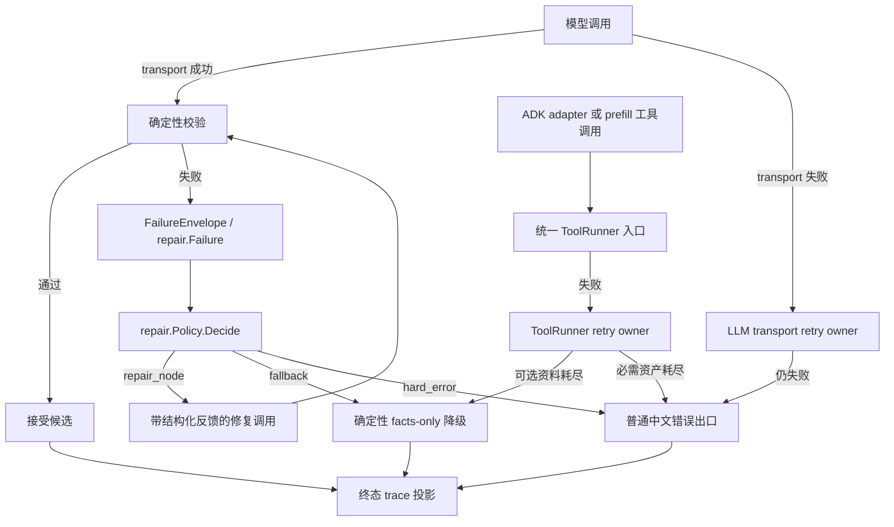

# 统一错误处理、重试与修复方案

## 1. 目标

本方案解决三个用户可见问题：

1. 合同失败后是否重试、修复、降级或停止，不再由多个层重复决定。
2. 修复失败后，模型能收到足够且有界的错误反馈；同一字段最多修复 2 次，整轮最多修复 2 次。
3. 最终 trace 不再把“曾经失败、后来接受”伪装成从未失败，`facts_only_degraded` 必须能解释原因。

### 非目标

- 不新增 supervisor、Agent 或第三套状态机。
- 不允许模型修改四柱、起运、大运等确定性事实。
- 不把所有错误都交给模型；模型候选可修，确定性计算自身冲突必须停止。
- 不在本批次迁移 Qimen/Ziwei 的领域合同，先用八字闭环证明共享合同。

## 2. 当前证据

已从代码和 trace 确认：

- `trc_c4cebf450c82` 出现 `dynamic_facts_only_degraded`，但最终
  `bazi.contract.failure_class=clean`，失败原因被清掉。
- 一次失败会经过
  `static_judgment -> contract_check -> repair -> contract_check -> lifetime_dayun_judgment -> contract_check -> recover_facts -> render`。
- 同一失败至少在以下位置重复解释：
  `specialists/bazi/domain/contract_policy.go`、
  `specialists/bazi/application/bazi_contract_failure.go`、
  `specialists/bazi/adapter/types_compat.go`、
  `internal/repair/policy.go`。
- `method_contract` 当前通过 Bazi adapter/application 临时映射为 `schema_error`，而共享 `repair.Policy` 仍把它视为 hard error；这说明真正的决策 owner 不唯一。
- `baziClearContractFailureTraceAttrs` 会把失败属性覆盖为 `clean`，接受修复后无法查询初始失败。
- specialist 的 ADK 工具路径目前通过 `runtime/adapter.go` 直接调用 registry 中的
  `Tool.Execute`，没有经过 prefill 使用的 `ToolRunner.Run`；因此配置在 ToolRunner 的参数治理、timeout、retry、trace 和幂等约束并未覆盖主链。
- `KnowledgeSearchTool.Execute` 又会把 MCP 错误吞成 `fallback=true, err=nil`，即使接入 ToolRunner 也无法触发 transient retry。

上述事实是本方案的基线；最新真实 trace 仍需在实施后重新验证，不能用旧 trace 证明修复生效。

## 3. 目标流程

保留当前 L2 工作流、Graph 和有界 self-loop，只统一错误合同和决策入口；不升级为自主 Agent 循环：



每次循环只允许一个 `RepairDecision`。Graph 负责执行节点和转移，不再重新推断 recovery policy。

transport、工具和业务合同共用 trace 字段规范，但保留各自现有分类类型和执行循环：模型 transport 由 `internal/llm` 重试，工具/MCP 由 `ToolRunner` 重试，模型输出合同由 `internal/repair` 决定 repair/fallback/hard error。这样集中策略而不制造一个依赖所有层的万能重试器。

这里的工具目标流程有一个实施前提：先让 ADK specialist adapter 和 prefill 都进入同一个 `ToolRunner.Run`。不能只修改 ToolRunner 策略，否则生产主链仍会绕过新策略。

`internal/repair.Policy` 不再拥有 transport action：迁移 `ClassForHTTPStatus`/`HTTPStatusRetryable` 到 `internal/llm`，删除 `Policy.TransportMaxAttempts` 和 `ActionRetry`。工具层继续使用 `ToolErrorClass`，不强行改成 repair class；统一的是字段语义、预算原则和观测合同，不是把所有错误塞进一个枚举。

## 4. 统一合同

### 4.1 FailureEnvelope（沿用现有 `repair.Failure`）

`FailureEnvelope` 是方案中的语义名称；实现不新增第二套平行结构，直接沿用已有
`internal/repair.Failure`。领域校验器先产生不依赖 repair 包的 `ContractFailure`，application 在边界处唯一映射为 `repair.Failure`，repair policy 再派生动作和预算状态：

```text
repair.Failure {
  Domain, Stage, Class, Field, Origin
  Code, Message, Excerpt
  MissingRefs, AllowedRefs
  Fallback                 // 仅表示允许的降级候选，不是最终 action
}
```

领域层只负责“发生了什么、缺什么、允许什么”；不导入 `internal/repair`，不填写最终 action，不调用模型，不写用户文本。application 的映射只做类型翻译，不调用 `Policy.Decide`。`Origin` 至少区分 `model_candidate`、`tool`、`system`，用于 trace 和防止把系统不变量故障交给模型。

`ViolationMethodContract` 是领域校验的来源码，不等于最终 repair action。它必须按 finding 细分为 `schema_error`、`projection_mismatch`、`method_contract` 或 `fact_conflict`。共享 `repair.MethodContract` 保留，但语义改为“模型生成的领域方法合同错误，可带反馈修复”；删除当前临时的 `method_contract -> schema_error` 伪装映射。

模型候选与确定性事实冲突属于 `fact_conflict`，允许 repair；模型不能修改事实，修复后仍由同一 validator 复验。排盘工具、缓存、持久资产或两个确定性规则彼此冲突属于 `deterministic_conflict`，直接 hard error，不进入模型 repair。

### 4.2 RepairDecision

共享 `repair.Policy.Decide(repair.Failure, RepairState)` 是失败后的唯一动作决策入口：

```text
RepairDecision {
  Action       repair_node | fallback | hard_error
  Attempt      int
  MaxRepairAttempts int
  Exhausted    bool
  FinalReason  string
}
```

失败决策不返回 `accept`；接受是校验成功后的终态，而不是失败策略的动作。现有 `ActionAccept` 只保留给终态 trace/状态投影，不能作为 `Decide` 的失败输入结果。

`RepairState` 继续由 `internal/repair` 持有。本文的“重试 2 次”统一表示“初始调用之后再调用 2 次”，即最多 3 次实际调用。同一字段最多 2 次业务 repair，整轮最多 2 次业务 repair；transport retry 不占业务 repair 次数，但必须纳入总调用预算和 trace。各层保留符合自身语义的字段名，具体计数见 5.1，不做无收益的全局改名。

### 4.3 RepairInput

repair 模型必须看到本轮失败的结构化候选作为反例，否则它只能重新生成，不能针对原错误修正：

```text
RepairInput {
  RejectedCandidate  stage-local typed JSON，可空
  RejectedRawExcerpt parse_error 时使用，最多 8 KiB
  Failure            repair.Failure
  AllowedFix         []string
  MustPreserve       deterministic facts + accepted upstream claims
  Forbidden          []string
  Retry              int
}
```

允许回传的 `RejectedCandidate` 仅限当前节点刚解码、受 schema 约束的 JSON。若 JSON 根本无法解析，可回传本轮原始输出的有界、脱敏 excerpt，最多 8 KiB；不得把完整 provider 响应、完整 trace、其他用户历史或无界错误串反射给模型。修复结果必须再次通过同一 schema、引用目录、事实合同和语义合同；不能因为它来自 repair 节点而放宽校验。

现有静态 repair 会在部分场景带入 `canonical_synthesis`，但动态 repair 只带事实 payload、引用目录和错误反馈，没有保留刚被拒绝的动态候选。Batch 1 必须把 stage-local rejected candidate 写入 Graph 状态并传给 repair；这是对“把错误输出作为反例”的补全，不是新增历史记忆。

## 5. 分类与动作矩阵

传输/工具 retry 和业务候选 repair 是两套不同枚举、不同循环，不能放进同一个 `FailureClass` 决策表。

### 5.1 Transport 与工具 retry

| 层 | 分类 | 默认动作 | 耗尽后 | 说明 |
|---|---|---|---|---|
| 模型 transport | transient | retry | 普通中文错误出口 | 429、5xx、单次调用 timeout、空输出 |
| 模型 transport | fatal | stop | 普通中文错误出口 | 400、401、402 等不可通过重试解决 |
| 工具/MCP | transient/internal 且幂等 | retry | 由调用方按工具合同决定 fallback 或 hard error | timeout、临时网络错误、5xx |
| 工具/MCP | invalid/permission/business/canceled | stop | hard error 或既有取消出口 | 参数、权限、业务拒绝和父 context 取消 |

可选知识资料在重试耗尽后才允许由 adapter 生成 fallback；排盘、起运等必需资产失败不能静默降级。

### 5.2 业务候选 repair

| FailureClass | 默认动作 | repair 次数 | 耗尽后 | 说明 |
|---|---|---:|---|---|
| `parse_error` | `repair_node` | 2 | 按阶段 fallback，否则 hard error | JSON 不可解析 |
| `schema_error` | `repair_node` | 2 | 按阶段 fallback，否则 hard error | 枚举、必填、范围、引用格式 |
| `projection_mismatch` | `repair_node` | 2 | 动态 facts-only；静态按白名单决定 | 输出无法投影到合同 |
| `method_contract` | `repair_node` | 2 | 按阶段 fallback，否则 hard error | 模型候选违反领域方法合同 |
| `evidence_overclaim` | `repair_node` | 2 | 静态 facts-only；动态仅白名单降级，否则 hard error | 结论超过证据 |
| `domain_unauthorized` | `repair_node` | 2 | facts-only 或 hard error | 删除或收窄越过授权范围的模型内容 |
| `fact_conflict` | `repair_node` | 2 | 按阶段 fallback，否则 hard error | 模型候选必须服从确定性事实 |
| `deterministic_conflict` | `hard_error` | 0 | hard error | 工具、资产或确定性规则彼此冲突 |
| `guardrail_blocked` | 不进入 repair | 0 | Batch 0 按 final guard 现有能力冻结为安全出口或 hard error | 只有已有确定性安全输出时才允许 fallback |
| `unknown` | `hard_error` | 0 | hard error | 未分类必须显式暴露 |

实际 fallback 仍由阶段白名单控制，不能由错误字符串猜测。只要错误对象是模型候选，schema、projection、method、越权、证据越界和事实冲突都先进行有界 repair；宿主取消、确定性系统冲突和未知不变量故障直接停止。`guardrail_blocked` 不凭方案臆造 facts-only 能力：Batch 0 若确认 final guard 没有对应的确定性安全输出，就固定为 hard error。

### 5.3 四层预算关系

现有系统有四层相关控制，必须明确职责和乘法边界：

| 层 | 现有 owner | 目标上限 | 规则 |
|---|---|---:|---|
| 模型 transport | `internal/llm/model_retry.go` | 2 次 retry | 唯一 transport retry owner；处理 429、5xx、timeout、空输出 |
| 工具/MCP | `internal/tools/runner.go` | Batch 0 冻结 | 只重试幂等工具的 transient/internal；参数、权限、业务拒绝不重试 |
| 领域 repair | `internal/repair` + Bazi Graph | 2 次 | 只处理结构/语义合同；同字段和整轮预算都由 `repair.State` 记录 |
| 外层编排 | `runtime/orchestration_graph_loop.go` | 0 次模型重试 | 可重跑纯确定性 prefill；runner 返回失败后不再整轮 dispatch |

同一失败只允许一个 retry owner。模型 transport 已由 ADK `ModelRetryConfig` 处理；外层不能因 specialist/runner 返回 `Retryable=true` 再执行整个 runner，否则一次请求可能重复排盘、检索和整套 Graph。外层保留 prefill 的纯确定性重跑，但删除 primary runner 的整轮 dispatch retry。每次实际重试还必须输出一条结构化服务日志：模型记录 `layer/attempt/max_retries/reason`，工具记录 `layer/tool_name/attempt/max_attempts/error_class`，业务 repair 记录 `layer/domain/stage/class/field/attempt/max_attempts/action`。日志不得包含用户消息、命盘、候选文本、提示词、工具参数或原始错误；完整关联与最终 action 继续由 trace 保存。

取消和截止时间高于所有 retry policy：父 `context.Canceled` 永不重试；单次 activity timeout 可以重试，但父 deadline 已到时立即停止。所有 backoff 必须用可取消的 timer/select，不能使用裸 `time.Sleep`。当前 ToolRunner 把 `context.Canceled` 分类为 transient 且用 `time.Sleep` 退避，是 Batch 1 的明确修复项。

工具层当前有两处已确认的断点：ADK specialist adapter 直接调用 raw `Tool.Execute`，绕过 ToolRunner；`KnowledgeSearchTool.Execute` 又把 MCP 超时/HTTP/解析错误转换成 `fallback=true, err=nil`。实施顺序必须是：ADK adapter/prefill 统一走 ToolRunner，知识库 MCP failure 返回可分类 error，ToolRunner 执行 transient retry，耗尽后才由知识检索 adapter 转成可选资料 fallback。必需资产工具不得静默 fallback。

计数观测统一为：trace 中 `attempts` 表示实际调用总数。Eino `MaxRetries=2` 和 ToolRunner `MaxAttempts=2` 是否分别表示 3 次、2 次实际调用，先由 Batch 0 的计数测试冻结；不为了统一名字机械改 API。产品是否要求工具也达到“初始调用 + 2 次 retry”，应在基线明确后通过显式合同和测试调整，不能顺带改变线上调用量。

## 6. 代码所有权

### 保留

- `internal/repair`：`FailureClass`、现有 `repair.Failure`、`RepairState`、预算和 `Policy.Decide`。
- `internal/tools`：所有 registry 工具的唯一执行入口，拥有工具参数治理、timeout、retry、trace 和幂等约束；不决定业务候选 repair。
- `internal/runtime`：只负责外层执行和状态转移；不决定领域 repair，也不重复模型 transport retry。
- `specialists/bazi/domain`：验证确定性事实、识别合同失败、生成领域证据和允许引用。
- `specialists/bazi/adapter`：调用模型/工具、执行 Graph 节点、消费 `RepairDecision`。
- `specialists/bazi/presentation`：只消费已接受或已降级的事实，不参与错误决策。

### 依赖方向

```text
domain -> Go 标准库和领域类型
application -> domain + repair contract mapping
adapter/graph -> repair.Policy + domain validator
runtime -> repair decision + specialist result / final audit
presentation -> validated result
```

domain 不得依赖 `internal/repair` 或 runtime；它只产生领域 `ContractFailure`/`ViolationCode`。application 是领域失败到共享 `repair.Failure` 的唯一映射 owner。presentation 不得依赖 repair policy；Graph 不得再维护一份 recovery action 表。现有 `domain/repair_failure.go` 对 `internal/repair` 的依赖与该方向冲突，必须在清理批次移出 domain。

## 7. Trace 合同

失败历史与最终状态并存，不再用空值覆盖历史。运行时继续使用 `repair.Failure`；`internal/repair` 拥有短结构 `repair.FailureSnapshot`，Graph 直接保存它，字段限于 domain/stage/class/field/code/origin/fallback。`RepairState` 第一次 `RecordFailure` 时只设置一次 `InitialFailure`，每次失败都更新 `LastFailure`；成功 repair 不清空二者。不得把 `Cause error`、候选正文或 feedback value 放进 Graph state。现有 Bazi domain 的 `RepairFailureState` 删除并合并为这个共享 DTO：

```text
repair.initial_class
repair.initial_stage
repair.initial_field
repair.failure_origin
repair.attempts
repair.last_action
repair.final_action
repair.exhausted
recovery.final_state
recovery.final_policy
recovery.degrade_reason
recovery.failed_stage
output.mode
repair.policy_version
repair.prompt_version
repair.validator_version
```

repair 成功本身应记录 `candidate_status=accepted_after_repair`，不应因此把 `turn_status` 标成 `degraded`；只有其他阶段仍发生降级时两者才可以同时存在。只有 `InitialFailure` 为空且最终没有降级时，才允许 legacy `failure_class=clean`。旧的清空函数必须改成统一 final projector：可清理“当前活动失败”，但必须保留 `initial_*`、`final_*` 和降级原因。

`repair.Attempt` 只保存 domain/stage/class/field/attempt/action、feedback keys、hint count 和版本号；删除当前可携带完整 `Feedback map[string]any` 的字段。反馈正文只存在于本次 repair 调用内存中，trace 仍只写 key 和计数。唯一的纯 repair trace projector 放在 `internal/repair`，返回安全短字段 map；`internal/tracing` 只负责发送，不理解 repair 业务，runtime/application/adapter 不再各写一份。

## 8. 分批实施与验证

### Batch 0：冻结基线

- 先同步 `docs/architecture.md` 和 `docs/acceptance-criteria.md`：明确模型候选错误可 repair、确定性系统冲突 hard error、repair 上限 2 次、知识库先重试后可选降级。旧验收当前仍写着 `fact_conflict`/`method_contract` 不 repair 且最多一次，不能带着旧合同实施。
- 固定一条合同 repair、一次 facts-only、一次 hard error 和一次 transport 失败轨迹。
- 记录模型、工具、领域 repair、外层四层的实际调用次数，确认 `MaxRetries`/`MaxAttempts` 的现有语义。
- 确认 final guard 对每种 `guardrail_blocked` 是否已有确定性安全输出；没有则冻结为 hard error。
- 验证：focused tests、`go test ./backend/...`、server build；Langfuse 不可用时把观测基础设施失败单独标为 UNKNOWN。

### Batch 1：合同收口

- 沿用现有 `repair.Failure` 作为 envelope；只补充 `deterministic_conflict` 和终态 decision 字段，不增加平行 DTO。
- 将 HTTP transport 分类从 `internal/repair` 移到 `internal/llm`；repair policy 删除 transport budget 和 retry action，只保留业务候选的 repair/fallback/hard error。
- 修正 `Policy` 的分类矩阵；删除 `MethodContract -> hard_error` 的默认分支。
- Bazi validator 将 method contract finding 映射为 schema/projection/method/fact conflict，并为每个 finding 写映射测试。
- Graph 保存当前 stage-local rejected candidate，static/dynamic repair 都把它作为有界反例；repair 后重新运行同一套 validator。
- 分层固定计数语义，补齐 parse/transport 的 2 次重试测试；不为统一命名改写 ToolRunner 的 `MaxAttempts`。
- 统一工具执行入口：`inferRegistryTool`、`newKnowledgeSearchAdapter` 和 prefill 都调用同一个 ToolRunner；迁移 `newDayunAdapter` 内部对 `yongshen.Execute` 的直接调用。
- 修复知识库工具吞错：MCP transient error 先交给 ToolRunner 重试，耗尽后才由 adapter 生成可选资料 fallback。
- 修复取消语义：ToolRunner 对 `context.Canceled` 不重试，backoff 可被父 context 取消；模型空输出 retry 也先检查父 context。
- 验证：repair 单测、Bazi contract 单测、`go test ./backend/...`。

### Batch 2：删除重复映射

- application 是 `ContractFailure -> repair.Failure` 的唯一映射 owner；adapter 不再重复映射，两者都不局部调用 `Policy.Decide`。
- Graph 只消费 `RepairDecision`，不再读取 Bazi recovery policy 决定 action。
- runtime 删除 primary runner 的整轮 dispatch retry；模型 transport 仅由 `internal/llm` 重试。
- 删除 `executeRegistryTool -> raw Tool.Execute` 旁路，禁止 adapter 绕过 ToolRunner。
- 验证：禁止符号审计、`go list ./backend/...`、全量测试、server build。

### Batch 3：trace 终态

- 用统一 projector 写 initial/last/final 字段。
- 合并 runtime/application/adapter 的 repair trace 投影；attempt 只保存安全短字段和版本号，不保存 feedback value。
- 删除“清成 clean”的覆盖语义。
- 验证：失败 -> 修复 -> 接受、失败 -> facts-only、失败 -> hard error 三条轨迹测试。

### Batch 4：回归与真实链路

- 每个历史故障至少一个 Graph/合同回归用例。
- L1 代码断言必须覆盖：失败分类不丢失、模型 fact conflict 会 repair、deterministic conflict 不 repair、合同失败和 transport 失败都不触发外层重复 dispatch、MCP transient 确实经过 ToolRunner、父取消立即停止且不 backoff、repair 收到被拒绝候选、repair 后重新校验、唯一 `done`、降级必须有原因。
- L2 Judge 只用于主观命理表达质量；若启用，先用人工标注校准，不把未校准分数当发布门禁。
- 至少固定五类产品故障 fixture：错领域路由、引用越界、事实冲突、格局合同失败、动态 facts-only 无原因。
- 真实 `/api/chat` SSE 验证唯一 `text`/`done`、中文错误出口和取消传播。
- Langfuse eval 验证新 trace 包含 repair attempt 和最终原因；旧 trace 不作为通过证据。

## 9. 回滚

每批独立提交；若真实回放出现 SSE 顺序、事实值或终态改变，只回滚该批。不得通过重新启用旧的多处映射来“临时修复”，否则会恢复当前的决策分裂。

## 10. 明确删除/合并的无效代码

以下不是“以后考虑”，是本方案完成时的清理验收项：

1. **收口 application 映射**：`bazi/application/bazi_contract_failure.go` 保留且仅保留 `ContractFailure -> repair.Failure` 的唯一类型映射；删除 `repairFallbackFromBaziRecoveryPolicy` 和其中直接 `Policy.Decide` 的 action 计算。若现有 `repairClassFromBaziContract` 可直接承担唯一映射就复用，不为改名重写。
2. **删除 adapter 第二份映射**：删除
   `bazi/adapter/types_compat.go` 的 `repairClassFromBaziContract` 和重复 fallback 映射；adapter 直接消费 application 产出的统一 envelope。
3. **收窄领域策略文件**：保留 `contract_policy.go` 的领域分类和阶段 fallback 白名单，删除其中与 `repair.Policy` 重复的 retry/action 决策。只有迁移后确认该文件只剩机械转发表，才合并进分类器并删除文件；不能为了“集中”误删仍有领域语义的白名单。
4. **合并失败重建**：将 `baziRecordInternalFailure`、`repairFailureStateFromRuntime`、`baziFailureErrorFromState` 中重复的失败重建收束为一个 projector；删除旧的多次转换链。
5. **删除清空式 trace 函数**：删除 `baziClearContractFailureTraceAttrs` 的“写 clean 覆盖历史”实现，替换为统一 final trace projector；旧函数名和调用点清零。
6. **删除临时伪装映射**：保留 `repair.MethodContract` 和领域输入码 `ViolationMethodContract`，把共享 action 改为有界 repair；删除 application/adapter 中 `method_contract -> schema_error` 的临时映射，并为每个 finding 保留明确的 schema/projection/method/fact 分类测试。
7. **保留但去决策的节点**：`baziRecoverFactsNode` 仍保留为确定性执行节点，但删除其独立分类判断；`baziRepairNode` 只执行 `repair_node` 决策。
8. **预算唯一 owner**：保留 `internal/repair/budget.go`，删除任何领域或 adapter 自己维护的 attempt 上限和计数。
9. **删除外层重复重试判断**：清理 `runtime/orchestration_graph_loop.go` 中 primary runner 失败后按 `Retryable` 再次 dispatch 的分支；模型 transport 只由 `internal/llm` 重试，外层仅保留纯确定性 prefill 重跑。
10. **移除 domain 对 repair 的反向依赖**：把 `bazi/domain/repair_failure.go` 的共享 repair 状态投影移到 application 或 graph 边界；domain 只保留 `ContractFailure` 和 validation violation。
11. **补齐动态反例并清理旧半实现**：统一 static/dynamic 的 `RepairInput`；删除“静态偶尔带 canonical、动态不带 rejected candidate”的双轨 payload 构造。
12. **删除工具执行旁路**：删除 `runtime/adapter.go` 中 `executeRegistryTool -> raw Tool.Execute` 路径；`inferRegistryTool`、`newKnowledgeSearchAdapter` 和 prefill 统一调用 ToolRunner，`newDayunAdapter` 内部对 `yongshen.Execute` 的直接调用也迁入统一入口。
13. **删除知识库假重试路径**：`KnowledgeSearchTool.Execute` 不再在 ToolRunner 之前把 MCP 错误吞成成功 fallback；统一为“先返回分类错误并重试，耗尽后由 adapter fallback”。
14. **删除不可取消退避**：ToolRunner 不再把 `context.Canceled` 当 transient，不再用裸 `time.Sleep`；改为可取消 timer，并保留单次 activity timeout 的可重试分类。
15. **删除 repair 对 transport 的越权职责**：把 `ClassForHTTPStatus`/`HTTPStatusRetryable` 迁到 `internal/llm`，删除 `Policy.TransportMaxAttempts` 和 `ActionRetry`；工具仍使用自己的 `ToolErrorClass`。
16. **删除状态中的 feedback 正文**：`repair.Attempt` 改存 feedback keys、hint count 和版本号；删除可序列化的完整 `Feedback map`。
17. **合并 repair trace projector**：删除 runtime、Bazi application 和 adapter 的重复 trace attr 构造，统一由 `internal/repair` 的纯 projector 输出安全短字段，tracing 只负责发送。

清理完成的硬验收：`rg`/CodeGraph 中不再存在上述旧 helper 的生产调用；没有第二份 action matrix；全量 backend 测试、构建、真实 SSE 和 Langfuse trace 均通过。

## 11. 未知与风险

- 需要新真实 trace 证明当前临时 `method_contract -> schema_error` 修复已进入运行中的后端。
- Qimen/Ziwei 是否能直接复用该 envelope，等八字轨迹稳定后再决定。
- Langfuse 连接失败属于观测基础设施故障，不能误报为业务失败；评测报告必须分开记录。
- Eino `MaxRetries` 的含义必须在 Batch 0 用实际调用计数确认；不能把“2 次 retry”和“2 次 total attempt”混写。
- 统一合同后仍可能存在领域专属 recovery state；只有 action 决策收口，不要求所有展示状态立即同名。
- 工具合同的 `MaxAttempts` 与模型合同的 `MaxRetries` 当前语义不同，迁移时必须保留兼容测试，避免一次改名改变线上调用量。
