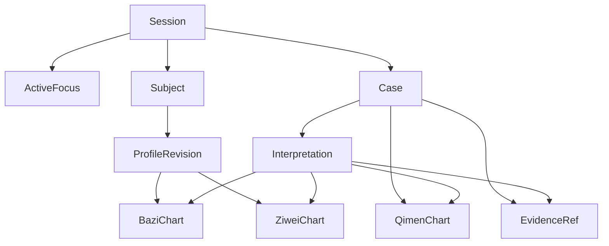

# 多对象命理资产与自动解析方案（拟实施）

> 状态：已确认设计，尚未实现。本文是实施合同，不替代 `docs/architecture.md` 对当前运行时的描述。

## 要解决的问题

当前会话把 `Profile`、`BaziResult`、`QimenResult`、`ZiWeiResult` 放在单一
`SessionState` 中。它只能安全表示“当前一个对象的一套资料”。对象切换、出生资料
修订、同一会话多次奇门起局，以及跨对象比较时，系统没有足够身份和版本信息来证明
本轮复用的是哪一份数据。

另一个问题是 follow-up 复用 `last_interpretation` 的自然语言摘要。摘要能帮助承接
话题，却不能作为四柱、大运、起运日期等命理事实的来源。

本方案的目标是保持自然聊天：用户不需要配置“当前人物”或手工选择版本；系统只在
确实无法唯一确定对象、资料或时间时提出一条澄清。

## 核心原则

1. 每轮先绑定对象、资料版本、咨询事项和时间范围，再执行领域分析。
2. 确定性事实只来自工具产物，LLM 只能解释和组织这些事实。
3. `Manager` 仍是唯一 conversation owner，但只持有本轮选择结果和引用，不保存全部资产 payload。
4. 资产强类型化；不将八字、奇门、古籍片段和解读统一退化为无类型 `map[string]any`。
5. 复用必须证明兼容；无法证明时重算或澄清，禁止按“最新一份”猜测。

## 领域对象



### Subject（咨询对象）

稳定表示“自己、孩子、配偶”等人。`SubjectID` 不因昵称、资料修正或切换会话而改变。

```go
type Subject struct {
	ID        string
	Display   string // 自己、孩子、父亲；仅作对话显示
	CreatedAt time.Time
}
```

### ProfileRevision（出生资料版本）

同一人的出生资料发生修订时创建新版本，不覆盖旧版本。资料是本命盘的输入，不是本命盘本身。

```go
type ProfileRevision struct {
	ID          string
	SubjectID   string
	Version     int
	BirthData   NormalizedBirthData
	Fingerprint string // 标准化输入哈希，仅用于缓存匹配
	Supersedes  string
	CreatedAt   time.Time
}
```

`NormalizedBirthData` 必须含公历日期、时分、性别、出生地、时区、真太阳时选择及资料完整度。
八字工具输出必须补齐大运方向、方向依据、精确起运时刻和每步大运起止边界；这些字段不能再只保留
虚岁区间。

### Case（咨询事项）

表示一次用户问题的上下文，不等同于聊天轮次。一个 Case 可以指向一个人、多人比较，或一个事件。

```go
type Case struct {
	ID            string
	SessionID     string
	SubjectIDs    []string
	Domain        string
	Question      string
	TimeScope     TimeScope
	EventTime     *time.Time // 奇门等事件盘必填
	CreatedAt     time.Time
}
```

本命盘归 `Subject + ProfileRevision`；奇门盘归 `Case + EventTime`。因此“同一个人今天上午和
下午各起一局”会得到两份独立的 QimenChart，不会覆盖彼此。

### DomainAsset（强类型领域资产）

不做一个泛型 payload 仓库。仓储接口可以统一，但对外模型必须强类型，例如 `BaziChart`、
`ZiweiChart`、`QimenChart`、`Interpretation`。

每份资产具备统一的元信息：

```go
type AssetRef struct {
	Kind    string // profile_revision | bazi_chart | ziwei_chart | qimen_chart | interpretation
	ID      string
	Version int
}

type AssetMeta struct {
	Ref           AssetRef
	OwnerRef      AssetRef       // ProfileRevision 或 Case
	SubjectIDs    []string
	InputRefs     []AssetRef
	MethodVersion string
	CalendarRule  string
	EffectiveTime *time.Time
	PayloadHash   string
	CreatedAt     time.Time
}
```

`BaziChart.InputRefs` 必须包含 ProfileRevision；`QimenChart.InputRefs` 必须包含 Case；
`Interpretation.InputRefs` 必须包含它实际使用的命盘资产和证据引用。

### EvidenceRef（知识证据引用）

古籍属于知识库，不属于某个 Subject。运行时只保存本轮使用的稳定引用：文档 slug、段落/片段 ID、
内容哈希和检索时间。知识库内容修订后，旧解读仍能说明它当时引用的内容版本。

## Session 与 Manager 的边界

Session 保存对话连续性和选择指针，而不是整套领域数据：

```go
type ActiveFocus struct {
	CaseID            string
	SubjectIDs        []string
	ProfileRevisionID string
	PrimaryAssetRefs  []AssetRef
}

type SessionState struct {
	SessionID     string
	ActiveFocus   ActiveFocus
	RecentTurns   []Turn
	RunningSummary string
	Execution     contracts.ExecutionSnapshot
}
```

`Manager` 读取 Session 和 `DomainAssetRepository`，生成本轮 `ExecutionPlan`。它只传入
specialist 所需的 `ContextPack`，不把历史全部、所有人物或所有盘灌入模型上下文。

## 自动解析流程

```text
用户消息
  -> RouteAdvisor：识别领域、显式槽位、候选对象表达
  -> ArtifactResolver：解析 Subject / ProfileRevision / Case / 时间
  -> 唯一匹配：绑定资产引用
  -> 缺少或不兼容：加入重算任务
  -> 多个合理候选：澄清短路
  -> ExecutionPlan
  -> Prefill / ToolRunner
  -> ContextPack
  -> specialist / renderer / final guard
```

`ArtifactResolver` 是普通 Go 代码，不是新的 LLM Agent，也不是 `fact_verification` 路由。
它只处理身份、版本、时间和兼容性选择。其优先级为：

1. 当前消息中的显式对象、出生资料、起局时间和“上一张/旧版”等限定词。
2. 本轮 RouteAdvisor 已提取的结构化槽位。
3. `ActiveFocus`。
4. 最近同一 Case 的已绑定资产。

只有唯一候选才能自动选中。以下情况必须澄清：

- “他”的候选同时是孩子和父亲。
- 同一人存在两个不同的出生时分，用户未说明以哪版为准。
- “上次奇门盘”对应多个 Case 或起局时间。
- 比较请求只明确了其中一个对象。

这让大多数正常聊天保持无感；澄清不是失败，而是拒绝静默串盘。

## 复用合同

### 命盘复用

本命盘仅在下列键完全匹配时复用：

```text
SubjectID + ProfileRevisionID + chart kind + method version + calendar rule
```

奇门盘还必须匹配 `CaseID + EventTime`。工具实现或历法规则升级后，旧资产可保留查看，
但不能静默视为与新版等价。

### 解读复用

旧解读只能作为对话背景或候选素材，不能作为事实源。可直接续答的条件是：

```text
同一 Case
+ 同一 Subject 集合
+ 同一命盘资产版本
+ 问题未超出旧解读覆盖范围
+ 证据/方法合同仍兼容
```

条件不满足时，复用命盘并重新解释；出生资料修订时，命盘和解读都重新生成。

## ContextPack 与声明合同

specialist 输入改为最小投影：

```go
type ContextPack struct {
	Case          Case
	Subjects      []Subject
	ProfileRefs   []AssetRef
	ChartRefs     []AssetRef
	EvidenceRefs  []EvidenceRef
	RecentContext ConversationSlice
}
```

specialist 输出不得只有自然语言，而应返回结构化声明：

```go
type Claim struct {
	Kind         string // deterministic | derived | interpretive
	Text         string
	SubjectRefs  []AssetRef
	EvidenceRefs []EvidenceRef
}
```

四柱、大运顺逆、起运日期、干支序列属于 `deterministic`，必须能在绑定的工具结果中找到。
格局判断、趋势说明和建议属于 `derived` 或 `interpretive`，也必须指向所用的命盘/证据。
final guard 校验声明与引用，不依赖关键字黑名单，也不因用户是否质疑而改变严格程度。

## ExecutionPlan 改造

当前 `RequiredArtifacts: []string{"bazi_chart"}` 不够表达身份。替换为精确需求：

```go
type ArtifactRequirement struct {
	Kind          string
	OwnerRef      AssetRef
	SubjectIDs    []string
	EffectiveTime *time.Time
	Compatibility CompatibilityPolicy
}

type ExecutionPlan struct {
	Route               policy.ApprovedRoute
	CaseRef             AssetRef
	SubjectRefs         []AssetRef
	Requirements        []ArtifactRequirement
	ResolvedAssets      []AssetRef
	Recompute           []ArtifactRequirement
	NeedsClarification  bool
	ClarificationReason string
}
```

Prefill 只按 `Requirements` 准备资产；follow-up 的 `direct/reuse_artifact/rerun_specialist` 决策
保留在 Manager，但它的输入从“当前 Session 有没有一张盘”升级为“当前 Case 的指定资产是否兼容”。

## 实施阶段

### Phase 1：确定性排盘合同

- 补齐八字输出的出生分钟、方向、方向依据、起运准确时刻和大运日期边界。
- 以实际起运边界判断当前大运，替代仅按虚岁选运。
- 为新字段写工具合同测试和历法边界案例。

涉及：`backend/internal/tools/bazi/calc.go`、`liunian.go`、工具合同和八字 fixture。

### Phase 2：引入资产身份与仓储

- 新建 `state/assets` 或等价强类型包，定义 Subject、ProfileRevision、Case 和各领域资产。
- 增加 `DomainAssetRepository`，初版沿用当前本地 session JSON 存储，不引入数据库、事件溯源或图数据库。
- 写单次迁移：将旧 Session 的 Profile/三种 Result 导入一个默认 Subject、ProfileRevision 和 Case。

### Phase 3：Resolver 与精确 Prefill

- 在 `Manager.BuildExecutionPlan` 后、orchestrationGraph 前插入 ArtifactResolver。
- 将 `RequiredArtifacts` 迁为 `ArtifactRequirement`。
- 删除“切换 Subject 时清空旧盘”和“当前字段覆盖旧结果”的写入路径。

### Phase 4：解读来源与最终约束

- 用 `InterpretationArtifact` 替代 `DomainContext.RuntimeValues["last_interpretation"]`。
- specialist 返回 Claim 和来源引用。
- final guard 阻断无来源的 deterministic Claim，并把 asset refs 写入 TurnTrace / ExecutionSnapshot。

### Phase 5：前端无感呈现与回归

- 正常情况不新增设置页；仅在歧义时显示一句澄清。
- 命盘卡携带可见的对象名、资料版本和起局时间，便于人工发现上下文是否正确。
- 以 SessionSnapshot 恢复 ActiveFocus 和卡片引用，而不是恢复一个隐式“当前盘”。

## 验收用例

新增以下回归用例，并保留现有单对象 happy path：

1. 自己与孩子同会话排盘后，问“孩子的学业”只绑定孩子的盘。
2. “他的学业”同时可指两人时，返回澄清且不触发 specialist。
3. 修改出生时间后生成 Profile v2；旧解释仍可查看，但不能用于 v2。
4. 同日两个奇门时间生成两份盘；追问能通过 Case/时间精确命中。
5. 比较两人时 ContextPack 同时包含两份指定盘，不污染 ActiveFocus。
6. 大运、起运等 deterministic Claim 与工具资产字段一致；final guard 拒绝凭空新增。
7. 工具/历法版本变化时，旧资产不静默复用。
8. 既有单对象 follow-up 仍无感命中，且不额外触发全量排盘。

## 明确不做

- 不新增 `fact_verification` intent。
- 不要求用户手工设置当前对象或版本。
- 不把全部聊天记录向量检索后猜命盘。
- 不引入完整 CQRS、Event Sourcing、Temporal 或图数据库。
- 不让“最近结果”成为跨对象/跨版本的兜底选择。
- 不把领域资产长期继续放在单个 `SessionState` 槽位中。

## 完成定义

完成后，任一用户可见的命理事实均能在 trace 中追溯到：目标对象、出生资料版本或 Case、
确定性工具版本、历法规则和具体资产引用；系统在无法唯一绑定时会澄清，而不会产出一段来源不明却看似完整的结论。
