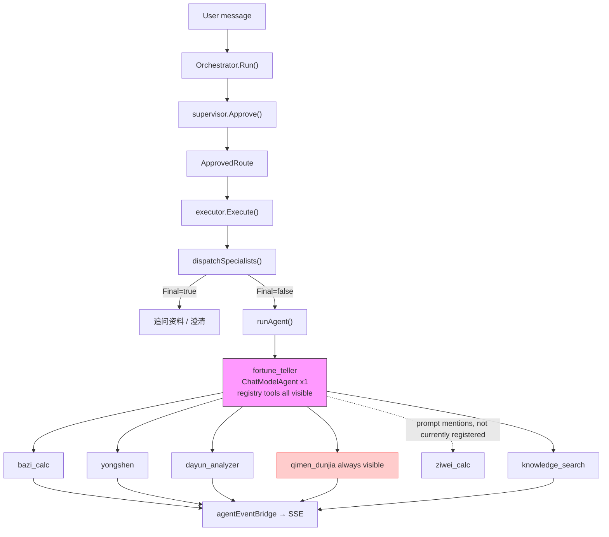
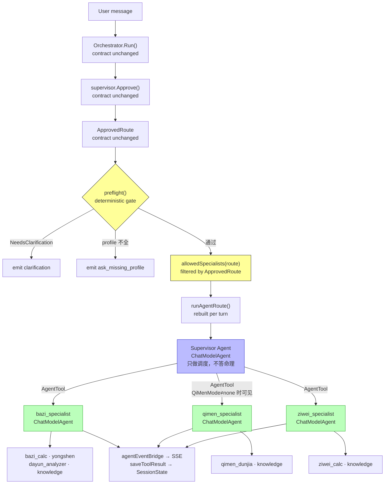
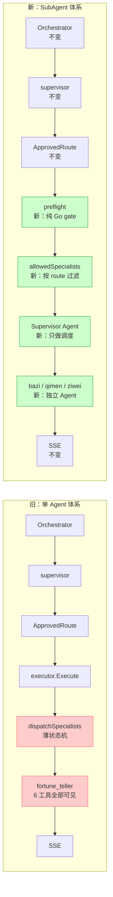
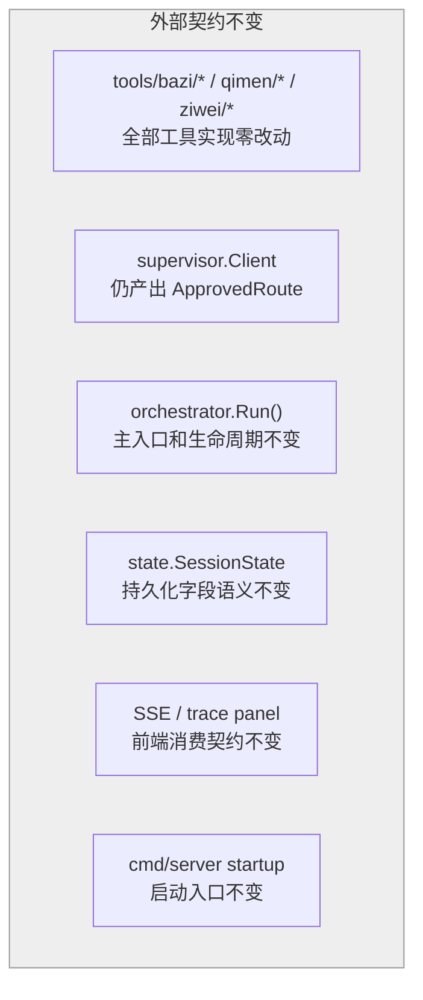

# Specialists AgentAsTool Implementation Plan

> **For agentic workers:** REQUIRED SUB-SKILL: Use superpowers:subagent-driven-development (recommended) or superpowers:executing-plans to implement this plan task-by-task. Steps use checkbox (`- [ ]`) syntax for tracking.

**Goal:** 将现有 `DomainHandler` 薄状态机彻底迁移为 `Supervisor Agent + AgentAsTool + Specialist Agent` 主链，同时保留 Go 侧 `ApprovedRoute`、policy、state、SSE、trace 的硬边界。

**Architecture:** `orchestrator` 仍先调用 `supervisor.Approve()` 产出 `policy.ApprovedRoute`，这是唯一可信路由输入。`runtime.Executor` 根据 `ApprovedRoute` 构建 route-bound Supervisor Agent，只暴露本轮允许调用的 specialist AgentTool；资料不全、澄清、profile gate 仍由 Go preflight 处理，不交给 prompt 猜。三个 specialist 是真正的 ADK `ChatModelAgent`，只挂各自领域工具。

**Tech Stack:** Go 1.21+, Eino ADK `ChatModelAgent` / `NewAgentTool`, lunar-go, Gin SSE, existing `TurnTrace`.

---

## 决策模式

### 决策点

这次不是“轻量收口”，而是把执行主链从单个 `fortune_teller` agent 改为父子 Agent。必须先决定父 agent 是否能自由重新路由；如果自由路由，会绕开当前已经验证过的 `qimen_mode/profile_requirement` 和 Go policy gate。

### 当前约束

当前稳定边界是：LLM supervisor 做语义路由，Go 负责 policy、state、trace、SSE 和工具执行边界。最近刚修复普通追问误触发奇门，所以新 AgentAsTool 方案必须 route-bound，不能引入第二套无约束 supervisor。

| 方案 | 优点 | 代价 | 风险 | 现有栈匹配 | 推荐 |
|------|------|------|------|----------|------|
| A. 父 Agent 自由选择所有 specialist | 最接近多 Agent demo | 会二次路由 | 高，可能绕过 `ApprovedRoute` | 低 | 否 |
| B. `ApprovedRoute` 决定可用 AgentTool，父 Agent 只在允许集合内编排 | 彻底迁移到 AgentAsTool，又保留硬边界 | 需要做 route-bound builder 和 contract tests | 中 | 高 | 是 |
| C. 只做工具分域，继续单 agent | 风险最低 | 不够彻底 | 低 | 高 | 备选 |

推荐 B：彻底迁移，但父 Agent 被 `ApprovedRoute` 约束。你决定。

---

## 架构对比

### 旧架构（单 Agent + 全量工具）



一个 agent 挂当前 registry 内全部工具，模型可以随意跨领域调用。当前 prompt 已写 `ziwei_calc`，但 container 尚未注册该工具；`fortune_followup` 仍能触发已注册的 `qimen_dunjia`，纯靠 prompt 约束不可靠。

---

### 新架构（Supervisor Agent + AgentTool Specialists）



**关键约束：** `allowedSpecialists(route)` 在构建 agent 之前过滤。`fortune_followup + QiMenMode=none` → qimen_specialist 根本不在工具列表中，模型调不了。

---

### 逐层对比



### 外部契约不变的部分



## 设计模式与可读性

| 模式 | 落点 | 解决的问题 | 可读性收益 | 不做什么 |
|------|------|------------|------------|----------|
| **Facade** | `runtime.Executor` | 对 `orchestrator` 隐藏 AgentAsTool 组装细节 | `orchestrator.Run()` 仍只看见 `Execute(route, message)` | 不把 ADK 类型泄露到会话生命周期层 |
| **Strategy** | `runtime/preflight.go` + `allowedSpecialists()` | 将 route gate 和 specialist 选择规则显式化 | 普通追问、奇门主链、跨领域分流都有独立规则入口 | 不把这些规则写进 prompt |
| **Registry** | `specialists.Registry` | 统一声明领域专家元数据 | 新增领域只读 `Register()`，不用追调用链找工厂函数 | 不让 registry 负责构建 ADK agent，避免 package cycle |
| **Builder** | `runtime.AgentBuilder` | 收敛 `adk.NewChatModelAgent` 重复配置 | retry、MaxIterations、ToolsConfig 的默认值集中可见 | 不保存 session mutable state |
| **Adapter** | `runtime/adapter.go` | 将项目 `tools.Tool` 转为 Eino `tool.BaseTool` | 领域 agent 只关心工具名，不关心转换细节 | 不在 adapter 内做路由判断 |
| **Policy Gate** | `preflight` + `ApprovedRoute` | 确保模型只能在批准边界内行动 | 安全规则可单测，可回归 | 不依赖父 agent 自觉遵守约束 |
| **Event Bridge** | `runtime/bridge.go` | 把 ADK nested events 映射回现有 SSE/trace/session | 前端和 trace panel 不需要理解 ADK 内部事件 | 不新建第二套事件协议 |

### 命名约定

- `Config` 只表示静态领域元数据；`Builder` 只负责把配置变成 ADK agent；`Executor` 只负责每轮执行。
- `preflight` 表示执行前硬判断；`allowedSpecialists` 表示本轮可见 AgentTool 集合；`agentEventBridge` 表示 ADK 到项目事件模型的转换。
- `Supervisor Agent` 是 runtime 内部编排器，不是新的权威 router；权威 router 仍是 `supervisor.Client -> policy.ApprovedRoute`。

## Non-negotiable Invariants

- `supervisor.Client` remains the only component that produces `policy.ApprovedRoute`.
- `policy.ApprovedRoute.PrimaryDomain`, `SecondaryDomains`, and `PolicyHints.QimenMode` decide which AgentTools are visible to the parent agent.
- Missing-profile and clarification behavior stays deterministic in Go.
- `fortune_followup` must not trigger `qimen_dunjia` unless `qimen_mode` is `primary` or `supplement`.
- `qimen_mode=primary` may run without full birth profile; `profile_requirement=full` must ask for profile first.
- Child agent tool results must still call `saveToolResult()` so `SessionState.BaziResult/QimenResult/ZiWeiResult` survive later turns.
- Inner agent events must be visible in SSE/trace before old `DomainHandler` code is deleted.
- No feature flag fallback path unless a task explicitly adds and tests it. The mainline should be clean after migration.

## File Structure

| Path | Responsibility |
|------|----------------|
| `internal/runtime/agent_tool_contract_test.go` | Local ADK contract tests for `NewAgentTool`, event streaming, input shape, and SessionValues. |
| `internal/specialists/types.go` | Add `Config` / `Registry` beside existing `DomainHandler`; delete old interface only in final cleanup. |
| `internal/specialists/bazi/specialist.go` | Register bazi specialist config: name, description, instruction, tool names. |
| `internal/specialists/qimen/specialist.go` | Register qimen specialist config. |
| `internal/specialists/ziwei/specialist.go` | Register ziwei specialist config. |
| `internal/runtime/adapter.go` | Add exported per-domain adapter builders and a shared adapter factory. |
| `internal/runtime/preflight.go` | Deterministic clarification / missing-profile gate before any agent run. |
| `internal/runtime/agent.go` | Build specialist agents, route-bound supervisor agent, retry settings. |
| `internal/runtime/executor.go` | Replace single runtime agent path with route-bound AgentAsTool execution. |
| `internal/runtime/bridge.go` | Ensure nested tool and agent events update SSE, trace, and session state. |
| `internal/container/container.go` | Register `ziwei_calc`; stop injecting old `DomainHandler` instances. |
| `PROGRESS.md` | Record the architecture decision after implementation passes verification. |

---

## Task 0: Baseline And ADK Contract Spike

**Files:**
- Create: `internal/runtime/agent_tool_contract_test.go`
- Test: `internal/runtime/agent_tool_contract_test.go`

- [ ] **Step 1: Write local contract tests for AgentAsTool input shape**

Create fake agents and fake tools with no LLM call. Verify default `adk.NewAgentTool(ctx, agent)` exposes the wrapped agent name/description and receives `{"request":"..."}` as plain child input.

- [ ] **Step 2: Write contract test for `WithFullChatHistoryAsInput`**

Verify whether the child agent receives full parent chat history when `adk.WithFullChatHistoryAsInput()` is used. This decides whether specialist AgentTools use default request input or full-history input.

- [ ] **Step 3: Write contract test for internal event forwarding**

Use the local Eino source behavior: inner agent events are forwarded only when the parent `ToolsConfig.EmitInternalEvents` path is enabled. The test must prove which config is required for `agentEventBridge` to see child tool calls.

- [ ] **Step 4: Write contract test for SessionValues propagation**

Pass `adk.WithSessionValues(map[string]any{"profile": ...})` to the parent runner and verify whether the child agent/tool can read it. If it does not propagate, the implementation must pass route/session context in the AgentTool request payload instead.

- [ ] **Step 5: Run contract tests**

Run:

```bash
go test ./internal/runtime -run 'TestAgentToolContract' -v
```

Expected: PASS. If any expectation fails, update later tasks before continuing.

- [ ] **Step 6: Commit**

```bash
git add internal/runtime/agent_tool_contract_test.go
git commit -m "test: capture ADK AgentTool runtime contract"
```

---

## Task 1: Add Regression Tests For Current Routing Guarantees

**Files:**
- Modify/Create: `internal/runtime/preflight_test.go`
- Modify/Create: `internal/runtime/executor_agent_route_test.go`

- [ ] **Step 1: Add test for ordinary bazi followup not using qimen**

Create an `ApprovedRoute` with `TaskIntent=fortune_followup`, `PrimaryDomain=bazi`, and `PolicyHints.QimenMode=none`. Assert route-bound tool selection does not include `qimen_specialist`.

- [ ] **Step 2: Add test for qimen primary without full profile**

Create an `ApprovedRoute` with `PrimaryDomain=qimen`, `PolicyHints.QimenMode=primary`, `PolicyHints.ProfileRequirement=none`. Assert preflight allows execution without complete `SessionState.Profile`.

- [ ] **Step 3: Add test for profile-required route**

Create an `ApprovedRoute` with `PolicyHints.ProfileRequirement=full` and incomplete profile. Assert preflight returns `ask_missing_profile` text before agent execution.

- [ ] **Step 4: Add test for cross-domain allowed tools**

Create `PrimaryDomain=bazi`, `SecondaryDomains=["qimen"]`, `QimenMode=supplement`. Assert allowed AgentTools are `bazi_specialist` and `qimen_specialist`, not `ziwei_specialist`.

- [ ] **Step 5: Run tests and verify they fail before implementation if helpers do not exist**

Run:

```bash
go test ./internal/runtime -run 'TestRouteBound|TestPreflight' -v
```

Expected: FAIL only because new helpers are not implemented yet.

- [ ] **Step 6: Commit tests**

```bash
git add internal/runtime/preflight_test.go internal/runtime/executor_agent_route_test.go
git commit -m "test: lock route-bound agent execution guarantees"
```

---

## Task 2: Add Specialist Config Registry Beside DomainHandler

**Files:**
- Modify: `internal/specialists/types.go`
- Modify: `internal/specialists/bazi/specialist.go`
- Modify: `internal/specialists/qimen/specialist.go`
- Modify: `internal/specialists/ziwei/specialist.go`

- [ ] **Step 1: Add config types while preserving `DomainHandler`**

`internal/specialists/types.go` should add data-only contracts next to the existing `Event`, `EventSink`, and `DomainHandler`. Do not import `internal/runtime` here; avoid package cycles. `DomainHandler` stays until Task 8 so all intermediate commits keep compiling.

```go
// Config describes one domain specialist AgentTool.
type Config struct {
    Domain      string
    Name        string
    Description string
    Instruction string
    ToolNames   []string
}

// Registry stores specialist configs in registration order.
type Registry struct {
    configs []Config
}

// NewRegistry creates an empty specialist registry.
func NewRegistry() *Registry { return &Registry{} }

// Register appends one specialist config.
func (r *Registry) Register(cfg Config) { r.configs = append(r.configs, cfg) }

// All returns a copy of registered specialist configs.
func (r *Registry) All() []Config {
    out := make([]Config, len(r.configs))
    copy(out, r.configs)
    return out
}
```

- [ ] **Step 2: Add bazi config registration alongside existing specialist**

`internal/specialists/bazi/specialist.go` should keep the existing `Specialist`, `New()`, `Name()`, and `Run()` methods for compatibility. Add `Register(r *specialists.Registry)` below the existing code.

```go
func Register(r *specialists.Registry) {
    r.Register(specialists.Config{
        Domain:      "bazi",
        Name:        "bazi_specialist",
        Description: "八字命理专家。根据出生时间排盘、分析用神忌神、解读大运走势。",
        Instruction: `你是八字命理专家。

## 可调用工具
- bazi_calc：排八字四柱命盘（需要年/月/日/时/性别）
- yongshen：分析日主强弱、取用神忌神（需要先有排盘结果）
- dayun_analyzer：分析大运走势、各步大运起止时间（需要先有排盘结果）
- knowledge_search：检索古籍原文（《渊海子平》《滴天髓》等）

## 执行规则
1. 用户提供了出生信息 → 先调 bazi_calc 排盘
2. 排盘后 → 根据需要调 yongshen 或 dayun_analyzer
3. 关键论断前 → 调 knowledge_search 获取古籍原文
4. 综合输出中文解读，引用古籍时标注出处

## 禁止
- 不得自行推算四柱（以系统排盘结果为准）
- 不得跳过排盘直接分析（除非 session 中已有命盘）`,
        ToolNames: []string{"bazi_calc", "yongshen", "dayun_analyzer", "knowledge_search"},
    })
}
```

- [ ] **Step 3: Add qimen config registration alongside existing specialist**

Keep the existing `Specialist`, `New()`, `Name()`, `Run()`, and `isTimingRelevant()` code. Add:

```go
func Register(r *specialists.Registry) {
    r.Register(specialists.Config{
        Domain:      "qimen",
        Name:        "qimen_specialist",
        Description: "奇门遁甲专家。分析当前时空的吉凶方位、门星神组合。",
        Instruction: `你是奇门遁甲专家。

## 可调用工具
- qimen_dunjia：排奇门遁甲盘（需要时间信息）
- knowledge_search：检索古籍原文

## 执行规则
1. 调 qimen_dunjia 排盘获取九宫信息
2. 调 knowledge_search 查相关古籍
3. 分析宫、门、星、神组合，给出吉凶判断

## 注意
- 如果 SessionValues 中已有用户出生时间，排盘时可使用该时间
- 如果 SessionValues 中无时间信息，用当前时间排盘`,
        ToolNames: []string{"qimen_dunjia", "knowledge_search"},
    })
}
```

- [ ] **Step 4: Add ziwei config registration alongside existing specialist**

Keep the existing `Specialist`, `New()`, `Name()`, and `Run()` methods. Add:

```go
func Register(r *specialists.Registry) {
    r.Register(specialists.Config{
        Domain:      "ziwei",
        Name:        "ziwei_specialist",
        Description: "紫微斗数专家。根据出生信息排盘，分析十二宫星曜布局、四化飞星。",
        Instruction: `你是紫微斗数专家。

## 可调用工具
- ziwei_calc：排紫微斗数命盘（需要出生年月日时和性别）
- knowledge_search：检索古籍原文

## 执行规则
1. 用户提供了出生信息 → 调 ziwei_calc 排盘
2. 排盘后 → 调 knowledge_search 获取古籍原文
3. 分析命宫、身宫、三方四正的星曜组合，结合大限流年判断运势

## 输出要求
- 中文表达，专业但不晦涩
- 引用古籍时标注出处`,
        ToolNames: []string{"ziwei_calc", "knowledge_search"},
    })
}
```

- [ ] **Step 5: Run package tests**

Run:

```bash
go test ./internal/specialists/... -v
```

Expected: PASS. Existing `DomainHandler` tests should still pass because the old interface is still present.

- [ ] **Step 6: Commit**

```bash
git add internal/specialists
git commit -m "feat: add specialist AgentTool configs"
```

---

## Task 3: Build Per-Domain Tool Adapters

**Files:**
- Modify: `internal/runtime/adapter.go`
- Test: `internal/runtime/adapter_test.go`

- [ ] **Step 1: Add adapter factory by tool names**

Add exported helper:

```go
// BuildAdaptersFor creates Eino tool adapters for the requested registered tool names.
func BuildAdaptersFor(reg *tools.Registry, names []string) ([]tool.BaseTool, error) {
    builders := map[string]func() (tool.BaseTool, error){
        "bazi_calc":      func() (tool.BaseTool, error) { return newBaziCalcAdapter(reg) },
        "yongshen":       func() (tool.BaseTool, error) { return newYongshenAdapter(reg) },
        "dayun_analyzer": func() (tool.BaseTool, error) { return newDayunAdapter(reg) },
        "qimen_dunjia":   func() (tool.BaseTool, error) { return newQimenAdapter(reg) },
        "ziwei_calc":     func() (tool.BaseTool, error) { return newZiweiAdapter(reg) },
        "knowledge_search": func() (tool.BaseTool, error) {
            return newKnowledgeSearchAdapter(reg)
        },
    }
    adapters := make([]tool.BaseTool, 0, len(names))
    for _, name := range names {
        if _, ok := reg.Get(name); !ok {
            continue
        }
        build, ok := builders[name]
        if !ok {
            continue
        }
        t, err := build()
        if err != nil {
            return nil, err
        }
        adapters = append(adapters, t)
    }
    return adapters, nil
}
```

- [ ] **Step 2: Keep `buildAdapters` as compatibility wrapper**

`buildAdapters` should call `BuildAdaptersFor` with the full default tool list until the old single-agent path is deleted.

- [ ] **Step 3: Add adapter tests**

Test that missing registry tools are skipped and that bazi/qimen/ziwei domain lists expose only their requested tool names.

- [ ] **Step 4: Run tests**

Run:

```bash
go test ./internal/runtime -run TestBuildAdaptersFor -v
```

Expected: PASS.

- [ ] **Step 5: Commit**

```bash
git add internal/runtime/adapter.go internal/runtime/adapter_test.go
git commit -m "refactor: build runtime adapters by specialist domain"
```

---

## Task 4: Add Deterministic Runtime Preflight

**Files:**
- Create: `internal/runtime/preflight.go`
- Test: `internal/runtime/preflight_test.go`

- [ ] **Step 1: Implement preflight result type**

```go
type preflightResult struct {
    ShortCircuit bool
    TurnType     string
    Text         string
}
```

- [ ] **Step 2: Implement route preflight**

Rules:

- `route.NeedsClarification` emits `clarification`.
- `route.PolicyHints.ProfileRequirement == "full"` and incomplete profile emits `ask_missing_profile`.
- `PrimaryDomain == "bazi"` with no profile and no existing bazi chart emits `ask_missing_profile`, except `collect_profile`, `amend_profile`, `direct_bazi`.
- `PrimaryDomain == "ziwei"` with no profile and no existing ziwei chart emits `ask_missing_profile`, except profile collection intents.
- `PrimaryDomain == "qimen"` and `QimenMode == "primary"` does not require profile unless `ProfileRequirement == "full"`.

- [ ] **Step 3: Wire tests from Task 1**

Make the red tests pass without changing agent execution.

- [ ] **Step 4: Run tests**

Run:

```bash
go test ./internal/runtime -run TestPreflight -v
```

Expected: PASS.

- [ ] **Step 5: Commit**

```bash
git add internal/runtime/preflight.go internal/runtime/preflight_test.go
git commit -m "feat: add deterministic runtime preflight before agent execution"
```

---

## Task 5: Implement Agent Builder And Route-Bound Tool Selection

**Files:**
- Modify: `internal/runtime/agent.go`
- Modify/Create: `internal/runtime/agent_route.go`
- Test: `internal/runtime/executor_agent_route_test.go`

- [ ] **Step 1: Add `AgentBuilder`**

`AgentBuilder` owns the shared `ToolCallingChatModel` and builds:

- specialist `ChatModelAgent` from `specialists.Config`.
- route-bound supervisor `ChatModelAgent` from allowed AgentTools.

Do not store mutable session state inside agents.

- [ ] **Step 2: Add allowed specialist selection**

Implement:

```go
func allowedSpecialists(route policy.ApprovedRoute, configs []specialists.Config) []specialists.Config
```

Rules:

- Include primary domain specialist when registered.
- Include qimen secondary only when `QimenMode == "supplement"` or `QimenMode == "primary"`.
- Include other secondary domains only when explicitly present in `route.SecondaryDomains`.
- Never include qimen for plain `fortune_followup` with `QimenMode == "none"`.

- [ ] **Step 3: Build specialist AgentTools**

For each allowed config:

1. `BuildAdaptersFor(e.reg, cfg.ToolNames)`.
2. `builder.Specialist(ctx, cfg, adapters)`.
3. Wrap with `adk.NewAgentTool`.
4. Use `adk.WithFullChatHistoryAsInput()` only if Task 0 proves it is needed and safe.

- [ ] **Step 4: Build parent supervisor instruction**

Supervisor agent 每轮重建（rebuilt per turn），原因：instruction 和可见 AgentTool 集合由 `ApprovedRoute` 动态决定，复用会导致本轮 constraint 被上一轮污染。

完整 instruction：

```go
instruction := fmt.Sprintf(`你是命理咨询执行主管。

## 身份
你不是权威路由器——权威路由已经由系统决策层完成。本轮批准的主领域是 %s，你只能调用下方可见的领域专家。

## 可见的领域专家（本轮允许调用）
%s

## 调用规则
1. 如果只有一个专家可见 → 直接调用它
2. 如果多个专家可见 → 先调主领域专家，再根据用户是否明确问了辅领域决定是否调第二个
3. 如果用户问题涉及多个领域但只有一个专家可见 → 只调可见的，不要抱怨缺少工具

## 禁止
- 不要回答命理分析问题（这由领域专家负责），你只做执行调度
- 不要请求更多工具或抱怨缺少工具
- 如果运行时 preflight 已放行 qimen-primary 且无 profile，不要追问出生信息`,
    route.PrimaryDomain,
    formatAllowedTools(tools),
)
```

`formatAllowedTools()` 遍历可见 AgentTool 列表，输出每个 tool 的名称和描述。具体实现放在 `agent_route.go`。

- [ ] **Step 5: Run route-bound tests**

Run:

```bash
go test ./internal/runtime -run TestRouteBound -v
```

Expected: PASS.

- [ ] **Step 6: Commit**

```bash
git add internal/runtime/agent.go internal/runtime/agent_route.go internal/runtime/executor_agent_route_test.go
git commit -m "feat: build route-bound supervisor and specialist agents"
```

---

## Task 6: Integrate AgentAsTool Execution Into Executor

**Files:**
- Modify: `internal/runtime/executor.go`
- Modify: `internal/runtime/bridge.go`
- Test: `internal/runtime/executor_agent_route_test.go`

- [ ] **Step 1: Update `Executor` fields**

Replace `adapters`, `baziSp`, `qimenSp`, `ziweiSp` with:

```go
reg                *tools.Registry
specialistRegistry *specialists.Registry
builder            *AgentBuilder
```

- [ ] **Step 2: Register specialist configs in `NewExecutor`**

`NewExecutor` should create a registry and call:

```go
sr := specialists.NewRegistry()
bazi.Register(sr)
qimen.Register(sr)
ziwei.Register(sr)
```

- [ ] **Step 3: Apply preflight before agent run**

`Execute()` should:

1. `updateRoutingSnapshot(st, route)`.
2. Run deterministic preflight.
3. Emit short-circuit text if needed.
4. Otherwise call `runAgentRoute()`.

- [ ] **Step 4: Replace `runAgent` with `runAgentRoute`**

`runAgentRoute` builds fresh route-bound agents per turn. This avoids cross-session mutable state and keeps instruction/tool visibility tied to the current `ApprovedRoute`.

- [ ] **Step 5: Preserve SessionValues**

Pass profile, route snapshot, bazi/qimen/ziwei results, and running summary. If Task 0 shows SessionValues do not propagate into child tools, include the minimum route/session context in the AgentTool request text.

- [ ] **Step 6: Update event bridge**

If Task 0 shows inner events require `EmitInternalEvents`, set it on the parent agent tools config and update `agentEventBridge` to:

- emit `tool_call` SSE for child domain tools.
- save `bazi_calc`, `qimen_dunjia`, `ziwei_calc` results.
- keep final text aggregation unchanged.

- [ ] **Step 7: Run runtime tests**

Run:

```bash
go test ./internal/runtime -v
```

Expected: PASS.

- [ ] **Step 8: Commit**

```bash
git add internal/runtime/executor.go internal/runtime/bridge.go
git commit -m "feat: execute approved routes through AgentAsTool specialists"
```

---

## Task 7: Update Container Wiring And Tool Registration

**Files:**
- Modify: `internal/container/container.go`
- Modify: `internal/orchestrator/orchestrator.go`
- Modify: `internal/runtime/executor.go`

- [ ] **Step 1: Register Ziwei tool**

Import `internal/tools/ziwei` and add:

```go
reg.Register(&ziweiTools.ZiWeiCalcTool{})
```

- [ ] **Step 2: Remove old specialist injection**

Delete imports for `internal/specialists/bazi`, `qimen`, `ziwei` from container if they are only used for `SetSpecialists`. Delete:

```go
executor.SetSpecialists(bazi.New(), qimenSp.New(), ziwei.New())
```

- [ ] **Step 3: Remove `Orchestrator.SetSpecialists` and `runtime.SetSpecialists`**

1. 删除 `internal/orchestrator/orchestrator.go` 中的 `SetSpecialists` 方法
2. 删除 `internal/runtime/executor.go` 中残留的 `SetSpecialists` 桩方法
3. 清理相关 import：orchestrator 中 `specialists` 包、executor 中 `specialists.DomainHandler` 引用

Run `rg "SetSpecialists" internal/`，确认无剩余引用后提交。

- [ ] **Step 4: Build server**

Run:

```bash
go build ./cmd/server/
```

Expected: PASS.

- [ ] **Step 5: Commit**

```bash
git add internal/container/container.go internal/orchestrator/orchestrator.go internal/runtime/executor.go
git commit -m "chore: wire AgentAsTool runtime and register ziwei tool"
```

---

## Task 8: Delete Old DomainHandler Path

**Files:**
- Modify: `internal/specialists/types.go`
- Modify: `internal/specialists/bazi/specialist.go`
- Modify: `internal/specialists/qimen/specialist.go`
- Modify: `internal/specialists/ziwei/specialist.go`
- Delete/Modify: old specialist tests that assert `DomainHandler.Run`

- [ ] **Step 1: Confirm old interface is unused**

Run:

```bash
rg "DomainHandler|dispatchSpecialists|selectPrimarySpecialist|SetSpecialists" internal/ -g'*.go'
```

Expected: no production references.

- [ ] **Step 2: Remove dead code**

1. Delete old `DomainHandler` 接口（`internal/specialists/types.go` 中残留的）。
2. Delete old `Event` / `EventSink` if no production code references them.
3. Delete old `Specialist` structs, `New()`, `Name()`, and `Run()` methods from bazi/qimen/ziwei packages, leaving only `Register()`.
4. Delete 旧的 specialist 测试文件，或改成验证 `Register()` 输出的 config。
5. 检查 `schemas.DomainResult`：

```bash
rg "DomainResult" internal/ -l
```

如果只有 `schemas/domain_result.go` 自身引用 → 删除文件。如果有其他包引用 → 保留，另开 cleanup note。

- [ ] **Step 3: Run all Go tests**

Run:

```bash
go test ./... -v
```

Expected: PASS.

- [ ] **Step 4: Commit**

```bash
git add -A
git commit -m "chore: remove legacy DomainHandler specialist path"
```

---

## Task 9: Live SSE Regression Matrix

**Files:**
- No source changes unless verification finds a bug.

- [ ] **Step 1: Start backend**

Run:

```bash
LLM_API_KEY=sk-xxx go run ./cmd/server/
```

Expected: server starts on `:8080`.

- [ ] **Step 2: Verify bazi main route**

Send:

```text
我是1990年5月15日早上8点出生的男生，帮我算一下事业运
```

Expected SSE:

- `bazi_specialist` AgentTool is selected.
- `bazi_calc` appears.
- No `qimen_dunjia` unless route explicitly includes qimen.

- [ ] **Step 3: Verify qimen primary without profile**

Send:

```text
今天适合签约吗？
```

Expected SSE:

- `qimen_specialist` AgentTool is selected.
- `qimen_dunjia` appears.
- No ask for birth profile.

- [ ] **Step 4: Verify ordinary followup after qimen does not stick**

After a qimen turn, send:

```text
那印绶是什么意思？
```

Expected SSE:

- No `qimen_dunjia`.
- No qimen chart.
- Answer stays on bazi concept / knowledge explanation.

- [ ] **Step 5: Verify profile-required route**

Send:

```text
结合我的八字看今年事业，但我还没给出生时间
```

Expected SSE:

- deterministic `ask_missing_profile`.
- no AgentTool execution before profile is collected.

- [ ] **Step 6: Verify cross-domain route**

Send:

```text
帮我看看八字婚姻，顺便看看今天适不适合相亲
```

Expected SSE:

- primary bazi specialist first.
- qimen specialist only if approved route has qimen secondary/supplement.
- both tool results saved when tools run.

- [ ] **Step 7: Verify ziwei route**

Send:

```text
帮我看一下紫微斗数命盘，1990年5月15日早上8点出生的男生
```

Expected SSE:

- `ziwei_specialist` AgentTool selected.
- `ziwei_calc` appears.

- [ ] **Step 8: Save verification notes**

If behavior is correct, update `PROGRESS.md` with the new AgentAsTool architecture decision and verification commands.

- [ ] **Step 9: Commit docs**

```bash
git add PROGRESS.md
git commit -m "docs: record AgentAsTool specialist migration"
```

---

## Final Verification Gate

Before reporting success, run:

```bash
go test ./... -v
go build ./cmd/server/
```

Expected: both commands pass.

Manual SSE checks from Task 9 must be summarized with exact request text and observed tool events.

## Rollback

Rollback should be git-based, not a permanent runtime fallback:

1. Revert the commits from Task 2 through Task 8 if AgentAsTool execution is unstable.
2. Keep Task 0 contract tests if they document real ADK behavior.
3. Re-run `go test ./... -v` after revert.

Do not keep two production runtime paths long-term. The purpose of this plan is a clean mainline migration.
