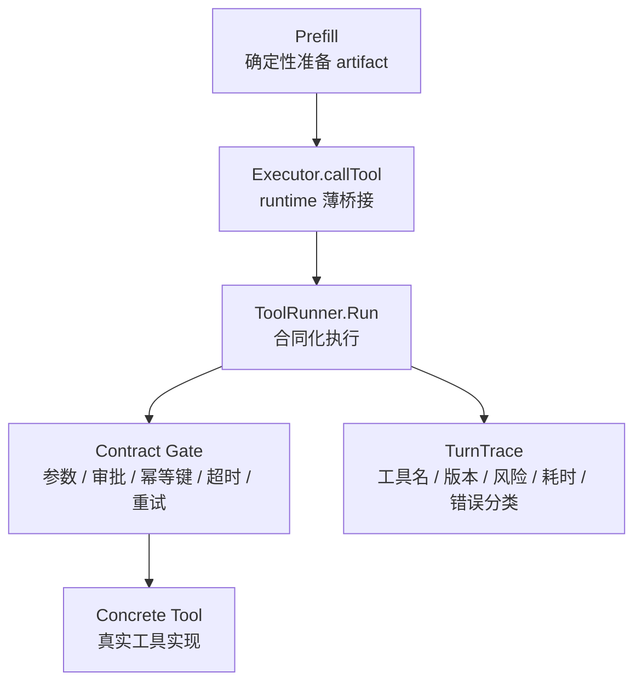

# 工具治理层

## 当前结论

工具治理层已经先落在 runtime-owned 确定性工具调用上，目标不是“统一包一层调用函数”，而是让每次工具调用都带着可读的合同、可控的执行策略和可复盘的 trace。

当前覆盖范围：

- 已覆盖：`Prefill` 中由 Go runtime 主动调用的排盘、用神、大运、流年、知识检索等工具。
- 已准备：写操作工具需要的风险等级、审批、幂等键字段。
- 未迁移：specialist ADK 内部的自由工具调用，后续要跨 Eino ADK tool adapter 单独做。

## 目录职责

| 文件 | 职责 |
|---|---|
| `backend/internal/tools/contract.go` | 定义工具合同：风险、副作用、参数、超时、重试、审批、幂等要求 |
| `backend/internal/tools/registry.go` | 注册工具，并把工具实现和工具合同放在同一个注册表里 |
| `backend/internal/tools/runner.go` | 按合同执行工具：参数校验、审批阻断、幂等键阻断、超时、重试、错误分类、trace 写入 |
| `backend/internal/runtime/executor.go` | runtime 的薄接入点，只负责把 prefill 调用转给 `ToolRunner` |
| `backend/internal/container/container.go` | composition root，集中注册系统启动时可用的工具与合同 |

这几个文件的边界要保持清楚：`Executor` 不拥有治理策略，`ToolRunner` 不懂业务编排，`Registry` 不执行工具。

## 调用链

关键点：

- `Prefill` 仍然只负责准备执行所需 artifact。
- `ToolRunner` 负责所有横切治理逻辑，避免每个调用点各写一套 retry / timeout / log。
- trace 记录工具名、版本、风险、副作用、是否只读、是否幂等、参数键摘要、决策来源、尝试次数、状态、耗时和错误分类。

## 工具合同

`ToolContract` 是每个工具的运行合同。它目前包含：

- `Version`：工具 schema 或语义版本。
- `ReadOnly` / `SideEffect`：区分无副作用、读、写、破坏性操作。
- `RiskLevel`：低、中、高、关键风险。
- `Params`：运行前可检查的轻量参数 schema。
- `TimeoutMillis`：单次调用超时。
- `Retry`：最大尝试次数、退避时间、允许重试的错误类型。
- `RequiresApproval`：未来写操作的人审或策略审批入口。
- `RequiresIdempotencyKey`：未来写操作的幂等键约束入口。

默认合同是保守的：未知工具默认只读、低风险、单次执行。现有确定性排盘类工具标记为无副作用，知识库工具标记为读操作，并允许 transient/internal 错误有限重试。

## 失败处理

`ToolRunner` 会把原始 error 映射成治理层错误分类：

| 错误分类 | 含义 | 当前策略 |
|---|---|---|
| `invalid_params` | 参数缺失、类型不对或缺幂等键 | 不执行或不重试，交回调用方修正 |
| `transient` | 超时、临时网络、限流等 | 合同允许时重试 |
| `permission_denied` | 权限失败 | 不重试 |
| `business_rejected` | 业务规则拒绝 | 不重试 |
| `not_found` | 工具不存在 | 不重试 |
| `approval_required` | 高风险工具缺少审批 | 阻断执行 |
| `internal_error` | 未归类内部错误 | 仅合同允许时重试 |

## 副作用控制

当前系统还没有支付、扣款、写外部状态这类高风险工具，但治理层已经保留接口：

- 高风险工具可以声明 `RequiresApproval=true`，未审批时直接返回 `blocked`。
- 写操作工具可以声明 `RequiresIdempotencyKey=true`，缺失时直接阻断。
- 真正的去重不能只靠 Agent，必须由工具服务端按幂等键兜底。
- 写操作结果必须可查询，避免“调用超时后不知道有没有成功”导致重复执行。

## 当前边界

这次不是把项目变成完整 SaaS 级平台，也不是一次性接管所有 LLM 自由工具调用。当前版本先建立清晰的生产平台骨架：

- 工具有合同。
- 调用走统一 runner。
- 参数错误能在执行前阻断。
- transient 错误能按合同有限重试。
- 高风险工具具备审批阻断入口。
- trace 能复盘工具选择后的执行事实。

后续如果要继续推进，可以按这个顺序做：

1. 把 specialist ADK tool adapter 迁移到 `ToolRunner`。
2. 引入 per-session / per-user 权限上下文。
3. 对写操作工具强制幂等键和结果查询。
4. 增加工具健康度和灰度版本选择。
5. 把 tool trace 接到 Langfuse / OTel 的统一查询面板。
